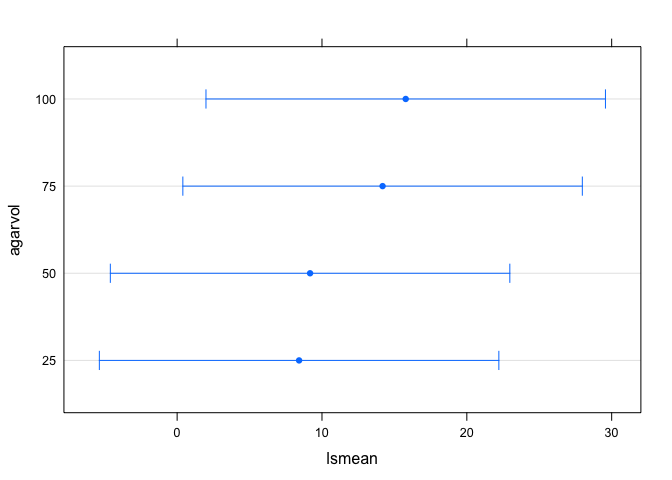
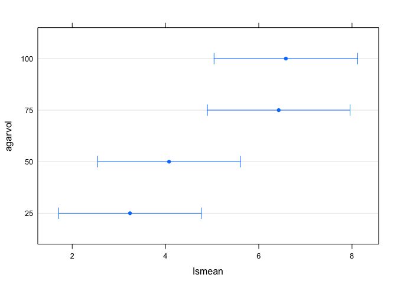
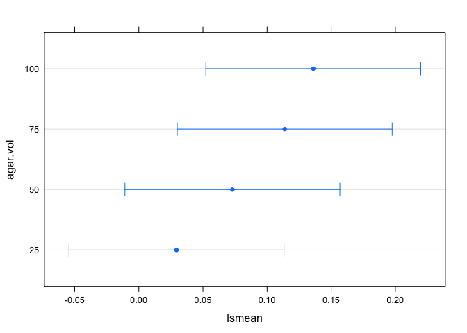

### Libraries

    ##      drc  ggplot2  lsmeans lmerTest  plotrix     plyr    knitr 
    ##     TRUE     TRUE     TRUE     TRUE     TRUE     TRUE     TRUE

``` r
agar.dil <- data.frame(read.csv("agardilutions.csv", na.strings = "na"))
```

### Assay Development

Here we are analysing a dataset where we inoculated different volumes of macerated agar in the wells of a 96 well plate to see how the fungicide and assay would perform under these conditions.

Here we are testing if the difference in macerated agar volume increased the background noise. We will pull out only the blank wells and do an ANOVA, treating trial as a random factor to test the affect of agar volume on optical density

``` r
agar.dil.blank <- agar.dil[agar.dil$is == "BLANK",]

lm <- lmer(od600 ~ agarvol + (1|trial), data = agar.dil.blank)
anova(lm)
```

    ## Analysis of Variance Table of type III  with  Satterthwaite 
    ## approximation for degrees of freedom
    ##             Sum Sq    Mean Sq NumDF  DenDF F.value Pr(>F)
    ## agarvol 0.00026846 0.00026846     1 141.01  0.5686 0.4521

### Linear model of percent relative growth

``` r
#doing a little data clean up, taking out the blank and ntc wells
noblank <- c("BLANK","NTC")
agar.dilnoblank <- agar.dil[!agar.dil$is %in% noblank,]
agar.dilnoblank$agarvol <- as.factor(agar.dilnoblank$agarvol) #convert the numeric data to factor
agar.dilnoblank$relgrow[agar.dilnoblank$conc == 10] <- agar.dilnoblank$relgrow[agar.dilnoblank$conc == 10]*100

agar.dilnoblank$relgrow[agar.dilnoblank$conc == 0.5] <- agar.dilnoblank$relgrow[agar.dilnoblank$conc == 0.5]*100
```

Testing if the percent realative growth at 0.5 ppm was increased by the agar volume We do have one missing value that was a contaminated well

``` r
rg_aov.05 <- lmer(relgrow ~ agarvol + (1|is), data = agar.dilnoblank[agar.dilnoblank$conc == 0.5,])
summary(rg_aov.05)
```

    ## Linear mixed model fit by REML t-tests use Satterthwaite approximations
    ##   to degrees of freedom [lmerMod]
    ## Formula: relgrow ~ agarvol + (1 | is)
    ##    Data: agar.dilnoblank[agar.dilnoblank$conc == 0.5, ]
    ## 
    ## REML criterion at convergence: 597
    ## 
    ## Scaled residuals: 
    ##      Min       1Q   Median       3Q      Max 
    ## -1.75681 -0.67232 -0.06661  0.41640  2.68018 
    ## 
    ## Random effects:
    ##  Groups   Name        Variance Std.Dev.
    ##  is       (Intercept) 77.85    8.823   
    ##  Residual             29.30    5.413   
    ## Number of obs: 96, groups:  is, 4
    ## 
    ## Fixed effects:
    ##             Estimate Std. Error      df t value Pr(>|t|)    
    ## (Intercept)   8.4204     4.5479  3.2800   1.852 0.153171    
    ## agarvol50     0.7579     1.5626 89.0000   0.485 0.628829    
    ## agarvol75     5.7639     1.5626 89.0000   3.689 0.000388 ***
    ## agarvol100    7.3606     1.5626 89.0000   4.711 9.05e-06 ***
    ## ---
    ## Signif. codes:  0 '***' 0.001 '**' 0.01 '*' 0.05 '.' 0.1 ' ' 1
    ## 
    ## Correlation of Fixed Effects:
    ##            (Intr) agrv50 agrv75
    ## agarvol50  -0.172              
    ## agarvol75  -0.172  0.500       
    ## agarvol100 -0.172  0.500  0.500

``` r
lmerTest::anova(rg_aov.05, type = 1) # type 1 SS ANOVA table, balanced design all types are the same 
```

    ## Analysis of Variance Table of type I  with  Satterthwaite 
    ## approximation for degrees of freedom
    ##         Sum Sq Mean Sq NumDF DenDF F.value    Pr(>F)    
    ## agarvol 955.09  318.36     3    89  10.866 3.765e-06 ***
    ## ---
    ## Signif. codes:  0 '***' 0.001 '**' 0.01 '*' 0.05 '.' 0.1 ' ' 1

Lets make sure we look at the regression diagnostics

``` r
plot(rg_aov.05)
```


``` r
qqnorm(resid(rg_aov.05)); qqline(resid(rg_aov.05))
```


``` r
hist(resid(rg_aov.05))
```


Get the LS MEANS

``` r
# lsmeans for our linear model
lm_lsmeans_rg <- lsmeans::lsmeans(rg_aov.05, c("agarvol"))
plot(lm_lsmeans_rg)
```



``` r
lm_lsmeans_rg
```

    ##  agarvol    lsmean       SE   df   lower.CL upper.CL
    ##  25       8.420394 4.547874 3.28 -5.3697871 22.21058
    ##  50       9.178334 4.547874 3.28 -4.6118471 22.96852
    ##  75      14.184298 4.547874 3.28  0.3941164 27.97448
    ##  100     15.781036 4.547874 3.28  1.9908549 29.57122
    ## 
    ## Degrees-of-freedom method: satterthwaite 
    ## Confidence level used: 0.95

``` r
Results_rg_aov05 <- cld(lm_lsmeans_rg, alpha = 0.05, adjust = "tuk", Letters = letters, reversed = FALSE)
```

Testing if the percent realative growth at 10 ppm was increased by the agar volume We do have one missing value that was a contaminated well

``` r
rg_aov.10 <- lmer(relgrow ~ agarvol + (1|is), data = agar.dilnoblank[agar.dilnoblank$conc == 10,])
summary(rg_aov.10)
```

    ## Linear mixed model fit by REML t-tests use Satterthwaite approximations
    ##   to degrees of freedom [lmerMod]
    ## Formula: relgrow ~ agarvol + (1 | is)
    ##    Data: agar.dilnoblank[agar.dilnoblank$conc == 10, ]
    ## 
    ## REML criterion at convergence: 451.8
    ## 
    ## Scaled residuals: 
    ##      Min       1Q   Median       3Q      Max 
    ## -1.87258 -0.73632 -0.02724  0.69332  2.52455 
    ## 
    ## Random effects:
    ##  Groups   Name        Variance Std.Dev.
    ##  is       (Intercept) 0.7229   0.8502  
    ##  Residual             7.0104   2.6477  
    ## Number of obs: 95, groups:  is, 4
    ## 
    ## Fixed effects:
    ##             Estimate Std. Error      df t value Pr(>|t|)    
    ## (Intercept)   3.2393     0.6876 10.1300   4.711 0.000799 ***
    ## agarvol50     0.8375     0.7643 88.0100   1.096 0.276185    
    ## agarvol75     3.1887     0.7643 88.0100   4.172 7.07e-05 ***
    ## agarvol100    3.3421     0.7728 88.0500   4.325 4.01e-05 ***
    ## ---
    ## Signif. codes:  0 '***' 0.001 '**' 0.01 '*' 0.05 '.' 0.1 ' ' 1
    ## 
    ## Correlation of Fixed Effects:
    ##            (Intr) agrv50 agrv75
    ## agarvol50  -0.556              
    ## agarvol75  -0.556  0.500       
    ## agarvol100 -0.550  0.495  0.495

``` r
lmerTest::anova(rg_aov.10, type = 1) # type 1 SS ANOVA table, balanced design all types are the same 
```

    ## Analysis of Variance Table of type I  with  Satterthwaite 
    ## approximation for degrees of freedom
    ##         Sum Sq Mean Sq NumDF DenDF F.value    Pr(>F)    
    ## agarvol 200.85   66.95     3 88.03  9.5501 1.589e-05 ***
    ## ---
    ## Signif. codes:  0 '***' 0.001 '**' 0.01 '*' 0.05 '.' 0.1 ' ' 1

Lets make sure we look at the regression diagnostics

``` r
plot(rg_aov.10)
```


``` r
qqnorm(resid(rg_aov.10)); qqline(resid(rg_aov.10))
```


``` r
hist(resid(rg_aov.10))
```


Get the LS MEANS

``` r
# lsmeans for our linear model
lm_lsmeans_rg <- lsmeans::lsmeans(rg_aov.10, c("agarvol"))
plot(lm_lsmeans_rg)
```



``` r
lm_lsmeans_rg
```

    ##  agarvol   lsmean        SE    df lower.CL upper.CL
    ##  25      3.239270 0.6876258 10.13 1.709865 4.768674
    ##  50      4.076770 0.6876258 10.13 2.547365 5.606174
    ##  75      6.427945 0.6876258 10.13 4.898540 7.957349
    ##  100     6.581327 0.6970159 10.66 5.041137 8.121516
    ## 
    ## Degrees-of-freedom method: satterthwaite 
    ## Confidence level used: 0.95

``` r
Results_rg_aov10 <- cld(lm_lsmeans_rg, alpha = 0.05, adjust = "tuk", Letters = letters, reversed = FALSE)
```

### EC50 estimation

The following loop will generate EC50's for each isolate, agar volume, trial combination and save that output into a data frame called agardil, to use later for an ANOVA

``` r
agar.dil <- agar.dil[!agar.dil$is == "BLANK",]
agar.dil <- agar.dil[!agar.dil$is == "NTC",]
agar.dil$is <- factor(agar.dil$is)
agardil <- NULL
nm <- levels(agar.dil$is)
for (t in 1:2){
    for (i in seq_along(nm)){
agardil.drc <- drm(100*relgrow ~ conc, 
                   curveid = agarvol, 
                   data = agar.dil[agar.dil$is == nm[[i]] & agar.dil$trial == t,], 
                   fct = LL.4())

summary.mef.fit <- data.frame(summary(agardil.drc)[[3]])
#outputs the summary of just the EC50 data including the estimate, standard error, upper and lower bounds of the 95% confidence intervals around the EC50
print(nm[[i]])
print("RELATIVE EC50")
EC50.od.rel <- data.frame(ED(agardil.drc, 
                             respLev = c(50), 
                             type = "relative",
                             interval = "delta"),
                          level = 0.95)
rel.ec50 <- EC50.od.rel[1][[1]]
print("ABSOLUTE EC50")
EC50.od.abs <- data.frame(ED(agardil.drc, 
                             respLev = c(50), 
                             type = "absolute",
                             interval = "delta"),
                          level = 0.95)
abs.ec50 <- EC50.od.rel[1][[1]]
print(summary.mef.fit)
print("LACK FIT")
fit <- modelFit(agardil.drc)
lackfitpvalue <- fit[5]$`p value`[2]
print(fit)
print("COMP EC50")
#SI(agardil.drc, c(50, 50), ci = "delta")
agar.vol <- unique(agar.dil$agarvol[agar.dil$is == nm[[i]]])
agardil_i <- data.frame(rep(nm[[i]], 4), c(agar.vol), rep(t, 4), c(abs.ec50))
agardil <- rbind.data.frame(agardil, agardil_i)
   }

}
colnames(agardil) <- c("is", "agar.vol", "trial", "EC50")
```

Linear models to describe these data:
-------------------------------------

model: EC50 as a function of agar volume and isolate as a random effect

We are treating isolate as a random effect because these four isolates were chosen at random from a larger population of isolates and we want to generalize over isolate to see the effect of agar volume on the EC50.

``` r
agardil$agar.vol <- as.factor(agardil$agar.vol) #convert the numeric data to factor
agardil_aov <- lmer(EC50 ~ agar.vol + (1|is), data = agardil)
summary(agardil_aov)
```

    ## Linear mixed model fit by REML t-tests use Satterthwaite approximations
    ##   to degrees of freedom [lmerMod]
    ## Formula: EC50 ~ agar.vol + (1 | is)
    ##    Data: agardil
    ## 
    ## REML criterion at convergence: -94.2
    ## 
    ## Scaled residuals: 
    ##     Min      1Q  Median      3Q     Max 
    ## -1.6501 -0.5820 -0.0199  0.6076  1.9742 
    ## 
    ## Random effects:
    ##  Groups   Name        Variance Std.Dev.
    ##  is       (Intercept) 0.002972 0.05452 
    ##  Residual             0.001077 0.03281 
    ## Number of obs: 32, groups:  is, 4
    ## 
    ## Fixed effects:
    ##             Estimate Std. Error       df t value Pr(>|t|)    
    ## (Intercept)  0.02938    0.02962  3.82300   0.992   0.3798    
    ## agar.vol50   0.04358    0.01641 25.00000   2.657   0.0135 *  
    ## agar.vol75   0.08434    0.01641 25.00000   5.141 2.59e-05 ***
    ## agar.vol100  0.10666    0.01641 25.00000   6.502 8.26e-07 ***
    ## ---
    ## Signif. codes:  0 '***' 0.001 '**' 0.01 '*' 0.05 '.' 0.1 ' ' 1
    ## 
    ## Correlation of Fixed Effects:
    ##             (Intr) agr.50 agr.75
    ## agar.vol50  -0.277              
    ## agar.vol75  -0.277  0.500       
    ## agar.vol100 -0.277  0.500  0.500

``` r
lmerTest::anova(agardil_aov, type = 1) # type 1 SS ANOVA table, balanced design all types are the same 
```

    ## Analysis of Variance Table of type I  with  Satterthwaite 
    ## approximation for degrees of freedom
    ##            Sum Sq  Mean Sq NumDF DenDF F.value    Pr(>F)    
    ## agar.vol 0.053056 0.017685     3    25  16.428 4.174e-06 ***
    ## ---
    ## Signif. codes:  0 '***' 0.001 '**' 0.01 '*' 0.05 '.' 0.1 ' ' 1

Lets make sure we look at the regression diagnostics

``` r
plot(agardil_aov)
```


``` r
qqnorm(resid(agardil_aov)); qqline(resid(agardil_aov))
```


The residuals look normally destributed. One could argue the need for a log transformation for a "V" shaped residual plot, but I've already tried that and the contrasts do not change so I am keeping these data non-transformed.

``` r
# lsmeans for our linear model
lm_lsmeans <- lsmeans::lsmeans(agardil_aov, c("agar.vol"))
plot(lm_lsmeans)
```



``` r
lm_lsmeans
```

    ##  agar.vol     lsmean         SE   df    lower.CL  upper.CL
    ##  25       0.02938225 0.02962367 3.82 -0.05439341 0.1131579
    ##  50       0.07296703 0.02962367 3.82 -0.01080862 0.1567427
    ##  75       0.11372354 0.02962367 3.82  0.02994788 0.1974992
    ##  100      0.13604405 0.02962367 3.82  0.05226839 0.2198197
    ## 
    ## Degrees-of-freedom method: satterthwaite 
    ## Confidence level used: 0.95

``` r
Results_EC50_aov <- cld(lm_lsmeans, alpha = 0.05, adjust = "tuk", Letters = letters, reversed = FALSE)
```

Just getting the acctual SE for the cell means of agar volume.

``` r
mean.agar <- ddply(agardil, c("agar.vol"), 
      summarise, 
      mean = mean(EC50, na.rm = TRUE),
      std.err = std.error(EC50, na.rm = TRUE))
mean.agar$contrasts <- Results_EC50_aov$.group
mean_rg10 <- ddply(agar.dilnoblank[agar.dilnoblank$conc == 10,], c("agarvol"),
                 summarise, 
                 mean = mean(relgrow, na.rm = TRUE), 
                 std.err = std.error(relgrow, na.rm = TRUE))
mean_rg10$contrasts <- Results_rg_aov10$.group
mean_rg05 <- ddply(agar.dilnoblank[agar.dilnoblank$conc == 0.5,], c("agarvol"),
                 summarise, 
                 mean = mean(relgrow, na.rm = TRUE), 
                 std.err = std.error(relgrow, na.rm = TRUE))
mean_rg05$contrasts <- Results_rg_aov05$.group
FINAL.TABLE <- cbind.data.frame(mean.agar, mean_rg10$mean, mean_rg10$std.err, mean_rg10$contrasts, mean_rg05$mean, mean_rg05$std.err, mean_rg05$contrasts)
colnames(FINAL.TABLE) <- c("Agar Volume", "Mean EC50", "EC50.SE", "EC50.Contrast", "Mean RG 10", "RG10.SE", "RG10.Contrast", "Mean RG 05", "RG05.SE", "RG05.Contrast")
```

``` r
kable(FINAL.TABLE, digits = 3)
```

| Agar Volume |  Mean EC50|  EC50.SE| EC50.Contrast |  Mean RG 10|  RG10.SE| RG10.Contrast |  Mean RG 05|  RG05.SE| RG05.Contrast |
|:------------|----------:|--------:|:--------------|-----------:|--------:|:--------------|-----------:|--------:|:--------------|
| 25          |      0.029|    0.006| a             |       3.239|    0.494| a             |       8.420|    1.090| a             |
| 50          |      0.073|    0.016| ab            |       4.077|    0.471| a             |       9.178|    1.619| a             |
| 75          |      0.114|    0.025| bc            |       6.428|    0.550| b             |      14.184|    2.150| b             |
| 100         |      0.136|    0.030| c             |       6.565|    0.725| b             |      15.781|    2.570| b             |
