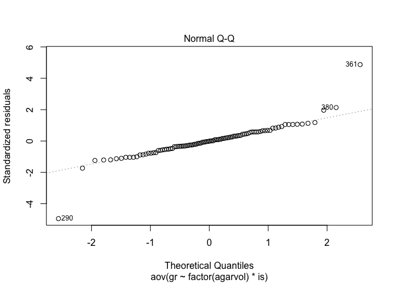
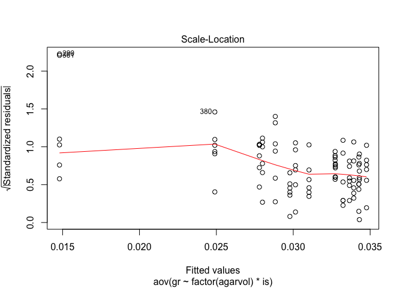
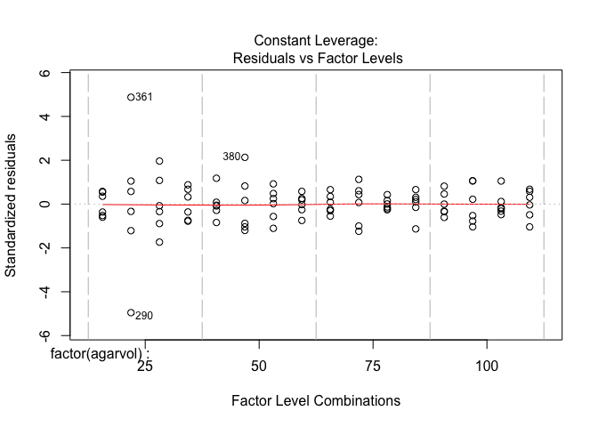
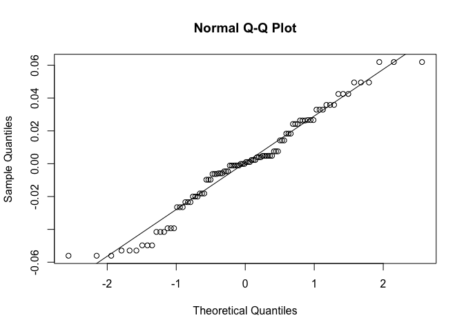
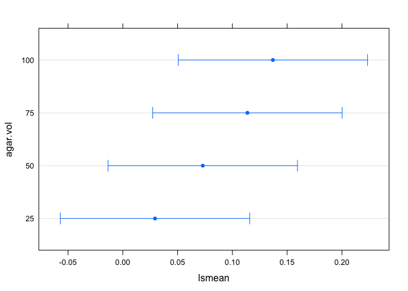
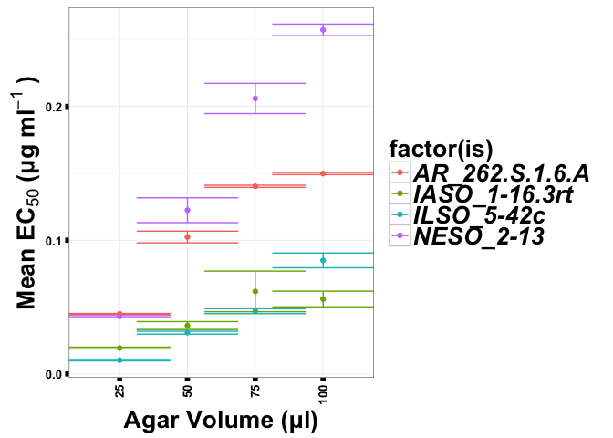

``` r
rm(list = ls(all=TRUE)) # removes all variables in the global environment so you start fresh

Sys.time() # prints out the time and date you ran the code
```

    ## [1] "2016-06-25 13:45:59 EDT"

``` r
options(scipen = 999) # stops anything from being in scientific notation
```

### Assay Development

Here we are analysing a dataset where we inoculated different volumes of macerated agar in the wells of a 96 well plate to see how the fungicide and assay would perform under these conditions.

The following loop will generate EC50's for each isolate, agar volume, trial combination and save that output into a data frame called agardil, to use later for an ANOVA

``` r
agar.dil <- agar.dil[!agar.dil$is == "BLANK",]
agar.dil <- agar.dil[!agar.dil$is == "NTC",]
agar.dil$is <- factor(agar.dil$is)
agardil <- NULL
nm <- levels(agar.dil$is)
for (t in 1:2){
  for (r in 1:3){
    for (i in seq_along(nm)){
agardil.drc <- drm(100*relgrow ~ conc, 
                   curveid = agarvol, 
                   data = agar.dil[agar.dil$is == nm[[i]] & agar.dil$trial == t,], 
                   fct = LL.4())

summary.mef.fit <- data.frame(summary(agardil.drc)[[3]])
#outputs the summary of just the EC50 data including the estimate, standard error, upper and lower bounds of the 95% confidence intervals around the EC50
print(nm[[i]])
print("RELATIVE EC50")
EC50.od.rel <- data.frame(ED(agardil.drc, 
                             respLev = c(50), 
                             type = "relative",
                             interval = "delta"),
                          level = 0.95)
rel.ec50 <- EC50.od.rel[1][[1]]
print("ABSOLUTE EC50")
EC50.od.abs <- data.frame(ED(agardil.drc, 
                             respLev = c(50), 
                             type = "absolute",
                             interval = "delta"),
                          level = 0.95)
abs.ec50 <- EC50.od.rel[1][[1]]
print(summary.mef.fit)
print("LACK FIT")
fit <- modelFit(agardil.drc)
lackfitpvalue <- fit[5]$`p value`[2]
print(fit)
print("COMP EC50")
SI(agardil.drc, c(50, 50), ci = "delta")
agar.vol <- unique(agar.dil$agarvol[agar.dil$is == nm[[i]]])
agardil_i <- data.frame(rep(nm[[i]], 4), c(agar.vol), rep(t, 4), c(abs.ec50))
agardil <- rbind.data.frame(agardil, agardil_i)
   }
  }
}
colnames(agardil) <- c("is", "agar.vol", "trial", "EC50")
```

Looking at growth rates

``` r
agar.dil$gr <- agar.dil$od600meanblank/24
gr0 <- aov(gr ~ factor(agarvol) * is, data = agar.dil[agar.dil$conc == 0,])
gr1 <- lmer(gr ~ factor(agarvol) + (1|is), data = agar.dil[agar.dil$conc == 0,])
gr2 <- aov(gr ~ factor(agarvol), data = agar.dil[agar.dil$conc == 0,])
anova(gr1, gr2, gr0)
```

    ## refitting model(s) with ML (instead of REML)

    ## Data: agar.dil[agar.dil$conc == 0, ]
    ## Models:
    ## gr2: gr ~ factor(agarvol)
    ## gr1: gr ~ factor(agarvol) + (1 | is)
    ## gr0: gr ~ factor(agarvol) * is
    ##     Df     AIC     BIC logLik deviance  Chisq Chi Df            Pr(>Chisq)
    ## gr2  5 -741.01 -728.19 375.50  -751.01                                    
    ## gr1  6 -831.52 -816.13 421.76  -843.52  92.51      1 < 0.00000000000000022
    ## gr0 17 -916.03 -872.44 475.02  -950.03 106.52     11 < 0.00000000000000022
    ##        
    ## gr2    
    ## gr1 ***
    ## gr0 ***
    ## ---
    ## Signif. codes:  0 '***' 0.001 '**' 0.01 '*' 0.05 '.' 0.1 ' ' 1

``` r
plot(gr0)
```

<!-- --><!-- --><!-- --><!-- -->

``` r
anova(gr1)
```

    ## Analysis of Variance Table
    ##                 Df     Sum Sq   Mean Sq F value
    ## factor(agarvol)  3 0.00031591 0.0001053  13.418

``` r
gr1_lsmeans <- lsmeans(gr1, c("agarvol"))
contrast(gr1_lsmeans, "pairwise")
```

    ##  contrast      estimate           SE df t.ratio p.value
    ##  25 - 50  -0.0033639757 0.0008086937 89  -4.160  0.0004
    ##  25 - 75  -0.0040700521 0.0008086937 89  -5.033  <.0001
    ##  25 - 100 -0.0047000000 0.0008086937 89  -5.812  <.0001
    ##  50 - 75  -0.0007060764 0.0008086937 89  -0.873  0.8187
    ##  50 - 100 -0.0013360243 0.0008086937 89  -1.652  0.3552
    ##  75 - 100 -0.0006299479 0.0008086937 89  -0.779  0.8638
    ## 
    ## P value adjustment: tukey method for comparing a family of 4 estimates

Specifying a linear models to describe these data: model: EC50 as a function of agar volume and isolate as a random effect

We are treating isolate as a random effect because these four isolates were chosen at random from a larger population of isolates and we want to generalize over isolate to see the effect of agar volume on the EC50.

``` r
agardil$agar.vol <- as.factor(agardil$agar.vol)
class(agardil$agar.vol)
```

    ## [1] "factor"

``` r
agardil2 <- lmer(EC50 ~ agar.vol + (1|is), data = agardil)
summary(agardil2)
```

    ## Linear mixed model fit by REML ['lmerMod']
    ## Formula: EC50 ~ agar.vol + (1 | is)
    ##    Data: agardil
    ## 
    ## REML criterion at convergence: -357.4
    ## 
    ## Scaled residuals: 
    ##     Min      1Q  Median      3Q     Max 
    ## -1.8597 -0.6176  0.0147  0.6567  2.0545 
    ## 
    ## Random effects:
    ##  Groups   Name        Variance  Std.Dev.
    ##  is       (Intercept) 0.0030401 0.05514 
    ##  Residual             0.0009084 0.03014 
    ## Number of obs: 96, groups:  is, 4
    ## 
    ## Fixed effects:
    ##             Estimate Std. Error t value
    ## (Intercept) 0.029382   0.028247   1.040
    ## agar.vol50  0.043585   0.008701   5.009
    ## agar.vol75  0.084341   0.008701   9.694
    ## agar.vol100 0.107606   0.008701  12.368
    ## 
    ## Correlation of Fixed Effects:
    ##             (Intr) agr.50 agr.75
    ## agar.vol50  -0.154              
    ## agar.vol75  -0.154  0.500       
    ## agar.vol100 -0.154  0.500  0.500

Lets make sure we look at the regression diagnostics

``` r
plot(agardil2)
```

<!-- -->

``` r
qqnorm(resid(agardil2)); qqline(resid(agardil2))
```

<!-- -->

The residuals look normally destributed. One could argue the need for a log transformation for a "V" shaped residual plot, but I've already tried that and the contrasts do not change so I am keeping these data non-transformed.

``` r
# lsmeans for our linear model
lm_lsmeans <- lsmeans(agardil2, c("agar.vol"))
plot(lm_lsmeans)
```

<!-- -->

``` r
contrast(lm_lsmeans, "pairwise")
```

    ##  contrast    estimate          SE df t.ratio p.value
    ##  25 - 50  -0.04358513 0.008700589 89  -5.009  <.0001
    ##  25 - 75  -0.08434124 0.008700589 89  -9.694  <.0001
    ##  25 - 100 -0.10760575 0.008700589 89 -12.368  <.0001
    ##  50 - 75  -0.04075612 0.008700589 89  -4.684  0.0001
    ##  50 - 100 -0.06402062 0.008700589 89  -7.358  <.0001
    ##  75 - 100 -0.02326451 0.008700589 89  -2.674  0.0434
    ## 
    ## P value adjustment: tukey method for comparing a family of 4 estimates

``` r
library(agricolae)
agardil.is1 <- lm(EC50 ~ agar.vol, data = agardil[agardil$is == "AR_262.S.1.6.A",])
lsmeans_is1 <- lsmeans(agardil.is1, c("agar.vol"))
contrast(lsmeans_is1, "pairwise")
```

    ##  contrast     estimate          SE df t.ratio p.value
    ##  25 - 50  -0.057466630 0.003182442 20 -18.057  <.0001
    ##  25 - 75  -0.095353563 0.003182442 20 -29.962  <.0001
    ##  25 - 100 -0.104886598 0.003182442 20 -32.958  <.0001
    ##  50 - 75  -0.037886933 0.003182442 20 -11.905  <.0001
    ##  50 - 100 -0.047419968 0.003182442 20 -14.900  <.0001
    ##  75 - 100 -0.009533035 0.003182442 20  -2.996  0.0332
    ## 
    ## P value adjustment: tukey method for comparing a family of 4 estimates

``` r
anova(agardil.is1)
```

    ## Analysis of Variance Table
    ## 
    ## Response: EC50
    ##           Df   Sum Sq   Mean Sq F value                Pr(>F)    
    ## agar.vol   3 0.040756 0.0135854  447.13 < 0.00000000000000022 ***
    ## Residuals 20 0.000608 0.0000304                                  
    ## ---
    ## Signif. codes:  0 '***' 0.001 '**' 0.01 '*' 0.05 '.' 0.1 ' ' 1

``` r
HSD.test(agardil.is1, "agar.vol", group = TRUE, console = TRUE)
```

    ## 
    ## Study: agardil.is1 ~ "agar.vol"
    ## 
    ## HSD Test for EC50 
    ## 
    ## Mean Square Error:  0.00003038381 
    ## 
    ## agar.vol,  means
    ## 
    ##          EC50          std r        Min        Max
    ## 100 0.1498252 0.0019029906 6 0.14808801 0.15156238
    ## 25  0.0449386 0.0006654122 6 0.04433116 0.04554603
    ## 50  0.1024052 0.0106566848 6 0.09267705 0.11213340
    ## 75  0.1402922 0.0019764024 6 0.13848796 0.14209636
    ## 
    ## alpha: 0.05 ; Df Error: 20 
    ## Critical Value of Studentized Range: 3.958293 
    ## 
    ## Honestly Significant Difference: 0.008907452 
    ## 
    ## Means with the same letter are not significantly different.
    ## 
    ## Groups, Treatments and means
    ## a     100     0.1498 
    ## b     75      0.1403 
    ## c     50      0.1024 
    ## d     25      0.04494

``` r
round(plotrix::std.error(agardil$EC50[agardil$is == "AR_262.S.1.6.A" & agardil$agar.vol == 25]),3)
```

    ## [1] 0

``` r
round(plotrix::std.error(agardil$EC50[agardil$is == "AR_262.S.1.6.A" & agardil$agar.vol == 50]),3)
```

    ## [1] 0.004

``` r
round(plotrix::std.error(agardil$EC50[agardil$is == "AR_262.S.1.6.A" & agardil$agar.vol == 75]),3)
```

    ## [1] 0.001

``` r
round(plotrix::std.error(agardil$EC50[agardil$is == "AR_262.S.1.6.A" & agardil$agar.vol == 100]),3)
```

    ## [1] 0.001

``` r
agardil.is2 <- lm(EC50 ~ agar.vol, data = agardil[agardil$is == "IASO_1-16.3rt",])
lsmeans_is2 <- lsmeans(agardil.is2, c("agar.vol"))
contrast(lsmeans_is2, "pairwise")
```

    ##  contrast     estimate         SE df t.ratio p.value
    ##  25 - 50  -0.016817430 0.01170387 20  -1.437  0.4922
    ##  25 - 75  -0.042354028 0.01170387 20  -3.619  0.0085
    ##  25 - 100 -0.036657296 0.01170387 20  -3.132  0.0249
    ##  50 - 75  -0.025536598 0.01170387 20  -2.182  0.1625
    ##  50 - 100 -0.019839866 0.01170387 20  -1.695  0.3521
    ##  75 - 100  0.005696732 0.01170387 20   0.487  0.9612
    ## 
    ## P value adjustment: tukey method for comparing a family of 4 estimates

``` r
anova(agardil.is2)
```

    ## Analysis of Variance Table
    ## 
    ## Response: EC50
    ##           Df    Sum Sq    Mean Sq F value   Pr(>F)   
    ## agar.vol   3 0.0067480 0.00224932  5.4736 0.006523 **
    ## Residuals 20 0.0082188 0.00041094                    
    ## ---
    ## Signif. codes:  0 '***' 0.001 '**' 0.01 '*' 0.05 '.' 0.1 ' ' 1

``` r
HSD.test(agardil.is2, "agar.vol", group = TRUE, console = TRUE)
```

    ## 
    ## Study: agardil.is2 ~ "agar.vol"
    ## 
    ## HSD Test for EC50 
    ## 
    ## Mean Square Error:  0.0004109418 
    ## 
    ## agar.vol,  means
    ## 
    ##           EC50         std r        Min        Max
    ## 100 0.05601926 0.014413556 6 0.04286154 0.06917698
    ## 25  0.01936196 0.001584580 6 0.01791545 0.02080848
    ## 50  0.03617939 0.007218725 6 0.02958963 0.04276916
    ## 75  0.06171599 0.037167130 6 0.02778720 0.09564478
    ## 
    ## alpha: 0.05 ; Df Error: 20 
    ## Critical Value of Studentized Range: 3.958293 
    ## 
    ## Honestly Significant Difference: 0.03275839 
    ## 
    ## Means with the same letter are not significantly different.
    ## 
    ## Groups, Treatments and means
    ## a     75      0.06172 
    ## a     100     0.05602 
    ## ab    50      0.03618 
    ## b     25      0.01936

``` r
round(plotrix::std.error(agardil$EC50[agardil$is == "IASO_1-16.3rt" & agardil$agar.vol == 25]), 3)
```

    ## [1] 0.001

``` r
round(plotrix::std.error(agardil$EC50[agardil$is == "IASO_1-16.3rt" & agardil$agar.vol == 50]), 3)
```

    ## [1] 0.003

``` r
round(plotrix::std.error(agardil$EC50[agardil$is == "IASO_1-16.3rt" & agardil$agar.vol == 75]), 3)
```

    ## [1] 0.015

``` r
round(plotrix::std.error(agardil$EC50[agardil$is == "IASO_1-16.3rt" & agardil$agar.vol == 100]), 3)
```

    ## [1] 0.006

``` r
agardil.is3 <- lm(EC50 ~ agar.vol, data = agardil[agardil$is == "ILSO_5-42c",])
anova(agardil.is3)
```

    ## Analysis of Variance Table
    ## 
    ## Response: EC50
    ##           Df    Sum Sq   Mean Sq F value            Pr(>F)    
    ## agar.vol   3 0.0179240 0.0059747  111.65 0.000000000001162 ***
    ## Residuals 20 0.0010702 0.0000535                              
    ## ---
    ## Signif. codes:  0 '***' 0.001 '**' 0.01 '*' 0.05 '.' 0.1 ' ' 1

``` r
HSD.test(agardil.is3, "agar.vol", group = TRUE, console = TRUE)
```

    ## 
    ## Study: agardil.is3 ~ "agar.vol"
    ## 
    ## HSD Test for EC50 
    ## 
    ## Mean Square Error:  0.00005351047 
    ## 
    ## agar.vol,  means
    ## 
    ##           EC50         std r         Min        Max
    ## 100 0.08489764 0.013570616 6 0.072509421 0.09728586
    ## 25  0.01030753 0.001311343 6 0.009110444 0.01150462
    ## 50  0.03084290 0.002703803 6 0.028374678 0.03331112
    ## 75  0.04694725 0.004566189 6 0.042778905 0.05111559
    ## 
    ## alpha: 0.05 ; Df Error: 20 
    ## Critical Value of Studentized Range: 3.958293 
    ## 
    ## Honestly Significant Difference: 0.01182093 
    ## 
    ## Means with the same letter are not significantly different.
    ## 
    ## Groups, Treatments and means
    ## a     100     0.0849 
    ## b     75      0.04695 
    ## c     50      0.03084 
    ## d     25      0.01031

``` r
round(plotrix::std.error(agardil$EC50[agardil$is == "ILSO_5-42c" & agardil$agar.vol == 25]), 3)
```

    ## [1] 0.001

``` r
round(plotrix::std.error(agardil$EC50[agardil$is == "ILSO_5-42c" & agardil$agar.vol == 50]), 3)
```

    ## [1] 0.001

``` r
round(plotrix::std.error(agardil$EC50[agardil$is == "ILSO_5-42c" & agardil$agar.vol == 75]), 3)
```

    ## [1] 0.002

``` r
round(plotrix::std.error(agardil$EC50[agardil$is == "ILSO_5-42c" & agardil$agar.vol == 100]), 3)
```

    ## [1] 0.006

``` r
agardil.is4 <- lm(EC50 ~ agar.vol, data = agardil[agardil$is == "NESO_2-13",])
anova(agardil.is4)
```

    ## Analysis of Variance Table
    ## 
    ## Response: EC50
    ##           Df  Sum Sq Mean Sq F value              Pr(>F)    
    ## agar.vol   3 0.15987 0.05329  152.05 0.00000000000006204 ***
    ## Residuals 20 0.00701 0.00035                                
    ## ---
    ## Signif. codes:  0 '***' 0.001 '**' 0.01 '*' 0.05 '.' 0.1 ' ' 1

``` r
HSD.test(agardil.is4, "agar.vol", group = TRUE, console = TRUE)
```

    ## 
    ## Study: agardil.is4 ~ "agar.vol"
    ## 
    ## HSD Test for EC50 
    ## 
    ## Mean Square Error:  0.0003504848 
    ## 
    ## agar.vol,  means
    ## 
    ##           EC50         std r       Min       Max
    ## 100 0.25721014 0.010641500 6 0.2474958 0.2669245
    ## 25  0.04292115 0.001722642 6 0.0413486 0.0444937
    ## 50  0.12244222 0.022781715 6 0.1016455 0.1432390
    ## 75  0.20593881 0.027689778 6 0.1806616 0.2312160
    ## 
    ## alpha: 0.05 ; Df Error: 20 
    ## Critical Value of Studentized Range: 3.958293 
    ## 
    ## Honestly Significant Difference: 0.0302529 
    ## 
    ## Means with the same letter are not significantly different.
    ## 
    ## Groups, Treatments and means
    ## a     100     0.2572 
    ## b     75      0.2059 
    ## c     50      0.1224 
    ## d     25      0.04292

``` r
round(plotrix::std.error(agardil$EC50[agardil$is == "NESO_2-13" & agardil$agar.vol == 25]), 3)
```

    ## [1] 0.001

``` r
round(plotrix::std.error(agardil$EC50[agardil$is == "NESO_2-13" & agardil$agar.vol == 50]), 3)
```

    ## [1] 0.009

``` r
round(plotrix::std.error(agardil$EC50[agardil$is == "NESO_2-13" & agardil$agar.vol == 75]), 3)
```

    ## [1] 0.011

``` r
round(plotrix::std.error(agardil$EC50[agardil$is == "NESO_2-13" & agardil$agar.vol == 100]), 3)
```

    ## [1] 0.004

``` r
library(ggplot2)
library(Rmisc)
p1 <- ggplot(agardil, aes(x = agar.vol, y = EC50, color = factor(is))) +
  stat_summary(fun.y = mean, geom = "point") + 
  stat_summary(fun.y = mean, geom = "line") +
  stat_summary(fun.data = mean_se, geom = "errorbar", width = 1.5) +
  theme_bw() +
  theme(axis.text.x = element_text(size = 10, face = "bold", 
                                   angle = 90, hjust = 1, vjust = 0.5),
        axis.ticks = element_line(colour = 'black', size = 2, linetype = 'dashed'),
        axis.text.y = element_text(size = 10, face = "bold"),
        axis.title.x = element_text(size = 20, face = "bold"),
        axis.title.y = element_text(size = 20, face = "bold"),
        legend.title = element_text(size  = 20, face = "bold"),
        legend.text = element_text(size  = 20, face = "bold.italic")) +
    guides(fill = guide_legend(title = "Isolate", title.position = "top")) +
  labs(list(x = "Agar Volume (μl)",  
            y = expression(bold("Mean EC"[50] ~"(μg ml"^-1~")"))))
print(p1)
```

<!-- -->
