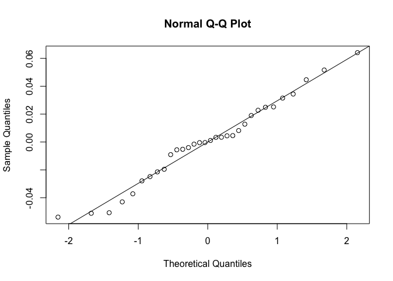

``` r
rm(list = ls(all=TRUE)) # removes all variables in the global environment so you start fresh

Sys.time() # prints out the time and date you ran the code
```

    ## [1] "2016-06-25 15:00:17 EDT"

``` r
options(scipen = 999) # stops anything from being in scientific notation
```

### Assay Development

Here we are analysing a dataset where we inoculated different volumes of macerated agar in the wells of a 96 well plate to see how the fungicide and assay would perform under these conditions.

The following loop will generate EC50's for each isolate, agar volume, trial combination and save that output into a data frame called agardil, to use later for an ANOVA

``` r
agar.dil <- agar.dil[!agar.dil$is == "BLANK",]
agar.dil <- agar.dil[!agar.dil$is == "NTC",]
agar.dil$is <- factor(agar.dil$is)
agardil <- NULL
nm <- levels(agar.dil$is)
for (t in 1:2){
    for (i in seq_along(nm)){
agardil.drc <- drm(100*relgrow ~ conc, 
                   curveid = agarvol, 
                   data = agar.dil[agar.dil$is == nm[[i]] & agar.dil$trial == t,], 
                   fct = LL.4())

summary.mef.fit <- data.frame(summary(agardil.drc)[[3]])
#outputs the summary of just the EC50 data including the estimate, standard error, upper and lower bounds of the 95% confidence intervals around the EC50
print(nm[[i]])
print("RELATIVE EC50")
EC50.od.rel <- data.frame(ED(agardil.drc, 
                             respLev = c(50), 
                             type = "relative",
                             interval = "delta"),
                          level = 0.95)
rel.ec50 <- EC50.od.rel[1][[1]]
print("ABSOLUTE EC50")
EC50.od.abs <- data.frame(ED(agardil.drc, 
                             respLev = c(50), 
                             type = "absolute",
                             interval = "delta"),
                          level = 0.95)
abs.ec50 <- EC50.od.rel[1][[1]]
print(summary.mef.fit)
print("LACK FIT")
fit <- modelFit(agardil.drc)
lackfitpvalue <- fit[5]$`p value`[2]
print(fit)
print("COMP EC50")
SI(agardil.drc, c(50, 50), ci = "delta")
agar.vol <- unique(agar.dil$agarvol[agar.dil$is == nm[[i]]])
agardil_i <- data.frame(rep(nm[[i]], 4), c(agar.vol), rep(t, 4), c(abs.ec50))
agardil <- rbind.data.frame(agardil, agardil_i)
   }

}
colnames(agardil) <- c("is", "agar.vol", "trial", "EC50")
```

Specifying a linear models to describe these data:

model: EC50 as a function of agar volume and isolate as a random effect

We are treating isolate as a random effect because these four isolates were chosen at random from a larger population of isolates and we want to generalize over isolate to see the effect of agar volume on the EC50.

``` r
agardil$agar.vol <- as.factor(agardil$agar.vol)
class(agardil$agar.vol)
```

    ## [1] "factor"

``` r
agardil2 <- lmer(EC50 ~ agar.vol + (1|is), data = agardil)
summary(agardil2)
```

    ## Linear mixed model fit by REML t-tests use Satterthwaite approximations
    ##   to degrees of freedom [lmerMod]
    ## Formula: EC50 ~ agar.vol + (1 | is)
    ##    Data: agardil
    ## 
    ## REML criterion at convergence: -94.2
    ## 
    ## Scaled residuals: 
    ##      Min       1Q   Median       3Q      Max 
    ## -1.64111 -0.61006  0.01052  0.60720  1.95198 
    ## 
    ## Random effects:
    ##  Groups   Name        Variance Std.Dev.
    ##  is       (Intercept) 0.002943 0.05425 
    ##  Residual             0.001078 0.03283 
    ## Number of obs: 32, groups:  is, 4
    ## 
    ## Fixed effects:
    ##             Estimate Std. Error       df t value    Pr(>|t|)    
    ## (Intercept)  0.02938    0.02951  3.83200   0.996      0.3780    
    ## agar.vol50   0.04359    0.01642 25.00000   2.655      0.0136 *  
    ## agar.vol75   0.08434    0.01642 25.00000   5.138 0.000026110 ***
    ## agar.vol100  0.10761    0.01642 25.00000   6.555 0.000000724 ***
    ## ---
    ## Signif. codes:  0 '***' 0.001 '**' 0.01 '*' 0.05 '.' 0.1 ' ' 1
    ## 
    ## Correlation of Fixed Effects:
    ##             (Intr) agr.50 agr.75
    ## agar.vol50  -0.278              
    ## agar.vol75  -0.278  0.500       
    ## agar.vol100 -0.278  0.500  0.500

``` r
lmerTest::anova(agardil2, type = 1) # type 1 SS ANOVA table, balanced design all types are the same 
```

    ## Analysis of Variance Table of type I  with  Satterthwaite 
    ## approximation for degrees of freedom
    ##            Sum Sq  Mean Sq NumDF DenDF F.value      Pr(>F)    
    ## agar.vol 0.053786 0.017929     3    25  16.632 0.000003774 ***
    ## ---
    ## Signif. codes:  0 '***' 0.001 '**' 0.01 '*' 0.05 '.' 0.1 ' ' 1

Lets make sure we look at the regression diagnostics

``` r
plot(agardil2)
```

<!-- -->

``` r
qqnorm(resid(agardil2)); qqline(resid(agardil2))
```

<!-- -->

The residuals look normally destributed. One could argue the need for a log transformation for a "V" shaped residual plot, but I've already tried that and the contrasts do not change so I am keeping these data non-transformed.

``` r
# lsmeans for our linear model
lm_lsmeans <- lsmeans::lsmeans(agardil2, c("agar.vol"))
plot(lm_lsmeans)
```

<!-- -->

``` r
lm_lsmeans
```

    ##  agar.vol     lsmean         SE   df    lower.CL  upper.CL
    ##  25       0.02938231 0.02950515 3.83 -0.05397487 0.1127395
    ##  50       0.07296744 0.02950515 3.83 -0.01038974 0.1563246
    ##  75       0.11372355 0.02950515 3.83  0.03036637 0.1970807
    ##  100      0.13698806 0.02950515 3.83  0.05363088 0.2203452
    ## 
    ## Confidence level used: 0.95

``` r
lsmeans::contrast(lm_lsmeans, "pairwise")
```

    ##  contrast    estimate         SE df t.ratio p.value
    ##  25 - 50  -0.04358513 0.01641624 25  -2.655  0.0613
    ##  25 - 75  -0.08434124 0.01641624 25  -5.138  0.0001
    ##  25 - 100 -0.10760575 0.01641624 25  -6.555  <.0001
    ##  50 - 75  -0.04075612 0.01641624 25  -2.483  0.0874
    ##  50 - 100 -0.06402062 0.01641624 25  -3.900  0.0034
    ##  75 - 100 -0.02326451 0.01641624 25  -1.417  0.5008
    ## 
    ## P value adjustment: tukey method for comparing a family of 4 estimates

Just getting the acctual SE for the cell means of agar volume.

``` r
mean.agar <- ddply(agardil, c("agar.vol"), 
      summarise, 
      mean = mean(EC50, na.rm = TRUE),
      std.err = std.error(EC50, na.rm = TRUE))
kable(mean.agar, digits = 3)
```

| agar.vol |   mean|  std.err|
|:---------|------:|--------:|
| 25       |  0.029|    0.006|
| 50       |  0.073|    0.016|
| 75       |  0.114|    0.025|
| 100      |  0.137|    0.029|
