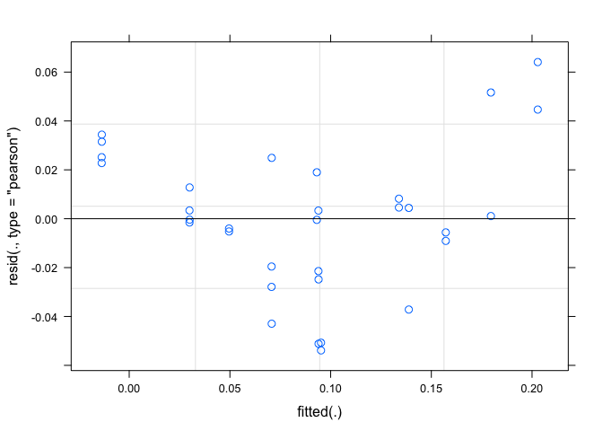

``` r
rm(list = ls(all=TRUE)) # removes all variables in the global environment so you start fresh

Sys.time() # prints out the time and date you ran the code
```

    ## [1] "2016-05-02 08:49:54 EDT"

``` r
options(scipen = 999) # stops anything from being in scientific notation
```

### Assay Development

Here we are analysing a dataset where we did different volumes of macerated agar in the wells of a 96 well plate to see which was going to be the closest to the actual poison plate data.

The following loop will generate EC50's for each isolate, agar volume, trial combination and save that output into a data frame called agardil, to use later for an ANOVA

``` r
library(drc)
agar.dil <- agar.dil[!agar.dil$is == "BLANK",]
agar.dil <- agar.dil[!agar.dil$is == "NTC",]
agar.dil$is <- factor(agar.dil$is)
agardil <- NULL
nm <- levels(agar.dil$is)
for (t in 1:2){
  for (i in seq_along(nm)){
agardil.drc <- drm(100*relgrow ~ conc, 
                   curveid = agarvol, 
                   data = agar.dil[agar.dil$is == nm[[i]] & agar.dil$trial == t,], 
                   fct = LL.4())

summary.mef.fit <- data.frame(summary(agardil.drc)[[3]])
#outputs the summary of just the EC50 data including the estimate, standard error, upper and lower bounds of the 95% confidence intervals around the EC50
print(nm[[i]])
print("RELATIVE EC50")
EC50.od.rel <- data.frame(ED(agardil.drc, 
                             respLev = c(50), 
                             type = "relative",
                             interval = "delta"),
                          level = 0.95)
rel.ec50 <- EC50.od.rel[1][[1]]
print("ABSOLUTE EC50")
EC50.od.abs <- data.frame(ED(agardil.drc, 
                             respLev = c(50), 
                             type = "absolute",
                             interval = "delta"),
                          level = 0.95)
abs.ec50 <- EC50.od.rel[1][[1]]
print(summary.mef.fit)
print("LACK FIT")
fit <- modelFit(agardil.drc)
lackfitpvalue <- fit[5]$`p value`[2]
print(fit)
print("COMP EC50")
SI(agardil.drc, c(50, 50), ci = "delta")
agar.vol <- unique(agar.dil$agarvol[agar.dil$is == nm[[i]]])
agardil_i <- data.frame(rep(nm[[i]], 4), c(agar.vol), rep(t, 4), c(abs.ec50))
agardil <- rbind.data.frame(agardil, agardil_i)
  }
}
colnames(agardil) <- c("is", "agar.vol", "trial", "EC50")
```

Two-way ANOVA looking at the effect of isolate and agar volume added per well to the resulting EC50

``` r
agardil.aov <- lm(EC50 ~ agar.vol + is + is:agar.vol, data = agardil)
anova(agardil.aov)
```

    ## Analysis of Variance Table
    ## 
    ## Response: EC50
    ##             Df   Sum Sq  Mean Sq F value            Pr(>F)    
    ## agar.vol     1 0.052874 0.052874 159.504 0.000000000004306 ***
    ## is           3 0.073871 0.024624  74.282 0.000000000002743 ***
    ## agar.vol:is  3 0.019905 0.006635  20.016 0.000001016249563 ***
    ## Residuals   24 0.007956 0.000331                              
    ## ---
    ## Signif. codes:  0 '***' 0.001 '**' 0.01 '*' 0.05 '.' 0.1 ' ' 1

Looks like the mean of everthing was significant. This means we have a significant effect of agar volume within each isolate. This means we should look at just the main effects (agar volume) within isolate.

``` r
library(agricolae)
agardil.is1 <- lm(EC50 ~ agar.vol, data = agardil[agardil$is == "AR_262.S.1.6.A",])
anova(agardil.is1)
```

    ## Analysis of Variance Table
    ## 
    ## Response: EC50
    ##           Df    Sum Sq   Mean Sq F value   Pr(>F)    
    ## agar.vol   1 0.0124289 0.0124289  54.871 0.000311 ***
    ## Residuals  6 0.0013591 0.0002265                     
    ## ---
    ## Signif. codes:  0 '***' 0.001 '**' 0.01 '*' 0.05 '.' 0.1 ' ' 1

``` r
HSD.test(agardil.is1, "agar.vol", group = TRUE, console = TRUE)
```

    ## 
    ## Study: agardil.is1 ~ "agar.vol"
    ## 
    ## HSD Test for EC50 
    ## 
    ## Mean Square Error:  0.000226512 
    ## 
    ## agar.vol,  means
    ## 
    ##          EC50          std r        Min        Max
    ## 25  0.0449386 0.0008590435 2 0.04433116 0.04554603
    ## 50  0.1024052 0.0137577210 2 0.09267705 0.11213340
    ## 75  0.1402922 0.0025515245 2 0.13848796 0.14209636
    ## 100 0.1498252 0.0024567502 2 0.14808801 0.15156238
    ## 
    ## alpha: 0.05 ; Df Error: 6 
    ## Critical Value of Studentized Range: 4.895599 
    ## 
    ## Honestly Significant Difference: 0.05209985 
    ## 
    ## Means with the same letter are not significantly different.
    ## 
    ## Groups, Treatments and means
    ## a     100     0.1498 
    ## a     75      0.1403 
    ## a     50      0.1024 
    ## b     25      0.04494

``` r
round(plotrix::std.error(agardil$EC50[agardil$is == "AR_262.S.1.6.A" & agardil$agar.vol == 25]),3)
```

    ## [1] 0.001

``` r
round(plotrix::std.error(agardil$EC50[agardil$is == "AR_262.S.1.6.A" & agardil$agar.vol == 50]),3)
```

    ## [1] 0.01

``` r
round(plotrix::std.error(agardil$EC50[agardil$is == "AR_262.S.1.6.A" & agardil$agar.vol == 75]),3)
```

    ## [1] 0.002

``` r
round(plotrix::std.error(agardil$EC50[agardil$is == "AR_262.S.1.6.A" & agardil$agar.vol == 100]),3)
```

    ## [1] 0.002

``` r
agardil.is2 <- lm(EC50 ~ agar.vol, data = agardil[agardil$is == "IASO_1-16.3rt",])
anova(agardil.is2)
```

    ## Analysis of Variance Table
    ## 
    ## Response: EC50
    ##           Df    Sum Sq    Mean Sq F value Pr(>F)
    ## agar.vol   1 0.0018362 0.00183625  3.4947 0.1108
    ## Residuals  6 0.0031527 0.00052545

``` r
HSD.test(agardil.is2, "agar.vol", group = TRUE, console = TRUE)
```

    ## 
    ## Study: agardil.is2 ~ "agar.vol"
    ## 
    ## HSD Test for EC50 
    ## 
    ## Mean Square Error:  0.000525446 
    ## 
    ## agar.vol,  means
    ## 
    ##           EC50         std r        Min        Max
    ## 25  0.01936196 0.002045684 2 0.01791545 0.02080848
    ## 50  0.03617939 0.009319333 2 0.02958963 0.04276916
    ## 75  0.06171599 0.047982559 2 0.02778720 0.09564478
    ## 100 0.05601926 0.018607821 2 0.04286154 0.06917698
    ## 
    ## alpha: 0.05 ; Df Error: 6 
    ## Critical Value of Studentized Range: 4.895599 
    ## 
    ## Honestly Significant Difference: 0.07935145 
    ## 
    ## Means with the same letter are not significantly different.
    ## 
    ## Groups, Treatments and means
    ## a     75      0.06172 
    ## a     100     0.05602 
    ## a     50      0.03618 
    ## a     25      0.01936

``` r
round(plotrix::std.error(agardil$EC50[agardil$is == "IASO_1-16.3rt" & agardil$agar.vol == 25]), 3)
```

    ## [1] 0.001

``` r
round(plotrix::std.error(agardil$EC50[agardil$is == "IASO_1-16.3rt" & agardil$agar.vol == 50]), 3)
```

    ## [1] 0.007

``` r
round(plotrix::std.error(agardil$EC50[agardil$is == "IASO_1-16.3rt" & agardil$agar.vol == 75]), 3)
```

    ## [1] 0.034

``` r
round(plotrix::std.error(agardil$EC50[agardil$is == "IASO_1-16.3rt" & agardil$agar.vol == 100]), 3)
```

    ## [1] 0.013

``` r
agardil.is3 <- lm(EC50 ~ agar.vol, data = agardil[agardil$is == "ILSO_5-42c",])
anova(agardil.is3)
```

    ## Analysis of Variance Table
    ## 
    ## Response: EC50
    ##           Df    Sum Sq   Mean Sq F value    Pr(>F)    
    ## agar.vol   1 0.0057540 0.0057540  59.789 0.0002456 ***
    ## Residuals  6 0.0005774 0.0000962                      
    ## ---
    ## Signif. codes:  0 '***' 0.001 '**' 0.01 '*' 0.05 '.' 0.1 ' ' 1

``` r
HSD.test(agardil.is3, "agar.vol", group = TRUE, console = TRUE)
```

    ## 
    ## Study: agardil.is3 ~ "agar.vol"
    ## 
    ## HSD Test for EC50 
    ## 
    ## Mean Square Error:  0.00009623774 
    ## 
    ## agar.vol,  means
    ## 
    ##           EC50         std r         Min        Max
    ## 25  0.01030753 0.001692936 2 0.009110444 0.01150462
    ## 50  0.03084290 0.003490594 2 0.028374678 0.03331112
    ## 75  0.04694725 0.005894925 2 0.042778905 0.05111559
    ## 100 0.08489764 0.017519590 2 0.072509421 0.09728586
    ## 
    ## alpha: 0.05 ; Df Error: 6 
    ## Critical Value of Studentized Range: 4.895599 
    ## 
    ## Honestly Significant Difference: 0.03395968 
    ## 
    ## Means with the same letter are not significantly different.
    ## 
    ## Groups, Treatments and means
    ## a     100     0.0849 
    ## b     75      0.04695 
    ## bc    50      0.03084 
    ## c     25      0.01031

``` r
round(plotrix::std.error(agardil$EC50[agardil$is == "ILSO_5-42c" & agardil$agar.vol == 25]), 3)
```

    ## [1] 0.001

``` r
round(plotrix::std.error(agardil$EC50[agardil$is == "ILSO_5-42c" & agardil$agar.vol == 50]), 3)
```

    ## [1] 0.002

``` r
round(plotrix::std.error(agardil$EC50[agardil$is == "ILSO_5-42c" & agardil$agar.vol == 75]), 3)
```

    ## [1] 0.004

``` r
round(plotrix::std.error(agardil$EC50[agardil$is == "ILSO_5-42c" & agardil$agar.vol == 100]), 3)
```

    ## [1] 0.012

``` r
agardil.is4 <- lm(EC50 ~ agar.vol, data = agardil[agardil$is == "NESO_2-13",])
anova(agardil.is4)
```

    ## Analysis of Variance Table
    ## 
    ## Response: EC50
    ##           Df   Sum Sq  Mean Sq F value     Pr(>F)    
    ## agar.vol   1 0.052760 0.052760  110.43 0.00004362 ***
    ## Residuals  6 0.002867 0.000478                       
    ## ---
    ## Signif. codes:  0 '***' 0.001 '**' 0.01 '*' 0.05 '.' 0.1 ' ' 1

``` r
HSD.test(agardil.is4, "agar.vol", group = TRUE, console = TRUE)
```

    ## 
    ## Study: agardil.is4 ~ "agar.vol"
    ## 
    ## HSD Test for EC50 
    ## 
    ## Mean Square Error:  0.0004777732 
    ## 
    ## agar.vol,  means
    ## 
    ##           EC50         std r       Min       Max
    ## 25  0.04292115 0.002223921 2 0.0413486 0.0444937
    ## 50  0.12244222 0.029411068 2 0.1016455 0.1432390
    ## 75  0.20593881 0.035747349 2 0.1806616 0.2312160
    ## 100 0.25721014 0.013738118 2 0.2474958 0.2669245
    ## 
    ## alpha: 0.05 ; Df Error: 6 
    ## Critical Value of Studentized Range: 4.895599 
    ## 
    ## Honestly Significant Difference: 0.07566617 
    ## 
    ## Means with the same letter are not significantly different.
    ## 
    ## Groups, Treatments and means
    ## a     100     0.2572 
    ## a     75      0.2059 
    ## b     50      0.1224 
    ## c     25      0.04292

``` r
round(plotrix::std.error(agardil$EC50[agardil$is == "NESO_2-13" & agardil$agar.vol == 25]), 3)
```

    ## [1] 0.002

``` r
round(plotrix::std.error(agardil$EC50[agardil$is == "NESO_2-13" & agardil$agar.vol == 50]), 3)
```

    ## [1] 0.021

``` r
round(plotrix::std.error(agardil$EC50[agardil$is == "NESO_2-13" & agardil$agar.vol == 75]), 3)
```

    ## [1] 0.025

``` r
round(plotrix::std.error(agardil$EC50[agardil$is == "NESO_2-13" & agardil$agar.vol == 100]), 3)
```

    ## [1] 0.01

``` r
library(ggplot2)
library(Rmisc)
p1 <- ggplot(agardil, aes(x = agar.vol, y = EC50, color = factor(is))) +
  stat_summary(fun.y = mean, geom = "point") + 
  stat_summary(fun.y = mean, geom = "line") +
  stat_summary(fun.data = mean_se, geom = "errorbar", width = 1.5) +
  theme_bw() +
  theme(axis.text.x = element_text(size = 10, face = "bold", 
                                   angle = 90, hjust = 1, vjust = 0.5),
        axis.ticks = element_line(colour = 'black', size = 2, linetype = 'dashed'),
        axis.text.y = element_text(size = 10, face = "bold"),
        axis.title.x = element_text(size = 20, face = "bold"),
        axis.title.y = element_text(size = 20, face = "bold"),
        legend.title = element_text(size  = 20, face = "bold"),
        legend.text = element_text(size  = 20, face = "bold.italic")) +
    guides(fill = guide_legend(title = "Isolate", title.position = "top")) +
  labs(list(x = "Agar Volume (μl)",  
            y = expression(bold("Mean EC"[50] ~"(μg ml"^-1~")"))))
print(p1)
```

<!-- -->
