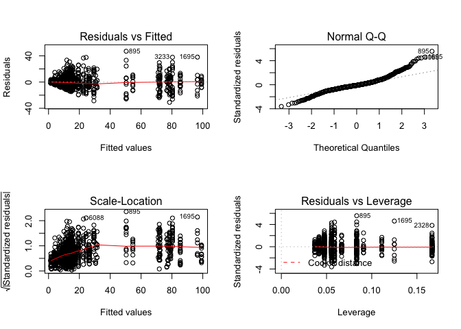
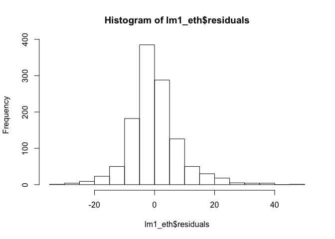
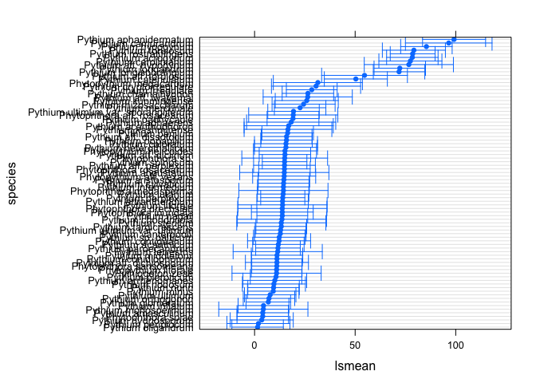
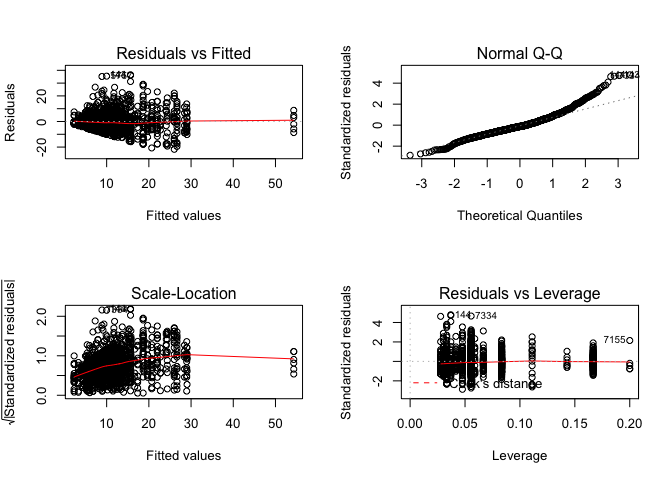
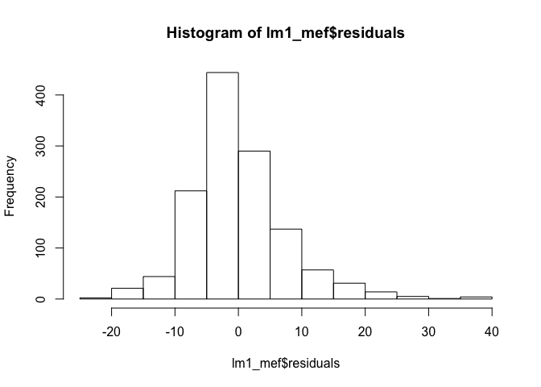
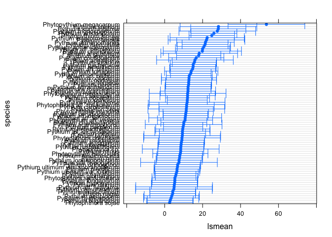
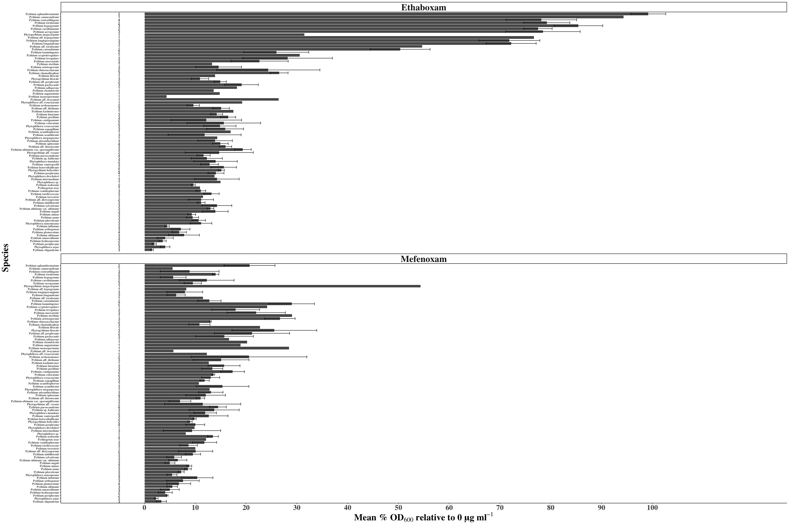
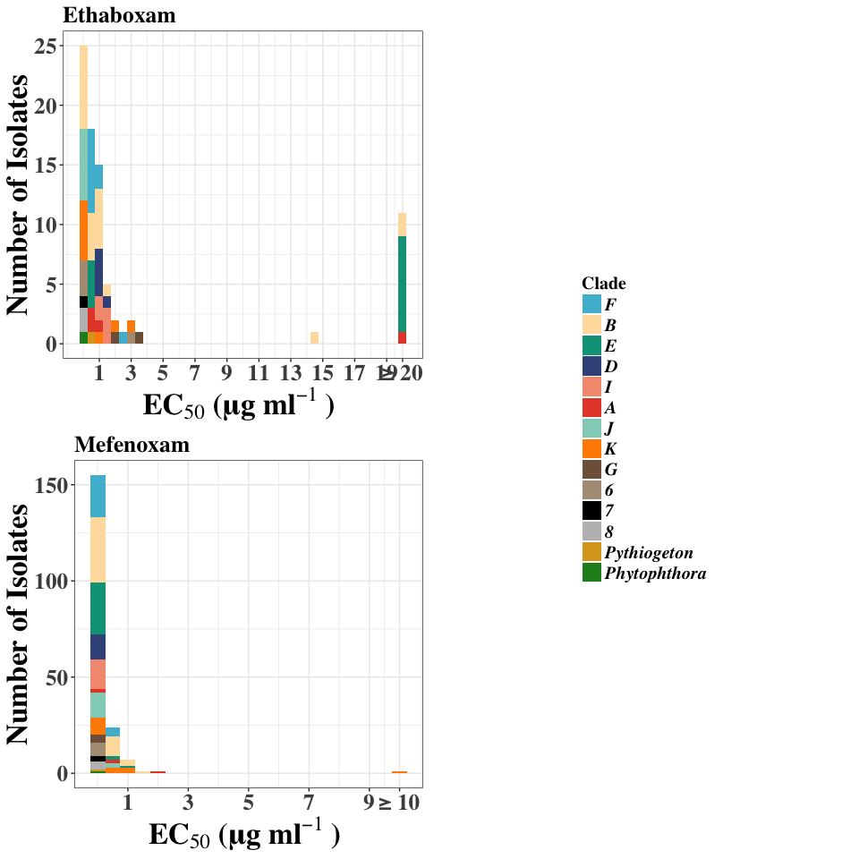

    ## Warning: Installed Rcpp (0.12.12) different from Rcpp used to build dplyr (0.12.11).
    ## Please reinstall dplyr to avoid random crashes or undefined behavior.

    ##          drc         lme4      lsmeans         plyr      plotrix 
    ##         TRUE         TRUE         TRUE         TRUE         TRUE 
    ##        knitr      ggplot2       lmtest     lmerTest        Rmisc 
    ##         TRUE         TRUE         TRUE         TRUE         TRUE 
    ##    gridExtra       plotly      webshot      ggpmisc multcompView 
    ##         TRUE         TRUE         TRUE         TRUE         TRUE 
    ##        ggsci          AER      betareg 
    ##         TRUE         TRUE         TRUE

Ethaboxam and Mefenoxam high throughput fungicide sensitivity data
------------------------------------------------------------------

Reading in data

``` r
growth.un.eth <- read.csv("ethaboxam_Set1-8_Trials1_2_Corrected.csv", na.strings = "na")
growth.un.eth <- data.frame(na.omit(growth.un.eth)) #omits missing values
growth.un.mef <- data.frame(read.csv("mefenoxam_Set1-8_Trials1_2_Corrected.csv", na.strings = "na"))
growth.un.mef <- data.frame(na.omit(growth.un.mef)) #omits missing values

combined <- rbind.data.frame(growth.un.eth, growth.un.mef)
```

Z'factor filtering
------------------

We are using Z'factor analysis as a screening method to pick out any isolates that did not grow enough compared to backround noise, or blank controls. This step ensures assay conditions and growth were good enough to be distiguished from backround noise. It does not nessesarily indicate high-quality data input into the non-linear regressions for EC50 evalutation, but does make it a little cleaner.

This is the code to do this analysis, but each isolate has been manually removed previously

``` r
Z <- function (sdPC, sdNC, mPC, mNC) {1-((3*(sdPC + sdNC))/abs(mPC - mNC))}
```

``` r
Zfactor <- function(df){
growth.un.eth <- df
df <- df[!df$genus == "BLANK",]
df <- df[!df$genus == "NTC",]
Zfactor.dataframe <- NULL
trial <- unique(growth.un.eth$trial)
set <- unique(growth.un.eth$set)
for(x in trial){
  for(y in set){
    growth.od_loop <- growth.un.eth[growth.un.eth$trial == x & growth.un.eth$set == y,]
    growth.od_loop$is <- factor(growth.od_loop$is)
    growth.od_loop$genus <- factor(growth.od_loop$genus)
    nm <- levels(growth.od_loop$is)
    sdPosControl <- sd(growth.od_loop$od600[growth.od_loop$genus == "BLANK" & growth.od_loop$trial == x & growth.od_loop$set == y])
    meanPosControl <- mean(growth.od_loop$od600[growth.od_loop$genus == "BLANK" & growth.od_loop$trial == x & growth.od_loop$set == y])
    for(i in seq_along(nm)){
      sdNegControl <- sd(growth.od_loop$od600[growth.od_loop$is == nm[[i]] & growth.od_loop$conc == 0 & growth.od_loop$trial == x & growth.od_loop$set == y])
      meanNegControl <- mean(growth.od_loop$od600[growth.od_loop$is == nm[[i]] & growth.od_loop$conc == 0 & growth.od_loop$trial == x & growth.od_loop$set == y])
      Zloop_is <- data.frame(nm[[i]], 
                             as.character(unique(growth.od_loop$species[growth.od_loop$is == nm[[i]]])),
                             as.character(unique(growth.od_loop$clade[growth.od_loop$is == nm[[i]]])),
                             as.character(unique(growth.od_loop$genus[growth.od_loop$is == nm[[i]]])),
                             x, 
                             y, 
                             as.character(unique(growth.od_loop$hrs[growth.od_loop$is == nm[[i]]])),
                             meanNegControl,
                             sdNegControl,
                             sdPosControl, 
                             meanPosControl)
      colnames(Zloop_is) <- c("isolate", 
                              "species",
                              "clade",
                              "genus",
                              "trial",
                              "set", 
                              "hours",
                              "meanod600",
                              "sdod600",
                              "sdblank",
                              "meanblank")
      Zfactor.dataframe <- rbind(Zfactor.dataframe, Zloop_is)
    }
  }
}
#Zfactor.dataframe <- Zfactor.dataframe[!Zfactor.dataframe$clade == "BLANK",]
#Zfactor.dataframe <- Zfactor.dataframe[!Zfactor.dataframe$clade == "NTC",]
#Zfactor.dataframe$Zfactor <- format(Zfactor.dataframe$Zfactor, scientific = F)
#Zfactor.dataframe$Zfactor <- as.numeric(as.character(Zfactor.dataframe$Zfactor))
#Zfactor.dataframe <- Zfactor.dataframe[order(Zfactor.dataframe$is),]
#Zfactor.dataframe$Zfactor <- ifelse(Zfactor.dataframe$Zfactor < 0, 0, Zfactor.dataframe$Zfactor)
return(Zfactor.dataframe)
}

# calculate
eth_Z <- Zfactor(growth.un.eth)
mef_Z <- Zfactor(growth.un.mef)
```

``` r
eth_Z$chem <- "ethaboxam"
mef_Z$chem <- "mefenoxam"

Z_factor <- rbind.data.frame(eth_Z, mef_Z)

Z_factor$Zfactor <- Z(Z_factor$sdblank, Z_factor$sdod600, Z_factor$meanblank, Z_factor$meanod600)
Z_factor$Zfactor <- ifelse(Z_factor$Zfactor < 0, 0, Z_factor$Zfactor)
Z_factor <- Z_factor[!Z_factor$species == "BLANK",]
Z_factor <- Z_factor[!Z_factor$species == "NTC",]
Z_factor <- Z_factor[!Z_factor$species == "REF",]

#write.csv(Z_factor, "Z_factor.csv")
ggplot(Z_factor, aes(x = reorder(isolate, Zfactor), y = Zfactor, shape = chem, color = hours)) + 
  geom_point() +
  geom_hline(yintercept = 0.4) +
  theme(axis.text.x = element_text(angle = 90, hjust = 1, size = 5)) +
  geom_text(aes(label=ifelse(Zfactor<0.4,as.character(isolate),'')),hjust=0,vjust=0) 
```


EC50 calculation and data gathering
-----------------------------------

The loop will run a regression for each individual isolate and will print out the summary statistics. It will also generate a table at the end, entitled EC50, ordered by species, showing the EC50, and some various summary statistics pulled out from the loop as it was running.

This will generate a table with the following information: Isolate Species Clade Trial EC50 estimation Std Error of EC50 Upper95 of EC50 Lower95 of EC50 Percent Relative Growth at 10 or 20 ppm mefenoxam or ethaboxam respecivley Std error of Percent Relative Growth Growth Rate Std error Growth Rate The hours each isolate was measured

``` r
genEC <- function(df, max.conc) {
    df <- df[!df$genus == "BLANK", ]
    df <- df[!df$genus == "NTC", ]
    df <- df[!df$genus == "REF", ]
    df$is <- factor(df$is)
    EC50 <- NULL
    colnames <- c("Isolate", "Species", "Clade", "Trial", "EC50", "StdErr", 
        "Upper95", "Lower95", "PercentRelGrowth", "StdErrRG", "GR", "StdErrGR", 
        "Hours")
    rel.grow <- NULL
    nm <- levels(df$is)
    for (i in seq_along(nm)) {
        a <- length(unique(df$loop[df$is == nm[[i]]]))
        for (t in 1:a) {
            growth.ed.ethmef <- drm(100 * relgrowth ~ conc, data = df[df$is == 
                nm[[i]] & df$loop == t, ], fct = LL.4(), na.action = na.omit)
            print(nm[[i]])
            print(t)
            
            # outputs the summary of the paramters including the estimate, standard
            # error, t-value, and p-value outputs it into a df frame called
            # summary.mef.fit for 'summary of fit'
            summary.mef.fit <- data.frame(summary(growth.ed.ethmef)[[3]])
            # outputs the summary of just the EC50 df including the estimate, standard
            # error, upper and lower bounds of the 95% confidence intervals around the
            # EC50
            EC50.od.rel <- data.frame(ED(growth.ed.ethmef, respLev = c(50), 
                type = "relative", interval = "delta"), level = 0.95)
            rel.ec50 <- EC50.od.rel[1][[1]]
            EC50.od.abs <- data.frame(ED(growth.ed.ethmef, respLev = c(50), 
                type = "absolute", interval = "delta"), level = 0.95)
            abs.ec50 <- EC50.od.abs[1][[1]]
            
            # grabbing some of the values we want from the model fit
            ec50 <- EC50.od.abs[1][[1]]
            stderr <- EC50.od.abs[2][[1]]
            lower <- EC50.od.abs[3][[1]]
            upper <- EC50.od.abs[4][[1]]
            
            # grabing the species and clade
            species <- as.character(unique(df$species[df$is == nm[[i]]]))
            clade <- as.character(unique(df$clade[df$is == nm[[i]]]))
            
            # calculating relative growth at 20 ppm
            relgrowth20 <- mean(100 * df$relgrowth[df$is == nm[[i]] & df$conc == 
                max.conc & df$loop == t])
            relgrowth20.sd <- sd(100 * df$relgrowth[df$is == nm[[i]] & df$conc == 
                max.conc & df$loop == t])
            stderr.rel <- relgrowth20.sd/sqrt(length(df$relgrowth[df$is == nm[[i]] & 
                df$conc == max.conc & df$loop == t]))
            growthrate <- mean(df$od600meanblank[df$is == nm[[i]] & df$conc == 
                0 & df$loop == t])/unique(df$hrs[df$is == nm[[i]] & df$conc == 
                0 & df$loop == t])
            stderr.gr <- growthrate/length(mean(df$od600meanblank[df$is == nm[[i]] & 
                df$conc == 0 & df$loop == t]))
            hours <- as.numeric(unique(df$hrs[df$is == nm[[i]]]))
            EC50_i <- data.frame(cbind.data.frame(nm[[i]], as.character(species), 
                as.character(clade), as.numeric(t), as.numeric(ec50), as.numeric(stderr), 
                as.numeric(lower), as.numeric(upper), as.numeric(relgrowth20), 
                as.numeric(stderr.rel), as.numeric(growthrate), as.numeric(stderr.gr), 
                as.numeric(hours)))
            colnames(EC50_i) <- colnames
            
            EC50 <- rbind.data.frame(EC50, EC50_i)
            colnames(EC50) <- colnames
            
            EC50$EC50 <- ifelse(EC50$EC50 > max.conc, max.conc, EC50$EC50)
            EC50$EC50[is.na(EC50$EC50)] <- max.conc
            EC50$StdErr <- ifelse(EC50$EC50 > max.conc, NA, EC50$StdErr)
            
        }
    }
    return(EC50)
}
EC50.eth <- genEC(growth.un.eth, 20)
EC50.mef <- genEC(growth.un.mef, 10)
EC50.mef$Chem <- "Mefenoxam"
EC50.eth$Chem <- "Ethaboxam"
combine.EC <- rbind.data.frame(EC50.eth, EC50.mef)
# write.csv(combine.EC, 'ec50.csv')
```

Growth Rate Plot
----------------

Objective: test if isolates measured at 24 hours had a significantly faster growth rate than those at 48 hours

``` r
ggplot(combine.EC, aes(x=GR)) + geom_density(aes(group=Hours, fill= as.factor(Hours)), alpha=0.3)
```


``` r
summary(combine.EC$GR[combine.EC$Hours == 24])
```

    ##     Min.  1st Qu.   Median     Mean  3rd Qu.     Max. 
    ## 0.007235 0.022920 0.028880 0.028100 0.033400 0.062170

``` r
summary(combine.EC$GR[combine.EC$Hours == 48])
```

    ##     Min.  1st Qu.   Median     Mean  3rd Qu.     Max. 
    ## 0.007472 0.013370 0.015840 0.015840 0.018340 0.025490

Two sample t-test

``` r
t.test(combine.EC$GR[combine.EC$Hours == 24], combine.EC$GR[combine.EC$Hours == 48])
```

    ## 
    ##  Welch Two Sample t-test
    ## 
    ## data:  combine.EC$GR[combine.EC$Hours == 24] and combine.EC$GR[combine.EC$Hours == 48]
    ## t = 28.23, df = 431.56, p-value < 2.2e-16
    ## alternative hypothesis: true difference in means is not equal to 0
    ## 95 percent confidence interval:
    ##  0.01140017 0.01310638
    ## sample estimates:
    ##  mean of x  mean of y 
    ## 0.02809795 0.01584467

``` r
#subsetting the data to not include the control data points
noblank <- c("BLANK", "REF", "NTC")
eth.noblank <- growth.un.eth[!growth.un.eth$clade %in% noblank,]
mef.noblank <- growth.un.mef[!growth.un.mef$clade %in% noblank,]
```

Testing the effect of species on percent relative growth at 20 ppm Ethaboxam
----------------------------------------------------------------------------

Model 1: Species as fixed effect Model 2: Species as fixed effect and experiment as random effect Model 3: Species as fixed effect and isolate nested within species as random effect Model 4: Species as fixed effect, experiment as random effect, and isolate nested within species as random effect

``` r
lm1_eth <- lm(relgrowth*100 ~ species, data = eth.noblank[eth.noblank$conc == 20,])
summary(lm1_eth, adjust="bon")
```

    ## 
    ## Call:
    ## lm(formula = relgrowth * 100 ~ species, data = eth.noblank[eth.noblank$conc == 
    ##     20, ])
    ## 
    ## Residuals:
    ##     Min      1Q  Median      3Q     Max 
    ## -30.927  -4.518  -0.863   3.467  46.962 
    ## 
    ## Coefficients:
    ##                                            Estimate Std. Error t value
    ## (Intercept)                                 19.2260     3.6132   5.321
    ## speciesPhytophthora drechsleri              -5.4369     5.1099  -1.064
    ## speciesPhytophthora inundata                -6.1031     4.2752  -1.428
    ## speciesPhytophthora megasperma              -4.8858     5.1099  -0.956
    ## speciesPhytophthora rosacearum              -4.3790     4.1722  -1.050
    ## speciesPhytophthora sansomeana              -8.3368     4.0397  -2.064
    ## speciesPhytophthora sojae                  -15.1678     4.1722  -3.635
    ## speciesPhytophthora sp.                     -4.2478     4.6647  -0.911
    ## speciesPhytopythium aff. vexans             -4.5157     4.4253  -1.020
    ## speciesPhytopythium helicoides              -4.1177     4.4253  -0.931
    ## speciesPhytopythium litorale                -8.1002     4.0970  -1.977
    ## speciesPhytopythium megacarpum              12.2431     5.1099   2.396
    ## speciesPythiogeton zeae                     -8.2870     5.1099  -1.622
    ## speciesPythium acanthicum                   -7.3974     4.1722  -1.773
    ## speciesPythium acanthophoron                -2.2705     5.1099  -0.444
    ## speciesPythium acrogynum                    59.2115     4.1722  14.192
    ## speciesPythium adhaerens                    -1.0333     5.1099  -0.202
    ## speciesPythium aff. diclinum                -4.1358     4.1722  -0.991
    ## speciesPythium aff. dictyosporum            -8.1135     4.4253  -1.833
    ## speciesPythium aff. dissotocum              -3.4040     4.0970  -0.831
    ## speciesPythium aff. hypogynum               57.4635     5.1099  11.246
    ## speciesPythium aff. iwayamai                 7.1961     5.1099   1.408
    ## speciesPythium aff. perplexum               -4.5412     4.2752  -1.062
    ## speciesPythium aff. torulosum               35.4387     4.6647   7.597
    ## speciesPythium amasculinum                 -15.1555     4.1722  -3.632
    ## speciesPythium angustatum                   -4.4490     5.1099  -0.871
    ## speciesPythium aphanidermatum               79.9535     4.4253  18.067
    ## speciesPythium aristosporum                 -4.6443     4.1722  -1.113
    ## speciesPythium arrhenomanes                 -9.2777     4.4918  -2.065
    ## speciesPythium attrantheridium              -5.3157     4.1722  -1.274
    ## speciesPythium camurandrum                  77.3044     4.7798  16.173
    ## speciesPythium carolinianum                 58.2418     4.4253  13.161
    ## speciesPythium catenulatum                  31.1190     4.4253   7.032
    ## speciesPythium chamaihyphon                  7.2878     4.1722   1.747
    ## speciesPythium chondricola                  -5.6121     5.1099  -1.098
    ## speciesPythium coloratum                    -3.6089     4.4253  -0.816
    ## speciesPythium conidiophorum                -7.9325     4.0970  -1.936
    ## speciesPythium contiguanum                  -7.0469     4.4253  -1.592
    ## speciesPythium cryptoirregulare             11.3272     5.1099   2.217
    ## speciesPythium glomeratum                  -12.3969     4.0397  -3.069
    ## speciesPythium heterothallicum              -3.6367     4.4253  -0.822
    ## speciesPythium hydnosporum                 -15.6693     4.4253  -3.541
    ## speciesPythium hypogynum                    66.2014     4.1722  15.867
    ## speciesPythium inflatum                    -14.7577     4.0970  -3.602
    ## speciesPythium intermedium                  -4.7583     4.2028  -1.132
    ## speciesPythium irregulare                   10.1799     4.0970   2.485
    ## speciesPythium kashmirense                  -2.6181     4.9240  -0.532
    ## speciesPythium kunmingense                   6.7177     4.4253   1.518
    ## speciesPythium litorale                     -5.3186     5.1099  -1.041
    ## speciesPythium longandrum                   52.9659     4.1722  12.695
    ## speciesPythium longisporangium              52.5998     4.1722  12.607
    ## speciesPythium lutarium                     -5.0272     4.1722  -1.205
    ## speciesPythium mercuriale                    3.4152     4.1722   0.819
    ## speciesPythium middletonii                  -8.0704     4.1722  -1.934
    ## speciesPythium minus                        -9.9418     4.1722  -2.383
    ## speciesPythium monospermum                 -14.8692     5.1099  -2.910
    ## speciesPythium nagaii                       -5.9978     4.0970  -1.464
    ## speciesPythium nodosum                      -9.6183     4.4253  -2.174
    ## speciesPythium nunn                         -9.7797     4.1722  -2.344
    ## speciesPythium oligandrum                  -17.7258     4.1722  -4.249
    ## speciesPythium oopapillum                   -3.3619     4.1722  -0.806
    ## speciesPythium orthogonon                  -12.0631     4.1722  -2.891
    ## speciesPythium pachycaule                    0.1637     4.2028   0.039
    ## speciesPythium paroecandrum                 -7.5903     4.0397  -1.879
    ## speciesPythium periilum                     -2.7658     4.1722  -0.663
    ## speciesPythium periplocum                  -17.3128     4.4253  -3.912
    ## speciesPythium perplexum                    -5.4201     3.9946  -1.357
    ## speciesPythium pleroticum                   -8.5576     4.1722  -2.051
    ## speciesPythium rhizosaccharum                5.1472     4.4253   1.163
    ## speciesPythium rostratifingens              58.7161     4.0572  14.472
    ## speciesPythium sp. balticum                 -6.9634     4.1722  -1.669
    ## speciesPythium spinosum                     -4.3041     4.0397  -1.065
    ## speciesPythium sterilum                     -5.9441     5.1099  -1.163
    ## speciesPythium sylvaticum                   -4.1485     4.0970  -1.013
    ## speciesPythium tardicrescens                -5.6105     4.0970  -1.369
    ## speciesPythium terrestris                   -7.7276     5.1099  -1.512
    ## speciesPythium torulosum                    59.9773     4.4253  13.553
    ## speciesPythium ultimum                     -11.4606     4.1722  -2.747
    ## speciesPythium ultimum var. sporangiiferum   0.1337     4.1722   0.032
    ## speciesPythium ultimum var. ultimum         -6.4378     4.0970  -1.571
    ## speciesPythium vanterpoolii                 -6.4212     4.1722  -1.539
    ##                                            Pr(>|t|)    
    ## (Intercept)                                1.25e-07 ***
    ## speciesPhytophthora drechsleri             0.287559    
    ## speciesPhytophthora inundata               0.153705    
    ## speciesPhytophthora megasperma             0.339206    
    ## speciesPhytophthora rosacearum             0.294151    
    ## speciesPhytophthora sansomeana             0.039278 *  
    ## speciesPhytophthora sojae                  0.000290 ***
    ## speciesPhytophthora sp.                    0.362687    
    ## speciesPhytopythium aff. vexans            0.307750    
    ## speciesPhytopythium helicoides             0.352314    
    ## speciesPhytopythium litorale               0.048277 *  
    ## speciesPhytopythium megacarpum             0.016742 *  
    ## speciesPythiogeton zeae                    0.105139    
    ## speciesPythium acanthicum                  0.076500 .  
    ## speciesPythium acanthophoron               0.656893    
    ## speciesPythium acrogynum                    < 2e-16 ***
    ## speciesPythium adhaerens                   0.839791    
    ## speciesPythium aff. diclinum               0.321764    
    ## speciesPythium aff. dictyosporum           0.067005 .  
    ## speciesPythium aff. dissotocum             0.406239    
    ## speciesPythium aff. hypogynum               < 2e-16 ***
    ## speciesPythium aff. iwayamai               0.159329    
    ## speciesPythium aff. perplexum              0.288372    
    ## speciesPythium aff. torulosum              6.42e-14 ***
    ## speciesPythium amasculinum                 0.000294 ***
    ## speciesPythium angustatum                  0.384122    
    ## speciesPythium aphanidermatum               < 2e-16 ***
    ## speciesPythium aristosporum                0.265884    
    ## speciesPythium arrhenomanes                0.039111 *  
    ## speciesPythium attrantheridium             0.202904    
    ## speciesPythium camurandrum                  < 2e-16 ***
    ## speciesPythium carolinianum                 < 2e-16 ***
    ## speciesPythium catenulatum                 3.56e-12 ***
    ## speciesPythium chamaihyphon                0.080958 .  
    ## speciesPythium chondricola                 0.272315    
    ## speciesPythium coloratum                   0.414956    
    ## speciesPythium conidiophorum               0.053101 .  
    ## speciesPythium contiguanum                 0.111578    
    ## speciesPythium cryptoirregulare            0.026844 *  
    ## speciesPythium glomeratum                  0.002202 ** 
    ## speciesPythium heterothallicum             0.411361    
    ## speciesPythium hydnosporum                 0.000415 ***
    ## speciesPythium hypogynum                    < 2e-16 ***
    ## speciesPythium inflatum                    0.000330 ***
    ## speciesPythium intermedium                 0.257801    
    ## speciesPythium irregulare                  0.013113 *  
    ## speciesPythium kashmirense                 0.595037    
    ## speciesPythium kunmingense                 0.129294    
    ## speciesPythium litorale                    0.298170    
    ## speciesPythium longandrum                   < 2e-16 ***
    ## speciesPythium longisporangium              < 2e-16 ***
    ## speciesPythium lutarium                    0.228487    
    ## speciesPythium mercuriale                  0.413209    
    ## speciesPythium middletonii                 0.053329 .  
    ## speciesPythium minus                       0.017346 *  
    ## speciesPythium monospermum                 0.003688 ** 
    ## speciesPythium nagaii                      0.143496    
    ## speciesPythium nodosum                     0.029954 *  
    ## speciesPythium nunn                        0.019253 *  
    ## speciesPythium oligandrum                  2.33e-05 ***
    ## speciesPythium oopapillum                  0.420542    
    ## speciesPythium orthogonon                  0.003911 ** 
    ## speciesPythium pachycaule                  0.968928    
    ## speciesPythium paroecandrum                0.060519 .  
    ## speciesPythium periilum                    0.507519    
    ## speciesPythium periplocum                  9.70e-05 ***
    ## speciesPythium perplexum                   0.175097    
    ## speciesPythium pleroticum                  0.040492 *  
    ## speciesPythium rhizosaccharum              0.245030    
    ## speciesPythium rostratifingens              < 2e-16 ***
    ## speciesPythium sp. balticum                0.095400 .  
    ## speciesPythium spinosum                    0.286902    
    ## speciesPythium sterilum                    0.244972    
    ## speciesPythium sylvaticum                  0.311493    
    ## speciesPythium tardicrescens               0.171149    
    ## speciesPythium terrestris                  0.130748    
    ## speciesPythium torulosum                    < 2e-16 ***
    ## speciesPythium ultimum                     0.006114 ** 
    ## speciesPythium ultimum var. sporangiiferum 0.974449    
    ## speciesPythium ultimum var. ultimum        0.116388    
    ## speciesPythium vanterpoolii                0.124078    
    ## ---
    ## Signif. codes:  0 '***' 0.001 '**' 0.01 '*' 0.05 '.' 0.1 ' ' 1
    ## 
    ## Residual standard error: 8.851 on 1106 degrees of freedom
    ## Multiple R-squared:  0.8793, Adjusted R-squared:  0.8706 
    ## F-statistic: 100.7 on 80 and 1106 DF,  p-value: < 2.2e-16

``` r
#Plotting diagnostic plots for fit1 model
par(mfrow=c(2,2)) # optional layout 
plot(lm1_eth)# diagnostic plots
```



``` r
#Plotting residuals
par(mfrow=c(1,1)) # optional layout 
hist(lm1_eth$residuals)
```



``` r
lm2_eth <- lmer(relgrowth*100 ~ species + (1|trial), data = eth.noblank[eth.noblank$conc == 20,])
summary(lm2_eth, adjust="bon")
```

    ## Linear mixed model fit by REML t-tests use Satterthwaite approximations
    ##   to degrees of freedom [lmerMod]
    ## Formula: relgrowth * 100 ~ species + (1 | trial)
    ##    Data: eth.noblank[eth.noblank$conc == 20, ]
    ## 
    ## REML criterion at convergence: 8171.2
    ## 
    ## Scaled residuals: 
    ##     Min      1Q  Median      3Q     Max 
    ## -3.5136 -0.5046 -0.0988  0.3988  5.3260 
    ## 
    ## Random effects:
    ##  Groups   Name        Variance Std.Dev.
    ##  trial    (Intercept)  0.1093  0.3306  
    ##  Residual             78.2746  8.8473  
    ## Number of obs: 1187, groups:  trial, 3
    ## 
    ## Fixed effects:
    ##                                             Estimate Std. Error        df
    ## (Intercept)                                  19.2351     3.6194 1033.5000
    ## speciesPhytophthora drechsleri               -5.4369     5.1080 1105.0000
    ## speciesPhytophthora inundata                 -6.0078     4.2750 1106.0000
    ## speciesPhytophthora megasperma               -4.8858     5.1080 1105.0000
    ## speciesPhytophthora rosacearum               -4.3790     4.1707 1105.0000
    ## speciesPhytophthora sansomeana               -8.3039     4.0397 1105.7000
    ## speciesPhytophthora sojae                   -15.0090     4.1744 1104.0000
    ## speciesPhytophthora sp.                      -4.1948     4.6633 1105.4000
    ## speciesPhytopythium aff. vexans              -4.5157     4.4236 1105.0000
    ## speciesPhytopythium helicoides               -4.1177     4.4236 1105.0000
    ## speciesPhytopythium litorale                 -8.1229     4.0956 1105.1000
    ## speciesPhytopythium megacarpum               12.2431     5.1080 1105.0000
    ## speciesPythiogeton zeae                      -8.2870     5.1080 1105.0000
    ## speciesPythium acanthicum                    -7.3444     4.1711 1105.4000
    ## speciesPythium acanthophoron                 -2.2705     5.1080 1105.0000
    ## speciesPythium acrogynum                     59.2115     4.1707 1105.0000
    ## speciesPythium adhaerens                     -1.0333     5.1080 1105.0000
    ## speciesPythium aff. diclinum                 -4.0829     4.1711 1105.4000
    ## speciesPythium aff. dictyosporum             -8.1135     4.4236 1105.0000
    ## speciesPythium aff. dissotocum               -3.4079     4.0959 1105.7000
    ## speciesPythium aff. hypogynum                57.4635     5.1080 1105.0000
    ## speciesPythium aff. iwayamai                  7.1961     5.1080 1105.0000
    ## speciesPythium aff. perplexum                -4.5729     4.2738 1105.2000
    ## speciesPythium aff. torulosum                35.3858     4.6633 1105.4000
    ## speciesPythium amasculinum                  -15.1555     4.1707 1105.0000
    ## speciesPythium angustatum                    -4.4490     5.1080 1105.0000
    ## speciesPythium aphanidermatum                79.9535     4.4236 1105.0000
    ## speciesPythium aristosporum                  -4.6443     4.1707 1105.0000
    ## speciesPythium arrhenomanes                  -9.2922     4.4902 1105.0000
    ## speciesPythium attrantheridium               -5.3157     4.1707 1105.0000
    ## speciesPythium camurandrum                   77.3838     4.7789 1105.7000
    ## speciesPythium carolinianum                  58.2418     4.4236 1105.0000
    ## speciesPythium catenulatum                   31.1190     4.4236 1105.0000
    ## speciesPythium chamaihyphon                   7.2878     4.1707 1105.0000
    ## speciesPythium chondricola                   -5.6121     5.1080 1105.0000
    ## speciesPythium coloratum                     -3.6089     4.4236 1105.0000
    ## speciesPythium conidiophorum                 -8.0006     4.0962 1105.7000
    ## speciesPythium contiguanum                   -7.0469     4.4236 1105.0000
    ## speciesPythium cryptoirregulare              11.1684     5.1110 1105.6000
    ## speciesPythium glomeratum                   -12.4366     4.0385 1105.3000
    ## speciesPythium heterothallicum               -3.6367     4.4236 1105.0000
    ## speciesPythium hydnosporum                  -15.6693     4.4236 1105.0000
    ## speciesPythium hypogynum                     66.2544     4.1711 1105.4000
    ## speciesPythium inflatum                     -14.7350     4.0956 1105.1000
    ## speciesPythium intermedium                   -4.7677     4.2012 1105.0000
    ## speciesPythium irregulare                    10.1572     4.0956 1105.1000
    ## speciesPythium kashmirense                   -2.5954     4.9222 1105.0000
    ## speciesPythium kunmingense                    6.7177     4.4236 1105.0000
    ## speciesPythium litorale                      -5.3186     5.1080 1105.0000
    ## speciesPythium longandrum                    52.9130     4.1711 1105.4000
    ## speciesPythium longisporangium               52.6528     4.1711 1105.4000
    ## speciesPythium lutarium                      -5.0582     4.1713 1105.9000
    ## speciesPythium mercuriale                     3.4152     4.1707 1105.0000
    ## speciesPythium middletonii                   -8.0704     4.1707 1105.0000
    ## speciesPythium minus                         -9.8889     4.1711 1105.4000
    ## speciesPythium monospermum                  -14.8692     5.1080 1105.0000
    ## speciesPythium nagaii                        -6.0204     4.0956 1105.1000
    ## speciesPythium nodosum                       -9.6183     4.4236 1105.0000
    ## speciesPythium nunn                          -9.7797     4.1707 1105.0000
    ## speciesPythium oligandrum                   -17.6729     4.1711 1105.4000
    ## speciesPythium oopapillum                    -3.3619     4.1707 1105.0000
    ## speciesPythium orthogonon                   -12.0631     4.1707 1105.0000
    ## speciesPythium pachycaule                     0.1544     4.2012 1105.0000
    ## speciesPythium paroecandrum                  -7.5903     4.0382 1105.0000
    ## speciesPythium periilum                      -2.7658     4.1707 1105.0000
    ## speciesPythium periplocum                   -17.3128     4.4236 1105.0000
    ## speciesPythium perplexum                     -5.4378     3.9931 1105.0000
    ## speciesPythium pleroticum                    -8.5576     4.1707 1105.0000
    ## speciesPythium rhizosaccharum                 5.1472     4.4236 1105.0000
    ## speciesPythium rostratifingens               58.7920     4.0566 1105.8000
    ## speciesPythium sp. balticum                  -6.9634     4.1707 1105.0000
    ## speciesPythium spinosum                      -4.2644     4.0385 1105.3000
    ## speciesPythium sterilum                      -5.9441     5.1080 1105.0000
    ## speciesPythium sylvaticum                    -4.1523     4.0959 1105.7000
    ## speciesPythium tardicrescens                 -5.6332     4.0956 1105.1000
    ## speciesPythium terrestris                    -7.7276     5.1080 1105.0000
    ## speciesPythium torulosum                     59.9773     4.4236 1105.0000
    ## speciesPythium ultimum                      -11.4606     4.1707 1105.0000
    ## speciesPythium ultimum var. sporangiiferum    0.1027     4.1713 1105.9000
    ## speciesPythium ultimum var. ultimum          -6.5325     4.0971 1105.9000
    ## speciesPythium vanterpoolii                  -6.3153     4.1723 1106.0000
    ##                                            t value Pr(>|t|)    
    ## (Intercept)                                  5.314 1.31e-07 ***
    ## speciesPhytophthora drechsleri              -1.064 0.287382    
    ## speciesPhytophthora inundata                -1.405 0.160199    
    ## speciesPhytophthora megasperma              -0.957 0.339028    
    ## speciesPhytophthora rosacearum              -1.050 0.293973    
    ## speciesPhytophthora sansomeana              -2.056 0.040058 *  
    ## speciesPhytophthora sojae                   -3.596 0.000338 ***
    ## speciesPhytophthora sp.                     -0.900 0.368559    
    ## speciesPhytopythium aff. vexans             -1.021 0.307572    
    ## speciesPhytopythium helicoides              -0.931 0.352137    
    ## speciesPhytopythium litorale                -1.983 0.047577 *  
    ## speciesPhytopythium megacarpum               2.397 0.016702 *  
    ## speciesPythiogeton zeae                     -1.622 0.105011    
    ## speciesPythium acanthicum                   -1.761 0.078548 .  
    ## speciesPythium acanthophoron                -0.444 0.656774    
    ## speciesPythium acrogynum                    14.197  < 2e-16 ***
    ## speciesPythium adhaerens                    -0.202 0.839733    
    ## speciesPythium aff. diclinum                -0.979 0.327864    
    ## speciesPythium aff. dictyosporum            -1.834 0.066905 .  
    ## speciesPythium aff. dissotocum              -0.832 0.405575    
    ## speciesPythium aff. hypogynum               11.250  < 2e-16 ***
    ## speciesPythium aff. iwayamai                 1.409 0.159175    
    ## speciesPythium aff. perplexum               -1.070 0.284854    
    ## speciesPythium aff. torulosum                7.588 6.88e-14 ***
    ## speciesPythium amasculinum                  -3.634 0.000292 ***
    ## speciesPythium angustatum                   -0.871 0.383947    
    ## speciesPythium aphanidermatum               18.074  < 2e-16 ***
    ## speciesPythium aristosporum                 -1.114 0.265708    
    ## speciesPythium arrhenomanes                 -2.069 0.038738 *  
    ## speciesPythium attrantheridium              -1.275 0.202738    
    ## speciesPythium camurandrum                  16.193  < 2e-16 ***
    ## speciesPythium carolinianum                 13.166  < 2e-16 ***
    ## speciesPythium catenulatum                   7.035 3.50e-12 ***
    ## speciesPythium chamaihyphon                  1.747 0.080847 .  
    ## speciesPythium chondricola                  -1.099 0.272139    
    ## speciesPythium coloratum                    -0.816 0.414784    
    ## speciesPythium conidiophorum                -1.953 0.051051 .  
    ## speciesPythium contiguanum                  -1.593 0.111446    
    ## speciesPythium cryptoirregulare              2.185 0.029087 *  
    ## speciesPythium glomeratum                   -3.080 0.002124 ** 
    ## speciesPythium heterothallicum              -0.822 0.411188    
    ## speciesPythium hydnosporum                  -3.542 0.000413 ***
    ## speciesPythium hypogynum                    15.884  < 2e-16 ***
    ## speciesPythium inflatum                     -3.598 0.000335 ***
    ## speciesPythium intermedium                  -1.135 0.256695    
    ## speciesPythium irregulare                    2.480 0.013285 *  
    ## speciesPythium kashmirense                  -0.527 0.598101    
    ## speciesPythium kunmingense                   1.519 0.129153    
    ## speciesPythium litorale                     -1.041 0.297992    
    ## speciesPythium longandrum                   12.686  < 2e-16 ***
    ## speciesPythium longisporangium              12.623  < 2e-16 ***
    ## speciesPythium lutarium                     -1.213 0.225531    
    ## speciesPythium mercuriale                    0.819 0.413037    
    ## speciesPythium middletonii                  -1.935 0.053241 .  
    ## speciesPythium minus                        -2.371 0.017919 *  
    ## speciesPythium monospermum                  -2.911 0.003675 ** 
    ## speciesPythium nagaii                       -1.470 0.141850    
    ## speciesPythium nodosum                      -2.174 0.029894 *  
    ## speciesPythium nunn                         -2.345 0.019209 *  
    ## speciesPythium oligandrum                   -4.237 2.45e-05 ***
    ## speciesPythium oopapillum                   -0.806 0.420371    
    ## speciesPythium orthogonon                   -2.892 0.003898 ** 
    ## speciesPythium pachycaule                    0.037 0.970689    
    ## speciesPythium paroecandrum                 -1.880 0.060425 .  
    ## speciesPythium periilum                     -0.663 0.507362    
    ## speciesPythium periplocum                   -3.914 9.64e-05 ***
    ## speciesPythium perplexum                    -1.362 0.173545    
    ## speciesPythium pleroticum                   -2.052 0.040418 *  
    ## speciesPythium rhizosaccharum                1.164 0.244856    
    ## speciesPythium rostratifingens              14.493  < 2e-16 ***
    ## speciesPythium sp. balticum                 -1.670 0.095278 .  
    ## speciesPythium spinosum                     -1.056 0.291219    
    ## speciesPythium sterilum                     -1.164 0.244798    
    ## speciesPythium sylvaticum                   -1.014 0.310908    
    ## speciesPythium tardicrescens                -1.375 0.169277    
    ## speciesPythium terrestris                   -1.513 0.130606    
    ## speciesPythium torulosum                    13.558  < 2e-16 ***
    ## speciesPythium ultimum                      -2.748 0.006095 ** 
    ## speciesPythium ultimum var. sporangiiferum   0.025 0.980371    
    ## speciesPythium ultimum var. ultimum         -1.594 0.111133    
    ## speciesPythium vanterpoolii                 -1.514 0.130405    
    ## ---
    ## Signif. codes:  0 '***' 0.001 '**' 0.01 '*' 0.05 '.' 0.1 ' ' 1

    ## 
    ## Correlation matrix not shown by default, as p = 81 > 12.
    ## Use print(x, correlation=TRUE)  or
    ##   vcov(x)     if you need it

``` r
#Model 4 with fixed effect (species) and random nested effect (species:isolate)
lm4_eth <- lmer(relgrowth*100 ~ species + (1|species:is), data = eth.noblank[eth.noblank$conc == 20,])
summary(lm4_eth, adjust="bon")
```

    ## Linear mixed model fit by REML t-tests use Satterthwaite approximations
    ##   to degrees of freedom [lmerMod]
    ## Formula: relgrowth * 100 ~ species + (1 | species:is)
    ##    Data: eth.noblank[eth.noblank$conc == 20, ]
    ## 
    ## REML criterion at convergence: 8041.9
    ## 
    ## Scaled residuals: 
    ##     Min      1Q  Median      3Q     Max 
    ## -3.8541 -0.4903 -0.0601  0.4352  5.4618 
    ## 
    ## Random effects:
    ##  Groups     Name        Variance Std.Dev.
    ##  species:is (Intercept) 29.35    5.418   
    ##  Residual               60.81    7.798   
    ## Number of obs: 1187, groups:  species:is, 190
    ## 
    ## Fixed effects:
    ##                                            Estimate Std. Error       df
    ## (Intercept)                                 19.2260     6.2839 108.8300
    ## speciesPhytophthora drechsleri              -5.4369     8.8868 108.8300
    ## speciesPhytophthora inundata                -5.4381     7.6387 105.4700
    ## speciesPhytophthora megasperma              -4.8858     8.8868 108.8300
    ## speciesPhytophthora rosacearum              -4.3790     7.2560 108.8300
    ## speciesPhytophthora sansomeana              -8.1661     7.2026 105.5600
    ## speciesPhytophthora sojae                  -15.1678     7.2560 108.8300
    ## speciesPhytophthora sp.                     -4.2478     8.6946  99.6900
    ## speciesPhytopythium aff. vexans             -4.5157     7.6962 108.8300
    ## speciesPhytopythium helicoides              -4.1177     7.6962 108.8300
    ## speciesPhytopythium litorale                -8.2676     7.2286 107.0900
    ## speciesPhytopythium megacarpum              12.2431     8.8868 108.8300
    ## speciesPythiogeton zeae                     -8.2870     8.8868 108.8300
    ## speciesPythium acanthicum                   -7.3974     7.2560 108.8300
    ## speciesPythium acanthophoron                -2.2705     8.8868 108.8300
    ## speciesPythium acrogynum                    59.2115     7.2560 108.8300
    ## speciesPythium adhaerens                    -1.0333     8.8868 108.8300
    ## speciesPythium aff. diclinum                -4.1358     7.2560 108.8300
    ## speciesPythium aff. dictyosporum            -8.1135     7.6962 108.8300
    ## speciesPythium aff. dissotocum              -3.3133     7.2286 107.0900
    ## speciesPythium aff. hypogynum               57.4635     8.8868 108.8300
    ## speciesPythium aff. iwayamai                 7.1961     8.8868 108.8300
    ## speciesPythium aff. perplexum               -4.3553     7.6387 105.4700
    ## speciesPythium aff. torulosum               35.4387     8.6946  99.6900
    ## speciesPythium amasculinum                 -15.1555     7.2560 108.8300
    ## speciesPythium angustatum                   -4.4490     8.8868 108.8300
    ## speciesPythium aphanidermatum               79.9535     7.6962 108.8300
    ## speciesPythium aristosporum                 -4.6443     7.2560 108.8300
    ## speciesPythium arrhenomanes                 -9.1639     7.7282 110.6100
    ## speciesPythium attrantheridium              -5.3157     7.2560 108.8300
    ## speciesPythium camurandrum                  77.3044     8.7431 101.9400
    ## speciesPythium carolinianum                 58.2418     7.6962 108.8300
    ## speciesPythium catenulatum                  31.1190     7.6962 108.8300
    ## speciesPythium chamaihyphon                  7.2878     7.2560 108.8300
    ## speciesPythium chondricola                  -5.6121     8.8868 108.8300
    ## speciesPythium coloratum                    -3.6089     7.6962 108.8300
    ## speciesPythium conidiophorum                -8.0952     7.2286 107.0900
    ## speciesPythium contiguanum                  -7.0469     7.6962 108.8300
    ## speciesPythium cryptoirregulare             11.3272     8.8868 108.8300
    ## speciesPythium glomeratum                  -12.3969     7.0256 108.8300
    ## speciesPythium heterothallicum              -3.6367     7.6962 108.8300
    ## speciesPythium hydnosporum                 -15.6693     7.6962 108.8300
    ## speciesPythium hypogynum                    66.2014     7.2560 108.8300
    ## speciesPythium inflatum                    -14.7893     7.2286 107.0900
    ## speciesPythium intermedium                  -4.8834     7.2710 109.7100
    ## speciesPythium irregulare                    9.1985     7.2286 107.0900
    ## speciesPythium kashmirense                  -2.6181     8.8050 104.8700
    ## speciesPythium kunmingense                   6.7177     7.6962 108.8300
    ## speciesPythium litorale                     -5.3186     8.8868 108.8300
    ## speciesPythium longandrum                   52.9659     7.2560 108.8300
    ## speciesPythium longisporangium              52.5998     7.2560 108.8300
    ## speciesPythium lutarium                     -5.0272     7.2560 108.8300
    ## speciesPythium mercuriale                    3.4152     7.2560 108.8300
    ## speciesPythium middletonii                  -8.0704     7.2560 108.8300
    ## speciesPythium minus                        -9.9418     7.2560 108.8300
    ## speciesPythium monospermum                 -14.8692     8.8868 108.8300
    ## speciesPythium nagaii                       -5.4422     7.2286 107.0900
    ## speciesPythium nodosum                      -9.6183     7.6962 108.8300
    ## speciesPythium nunn                         -9.7797     7.2560 108.8300
    ## speciesPythium oligandrum                  -17.7258     7.2560 108.8300
    ## speciesPythium oopapillum                   -3.3619     7.2560 108.8300
    ## speciesPythium orthogonon                  -12.0631     7.2560 108.8300
    ## speciesPythium pachycaule                   -0.1243     7.2710 109.7100
    ## speciesPythium paroecandrum                 -7.5903     7.0256 108.8300
    ## speciesPythium periilum                     -2.7658     7.2560 108.8300
    ## speciesPythium periplocum                  -17.3128     7.6962 108.8300
    ## speciesPythium perplexum                    -5.2119     7.0096 107.7700
    ## speciesPythium pleroticum                   -8.5576     7.2560 108.8300
    ## speciesPythium rhizosaccharum                5.1472     7.6962 108.8300
    ## speciesPythium rostratifingens              59.3655     7.0343 109.3500
    ## speciesPythium sp. balticum                 -6.9634     7.2560 108.8300
    ## speciesPythium spinosum                     -4.3041     7.0256 108.8300
    ## speciesPythium sterilum                     -5.9441     8.8868 108.8300
    ## speciesPythium sylvaticum                   -4.8041     7.2286 107.0900
    ## speciesPythium tardicrescens                -5.9455     7.2286 107.0900
    ## speciesPythium terrestris                   -7.7276     8.8868 108.8300
    ## speciesPythium torulosum                    59.9773     7.6962 108.8300
    ## speciesPythium ultimum                     -11.4606     7.2560 108.8300
    ## speciesPythium ultimum var. sporangiiferum   0.1337     7.2560 108.8300
    ## speciesPythium ultimum var. ultimum         -6.2924     7.2286 107.0900
    ## speciesPythium vanterpoolii                 -6.4212     7.2560 108.8300
    ##                                            t value Pr(>|t|)    
    ## (Intercept)                                  3.060  0.00279 ** 
    ## speciesPhytophthora drechsleri              -0.612  0.54195    
    ## speciesPhytophthora inundata                -0.712  0.47809    
    ## speciesPhytophthora megasperma              -0.550  0.58360    
    ## speciesPhytophthora rosacearum              -0.603  0.54744    
    ## speciesPhytophthora sansomeana              -1.134  0.25946    
    ## speciesPhytophthora sojae                   -2.090  0.03891 *  
    ## speciesPhytophthora sp.                     -0.489  0.62623    
    ## speciesPhytopythium aff. vexans             -0.587  0.55859    
    ## speciesPhytopythium helicoides              -0.535  0.59372    
    ## speciesPhytopythium litorale                -1.144  0.25528    
    ## speciesPhytopythium megacarpum               1.378  0.17113    
    ## speciesPythiogeton zeae                     -0.933  0.35314    
    ## speciesPythium acanthicum                   -1.019  0.31024    
    ## speciesPythium acanthophoron                -0.255  0.79883    
    ## speciesPythium acrogynum                     8.160 6.38e-13 ***
    ## speciesPythium adhaerens                    -0.116  0.90765    
    ## speciesPythium aff. diclinum                -0.570  0.56986    
    ## speciesPythium aff. dictyosporum            -1.054  0.29412    
    ## speciesPythium aff. dissotocum              -0.458  0.64762    
    ## speciesPythium aff. hypogynum                6.466 2.94e-09 ***
    ## speciesPythium aff. iwayamai                 0.810  0.41985    
    ## speciesPythium aff. perplexum               -0.570  0.56978    
    ## speciesPythium aff. torulosum                4.076 9.22e-05 ***
    ## speciesPythium amasculinum                  -2.089  0.03907 *  
    ## speciesPythium angustatum                   -0.501  0.61764    
    ## speciesPythium aphanidermatum               10.389  < 2e-16 ***
    ## speciesPythium aristosporum                 -0.640  0.52348    
    ## speciesPythium arrhenomanes                 -1.186  0.23825    
    ## speciesPythium attrantheridium              -0.733  0.46538    
    ## speciesPythium camurandrum                   8.842 2.98e-14 ***
    ## speciesPythium carolinianum                  7.568 1.30e-11 ***
    ## speciesPythium catenulatum                   4.043 9.86e-05 ***
    ## speciesPythium chamaihyphon                  1.004  0.31743    
    ## speciesPythium chondricola                  -0.632  0.52903    
    ## speciesPythium coloratum                    -0.469  0.64007    
    ## speciesPythium conidiophorum                -1.120  0.26527    
    ## speciesPythium contiguanum                  -0.916  0.36189    
    ## speciesPythium cryptoirregulare              1.275  0.20516    
    ## speciesPythium glomeratum                   -1.765  0.08045 .  
    ## speciesPythium heterothallicum              -0.473  0.63749    
    ## speciesPythium hydnosporum                  -2.036  0.04418 *  
    ## speciesPythium hypogynum                     9.124 4.44e-15 ***
    ## speciesPythium inflatum                     -2.046  0.04321 *  
    ## speciesPythium intermedium                  -0.672  0.50324    
    ## speciesPythium irregulare                    1.273  0.20595    
    ## speciesPythium kashmirense                  -0.297  0.76679    
    ## speciesPythium kunmingense                   0.873  0.38466    
    ## speciesPythium litorale                     -0.598  0.55076    
    ## speciesPythium longandrum                    7.300 5.00e-11 ***
    ## speciesPythium longisporangium               7.249 6.43e-11 ***
    ## speciesPythium lutarium                     -0.693  0.48989    
    ## speciesPythium mercuriale                    0.471  0.63882    
    ## speciesPythium middletonii                  -1.112  0.26849    
    ## speciesPythium minus                        -1.370  0.17346    
    ## speciesPythium monospermum                  -1.673  0.09716 .  
    ## speciesPythium nagaii                       -0.753  0.45318    
    ## speciesPythium nodosum                      -1.250  0.21407    
    ## speciesPythium nunn                         -1.348  0.18052    
    ## speciesPythium oligandrum                   -2.443  0.01618 *  
    ## speciesPythium oopapillum                   -0.463  0.64406    
    ## speciesPythium orthogonon                   -1.662  0.09929 .  
    ## speciesPythium pachycaule                   -0.017  0.98639    
    ## speciesPythium paroecandrum                 -1.080  0.28237    
    ## speciesPythium periilum                     -0.381  0.70382    
    ## speciesPythium periplocum                   -2.250  0.02649 *  
    ## speciesPythium perplexum                    -0.744  0.45877    
    ## speciesPythium pleroticum                   -1.179  0.24082    
    ## speciesPythium rhizosaccharum                0.669  0.50504    
    ## speciesPythium rostratifingens               8.439 1.47e-13 ***
    ## speciesPythium sp. balticum                 -0.960  0.33935    
    ## speciesPythium spinosum                     -0.613  0.54140    
    ## speciesPythium sterilum                     -0.669  0.50499    
    ## speciesPythium sylvaticum                   -0.665  0.50773    
    ## speciesPythium tardicrescens                -0.823  0.41262    
    ## speciesPythium terrestris                   -0.870  0.38646    
    ## speciesPythium torulosum                     7.793 4.16e-12 ***
    ## speciesPythium ultimum                      -1.579  0.11713    
    ## speciesPythium ultimum var. sporangiiferum   0.018  0.98534    
    ## speciesPythium ultimum var. ultimum         -0.870  0.38598    
    ## speciesPythium vanterpoolii                 -0.885  0.37814    
    ## ---
    ## Signif. codes:  0 '***' 0.001 '**' 0.01 '*' 0.05 '.' 0.1 ' ' 1

    ## 
    ## Correlation matrix not shown by default, as p = 81 > 12.
    ## Use print(x, correlation=TRUE)  or
    ##   vcov(x)     if you need it

``` r
#Model 3 with fixed effect (species) and random effect (set) and nested effect (species:isolate)
lm3_eth <- lmer(relgrowth*100 ~ species + (1|trial) + (1|species:is), data = eth.noblank[eth.noblank$conc == 20,])
summary(lm3_eth, adjust="bon")
```

    ## Linear mixed model fit by REML t-tests use Satterthwaite approximations
    ##   to degrees of freedom [lmerMod]
    ## Formula: relgrowth * 100 ~ species + (1 | trial) + (1 | species:is)
    ##    Data: eth.noblank[eth.noblank$conc == 20, ]
    ## 
    ## REML criterion at convergence: 8041.9
    ## 
    ## Scaled residuals: 
    ##     Min      1Q  Median      3Q     Max 
    ## -3.8623 -0.4868 -0.0564  0.4362  5.4704 
    ## 
    ## Random effects:
    ##  Groups     Name        Variance Std.Dev.
    ##  species:is (Intercept) 29.32819 5.4156  
    ##  trial      (Intercept)  0.03328 0.1824  
    ##  Residual               60.79725 7.7973  
    ## Number of obs: 1187, groups:  species:is, 190; trial, 3
    ## 
    ## Fixed effects:
    ##                                            Estimate Std. Error       df
    ## (Intercept)                                 19.2311     6.2831 108.9100
    ## speciesPhytophthora drechsleri              -5.4369     8.8838 108.7600
    ## speciesPhytophthora inundata                -5.4060     7.6363 105.4200
    ## speciesPhytophthora megasperma              -4.8858     8.8838 108.7600
    ## speciesPhytophthora rosacearum              -4.3790     7.2536 108.7600
    ## speciesPhytophthora sansomeana              -8.1504     7.2004 105.5300
    ## speciesPhytophthora sojae                  -15.1063     7.2545 108.8500
    ## speciesPhytophthora sp.                     -4.2273     8.6917  99.6300
    ## speciesPhytopythium aff. vexans             -4.5157     7.6936 108.7600
    ## speciesPhytopythium helicoides              -4.1177     7.6936 108.7600
    ## speciesPhytopythium litorale                -8.2749     7.2261 107.0300
    ## speciesPhytopythium megacarpum              12.2431     8.8838 108.7600
    ## speciesPythiogeton zeae                     -8.2870     8.8838 108.7600
    ## speciesPythium acanthicum                   -7.3769     7.2537 108.7700
    ## speciesPythium acanthophoron                -2.2705     8.8838 108.7600
    ## speciesPythium acrogynum                    59.2115     7.2536 108.7600
    ## speciesPythium adhaerens                    -1.0333     8.8838 108.7600
    ## speciesPythium aff. diclinum                -4.1153     7.2537 108.7700
    ## speciesPythium aff. dictyosporum            -8.1135     7.6936 108.7600
    ## speciesPythium aff. dissotocum              -3.3151     7.2262 107.0300
    ## speciesPythium aff. hypogynum               57.4635     8.8838 108.7600
    ## speciesPythium aff. iwayamai                 7.1961     8.8838 108.7600
    ## speciesPythium aff. perplexum               -4.3660     7.6361 105.4000
    ## speciesPythium aff. torulosum               35.4182     8.6917  99.6300
    ## speciesPythium amasculinum                 -15.1555     7.2536 108.7600
    ## speciesPythium angustatum                   -4.4490     8.8838 108.7600
    ## speciesPythium aphanidermatum               79.9535     7.6936 108.7600
    ## speciesPythium aristosporum                 -4.6443     7.2536 108.7600
    ## speciesPythium arrhenomanes                 -9.1700     7.7257 110.5400
    ## speciesPythium attrantheridium              -5.3157     7.2536 108.7600
    ## speciesPythium camurandrum                  77.3352     8.7403 101.8900
    ## speciesPythium carolinianum                 58.2418     7.6936 108.7600
    ## speciesPythium catenulatum                  31.1190     7.6936 108.7600
    ## speciesPythium chamaihyphon                  7.2878     7.2536 108.7600
    ## speciesPythium chondricola                  -5.6121     8.8838 108.7600
    ## speciesPythium coloratum                    -3.6089     7.6936 108.7600
    ## speciesPythium conidiophorum                -8.1223     7.2263 107.0400
    ## speciesPythium contiguanum                  -7.0469     7.6936 108.7600
    ## speciesPythium cryptoirregulare             11.2657     8.8845 108.8300
    ## speciesPythium glomeratum                  -12.4123     7.0233 108.7700
    ## speciesPythium heterothallicum              -3.6367     7.6936 108.7600
    ## speciesPythium hydnosporum                 -15.6693     7.6936 108.7600
    ## speciesPythium hypogynum                    66.2219     7.2537 108.7700
    ## speciesPythium inflatum                    -14.7821     7.2261 107.0300
    ## speciesPythium intermedium                  -4.8873     7.2686 109.6400
    ## speciesPythium irregulare                    9.1913     7.2261 107.0300
    ## speciesPythium kashmirense                  -2.6093     8.8020 104.8100
    ## speciesPythium kunmingense                   6.7177     7.6936 108.7600
    ## speciesPythium litorale                     -5.3186     8.8838 108.7600
    ## speciesPythium longandrum                   52.9454     7.2537 108.7700
    ## speciesPythium longisporangium              52.6203     7.2537 108.7700
    ## speciesPythium lutarium                     -5.0400     7.2537 108.7800
    ## speciesPythium mercuriale                    3.4152     7.2536 108.7600
    ## speciesPythium middletonii                  -8.0704     7.2536 108.7600
    ## speciesPythium minus                        -9.9213     7.2537 108.7700
    ## speciesPythium monospermum                 -14.8692     8.8838 108.7600
    ## speciesPythium nagaii                       -5.4495     7.2261 107.0300
    ## speciesPythium nodosum                      -9.6183     7.6936 108.7600
    ## speciesPythium nunn                         -9.7797     7.2536 108.7600
    ## speciesPythium oligandrum                  -17.7053     7.2537 108.7700
    ## speciesPythium oopapillum                   -3.3619     7.2536 108.7600
    ## speciesPythium orthogonon                  -12.0631     7.2536 108.7600
    ## speciesPythium pachycaule                   -0.1282     7.2686 109.6400
    ## speciesPythium paroecandrum                 -7.5903     7.0233 108.7600
    ## speciesPythium periilum                     -2.7658     7.2536 108.7600
    ## speciesPythium periplocum                  -17.3128     7.6936 108.7600
    ## speciesPythium perplexum                    -5.2174     7.0072 107.7000
    ## speciesPythium pleroticum                   -8.5576     7.2536 108.7600
    ## speciesPythium rhizosaccharum                5.1472     7.6936 108.7600
    ## speciesPythium rostratifingens              59.3935     7.0321 109.3000
    ## speciesPythium sp. balticum                 -6.9634     7.2536 108.7600
    ## speciesPythium spinosum                     -4.2888     7.0233 108.7700
    ## speciesPythium sterilum                     -5.9441     8.8838 108.7600
    ## speciesPythium sylvaticum                   -4.8059     7.2262 107.0300
    ## speciesPythium tardicrescens                -5.9527     7.2261 107.0300
    ## speciesPythium terrestris                   -7.7276     8.8838 108.7600
    ## speciesPythium torulosum                    59.9773     7.6936 108.7600
    ## speciesPythium ultimum                     -11.4606     7.2536 108.7600
    ## speciesPythium ultimum var. sporangiiferum   0.1209     7.2537 108.7800
    ## speciesPythium ultimum var. ultimum         -6.3286     7.2264 107.0600
    ## speciesPythium vanterpoolii                 -6.3802     7.2540 108.8100
    ##                                            t value Pr(>|t|)    
    ## (Intercept)                                  3.061  0.00278 ** 
    ## speciesPhytophthora drechsleri              -0.612  0.54181    
    ## speciesPhytophthora inundata                -0.708  0.48054    
    ## speciesPhytophthora megasperma              -0.550  0.58347    
    ## speciesPhytophthora rosacearum              -0.604  0.54730    
    ## speciesPhytophthora sansomeana              -1.132  0.26023    
    ## speciesPhytophthora sojae                   -2.082  0.03966 *  
    ## speciesPhytophthora sp.                     -0.486  0.62778    
    ## speciesPhytopythium aff. vexans             -0.587  0.55846    
    ## speciesPhytopythium helicoides              -0.535  0.59359    
    ## speciesPhytopythium litorale                -1.145  0.25471    
    ## speciesPhytopythium megacarpum               1.378  0.17099    
    ## speciesPythiogeton zeae                     -0.933  0.35298    
    ## speciesPythium acanthicum                   -1.017  0.31142    
    ## speciesPythium acanthophoron                -0.256  0.79876    
    ## speciesPythium acrogynum                     8.163 6.31e-13 ***
    ## speciesPythium adhaerens                    -0.116  0.90762    
    ## speciesPythium aff. diclinum                -0.567  0.57165    
    ## speciesPythium aff. dictyosporum            -1.055  0.29396    
    ## speciesPythium aff. dissotocum              -0.459  0.64733    
    ## speciesPythium aff. hypogynum                6.468 2.91e-09 ***
    ## speciesPythium aff. iwayamai                 0.810  0.41969    
    ## speciesPythium aff. perplexum               -0.572  0.56870    
    ## speciesPythium aff. torulosum                4.075 9.26e-05 ***
    ## speciesPythium amasculinum                  -2.089  0.03901 *  
    ## speciesPythium angustatum                   -0.501  0.61752    
    ## speciesPythium aphanidermatum               10.392  < 2e-16 ***
    ## speciesPythium aristosporum                 -0.640  0.52334    
    ## speciesPythium arrhenomanes                 -1.187  0.23779    
    ## speciesPythium attrantheridium              -0.733  0.46524    
    ## speciesPythium camurandrum                   8.848 2.89e-14 ***
    ## speciesPythium carolinianum                  7.570 1.29e-11 ***
    ## speciesPythium catenulatum                   4.045 9.82e-05 ***
    ## speciesPythium chamaihyphon                  1.005  0.31727    
    ## speciesPythium chondricola                  -0.632  0.52889    
    ## speciesPythium coloratum                    -0.469  0.63996    
    ## speciesPythium conidiophorum                -1.124  0.26353    
    ## speciesPythium contiguanum                  -0.916  0.36173    
    ## speciesPythium cryptoirregulare              1.268  0.20750    
    ## speciesPythium glomeratum                   -1.767  0.07998 .  
    ## speciesPythium heterothallicum              -0.473  0.63738    
    ## speciesPythium hydnosporum                  -2.037  0.04411 *  
    ## speciesPythium hypogynum                     9.129 4.22e-15 ***
    ## speciesPythium inflatum                     -2.046  0.04324 *  
    ## speciesPythium intermedium                  -0.672  0.50275    
    ## speciesPythium irregulare                    1.272  0.20614    
    ## speciesPythium kashmirense                  -0.296  0.76747    
    ## speciesPythium kunmingense                   0.873  0.38450    
    ## speciesPythium litorale                     -0.599  0.55063    
    ## speciesPythium longandrum                    7.299 5.02e-11 ***
    ## speciesPythium longisporangium               7.254 6.28e-11 ***
    ## speciesPythium lutarium                     -0.695  0.48865    
    ## speciesPythium mercuriale                    0.471  0.63870    
    ## speciesPythium middletonii                  -1.113  0.26833    
    ## speciesPythium minus                        -1.368  0.17421    
    ## speciesPythium monospermum                  -1.674  0.09705 .  
    ## speciesPythium nagaii                       -0.754  0.45242    
    ## speciesPythium nodosum                      -1.250  0.21392    
    ## speciesPythium nunn                         -1.348  0.18038    
    ## speciesPythium oligandrum                   -2.441  0.01627 *  
    ## speciesPythium oopapillum                   -0.463  0.64395    
    ## speciesPythium orthogonon                   -1.663  0.09918 .  
    ## speciesPythium pachycaule                   -0.018  0.98596    
    ## speciesPythium paroecandrum                 -1.081  0.28221    
    ## speciesPythium periilum                     -0.381  0.70372    
    ## speciesPythium periplocum                   -2.250  0.02644 *  
    ## speciesPythium perplexum                    -0.745  0.45815    
    ## speciesPythium pleroticum                   -1.180  0.24066    
    ## speciesPythium rhizosaccharum                0.669  0.50490    
    ## speciesPythium rostratifingens               8.446 1.43e-13 ***
    ## speciesPythium sp. balticum                 -0.960  0.33919    
    ## speciesPythium spinosum                     -0.611  0.54271    
    ## speciesPythium sterilum                     -0.669  0.50485    
    ## speciesPythium sylvaticum                   -0.665  0.50744    
    ## speciesPythium tardicrescens                -0.824  0.41190    
    ## speciesPythium terrestris                   -0.870  0.38630    
    ## speciesPythium torulosum                     7.796 4.12e-12 ***
    ## speciesPythium ultimum                      -1.580  0.11701    
    ## speciesPythium ultimum var. sporangiiferum   0.017  0.98674    
    ## speciesPythium ultimum var. ultimum         -0.876  0.38313    
    ## speciesPythium vanterpoolii                 -0.880  0.38104    
    ## ---
    ## Signif. codes:  0 '***' 0.001 '**' 0.01 '*' 0.05 '.' 0.1 ' ' 1

    ## 
    ## Correlation matrix not shown by default, as p = 81 > 12.
    ## Use print(x, correlation=TRUE)  or
    ##   vcov(x)     if you need it

``` r
#Comparing models 2 and 3 and 4
anova(lm2_eth, lm3_eth, lm4_eth)
```

    ## refitting model(s) with ML (instead of REML)

    ## Data: eth.noblank[eth.noblank$conc == 20, ]
    ## Models:
    ## object: relgrowth * 100 ~ species + (1 | trial)
    ## ..2: relgrowth * 100 ~ species + (1 | species:is)
    ## ..1: relgrowth * 100 ~ species + (1 | trial) + (1 | species:is)
    ##        Df    AIC    BIC  logLik deviance   Chisq Chi Df Pr(>Chisq)    
    ## object 83 8627.1 9048.7 -4230.6   8461.1                              
    ## ..2    83 8567.6 8989.1 -4200.8   8401.6 59.5490      0     <2e-16 ***
    ## ..1    84 8569.6 8996.2 -4200.8   8401.6  0.0004      1     0.9847    
    ## ---
    ## Signif. codes:  0 '***' 0.001 '**' 0.01 '*' 0.05 '.' 0.1 ' ' 1

The ANOVA between model two and three and four indicate that model 3 is the best model, indicating that there was enough variance of isolates within species to indicate a different fit to the data. Therefore, we will go with model three to do multiple comparisons among species, controling for this variance.

``` r
lmerTest::anova(lm4_eth, test.statistic="F", type = 2) # using type II ANOVA for unbalanced data. Some isolates have more biological replicates than others. So the mean over all isolates is different.  
```

    ## Analysis of Variance Table of type II  with  Satterthwaite 
    ## approximation for degrees of freedom
    ##         Sum Sq Mean Sq NumDF  DenDF F.value    Pr(>F)    
    ## species 159091  1988.6    80 106.89  32.702 < 2.2e-16 ***
    ## ---
    ## Signif. codes:  0 '***' 0.001 '**' 0.01 '*' 0.05 '.' 0.1 ' ' 1

``` r
lsmeans_EC.eth <- lsmeans::lsmeans(lm4_eth, "species") #estimates the lsmeans
```

    ## Warning: Function call in data or subset: ref.grid/lsmeans results may be
    ## inconsistent

``` r
#does a multiple comparison based on bonferonii correction and adds letters to the table
Results_lsmeansEC.eth <- cld(lsmeans_EC.eth, alpha = 0.05, adjust = "bon", Letters = letters, reversed = FALSE)
```

``` r
#plots the lsmeans
plot(Results_lsmeansEC.eth)
```



Testing the effect of species on percent relative growth at 10 ppm Mefenoxam
----------------------------------------------------------------------------

Model 1: Species as fixed effect Model 2: Species as fixed effect and experiment as random effect Model 3: Species as fixed effect and isolate nested within species as random effect Model 4: Species as fixed effect, experiment as random effect, and isolate nested within species as random effect

``` r
lm1_mef <- lm(relgrowth*100 ~ species, data = mef.noblank[mef.noblank$conc == 10,])
summary(lm1_mef, adjust="bon")
```

    ## 
    ## Call:
    ## lm(formula = relgrowth * 100 ~ species, data = mef.noblank[mef.noblank$conc == 
    ##     10, ])
    ## 
    ## Residuals:
    ##     Min      1Q  Median      3Q     Max 
    ## -21.740  -4.465  -0.925   3.657  36.525 
    ## 
    ## Coefficients:
    ##                                            Estimate Std. Error t value
    ## (Intercept)                                12.28000    3.17043   3.873
    ## speciesPhytophthora drechsleri             -2.46667    4.48366  -0.550
    ## speciesPhytophthora inundata               -0.77533    3.75130  -0.207
    ## speciesPhytophthora megasperma              0.51833    4.48366   0.116
    ## speciesPhytophthora rosacearum              0.72944    3.66089   0.199
    ## speciesPhytophthora sansomeana             -6.88722    3.66089  -1.881
    ## speciesPhytophthora sojae                  -9.98833    3.66089  -2.728
    ## speciesPhytophthora sp.                    -4.15000    4.48366  -0.926
    ## speciesPhytopythium aff. vexans            -0.83500    3.88297  -0.215
    ## speciesPhytopythium helicoides             -3.32417    3.88297  -0.856
    ## speciesPhytopythium litorale               13.74048    3.59493   3.822
    ## speciesPhytopythium megacarpum             42.05167    4.48366   9.379
    ## speciesPythiogeton zeae                    -0.17500    4.48366  -0.039
    ## speciesPythium acanthicum                   3.07611    3.66089   0.840
    ## speciesPythium acanthophoron               -1.58833    4.48366  -0.354
    ## speciesPythium acrogynum                   -2.79000    3.66089  -0.762
    ## speciesPythium adhaerens                    4.37000    4.48366   0.975
    ## speciesPythium aff. diclinum                2.79222    3.66089   0.763
    ## speciesPythium aff. dictyosporum           -2.21750    3.88297  -0.571
    ## speciesPythium aff. dissotocum             -1.28037    3.50504  -0.365
    ## speciesPythium aff. hypogynum              -4.04000    4.48366  -0.901
    ## speciesPythium aff. iwayamai               -6.59667    4.48366  -1.471
    ## speciesPythium aff. perplexum               7.41800    3.75130   1.977
    ## speciesPythium aff. torulosum              -0.76417    3.88297  -0.197
    ## speciesPythium amasculinum                 -7.31167    3.66089  -1.997
    ## speciesPythium angustatum                   6.62833    4.48366   1.478
    ## speciesPythium aphanidermatum               8.39667    3.66089   2.294
    ## speciesPythium aristosporum                14.37667    3.66089   3.927
    ## speciesPythium arrhenomanes                12.09111    4.09301   2.954
    ## speciesPythium attrantheridium              0.77167    3.66089   0.211
    ## speciesPythium camurandrum                 -6.74000    4.48366  -1.503
    ## speciesPythium carolinianum                -0.03417    3.88297  -0.009
    ## speciesPythium catenulatum                  0.49000    3.88297   0.126
    ## speciesPythium chamaihyphon                -1.47167    3.66089  -0.402
    ## speciesPythium chondricola                  8.47400    4.70250   1.802
    ## speciesPythium coloratum                    1.26333    3.88297   0.325
    ## speciesPythium conidiophorum                0.16476    3.59493   0.046
    ## speciesPythium contiguanum                  5.06250    3.88297   1.304
    ## speciesPythium cryptoirregulare            11.84111    4.09301   2.893
    ## speciesPythium glomeratum                  -5.52792    3.54465  -1.560
    ## speciesPythium heterothallicum             -2.35667    3.75130  -0.628
    ## speciesPythium hydnosporum                 -8.19000    3.88297  -2.109
    ## speciesPythium hypogynum                   -6.63444    3.66089  -1.812
    ## speciesPythium inflatum                    -2.41588    3.68772  -0.655
    ## speciesPythium intermedium                 -2.92333    3.66089  -0.799
    ## speciesPythium irregulare                   6.36633    3.47303   1.833
    ## speciesPythium kashmirense                  0.12925    4.32057   0.030
    ## speciesPythium kunmingense                 16.68417    3.88297   4.297
    ## speciesPythium litorale                    10.45500    4.48366   2.332
    ## speciesPythium longandrum                  -6.29810    3.59493  -1.752
    ## speciesPythium longisporangium             -4.34556    3.66089  -1.187
    ## speciesPythium lutarium                     3.37519    3.50504   0.963
    ## speciesPythium mercuriale                   9.72229    3.66089   2.656
    ## speciesPythium middletonii                 -2.09238    3.59493  -0.582
    ## speciesPythium minus                       -3.47833    3.66089  -0.950
    ## speciesPythium monospermum                 16.17000    4.48366   3.606
    ## speciesPythium nagaii                      -7.06238    3.59493  -1.965
    ## speciesPythium nodosum                      1.19750    3.88297   0.308
    ## speciesPythium nunn                        -3.73056    3.66089  -1.019
    ## speciesPythium oligandrum                  -8.96778    3.66089  -2.450
    ## speciesPythium oopapillum                  -0.57030    3.44662  -0.165
    ## speciesPythium orthogonon                  -4.72056    3.66089  -1.289
    ## speciesPythium pachycaule                   3.45833    3.66089   0.945
    ## speciesPythium paroecandrum                 2.17375    3.54465   0.613
    ## speciesPythium periilum                     1.04889    3.66089   0.287
    ## speciesPythium periplocum                  -7.81333    3.88297  -2.012
    ## speciesPythium perplexum                   -2.29472    3.42445  -0.670
    ## speciesPythium pleroticum                  -5.07056    3.66089  -1.385
    ## speciesPythium rhizosaccharum               0.71500    3.88297   0.184
    ## speciesPythium rostratifingens             -3.39654    3.66089  -0.928
    ## speciesPythium sp. balticum                 1.42167    3.66089   0.388
    ## speciesPythium spinosum                    -0.40333    3.47303  -0.116
    ## speciesPythium sterilum                    16.77000    4.48366   3.740
    ## speciesPythium sylvaticum                  -6.31788    3.44662  -1.833
    ## speciesPythium tardicrescens               -3.14857    3.59493  -0.876
    ## speciesPythium terrestris                  -2.28500    4.48366  -0.510
    ## speciesPythium torulosum                    1.72611    3.66089   0.471
    ## speciesPythium ultimum                     -6.83500    3.66089  -1.867
    ## speciesPythium ultimum var. sporangiiferum -4.99857    3.59493  -1.390
    ## speciesPythium ultimum var. ultimum        -5.62667    3.59493  -1.565
    ## speciesPythium vanterpoolii                 0.38444    3.66089   0.105
    ##                                            Pr(>|t|)    
    ## (Intercept)                                0.000113 ***
    ## speciesPhytophthora drechsleri             0.582324    
    ## speciesPhytophthora inundata               0.836292    
    ## speciesPhytophthora megasperma             0.907985    
    ## speciesPhytophthora rosacearum             0.842099    
    ## speciesPhytophthora sansomeana             0.060178 .  
    ## speciesPhytophthora sojae                  0.006459 ** 
    ## speciesPhytophthora sp.                    0.354852    
    ## speciesPhytopythium aff. vexans            0.829772    
    ## speciesPhytopythium helicoides             0.392122    
    ## speciesPhytopythium litorale               0.000139 ***
    ## speciesPhytopythium megacarpum              < 2e-16 ***
    ## speciesPythiogeton zeae                    0.968873    
    ## speciesPythium acanthicum                  0.400932    
    ## speciesPythium acanthophoron               0.723215    
    ## speciesPythium acrogynum                   0.446147    
    ## speciesPythium adhaerens                   0.329934    
    ## speciesPythium aff. diclinum               0.445785    
    ## speciesPythium aff. dictyosporum           0.568051    
    ## speciesPythium aff. dissotocum             0.714957    
    ## speciesPythium aff. hypogynum              0.367746    
    ## speciesPythium aff. iwayamai               0.141485    
    ## speciesPythium aff. perplexum              0.048223 *  
    ## speciesPythium aff. torulosum              0.844018    
    ## speciesPythium amasculinum                 0.046029 *  
    ## speciesPythium angustatum                  0.139586    
    ## speciesPythium aphanidermatum              0.021988 *  
    ## speciesPythium aristosporum                9.10e-05 ***
    ## speciesPythium arrhenomanes                0.003198 ** 
    ## speciesPythium attrantheridium             0.833090    
    ## speciesPythium camurandrum                 0.133046    
    ## speciesPythium carolinianum                0.992981    
    ## speciesPythium catenulatum                 0.899601    
    ## speciesPythium chamaihyphon                0.687759    
    ## speciesPythium chondricola                 0.071797 .  
    ## speciesPythium coloratum                   0.744972    
    ## speciesPythium conidiophorum               0.963452    
    ## speciesPythium contiguanum                 0.192566    
    ## speciesPythium cryptoirregulare            0.003886 ** 
    ## speciesPythium glomeratum                  0.119143    
    ## speciesPythium heterothallicum             0.529977    
    ## speciesPythium hydnosporum                 0.035136 *  
    ## speciesPythium hypogynum                   0.070202 .  
    ## speciesPythium inflatum                    0.512520    
    ## speciesPythium intermedium                 0.424724    
    ## speciesPythium irregulare                  0.067043 .  
    ## speciesPythium kashmirense                 0.976139    
    ## speciesPythium kunmingense                 1.88e-05 ***
    ## speciesPythium litorale                    0.019879 *  
    ## speciesPythium longandrum                  0.080044 .  
    ## speciesPythium longisporangium             0.235458    
    ## speciesPythium lutarium                    0.335769    
    ## speciesPythium mercuriale                  0.008021 ** 
    ## speciesPythium middletonii                 0.560653    
    ## speciesPythium minus                       0.342240    
    ## speciesPythium monospermum                 0.000323 ***
    ## speciesPythium nagaii                      0.049702 *  
    ## speciesPythium nodosum                     0.757834    
    ## speciesPythium nunn                        0.308398    
    ## speciesPythium oligandrum                  0.014445 *  
    ## speciesPythium oopapillum                  0.868604    
    ## speciesPythium orthogonon                  0.197493    
    ## speciesPythium pachycaule                  0.345021    
    ## speciesPythium paroecandrum                0.539830    
    ## speciesPythium periilum                    0.774537    
    ## speciesPythium periplocum                  0.044425 *  
    ## speciesPythium perplexum                   0.502926    
    ## speciesPythium pleroticum                  0.166296    
    ## speciesPythium rhizosaccharum              0.853937    
    ## speciesPythium rostratifingens             0.353706    
    ## speciesPythium sp. balticum                0.697835    
    ## speciesPythium spinosum                    0.907567    
    ## speciesPythium sterilum                    0.000193 ***
    ## speciesPythium sylvaticum                  0.067044 .  
    ## speciesPythium tardicrescens               0.381297    
    ## speciesPythium terrestris                  0.610407    
    ## speciesPythium torulosum                   0.637371    
    ## speciesPythium ultimum                     0.062145 .  
    ## speciesPythium ultimum var. sporangiiferum 0.164654    
    ## speciesPythium ultimum var. ultimum        0.117811    
    ## speciesPythium vanterpoolii                0.916383    
    ## ---
    ## Signif. codes:  0 '***' 0.001 '**' 0.01 '*' 0.05 '.' 0.1 ' ' 1
    ## 
    ## Residual standard error: 7.766 on 1181 degrees of freedom
    ## Multiple R-squared:  0.4246, Adjusted R-squared:  0.3857 
    ## F-statistic: 10.89 on 80 and 1181 DF,  p-value: < 2.2e-16

``` r
#Plotting diagnostic plots for fit1 model
par(mfrow=c(2,2)) # optional layout 
plot(lm1_mef)# diagnostic plots
```



``` r
#Plotting residuals
par(mfrow=c(1,1)) # optional layout 
hist(lm1_mef$residuals)
```



``` r
lm2_mef <- lmer(relgrowth*100 ~ species + (1|trial), data = mef.noblank[mef.noblank$conc == 10,])
```

``` r
#Model 3 with fixed effect (species) and random effect (set) and nested effect (species:isolate)
lm3_mef <- lmer(relgrowth*100 ~ species + (1|species:is), data = mef.noblank[mef.noblank$conc == 10,])
```

``` r
#Model 3 with fixed effect (species) and random effect (set) and nested effect (species:isolate)
lm4_mef <- lmer(relgrowth*100 ~ species + (1|trial) + (1|species:is), data = mef.noblank[mef.noblank$conc == 10,])
summary(lm4_mef, adjust="bon")
```

    ## Linear mixed model fit by REML t-tests use Satterthwaite approximations
    ##   to degrees of freedom [lmerMod]
    ## Formula: relgrowth * 100 ~ species + (1 | trial) + (1 | species:is)
    ##    Data: mef.noblank[mef.noblank$conc == 10, ]
    ## 
    ## REML criterion at convergence: 8208.5
    ## 
    ## Scaled residuals: 
    ##     Min      1Q  Median      3Q     Max 
    ## -3.3106 -0.5052 -0.0856  0.4176  4.6231 
    ## 
    ## Random effects:
    ##  Groups     Name        Variance Std.Dev.
    ##  species:is (Intercept) 24.591   4.959   
    ##  trial      (Intercept)  2.728   1.652   
    ##  Residual               44.126   6.643   
    ## Number of obs: 1262, groups:  species:is, 189; trial, 3
    ## 
    ## Fixed effects:
    ##                                             Estimate Std. Error        df
    ## (Intercept)                                 11.58578    5.73735 110.58000
    ## speciesPhytophthora drechsleri              -2.46667    7.99315 109.48000
    ## speciesPhytophthora inundata                -0.24218    6.87618 106.47000
    ## speciesPhytophthora megasperma               0.51833    7.99315 109.48000
    ## speciesPhytophthora rosacearum               0.72944    6.52638 109.48000
    ## speciesPhytophthora sansomeana              -6.19301    6.53119 109.80000
    ## speciesPhytophthora sojae                   -8.96260    6.52955 109.69000
    ## speciesPhytophthora sp.                     -3.12427    7.99574 109.62000
    ## speciesPhytopythium aff. vexans             -0.83500    6.92227 109.48000
    ## speciesPhytopythium helicoides              -3.32417    6.92227 109.48000
    ## speciesPhytopythium litorale                13.24949    6.50440 107.93000
    ## speciesPhytopythium megacarpum              42.05167    7.99315 109.48000
    ## speciesPythiogeton zeae                     -0.17500    7.99315 109.48000
    ## speciesPythium acanthicum                    3.41802    6.52673 109.50000
    ## speciesPythium acanthophoron                -1.58833    7.99315 109.48000
    ## speciesPythium acrogynum                    -2.79000    6.52638 109.48000
    ## speciesPythium adhaerens                     4.37000    7.99315 109.48000
    ## speciesPythium aff. diclinum                 3.13413    6.52673 109.50000
    ## speciesPythium aff. dictyosporum            -2.21750    6.92227 109.48000
    ## speciesPythium aff. dissotocum              -0.58615    6.46833 105.63000
    ## speciesPythium aff. hypogynum               -4.04000    7.99315 109.48000
    ## speciesPythium aff. iwayamai                -6.59667    7.99315 109.48000
    ## speciesPythium aff. perplexum                8.42367    6.87618 106.47000
    ## speciesPythium aff. torulosum               -0.76417    7.75973  97.20000
    ## speciesPythium amasculinum                  -7.31167    6.52638 109.48000
    ## speciesPythium angustatum                    6.62833    7.99315 109.48000
    ## speciesPythium aphanidermatum                9.09088    6.83776 104.22000
    ## speciesPythium aristosporum                 14.37667    6.52638 109.48000
    ## speciesPythium arrhenomanes                  9.92992    7.04095 116.33000
    ## speciesPythium attrantheridium               0.77167    6.52638 109.48000
    ## speciesPythium camurandrum                  -6.74000    7.99315 109.48000
    ## speciesPythium carolinianum                 -0.03417    6.92227 109.48000
    ## speciesPythium catenulatum                   0.49000    6.92227 109.48000
    ## speciesPythium chamaihyphon                 -1.47167    6.52638 109.48000
    ## speciesPythium chondricola                   8.26885    8.08474 114.58000
    ## speciesPythium coloratum                     1.26333    6.92227 109.48000
    ## speciesPythium conidiophorum                -0.47258    6.50440 107.93000
    ## speciesPythium contiguanum                   5.06250    6.92227 109.48000
    ## speciesPythium cryptoirregulare             10.81538    7.84095 101.35000
    ## speciesPythium glomeratum                   -5.78435    6.31935 109.49000
    ## speciesPythium heterothallicum              -2.04619    6.87732 106.55000
    ## speciesPythium hydnosporum                  -8.19000    6.92227 109.48000
    ## speciesPythium hypogynum                    -6.29253    6.52673 109.50000
    ## speciesPythium inflatum                     -2.22390    6.53853 110.27000
    ## speciesPythium intermedium                  -2.92333    6.52638 109.48000
    ## speciesPythium irregulare                    6.35090    6.45950 105.03000
    ## speciesPythium kashmirense                   0.27579    7.92722 105.90000
    ## speciesPythium kunmingense                  16.68417    6.92227 109.48000
    ## speciesPythium litorale                     10.45500    7.99315 109.48000
    ## speciesPythium longandrum                   -6.23226    6.50440 107.93000
    ## speciesPythium longisporangium              -4.00365    6.52673 109.50000
    ## speciesPythium lutarium                      4.06940    6.46833 105.63000
    ## speciesPythium mercuriale                    9.72229    6.52638 109.48000
    ## speciesPythium middletonii                  -2.51555    6.50440 107.93000
    ## speciesPythium minus                        -3.13642    6.52673 109.50000
    ## speciesPythium monospermum                  16.17000    7.99315 109.48000
    ## speciesPythium nagaii                       -7.36506    6.50440 107.93000
    ## speciesPythium nodosum                       1.19750    6.92227 109.48000
    ## speciesPythium nunn                         -3.73056    6.52638 109.48000
    ## speciesPythium oligandrum                   -8.62587    6.52673 109.50000
    ## speciesPythium oopapillum                    0.45660    6.45079 104.47000
    ## speciesPythium orthogonon                   -4.72056    6.52638 109.48000
    ## speciesPythium pachycaule                    3.45833    6.52638 109.48000
    ## speciesPythium paroecandrum                  2.17375    6.31914 109.48000
    ## speciesPythium periilum                      1.04889    6.52638 109.48000
    ## speciesPythium periplocum                   -7.81333    6.92227 109.48000
    ## speciesPythium perplexum                    -1.85954    6.27331 106.33000
    ## speciesPythium pleroticum                   -5.07056    6.52638 109.48000
    ## speciesPythium rhizosaccharum                0.71500    6.92227 109.48000
    ## speciesPythium rostratifingens              -3.05463    6.52673 109.50000
    ## speciesPythium sp. balticum                  1.42167    6.52638 109.48000
    ## speciesPythium spinosum                      0.33413    6.29539 107.78000
    ## speciesPythium sterilum                     16.77000    7.99315 109.48000
    ## speciesPythium sylvaticum                   -5.50173    6.45079 104.47000
    ## speciesPythium tardicrescens                -3.63508    6.50440 107.93000
    ## speciesPythium terrestris                   -2.28500    7.99315 109.48000
    ## speciesPythium torulosum                     2.42033    6.83776 104.22000
    ## speciesPythium ultimum                      -6.49309    6.52673 109.50000
    ## speciesPythium ultimum var. sporangiiferum  -4.82753    6.50784 108.16000
    ## speciesPythium ultimum var. ultimum         -5.13373    6.51321 108.50000
    ## speciesPythium vanterpoolii                  1.06826    6.52779 109.57000
    ##                                            t value Pr(>|t|)    
    ## (Intercept)                                  2.019   0.0459 *  
    ## speciesPhytophthora drechsleri              -0.309   0.7582    
    ## speciesPhytophthora inundata                -0.035   0.9720    
    ## speciesPhytophthora megasperma               0.065   0.9484    
    ## speciesPhytophthora rosacearum               0.112   0.9112    
    ## speciesPhytophthora sansomeana              -0.948   0.3451    
    ## speciesPhytophthora sojae                   -1.373   0.1727    
    ## speciesPhytophthora sp.                     -0.391   0.6967    
    ## speciesPhytopythium aff. vexans             -0.121   0.9042    
    ## speciesPhytopythium helicoides              -0.480   0.6320    
    ## speciesPhytopythium litorale                 2.037   0.0441 *  
    ## speciesPhytopythium megacarpum               5.261 7.18e-07 ***
    ## speciesPythiogeton zeae                     -0.022   0.9826    
    ## speciesPythium acanthicum                    0.524   0.6015    
    ## speciesPythium acanthophoron                -0.199   0.8429    
    ## speciesPythium acrogynum                    -0.427   0.6699    
    ## speciesPythium adhaerens                     0.547   0.5857    
    ## speciesPythium aff. diclinum                 0.480   0.6320    
    ## speciesPythium aff. dictyosporum            -0.320   0.7493    
    ## speciesPythium aff. dissotocum              -0.091   0.9280    
    ## speciesPythium aff. hypogynum               -0.505   0.6143    
    ## speciesPythium aff. iwayamai                -0.825   0.4110    
    ## speciesPythium aff. perplexum                1.225   0.2233    
    ## speciesPythium aff. torulosum               -0.098   0.9218    
    ## speciesPythium amasculinum                  -1.120   0.2650    
    ## speciesPythium angustatum                    0.829   0.4088    
    ## speciesPythium aphanidermatum                1.330   0.1866    
    ## speciesPythium aristosporum                  2.203   0.0297 *  
    ## speciesPythium arrhenomanes                  1.410   0.1611    
    ## speciesPythium attrantheridium               0.118   0.9061    
    ## speciesPythium camurandrum                  -0.843   0.4009    
    ## speciesPythium carolinianum                 -0.005   0.9961    
    ## speciesPythium catenulatum                   0.071   0.9437    
    ## speciesPythium chamaihyphon                 -0.225   0.8220    
    ## speciesPythium chondricola                   1.023   0.3086    
    ## speciesPythium coloratum                     0.183   0.8555    
    ## speciesPythium conidiophorum                -0.073   0.9422    
    ## speciesPythium contiguanum                   0.731   0.4661    
    ## speciesPythium cryptoirregulare              1.379   0.1708    
    ## speciesPythium glomeratum                   -0.915   0.3620    
    ## speciesPythium heterothallicum              -0.298   0.7666    
    ## speciesPythium hydnosporum                  -1.183   0.2393    
    ## speciesPythium hypogynum                    -0.964   0.3371    
    ## speciesPythium inflatum                     -0.340   0.7344    
    ## speciesPythium intermedium                  -0.448   0.6551    
    ## speciesPythium irregulare                    0.983   0.3278    
    ## speciesPythium kashmirense                   0.035   0.9723    
    ## speciesPythium kunmingense                   2.410   0.0176 *  
    ## speciesPythium litorale                      1.308   0.1936    
    ## speciesPythium longandrum                   -0.958   0.3401    
    ## speciesPythium longisporangium              -0.613   0.5409    
    ## speciesPythium lutarium                      0.629   0.5306    
    ## speciesPythium mercuriale                    1.490   0.1392    
    ## speciesPythium middletonii                  -0.387   0.6997    
    ## speciesPythium minus                        -0.481   0.6318    
    ## speciesPythium monospermum                   2.023   0.0455 *  
    ## speciesPythium nagaii                       -1.132   0.2600    
    ## speciesPythium nodosum                       0.173   0.8630    
    ## speciesPythium nunn                         -0.572   0.5688    
    ## speciesPythium oligandrum                   -1.322   0.1890    
    ## speciesPythium oopapillum                    0.071   0.9437    
    ## speciesPythium orthogonon                   -0.723   0.4710    
    ## speciesPythium pachycaule                    0.530   0.5973    
    ## speciesPythium paroecandrum                  0.344   0.7315    
    ## speciesPythium periilum                      0.161   0.8726    
    ## speciesPythium periplocum                   -1.129   0.2615    
    ## speciesPythium perplexum                    -0.296   0.7675    
    ## speciesPythium pleroticum                   -0.777   0.4389    
    ## speciesPythium rhizosaccharum                0.103   0.9179    
    ## speciesPythium rostratifingens              -0.468   0.6407    
    ## speciesPythium sp. balticum                  0.218   0.8280    
    ## speciesPythium spinosum                      0.053   0.9578    
    ## speciesPythium sterilum                      2.098   0.0382 *  
    ## speciesPythium sylvaticum                   -0.853   0.3957    
    ## speciesPythium tardicrescens                -0.559   0.5774    
    ## speciesPythium terrestris                   -0.286   0.7755    
    ## speciesPythium torulosum                     0.354   0.7241    
    ## speciesPythium ultimum                      -0.995   0.3220    
    ## speciesPythium ultimum var. sporangiiferum  -0.742   0.4598    
    ## speciesPythium ultimum var. ultimum         -0.788   0.4323    
    ## speciesPythium vanterpoolii                  0.164   0.8703    
    ## ---
    ## Signif. codes:  0 '***' 0.001 '**' 0.01 '*' 0.05 '.' 0.1 ' ' 1

    ## 
    ## Correlation matrix not shown by default, as p = 81 > 12.
    ## Use print(x, correlation=TRUE)  or
    ##   vcov(x)     if you need it

``` r
#Comparing models 2 and 3
anova(lm2_mef, lm3_mef, lm4_mef)
```

    ## refitting model(s) with ML (instead of REML)

    ## Data: mef.noblank[mef.noblank$conc == 10, ]
    ## Models:
    ## object: relgrowth * 100 ~ species + (1 | trial)
    ## ..1: relgrowth * 100 ~ species + (1 | species:is)
    ## ..2: relgrowth * 100 ~ species + (1 | trial) + (1 | species:is)
    ##        Df    AIC    BIC  logLik deviance  Chisq Chi Df Pr(>Chisq)    
    ## object 83 8808.8 9235.5 -4321.4   8642.8                             
    ## ..1    83 8747.2 9173.9 -4290.6   8581.2 61.609      0  < 2.2e-16 ***
    ## ..2    84 8721.0 9152.8 -4276.5   8553.0 28.187      1  1.101e-07 ***
    ## ---
    ## Signif. codes:  0 '***' 0.001 '**' 0.01 '*' 0.05 '.' 0.1 ' ' 1

Again, the ANOVA between model two and three indicate that model 4 is the best model, indicating that there was enough variance of isolates within species to indicate a different fit to the data. Therefore, we will go with model three to do multiple comparisons among species, controling for this variance.

``` r
lmerTest::anova(lm4_mef, test.statistic="F", type = 2) # using type II ANOVA for unbalanced data. Some isolates have more technical replicates than others. So the mean over all isolates is different.  
```

    ## Analysis of Variance Table of type II  with  Satterthwaite 
    ## approximation for degrees of freedom
    ##         Sum Sq Mean Sq NumDF  DenDF F.value   Pr(>F)    
    ## species  11187  139.83    80 106.28   3.169 1.85e-08 ***
    ## ---
    ## Signif. codes:  0 '***' 0.001 '**' 0.01 '*' 0.05 '.' 0.1 ' ' 1

``` r
lsmeans_EC.mef <- lsmeans::lsmeans(lm4_mef, "species") #estimates the lsmeans
```

    ## Warning: Function call in data or subset: ref.grid/lsmeans results may be
    ## inconsistent

``` r
#does a multiple comparison based on bonferonii correction and adds letters to the table
Results_lsmeansEC.mef <- cld(lsmeans_EC.mef, alpha = 0.05, adjust = "bon", Letters = letters, reversed = FALSE)
```

``` r
#plots the lsmeans
plot(Results_lsmeansEC.mef)
```



Summarizing the data for plotting
---------------------------------

``` r
#summarizing the mean of each isolate and keeping the species clade and chemistry information
EC50 <- ddply(combine.EC, c("Isolate", "Species", "Clade", "Chem"), summarise,
      N    = length(PercentRelGrowth),
      mean_rel = mean(PercentRelGrowth),
      se_rel   = sd(PercentRelGrowth)/sqrt(N), 
      mean_EC50 = mean(EC50),
      se_EC50   = sd(EC50)/sqrt(N),
      mean_gr = mean(GR), 
      se_gr = sd(GR)/sqrt(N))
```

``` r
#Summarizing the mean relative percent response at 10 and 20 ppm mefenoxam and ethaboxam, repspectivley 
EC50_Nis_rel <- summarySE(EC50, measurevar = "mean_rel", groupvars = c("Species", "Chem", "Clade"))
```

    ## Warning in qt(conf.interval/2 + 0.5, datac$N - 1): NaNs produced

``` r
EC50_Nis_rel[,5:8] <- round(EC50_Nis_rel[,5:8], 2)
```

``` r
#summarizing the mean EC50 
EC50_Nis <- summarySE(EC50, measurevar = "mean_EC50", groupvars = c("Species", "Chem", "Clade"))
```

    ## Warning in qt(conf.interval/2 + 0.5, datac$N - 1): NaNs produced

``` r
EC50_Nis[,5:8] <- round(EC50_Nis[,5:8], 2)
```

``` r
#The final table
EC50_final <- cbind.data.frame(EC50_Nis, EC50_Nis_rel[,5:8]); colnames(EC50_final) <- c("Species", "Chem", "Clade", "N", "mean_EC50", "EC50sd", "EC50se", "EC50ci", "mean_rel", "rel_sd", "rel_se", "rel_ci")

#Splitting it into mefenoxam and ethaboxam final tables
Mefenoxam_Final <- EC50_final[EC50_final$Chem == "Mefenoxam",]
Ethaboxam_Final <- EC50_final[EC50_final$Chem == "Ethaboxam",]
```

``` r
#Adding on the contrast letters for ethaboxam
Ethaboxam_Final <- Ethaboxam_Final[order(as.character(Ethaboxam_Final$Species)),]
Results_lsmeansEC.eth <- Results_lsmeansEC.eth[order(Results_lsmeansEC.eth$species),]
Ethaboxam_Final$rel_group <- Results_lsmeansEC.eth$.group

#Print it in a nice form
kable(Ethaboxam_Final[order(-Ethaboxam_Final$mean_rel),], digits = 2, format = "markdown")
```

<table>
<colgroup>
<col width="3%" />
<col width="24%" />
<col width="7%" />
<col width="9%" />
<col width="2%" />
<col width="7%" />
<col width="5%" />
<col width="5%" />
<col width="5%" />
<col width="6%" />
<col width="5%" />
<col width="5%" />
<col width="5%" />
<col width="7%" />
</colgroup>
<thead>
<tr class="header">
<th align="left"></th>
<th align="left">Species</th>
<th align="left">Chem</th>
<th align="left">Clade</th>
<th align="right">N</th>
<th align="right">mean_EC50</th>
<th align="right">EC50sd</th>
<th align="right">EC50se</th>
<th align="right">EC50ci</th>
<th align="right">mean_rel</th>
<th align="right">rel_sd</th>
<th align="right">rel_se</th>
<th align="right">rel_ci</th>
<th align="left">rel_group</th>
</tr>
</thead>
<tbody>
<tr class="odd">
<td align="left">111</td>
<td align="left">Pythium aphanidermatum</td>
<td align="left">Ethaboxam</td>
<td align="left">A</td>
<td align="right">2</td>
<td align="right">20.00</td>
<td align="right">0.00</td>
<td align="right">0.00</td>
<td align="right">0.00</td>
<td align="right">99.18</td>
<td align="right">4.89</td>
<td align="right">3.46</td>
<td align="right">43.95</td>
<td align="left">h</td>
</tr>
<tr class="even">
<td align="left">47</td>
<td align="left">Pythium camurandrum</td>
<td align="left">Ethaboxam</td>
<td align="left">E</td>
<td align="right">1</td>
<td align="right">20.00</td>
<td align="right">NA</td>
<td align="right">NA</td>
<td align="right">NA</td>
<td align="right">94.33</td>
<td align="right">NA</td>
<td align="right">NA</td>
<td align="right">NA</td>
<td align="left">gh</td>
</tr>
<tr class="odd">
<td align="left">11</td>
<td align="left">Pythium hypogynum</td>
<td align="left">Ethaboxam</td>
<td align="left">E</td>
<td align="right">3</td>
<td align="right">20.00</td>
<td align="right">0.00</td>
<td align="right">0.00</td>
<td align="right">0.00</td>
<td align="right">85.43</td>
<td align="right">8.31</td>
<td align="right">4.80</td>
<td align="right">20.65</td>
<td align="left">fgh</td>
</tr>
<tr class="even">
<td align="left">73</td>
<td align="left">Pythium torulosum</td>
<td align="left">Ethaboxam</td>
<td align="left">B</td>
<td align="right">2</td>
<td align="right">20.00</td>
<td align="right">0.00</td>
<td align="right">0.00</td>
<td align="right">0.00</td>
<td align="right">79.20</td>
<td align="right">6.43</td>
<td align="right">4.55</td>
<td align="right">57.78</td>
<td align="left">fgh</td>
</tr>
<tr class="odd">
<td align="left">23</td>
<td align="left">Pythium acrogynum</td>
<td align="left">Ethaboxam</td>
<td align="left">E</td>
<td align="right">3</td>
<td align="right">20.00</td>
<td align="right">0.00</td>
<td align="right">0.00</td>
<td align="right">0.00</td>
<td align="right">78.44</td>
<td align="right">12.72</td>
<td align="right">7.35</td>
<td align="right">31.60</td>
<td align="left">fgh</td>
</tr>
<tr class="even">
<td align="left">25</td>
<td align="left">Pythium rostratifingens</td>
<td align="left">Ethaboxam</td>
<td align="left">E</td>
<td align="right">4</td>
<td align="right">20.00</td>
<td align="right">0.00</td>
<td align="right">0.00</td>
<td align="right">0.00</td>
<td align="right">78.13</td>
<td align="right">13.90</td>
<td align="right">6.95</td>
<td align="right">22.11</td>
<td align="left">fgh</td>
</tr>
<tr class="odd">
<td align="left">83</td>
<td align="left">Pythium carolinianum</td>
<td align="left">Ethaboxam</td>
<td align="left">E</td>
<td align="right">2</td>
<td align="right">20.00</td>
<td align="right">0.00</td>
<td align="right">0.00</td>
<td align="right">0.00</td>
<td align="right">77.47</td>
<td align="right">3.95</td>
<td align="right">2.79</td>
<td align="right">35.49</td>
<td align="left">efgh</td>
</tr>
<tr class="even">
<td align="left">15</td>
<td align="left">Pythium aff. hypogynum</td>
<td align="left">Ethaboxam</td>
<td align="left">E</td>
<td align="right">1</td>
<td align="right">20.00</td>
<td align="right">NA</td>
<td align="right">NA</td>
<td align="right">NA</td>
<td align="right">76.69</td>
<td align="right">NA</td>
<td align="right">NA</td>
<td align="right">NA</td>
<td align="left">efgh</td>
</tr>
<tr class="odd">
<td align="left">53</td>
<td align="left">Pythium longandrum</td>
<td align="left">Ethaboxam</td>
<td align="left">E</td>
<td align="right">3</td>
<td align="right">20.00</td>
<td align="right">0.00</td>
<td align="right">0.00</td>
<td align="right">0.00</td>
<td align="right">72.19</td>
<td align="right">8.52</td>
<td align="right">4.92</td>
<td align="right">21.18</td>
<td align="left">efg</td>
</tr>
<tr class="even">
<td align="left">105</td>
<td align="left">Pythium longisporangium</td>
<td align="left">Ethaboxam</td>
<td align="left">E</td>
<td align="right">3</td>
<td align="right">20.00</td>
<td align="right">0.00</td>
<td align="right">0.00</td>
<td align="right">0.01</td>
<td align="right">71.83</td>
<td align="right">10.42</td>
<td align="right">6.02</td>
<td align="right">25.89</td>
<td align="left">efg</td>
</tr>
<tr class="odd">
<td align="left">117</td>
<td align="left">Pythium aff. torulosum</td>
<td align="left">Ethaboxam</td>
<td align="left">B</td>
<td align="right">1</td>
<td align="right">19.94</td>
<td align="right">NA</td>
<td align="right">NA</td>
<td align="right">NA</td>
<td align="right">54.66</td>
<td align="right">NA</td>
<td align="right">NA</td>
<td align="right">NA</td>
<td align="left">def</td>
</tr>
<tr class="even">
<td align="left">21</td>
<td align="left">Pythium catenulatum</td>
<td align="left">Ethaboxam</td>
<td align="left">B</td>
<td align="right">2</td>
<td align="right">14.72</td>
<td align="right">3.87</td>
<td align="right">2.74</td>
<td align="right">34.79</td>
<td align="right">50.34</td>
<td align="right">8.31</td>
<td align="right">5.88</td>
<td align="right">74.69</td>
<td align="left">de</td>
</tr>
<tr class="odd">
<td align="left">149</td>
<td align="left">Phytopythium megacarpum</td>
<td align="left">Ethaboxam</td>
<td align="left">K</td>
<td align="right">1</td>
<td align="right">0.12</td>
<td align="right">NA</td>
<td align="right">NA</td>
<td align="right">NA</td>
<td align="right">31.47</td>
<td align="right">NA</td>
<td align="right">NA</td>
<td align="right">NA</td>
<td align="left">abcd</td>
</tr>
<tr class="even">
<td align="left">71</td>
<td align="left">Pythium cryptoirregulare</td>
<td align="left">Ethaboxam</td>
<td align="left">F</td>
<td align="right">1</td>
<td align="right">0.79</td>
<td align="right">NA</td>
<td align="right">NA</td>
<td align="right">NA</td>
<td align="right">30.55</td>
<td align="right">NA</td>
<td align="right">NA</td>
<td align="right">NA</td>
<td align="left">abcd</td>
</tr>
<tr class="odd">
<td align="left">1</td>
<td align="left">Pythium irregulare</td>
<td align="left">Ethaboxam</td>
<td align="left">F</td>
<td align="right">3</td>
<td align="right">1.04</td>
<td align="right">0.45</td>
<td align="right">0.26</td>
<td align="right">1.12</td>
<td align="right">28.16</td>
<td align="right">15.30</td>
<td align="right">8.83</td>
<td align="right">38.01</td>
<td align="left">cd</td>
</tr>
<tr class="even">
<td align="left">115</td>
<td align="left">Pythium chamaihyphon</td>
<td align="left">Ethaboxam</td>
<td align="left">K</td>
<td align="right">3</td>
<td align="right">3.22</td>
<td align="right">1.32</td>
<td align="right">0.76</td>
<td align="right">3.28</td>
<td align="right">26.51</td>
<td align="right">3.03</td>
<td align="right">1.75</td>
<td align="right">7.52</td>
<td align="left">bcd</td>
</tr>
<tr class="odd">
<td align="left">55</td>
<td align="left">Pythium aff. iwayamai</td>
<td align="left">Ethaboxam</td>
<td align="left">G</td>
<td align="right">1</td>
<td align="right">3.26</td>
<td align="right">NA</td>
<td align="right">NA</td>
<td align="right">NA</td>
<td align="right">26.42</td>
<td align="right">NA</td>
<td align="right">NA</td>
<td align="right">NA</td>
<td align="left">abcd</td>
</tr>
<tr class="even">
<td align="left">5</td>
<td align="left">Pythium kunmingense</td>
<td align="left">Ethaboxam</td>
<td align="left">F</td>
<td align="right">2</td>
<td align="right">0.32</td>
<td align="right">0.01</td>
<td align="right">0.00</td>
<td align="right">0.06</td>
<td align="right">25.94</td>
<td align="right">9.04</td>
<td align="right">6.39</td>
<td align="right">81.24</td>
<td align="left">abcd</td>
</tr>
<tr class="odd">
<td align="left">135</td>
<td align="left">Pythium rhizosaccharum</td>
<td align="left">Ethaboxam</td>
<td align="left">E</td>
<td align="right">2</td>
<td align="right">0.33</td>
<td align="right">0.25</td>
<td align="right">0.18</td>
<td align="right">2.27</td>
<td align="right">24.37</td>
<td align="right">14.37</td>
<td align="right">10.16</td>
<td align="right">129.09</td>
<td align="left">abcd</td>
</tr>
<tr class="even">
<td align="left">45</td>
<td align="left">Pythium mercuriale</td>
<td align="left">Ethaboxam</td>
<td align="left">K</td>
<td align="right">3</td>
<td align="right">0.14</td>
<td align="right">0.04</td>
<td align="right">0.02</td>
<td align="right">0.10</td>
<td align="right">22.64</td>
<td align="right">9.78</td>
<td align="right">5.65</td>
<td align="right">24.29</td>
<td align="left">abc</td>
</tr>
<tr class="odd">
<td align="left">107</td>
<td align="left">Pythium ultimum var. sporangiiferum</td>
<td align="left">Ethaboxam</td>
<td align="left">I</td>
<td align="right">3</td>
<td align="right">1.55</td>
<td align="right">1.03</td>
<td align="right">0.59</td>
<td align="right">2.55</td>
<td align="right">19.36</td>
<td align="right">2.86</td>
<td align="right">1.65</td>
<td align="right">7.11</td>
<td align="left">abc</td>
</tr>
<tr class="even">
<td align="left">155</td>
<td align="left">Phytophthora aff. rosacearum</td>
<td align="left">Ethaboxam</td>
<td align="left">6</td>
<td align="right">1</td>
<td align="right">0.08</td>
<td align="right">NA</td>
<td align="right">NA</td>
<td align="right">NA</td>
<td align="right">19.23</td>
<td align="right">NA</td>
<td align="right">NA</td>
<td align="right">NA</td>
<td align="left">abcd</td>
</tr>
<tr class="odd">
<td align="left">75</td>
<td align="left">Pythium pachycaule</td>
<td align="left">Ethaboxam</td>
<td align="left">B</td>
<td align="right">3</td>
<td align="right">0.03</td>
<td align="right">0.00</td>
<td align="right">0.00</td>
<td align="right">0.01</td>
<td align="right">19.11</td>
<td align="right">5.70</td>
<td align="right">3.29</td>
<td align="right">14.16</td>
<td align="left">abc</td>
</tr>
<tr class="even">
<td align="left">139</td>
<td align="left">Pythium adhaerens</td>
<td align="left">Ethaboxam</td>
<td align="left">A</td>
<td align="right">1</td>
<td align="right">0.59</td>
<td align="right">NA</td>
<td align="right">NA</td>
<td align="right">NA</td>
<td align="right">18.19</td>
<td align="right">NA</td>
<td align="right">NA</td>
<td align="right">NA</td>
<td align="left">abcd</td>
</tr>
<tr class="odd">
<td align="left">161</td>
<td align="left">Pythium kashmirense</td>
<td align="left">Ethaboxam</td>
<td align="left">B</td>
<td align="right">1</td>
<td align="right">0.06</td>
<td align="right">NA</td>
<td align="right">NA</td>
<td align="right">NA</td>
<td align="right">17.50</td>
<td align="right">NA</td>
<td align="right">NA</td>
<td align="right">NA</td>
<td align="left">abcd</td>
</tr>
<tr class="even">
<td align="left">159</td>
<td align="left">Pythium acanthophoron</td>
<td align="left">Ethaboxam</td>
<td align="left">J</td>
<td align="right">1</td>
<td align="right">0.10</td>
<td align="right">NA</td>
<td align="right">NA</td>
<td align="right">NA</td>
<td align="right">16.96</td>
<td align="right">NA</td>
<td align="right">NA</td>
<td align="right">NA</td>
<td align="left">abcd</td>
</tr>
<tr class="odd">
<td align="left">131</td>
<td align="left">Pythium periilum</td>
<td align="left">Ethaboxam</td>
<td align="left">B</td>
<td align="right">3</td>
<td align="right">0.77</td>
<td align="right">0.15</td>
<td align="right">0.09</td>
<td align="right">0.37</td>
<td align="right">16.46</td>
<td align="right">2.58</td>
<td align="right">1.49</td>
<td align="right">6.40</td>
<td align="left">abc</td>
</tr>
<tr class="even">
<td align="left">93</td>
<td align="left">Pythium aff. dissotocum</td>
<td align="left">Ethaboxam</td>
<td align="left">B</td>
<td align="right">3</td>
<td align="right">0.93</td>
<td align="right">0.27</td>
<td align="right">0.16</td>
<td align="right">0.67</td>
<td align="right">15.94</td>
<td align="right">2.12</td>
<td align="right">1.22</td>
<td align="right">5.27</td>
<td align="left">abc</td>
</tr>
<tr class="odd">
<td align="left">103</td>
<td align="left">Pythium oopapillum</td>
<td align="left">Ethaboxam</td>
<td align="left">B</td>
<td align="right">3</td>
<td align="right">0.76</td>
<td align="right">0.24</td>
<td align="right">0.14</td>
<td align="right">0.60</td>
<td align="right">15.86</td>
<td align="right">6.30</td>
<td align="right">3.64</td>
<td align="right">15.65</td>
<td align="left">abc</td>
</tr>
<tr class="even">
<td align="left">35</td>
<td align="left">Pythium coloratum</td>
<td align="left">Ethaboxam</td>
<td align="left">B</td>
<td align="right">2</td>
<td align="right">1.24</td>
<td align="right">0.45</td>
<td align="right">0.31</td>
<td align="right">4.00</td>
<td align="right">15.62</td>
<td align="right">10.24</td>
<td align="right">7.24</td>
<td align="right">92.01</td>
<td align="left">abc</td>
</tr>
<tr class="odd">
<td align="left">133</td>
<td align="left">Pythium heterothallicum</td>
<td align="left">Ethaboxam</td>
<td align="left">I</td>
<td align="right">2</td>
<td align="right">0.93</td>
<td align="right">0.52</td>
<td align="right">0.37</td>
<td align="right">4.71</td>
<td align="right">15.59</td>
<td align="right">3.56</td>
<td align="right">2.52</td>
<td align="right">31.97</td>
<td align="left">abc</td>
</tr>
<tr class="even">
<td align="left">143</td>
<td align="left">Phytopythium helicoides</td>
<td align="left">Ethaboxam</td>
<td align="left">K</td>
<td align="right">2</td>
<td align="right">1.78</td>
<td align="right">0.58</td>
<td align="right">0.41</td>
<td align="right">5.20</td>
<td align="right">15.11</td>
<td align="right">0.85</td>
<td align="right">0.60</td>
<td align="right">7.61</td>
<td align="left">abc</td>
</tr>
<tr class="odd">
<td align="left">101</td>
<td align="left">Pythium aff. diclinum</td>
<td align="left">Ethaboxam</td>
<td align="left">B</td>
<td align="right">3</td>
<td align="right">1.47</td>
<td align="right">1.18</td>
<td align="right">0.68</td>
<td align="right">2.93</td>
<td align="right">15.09</td>
<td align="right">2.84</td>
<td align="right">1.64</td>
<td align="right">7.05</td>
<td align="left">abc</td>
</tr>
<tr class="even">
<td align="left">153</td>
<td align="left">Phytophthora sp.</td>
<td align="left">Ethaboxam</td>
<td align="left">Phytophthora</td>
<td align="right">1</td>
<td align="right">0.10</td>
<td align="right">NA</td>
<td align="right">NA</td>
<td align="right">NA</td>
<td align="right">14.98</td>
<td align="right">NA</td>
<td align="right">NA</td>
<td align="right">NA</td>
<td align="left">abc</td>
</tr>
<tr class="odd">
<td align="left">95</td>
<td align="left">Pythium aff. perplexum</td>
<td align="left">Ethaboxam</td>
<td align="left">J</td>
<td align="right">2</td>
<td align="right">0.07</td>
<td align="right">0.02</td>
<td align="right">0.01</td>
<td align="right">0.17</td>
<td align="right">14.92</td>
<td align="right">1.69</td>
<td align="right">1.20</td>
<td align="right">15.21</td>
<td align="left">abc</td>
</tr>
<tr class="even">
<td align="left">7</td>
<td align="left">Pythium spinosum</td>
<td align="left">Ethaboxam</td>
<td align="left">F</td>
<td align="right">4</td>
<td align="right">0.54</td>
<td align="right">0.28</td>
<td align="right">0.14</td>
<td align="right">0.45</td>
<td align="right">14.92</td>
<td align="right">3.11</td>
<td align="right">1.55</td>
<td align="right">4.95</td>
<td align="left">abc</td>
</tr>
<tr class="odd">
<td align="left">79</td>
<td align="left">Phytophthora rosacearum</td>
<td align="left">Ethaboxam</td>
<td align="left">6</td>
<td align="right">3</td>
<td align="right">2.88</td>
<td align="right">4.59</td>
<td align="right">2.65</td>
<td align="right">11.39</td>
<td align="right">14.85</td>
<td align="right">5.49</td>
<td align="right">3.17</td>
<td align="right">13.63</td>
<td align="left">abc</td>
</tr>
<tr class="even">
<td align="left">145</td>
<td align="left">Pythium angustatum</td>
<td align="left">Ethaboxam</td>
<td align="left">B</td>
<td align="right">1</td>
<td align="right">0.04</td>
<td align="right">NA</td>
<td align="right">NA</td>
<td align="right">NA</td>
<td align="right">14.78</td>
<td align="right">NA</td>
<td align="right">NA</td>
<td align="right">NA</td>
<td align="left">abc</td>
</tr>
<tr class="odd">
<td align="left">51</td>
<td align="left">Phytopythium aff. vexans</td>
<td align="left">Ethaboxam</td>
<td align="left">K</td>
<td align="right">2</td>
<td align="right">0.83</td>
<td align="right">0.15</td>
<td align="right">0.11</td>
<td align="right">1.39</td>
<td align="right">14.71</td>
<td align="right">9.48</td>
<td align="right">6.70</td>
<td align="right">85.16</td>
<td align="left">abc</td>
</tr>
<tr class="even">
<td align="left">31</td>
<td align="left">Pythium aristosporum</td>
<td align="left">Ethaboxam</td>
<td align="left">B</td>
<td align="right">3</td>
<td align="right">0.19</td>
<td align="right">0.17</td>
<td align="right">0.10</td>
<td align="right">0.41</td>
<td align="right">14.58</td>
<td align="right">7.82</td>
<td align="right">4.51</td>
<td align="right">19.42</td>
<td align="left">abc</td>
</tr>
<tr class="odd">
<td align="left">157</td>
<td align="left">Phytophthora megasperma</td>
<td align="left">Ethaboxam</td>
<td align="left">6</td>
<td align="right">1</td>
<td align="right">0.11</td>
<td align="right">NA</td>
<td align="right">NA</td>
<td align="right">NA</td>
<td align="right">14.34</td>
<td align="right">NA</td>
<td align="right">NA</td>
<td align="right">NA</td>
<td align="left">abc</td>
</tr>
<tr class="even">
<td align="left">113</td>
<td align="left">Pythium sylvaticum</td>
<td align="left">Ethaboxam</td>
<td align="left">F</td>
<td align="right">3</td>
<td align="right">0.55</td>
<td align="right">0.05</td>
<td align="right">0.03</td>
<td align="right">0.11</td>
<td align="right">14.25</td>
<td align="right">5.10</td>
<td align="right">2.94</td>
<td align="right">12.67</td>
<td align="left">abc</td>
</tr>
<tr class="odd">
<td align="left">85</td>
<td align="left">Pythium intermedium</td>
<td align="left">Ethaboxam</td>
<td align="left">F</td>
<td align="right">3</td>
<td align="right">2.50</td>
<td align="right">2.16</td>
<td align="right">1.25</td>
<td align="right">5.38</td>
<td align="right">14.24</td>
<td align="right">7.59</td>
<td align="right">4.38</td>
<td align="right">18.85</td>
<td align="left">abc</td>
</tr>
<tr class="even">
<td align="left">9</td>
<td align="left">Pythium lutarium</td>
<td align="left">Ethaboxam</td>
<td align="left">B</td>
<td align="right">3</td>
<td align="right">0.64</td>
<td align="right">0.35</td>
<td align="right">0.20</td>
<td align="right">0.86</td>
<td align="right">14.20</td>
<td align="right">2.05</td>
<td align="right">1.18</td>
<td align="right">5.09</td>
<td align="left">abc</td>
</tr>
<tr class="odd">
<td align="left">81</td>
<td align="left">Pythium perplexum</td>
<td align="left">Ethaboxam</td>
<td align="left">J</td>
<td align="right">4</td>
<td align="right">0.15</td>
<td align="right">0.03</td>
<td align="right">0.02</td>
<td align="right">0.05</td>
<td align="right">14.07</td>
<td align="right">3.14</td>
<td align="right">1.57</td>
<td align="right">5.00</td>
<td align="left">abc</td>
</tr>
<tr class="even">
<td align="left">57</td>
<td align="left">Phytophthora inundata</td>
<td align="left">Ethaboxam</td>
<td align="left">6</td>
<td align="right">2</td>
<td align="right">0.13</td>
<td align="right">0.11</td>
<td align="right">0.08</td>
<td align="right">0.98</td>
<td align="right">13.98</td>
<td align="right">6.06</td>
<td align="right">4.28</td>
<td align="right">54.40</td>
<td align="left">abc</td>
</tr>
<tr class="odd">
<td align="left">77</td>
<td align="left">Pythium nagaii</td>
<td align="left">Ethaboxam</td>
<td align="left">G</td>
<td align="right">3</td>
<td align="right">1.91</td>
<td align="right">0.30</td>
<td align="right">0.17</td>
<td align="right">0.74</td>
<td align="right">13.93</td>
<td align="right">4.38</td>
<td align="right">2.53</td>
<td align="right">10.89</td>
<td align="left">abc</td>
</tr>
<tr class="even">
<td align="left">89</td>
<td align="left">Pythium attrantheridium</td>
<td align="left">Ethaboxam</td>
<td align="left">F</td>
<td align="right">3</td>
<td align="right">0.35</td>
<td align="right">0.21</td>
<td align="right">0.12</td>
<td align="right">0.52</td>
<td align="right">13.91</td>
<td align="right">5.87</td>
<td align="right">3.39</td>
<td align="right">14.59</td>
<td align="left">abc</td>
</tr>
<tr class="odd">
<td align="left">127</td>
<td align="left">Pythium litorale</td>
<td align="left">Ethaboxam</td>
<td align="left">K</td>
<td align="right">1</td>
<td align="right">0.17</td>
<td align="right">NA</td>
<td align="right">NA</td>
<td align="right">NA</td>
<td align="right">13.91</td>
<td align="right">NA</td>
<td align="right">NA</td>
<td align="right">NA</td>
<td align="left">abc</td>
</tr>
<tr class="even">
<td align="left">129</td>
<td align="left">Phytophthora drechsleri</td>
<td align="left">Ethaboxam</td>
<td align="left">8</td>
<td align="right">1</td>
<td align="right">0.12</td>
<td align="right">NA</td>
<td align="right">NA</td>
<td align="right">NA</td>
<td align="right">13.79</td>
<td align="right">NA</td>
<td align="right">NA</td>
<td align="right">NA</td>
<td align="left">abc</td>
</tr>
<tr class="odd">
<td align="left">65</td>
<td align="left">Pythium chondricola</td>
<td align="left">Ethaboxam</td>
<td align="left">A</td>
<td align="right">1</td>
<td align="right">0.83</td>
<td align="right">NA</td>
<td align="right">NA</td>
<td align="right">NA</td>
<td align="right">13.61</td>
<td align="right">NA</td>
<td align="right">NA</td>
<td align="right">NA</td>
<td align="left">abc</td>
</tr>
<tr class="even">
<td align="left">147</td>
<td align="left">Pythium sterilum</td>
<td align="left">Ethaboxam</td>
<td align="left">K</td>
<td align="right">1</td>
<td align="right">0.23</td>
<td align="right">NA</td>
<td align="right">NA</td>
<td align="right">NA</td>
<td align="right">13.28</td>
<td align="right">NA</td>
<td align="right">NA</td>
<td align="right">NA</td>
<td align="left">abc</td>
</tr>
<tr class="odd">
<td align="left">119</td>
<td align="left">Pythium tardicrescens</td>
<td align="left">Ethaboxam</td>
<td align="left">B</td>
<td align="right">3</td>
<td align="right">1.14</td>
<td align="right">0.63</td>
<td align="right">0.36</td>
<td align="right">1.55</td>
<td align="right">13.19</td>
<td align="right">2.59</td>
<td align="right">1.49</td>
<td align="right">6.43</td>
<td align="left">abc</td>
</tr>
<tr class="even">
<td align="left">123</td>
<td align="left">Pythium ultimum var. ultimum</td>
<td align="left">Ethaboxam</td>
<td align="left">I</td>
<td align="right">3</td>
<td align="right">1.44</td>
<td align="right">0.71</td>
<td align="right">0.41</td>
<td align="right">1.77</td>
<td align="right">12.97</td>
<td align="right">1.16</td>
<td align="right">0.67</td>
<td align="right">2.89</td>
<td align="left">abc</td>
</tr>
<tr class="odd">
<td align="left">67</td>
<td align="left">Pythium vanterpoolii</td>
<td align="left">Ethaboxam</td>
<td align="left">B</td>
<td align="right">3</td>
<td align="right">0.02</td>
<td align="right">0.00</td>
<td align="right">0.00</td>
<td align="right">0.01</td>
<td align="right">12.80</td>
<td align="right">3.02</td>
<td align="right">1.74</td>
<td align="right">7.50</td>
<td align="left">abc</td>
</tr>
<tr class="even">
<td align="left">109</td>
<td align="left">Pythium sp. balticum</td>
<td align="left">Ethaboxam</td>
<td align="left">F</td>
<td align="right">3</td>
<td align="right">0.32</td>
<td align="right">0.05</td>
<td align="right">0.03</td>
<td align="right">0.13</td>
<td align="right">12.26</td>
<td align="right">5.32</td>
<td align="right">3.07</td>
<td align="right">13.21</td>
<td align="left">abc</td>
</tr>
<tr class="odd">
<td align="left">69</td>
<td align="left">Pythium contiguanum</td>
<td align="left">Ethaboxam</td>
<td align="left">B</td>
<td align="right">2</td>
<td align="right">0.02</td>
<td align="right">0.01</td>
<td align="right">0.00</td>
<td align="right">0.05</td>
<td align="right">12.18</td>
<td align="right">9.81</td>
<td align="right">6.94</td>
<td align="right">88.13</td>
<td align="left">abc</td>
</tr>
<tr class="even">
<td align="left">49</td>
<td align="left">Pythium acanthicum</td>
<td align="left">Ethaboxam</td>
<td align="left">D</td>
<td align="right">3</td>
<td align="right">1.06</td>
<td align="right">0.82</td>
<td align="right">0.48</td>
<td align="right">2.05</td>
<td align="right">11.83</td>
<td align="right">12.44</td>
<td align="right">7.18</td>
<td align="right">30.90</td>
<td align="left">abc</td>
</tr>
<tr class="odd">
<td align="left">3</td>
<td align="left">Pythium paroecandrum</td>
<td align="left">Ethaboxam</td>
<td align="left">F</td>
<td align="right">4</td>
<td align="right">0.65</td>
<td align="right">0.38</td>
<td align="right">0.19</td>
<td align="right">0.60</td>
<td align="right">11.64</td>
<td align="right">2.58</td>
<td align="right">1.29</td>
<td align="right">4.11</td>
<td align="left">abc</td>
</tr>
<tr class="even">
<td align="left">27</td>
<td align="left">Pythium terrestris</td>
<td align="left">Ethaboxam</td>
<td align="left">F</td>
<td align="right">1</td>
<td align="right">0.47</td>
<td align="right">NA</td>
<td align="right">NA</td>
<td align="right">NA</td>
<td align="right">11.50</td>
<td align="right">NA</td>
<td align="right">NA</td>
<td align="right">NA</td>
<td align="left">abc</td>
</tr>
<tr class="odd">
<td align="left">19</td>
<td align="left">Pythium middletonii</td>
<td align="left">Ethaboxam</td>
<td align="left">E</td>
<td align="right">3</td>
<td align="right">0.43</td>
<td align="right">0.18</td>
<td align="right">0.10</td>
<td align="right">0.44</td>
<td align="right">11.16</td>
<td align="right">1.31</td>
<td align="right">0.76</td>
<td align="right">3.26</td>
<td align="left">abc</td>
</tr>
<tr class="even">
<td align="left">125</td>
<td align="left">Phytophthora sansomeana</td>
<td align="left">Ethaboxam</td>
<td align="left">8</td>
<td align="right">3</td>
<td align="right">0.05</td>
<td align="right">0.01</td>
<td align="right">0.01</td>
<td align="right">0.02</td>
<td align="right">11.11</td>
<td align="right">3.70</td>
<td align="right">2.14</td>
<td align="right">9.19</td>
<td align="left">abc</td>
</tr>
<tr class="odd">
<td align="left">99</td>
<td align="left">Pythium aff. dictyosporum</td>
<td align="left">Ethaboxam</td>
<td align="left">B</td>
<td align="right">2</td>
<td align="right">0.73</td>
<td align="right">0.51</td>
<td align="right">0.36</td>
<td align="right">4.55</td>
<td align="right">11.11</td>
<td align="right">3.50</td>
<td align="right">2.48</td>
<td align="right">31.48</td>
<td align="left">abc</td>
</tr>
<tr class="even">
<td align="left">91</td>
<td align="left">Pythium conidiophorum</td>
<td align="left">Ethaboxam</td>
<td align="left">B</td>
<td align="right">3</td>
<td align="right">0.50</td>
<td align="right">0.18</td>
<td align="right">0.11</td>
<td align="right">0.45</td>
<td align="right">11.09</td>
<td align="right">1.64</td>
<td align="right">0.95</td>
<td align="right">4.08</td>
<td align="left">abc</td>
</tr>
<tr class="odd">
<td align="left">151</td>
<td align="left">Pythiogeton zeae</td>
<td align="left">Ethaboxam</td>
<td align="left">Pythiogeton</td>
<td align="right">1</td>
<td align="right">0.37</td>
<td align="right">NA</td>
<td align="right">NA</td>
<td align="right">NA</td>
<td align="right">10.94</td>
<td align="right">NA</td>
<td align="right">NA</td>
<td align="right">NA</td>
<td align="left">abc</td>
</tr>
<tr class="even">
<td align="left">43</td>
<td align="left">Phytopythium litorale</td>
<td align="left">Ethaboxam</td>
<td align="left">K</td>
<td align="right">3</td>
<td align="right">0.15</td>
<td align="right">0.05</td>
<td align="right">0.03</td>
<td align="right">0.14</td>
<td align="right">10.91</td>
<td align="right">3.00</td>
<td align="right">1.73</td>
<td align="right">7.45</td>
<td align="left">abc</td>
</tr>
<tr class="odd">
<td align="left">13</td>
<td align="left">Pythium pleroticum</td>
<td align="left">Ethaboxam</td>
<td align="left">E</td>
<td align="right">3</td>
<td align="right">0.58</td>
<td align="right">0.17</td>
<td align="right">0.10</td>
<td align="right">0.43</td>
<td align="right">10.67</td>
<td align="right">2.29</td>
<td align="right">1.32</td>
<td align="right">5.69</td>
<td align="left">abc</td>
</tr>
<tr class="even">
<td align="left">59</td>
<td align="left">Pythium nodosum</td>
<td align="left">Ethaboxam</td>
<td align="left">J</td>
<td align="right">2</td>
<td align="right">0.05</td>
<td align="right">0.00</td>
<td align="right">0.00</td>
<td align="right">0.00</td>
<td align="right">9.61</td>
<td align="right">0.54</td>
<td align="right">0.38</td>
<td align="right">4.84</td>
<td align="left">abc</td>
</tr>
<tr class="odd">
<td align="left">29</td>
<td align="left">Pythium arrhenomanes</td>
<td align="left">Ethaboxam</td>
<td align="left">B</td>
<td align="right">2</td>
<td align="right">0.08</td>
<td align="right">0.04</td>
<td align="right">0.03</td>
<td align="right">0.38</td>
<td align="right">9.60</td>
<td align="right">1.73</td>
<td align="right">1.23</td>
<td align="right">15.58</td>
<td align="left">abc</td>
</tr>
<tr class="even">
<td align="left">41</td>
<td align="left">Pythium nunn</td>
<td align="left">Ethaboxam</td>
<td align="left">J</td>
<td align="right">3</td>
<td align="right">0.07</td>
<td align="right">0.02</td>
<td align="right">0.01</td>
<td align="right">0.05</td>
<td align="right">9.45</td>
<td align="right">2.08</td>
<td align="right">1.20</td>
<td align="right">5.17</td>
<td align="left">abc</td>
</tr>
<tr class="odd">
<td align="left">137</td>
<td align="left">Pythium minus</td>
<td align="left">Ethaboxam</td>
<td align="left">E</td>
<td align="right">3</td>
<td align="right">0.48</td>
<td align="right">0.05</td>
<td align="right">0.03</td>
<td align="right">0.13</td>
<td align="right">9.28</td>
<td align="right">1.34</td>
<td align="right">0.77</td>
<td align="right">3.32</td>
<td align="left">abc</td>
</tr>
<tr class="even">
<td align="left">33</td>
<td align="left">Pythium ultimum</td>
<td align="left">Ethaboxam</td>
<td align="left">I</td>
<td align="right">3</td>
<td align="right">1.51</td>
<td align="right">0.43</td>
<td align="right">0.25</td>
<td align="right">1.06</td>
<td align="right">7.77</td>
<td align="right">5.25</td>
<td align="right">3.03</td>
<td align="right">13.03</td>
<td align="left">abc</td>
</tr>
<tr class="odd">
<td align="left">87</td>
<td align="left">Pythium orthogonon</td>
<td align="left">Ethaboxam</td>
<td align="left">J</td>
<td align="right">3</td>
<td align="right">0.09</td>
<td align="right">0.04</td>
<td align="right">0.03</td>
<td align="right">0.11</td>
<td align="right">7.16</td>
<td align="right">3.09</td>
<td align="right">1.78</td>
<td align="right">7.68</td>
<td align="left">abc</td>
</tr>
<tr class="even">
<td align="left">141</td>
<td align="left">Pythium glomeratum</td>
<td align="left">Ethaboxam</td>
<td align="left">I</td>
<td align="right">4</td>
<td align="right">0.76</td>
<td align="right">0.43</td>
<td align="right">0.21</td>
<td align="right">0.68</td>
<td align="right">6.83</td>
<td align="right">2.84</td>
<td align="right">1.42</td>
<td align="right">4.51</td>
<td align="left">ab</td>
</tr>
<tr class="odd">
<td align="left">37</td>
<td align="left">Pythium inflatum</td>
<td align="left">Ethaboxam</td>
<td align="left">B</td>
<td align="right">3</td>
<td align="right">0.43</td>
<td align="right">0.45</td>
<td align="right">0.26</td>
<td align="right">1.13</td>
<td align="right">4.43</td>
<td align="right">0.77</td>
<td align="right">0.44</td>
<td align="right">1.90</td>
<td align="left">ab</td>
</tr>
<tr class="even">
<td align="left">39</td>
<td align="left">Pythium monospermum</td>
<td align="left">Ethaboxam</td>
<td align="left">A</td>
<td align="right">1</td>
<td align="right">0.59</td>
<td align="right">NA</td>
<td align="right">NA</td>
<td align="right">NA</td>
<td align="right">4.36</td>
<td align="right">NA</td>
<td align="right">NA</td>
<td align="right">NA</td>
<td align="left">abc</td>
</tr>
<tr class="odd">
<td align="left">17</td>
<td align="left">Pythium amasculinum</td>
<td align="left">Ethaboxam</td>
<td align="left">D</td>
<td align="right">3</td>
<td align="right">1.31</td>
<td align="right">1.18</td>
<td align="right">0.68</td>
<td align="right">2.94</td>
<td align="right">4.07</td>
<td align="right">2.77</td>
<td align="right">1.60</td>
<td align="right">6.87</td>
<td align="left">ab</td>
</tr>
<tr class="even">
<td align="left">97</td>
<td align="left">Phytophthora sojae</td>
<td align="left">Ethaboxam</td>
<td align="left">7</td>
<td align="right">3</td>
<td align="right">0.02</td>
<td align="right">0.01</td>
<td align="right">0.01</td>
<td align="right">0.03</td>
<td align="right">4.06</td>
<td align="right">1.62</td>
<td align="right">0.94</td>
<td align="right">4.03</td>
<td align="left">ab</td>
</tr>
<tr class="odd">
<td align="left">61</td>
<td align="left">Pythium hydnosporum</td>
<td align="left">Ethaboxam</td>
<td align="left">D</td>
<td align="right">2</td>
<td align="right">1.23</td>
<td align="right">0.41</td>
<td align="right">0.29</td>
<td align="right">3.67</td>
<td align="right">3.56</td>
<td align="right">1.01</td>
<td align="right">0.72</td>
<td align="right">9.09</td>
<td align="left">abc</td>
</tr>
<tr class="even">
<td align="left">121</td>
<td align="left">Pythium periplocum</td>
<td align="left">Ethaboxam</td>
<td align="left">D</td>
<td align="right">2</td>
<td align="right">0.80</td>
<td align="right">0.34</td>
<td align="right">0.24</td>
<td align="right">3.10</td>
<td align="right">1.91</td>
<td align="right">0.58</td>
<td align="right">0.41</td>
<td align="right">5.24</td>
<td align="left">ab</td>
</tr>
<tr class="odd">
<td align="left">63</td>
<td align="left">Pythium oligandrum</td>
<td align="left">Ethaboxam</td>
<td align="left">D</td>
<td align="right">3</td>
<td align="right">1.25</td>
<td align="right">0.17</td>
<td align="right">0.10</td>
<td align="right">0.42</td>
<td align="right">1.50</td>
<td align="right">0.43</td>
<td align="right">0.25</td>
<td align="right">1.06</td>
<td align="left">a</td>
</tr>
</tbody>
</table>

``` r
#write a csv file to edit in excel for publication
#write.csv(EC50_final, "EC50_final.csv", na = "-")
```

``` r
#Adding on the contrast letters for ethaboxam
Mefenoxam_Final <- Mefenoxam_Final[order(as.character(Mefenoxam_Final$Species)),]
Results_lsmeansEC.mef <- Results_lsmeansEC.mef[order(Results_lsmeansEC.mef$species),]
Mefenoxam_Final$rel_group <- Results_lsmeansEC.mef$.group

#Print it in a nice form
kable(Mefenoxam_Final[order(-Mefenoxam_Final$mean_rel),], digits = 2, format = "markdown")
```

<table>
<colgroup>
<col width="3%" />
<col width="24%" />
<col width="7%" />
<col width="9%" />
<col width="2%" />
<col width="7%" />
<col width="5%" />
<col width="5%" />
<col width="5%" />
<col width="6%" />
<col width="5%" />
<col width="5%" />
<col width="5%" />
<col width="7%" />
</colgroup>
<thead>
<tr class="header">
<th align="left"></th>
<th align="left">Species</th>
<th align="left">Chem</th>
<th align="left">Clade</th>
<th align="right">N</th>
<th align="right">mean_EC50</th>
<th align="right">EC50sd</th>
<th align="right">EC50se</th>
<th align="right">EC50ci</th>
<th align="right">mean_rel</th>
<th align="right">rel_sd</th>
<th align="right">rel_se</th>
<th align="right">rel_ci</th>
<th align="left">rel_group</th>
</tr>
</thead>
<tbody>
<tr class="odd">
<td align="left">150</td>
<td align="left">Phytopythium megacarpum</td>
<td align="left">Mefenoxam</td>
<td align="left">K</td>
<td align="right">1</td>
<td align="right">10.00</td>
<td align="right">NA</td>
<td align="right">NA</td>
<td align="right">NA</td>
<td align="right">54.33</td>
<td align="right">NA</td>
<td align="right">NA</td>
<td align="right">NA</td>
<td align="left">d</td>
</tr>
<tr class="even">
<td align="left">148</td>
<td align="left">Pythium sterilum</td>
<td align="left">Mefenoxam</td>
<td align="left">K</td>
<td align="right">1</td>
<td align="right">0.80</td>
<td align="right">NA</td>
<td align="right">NA</td>
<td align="right">NA</td>
<td align="right">29.05</td>
<td align="right">NA</td>
<td align="right">NA</td>
<td align="right">NA</td>
<td align="left">abcd</td>
</tr>
<tr class="odd">
<td align="left">6</td>
<td align="left">Pythium kunmingense</td>
<td align="left">Mefenoxam</td>
<td align="left">F</td>
<td align="right">2</td>
<td align="right">0.08</td>
<td align="right">0.01</td>
<td align="right">0.01</td>
<td align="right">0.09</td>
<td align="right">28.96</td>
<td align="right">6.35</td>
<td align="right">4.49</td>
<td align="right">57.02</td>
<td align="left">cd</td>
</tr>
<tr class="even">
<td align="left">40</td>
<td align="left">Pythium monospermum</td>
<td align="left">Mefenoxam</td>
<td align="left">A</td>
<td align="right">1</td>
<td align="right">1.98</td>
<td align="right">NA</td>
<td align="right">NA</td>
<td align="right">NA</td>
<td align="right">28.45</td>
<td align="right">NA</td>
<td align="right">NA</td>
<td align="right">NA</td>
<td align="left">abcd</td>
</tr>
<tr class="odd">
<td align="left">32</td>
<td align="left">Pythium aristosporum</td>
<td align="left">Mefenoxam</td>
<td align="left">B</td>
<td align="right">3</td>
<td align="right">0.59</td>
<td align="right">0.30</td>
<td align="right">0.17</td>
<td align="right">0.74</td>
<td align="right">26.66</td>
<td align="right">5.18</td>
<td align="right">2.99</td>
<td align="right">12.88</td>
<td align="left">cd</td>
</tr>
<tr class="even">
<td align="left">44</td>
<td align="left">Phytopythium litorale</td>
<td align="left">Mefenoxam</td>
<td align="left">K</td>
<td align="right">3</td>
<td align="right">0.89</td>
<td align="right">0.56</td>
<td align="right">0.33</td>
<td align="right">1.40</td>
<td align="right">25.56</td>
<td align="right">14.46</td>
<td align="right">8.35</td>
<td align="right">35.93</td>
<td align="left">bcd</td>
</tr>
<tr class="odd">
<td align="left">72</td>
<td align="left">Pythium cryptoirregulare</td>
<td align="left">Mefenoxam</td>
<td align="left">F</td>
<td align="right">1</td>
<td align="right">0.12</td>
<td align="right">NA</td>
<td align="right">NA</td>
<td align="right">NA</td>
<td align="right">24.12</td>
<td align="right">NA</td>
<td align="right">NA</td>
<td align="right">NA</td>
<td align="left">abcd</td>
</tr>
<tr class="even">
<td align="left">128</td>
<td align="left">Pythium litorale</td>
<td align="left">Mefenoxam</td>
<td align="left">K</td>
<td align="right">1</td>
<td align="right">0.52</td>
<td align="right">NA</td>
<td align="right">NA</td>
<td align="right">NA</td>
<td align="right">22.73</td>
<td align="right">NA</td>
<td align="right">NA</td>
<td align="right">NA</td>
<td align="left">abcd</td>
</tr>
<tr class="odd">
<td align="left">46</td>
<td align="left">Pythium mercuriale</td>
<td align="left">Mefenoxam</td>
<td align="left">K</td>
<td align="right">3</td>
<td align="right">0.37</td>
<td align="right">0.30</td>
<td align="right">0.17</td>
<td align="right">0.73</td>
<td align="right">22.00</td>
<td align="right">9.93</td>
<td align="right">5.73</td>
<td align="right">24.67</td>
<td align="left">abc</td>
</tr>
<tr class="even">
<td align="left">96</td>
<td align="left">Pythium aff. perplexum</td>
<td align="left">Mefenoxam</td>
<td align="left">J</td>
<td align="right">2</td>
<td align="right">0.08</td>
<td align="right">0.03</td>
<td align="right">0.02</td>
<td align="right">0.25</td>
<td align="right">21.18</td>
<td align="right">10.45</td>
<td align="right">7.39</td>
<td align="right">93.92</td>
<td align="left">abc</td>
</tr>
<tr class="odd">
<td align="left">112</td>
<td align="left">Pythium aphanidermatum</td>
<td align="left">Mefenoxam</td>
<td align="left">A</td>
<td align="right">2</td>
<td align="right">0.48</td>
<td align="right">0.01</td>
<td align="right">0.01</td>
<td align="right">0.09</td>
<td align="right">20.68</td>
<td align="right">7.09</td>
<td align="right">5.02</td>
<td align="right">63.74</td>
<td align="left">abc</td>
</tr>
<tr class="even">
<td align="left">30</td>
<td align="left">Pythium arrhenomanes</td>
<td align="left">Mefenoxam</td>
<td align="left">B</td>
<td align="right">2</td>
<td align="right">0.37</td>
<td align="right">0.33</td>
<td align="right">0.23</td>
<td align="right">2.97</td>
<td align="right">20.57</td>
<td align="right">16.11</td>
<td align="right">11.39</td>
<td align="right">144.73</td>
<td align="left">abc</td>
</tr>
<tr class="odd">
<td align="left">66</td>
<td align="left">Pythium chondricola</td>
<td align="left">Mefenoxam</td>
<td align="left">A</td>
<td align="right">1</td>
<td align="right">0.11</td>
<td align="right">NA</td>
<td align="right">NA</td>
<td align="right">NA</td>
<td align="right">20.19</td>
<td align="right">NA</td>
<td align="right">NA</td>
<td align="right">NA</td>
<td align="left">abcd</td>
</tr>
<tr class="even">
<td align="left">146</td>
<td align="left">Pythium angustatum</td>
<td align="left">Mefenoxam</td>
<td align="left">B</td>
<td align="right">1</td>
<td align="right">0.30</td>
<td align="right">NA</td>
<td align="right">NA</td>
<td align="right">NA</td>
<td align="right">18.91</td>
<td align="right">NA</td>
<td align="right">NA</td>
<td align="right">NA</td>
<td align="left">abcd</td>
</tr>
<tr class="odd">
<td align="left">2</td>
<td align="left">Pythium irregulare</td>
<td align="left">Mefenoxam</td>
<td align="left">F</td>
<td align="right">3</td>
<td align="right">0.25</td>
<td align="right">0.02</td>
<td align="right">0.01</td>
<td align="right">0.06</td>
<td align="right">17.94</td>
<td align="right">8.17</td>
<td align="right">4.71</td>
<td align="right">20.29</td>
<td align="left">abc</td>
</tr>
<tr class="even">
<td align="left">70</td>
<td align="left">Pythium contiguanum</td>
<td align="left">Mefenoxam</td>
<td align="left">B</td>
<td align="right">2</td>
<td align="right">0.55</td>
<td align="right">0.51</td>
<td align="right">0.36</td>
<td align="right">4.62</td>
<td align="right">17.34</td>
<td align="right">3.28</td>
<td align="right">2.32</td>
<td align="right">29.51</td>
<td align="left">abc</td>
</tr>
<tr class="odd">
<td align="left">140</td>
<td align="left">Pythium adhaerens</td>
<td align="left">Mefenoxam</td>
<td align="left">A</td>
<td align="right">1</td>
<td align="right">0.09</td>
<td align="right">NA</td>
<td align="right">NA</td>
<td align="right">NA</td>
<td align="right">16.65</td>
<td align="right">NA</td>
<td align="right">NA</td>
<td align="right">NA</td>
<td align="left">abc</td>
</tr>
<tr class="even">
<td align="left">76</td>
<td align="left">Pythium pachycaule</td>
<td align="left">Mefenoxam</td>
<td align="left">B</td>
<td align="right">3</td>
<td align="right">0.23</td>
<td align="right">0.11</td>
<td align="right">0.07</td>
<td align="right">0.28</td>
<td align="right">15.74</td>
<td align="right">9.87</td>
<td align="right">5.70</td>
<td align="right">24.51</td>
<td align="left">abc</td>
</tr>
<tr class="odd">
<td align="left">10</td>
<td align="left">Pythium lutarium</td>
<td align="left">Mefenoxam</td>
<td align="left">B</td>
<td align="right">3</td>
<td align="right">0.21</td>
<td align="right">0.11</td>
<td align="right">0.07</td>
<td align="right">0.28</td>
<td align="right">15.66</td>
<td align="right">5.45</td>
<td align="right">3.14</td>
<td align="right">13.53</td>
<td align="left">abc</td>
</tr>
<tr class="even">
<td align="left">50</td>
<td align="left">Pythium acanthicum</td>
<td align="left">Mefenoxam</td>
<td align="left">D</td>
<td align="right">3</td>
<td align="right">0.13</td>
<td align="right">0.05</td>
<td align="right">0.03</td>
<td align="right">0.13</td>
<td align="right">15.36</td>
<td align="right">8.99</td>
<td align="right">5.19</td>
<td align="right">22.34</td>
<td align="left">abc</td>
</tr>
<tr class="odd">
<td align="left">102</td>
<td align="left">Pythium aff. diclinum</td>
<td align="left">Mefenoxam</td>
<td align="left">B</td>
<td align="right">3</td>
<td align="right">0.11</td>
<td align="right">0.06</td>
<td align="right">0.03</td>
<td align="right">0.15</td>
<td align="right">15.07</td>
<td align="right">9.51</td>
<td align="right">5.49</td>
<td align="right">23.63</td>
<td align="left">abc</td>
</tr>
<tr class="even">
<td align="left">4</td>
<td align="left">Pythium paroecandrum</td>
<td align="left">Mefenoxam</td>
<td align="left">F</td>
<td align="right">4</td>
<td align="right">0.20</td>
<td align="right">0.17</td>
<td align="right">0.09</td>
<td align="right">0.28</td>
<td align="right">14.45</td>
<td align="right">3.28</td>
<td align="right">1.64</td>
<td align="right">5.22</td>
<td align="left">abc</td>
</tr>
<tr class="odd">
<td align="left">74</td>
<td align="left">Pythium torulosum</td>
<td align="left">Mefenoxam</td>
<td align="left">B</td>
<td align="right">2</td>
<td align="right">0.23</td>
<td align="right">0.00</td>
<td align="right">0.00</td>
<td align="right">0.01</td>
<td align="right">14.01</td>
<td align="right">0.87</td>
<td align="right">0.62</td>
<td align="right">7.83</td>
<td align="left">abc</td>
</tr>
<tr class="even">
<td align="left">110</td>
<td align="left">Pythium sp. balticum</td>
<td align="left">Mefenoxam</td>
<td align="left">F</td>
<td align="right">3</td>
<td align="right">0.18</td>
<td align="right">0.14</td>
<td align="right">0.08</td>
<td align="right">0.35</td>
<td align="right">13.70</td>
<td align="right">8.54</td>
<td align="right">4.93</td>
<td align="right">21.22</td>
<td align="left">abc</td>
</tr>
<tr class="odd">
<td align="left">36</td>
<td align="left">Pythium coloratum</td>
<td align="left">Mefenoxam</td>
<td align="left">B</td>
<td align="right">2</td>
<td align="right">0.15</td>
<td align="right">0.17</td>
<td align="right">0.12</td>
<td align="right">1.53</td>
<td align="right">13.54</td>
<td align="right">0.38</td>
<td align="right">0.27</td>
<td align="right">3.39</td>
<td align="left">abc</td>
</tr>
<tr class="even">
<td align="left">60</td>
<td align="left">Pythium nodosum</td>
<td align="left">Mefenoxam</td>
<td align="left">J</td>
<td align="right">2</td>
<td align="right">0.11</td>
<td align="right">0.00</td>
<td align="right">0.00</td>
<td align="right">0.01</td>
<td align="right">13.48</td>
<td align="right">1.49</td>
<td align="right">1.05</td>
<td align="right">13.39</td>
<td align="left">abc</td>
</tr>
<tr class="odd">
<td align="left">132</td>
<td align="left">Pythium periilum</td>
<td align="left">Mefenoxam</td>
<td align="left">B</td>
<td align="right">3</td>
<td align="right">0.50</td>
<td align="right">0.51</td>
<td align="right">0.29</td>
<td align="right">1.26</td>
<td align="right">13.33</td>
<td align="right">3.59</td>
<td align="right">2.07</td>
<td align="right">8.92</td>
<td align="left">abc</td>
</tr>
<tr class="even">
<td align="left">90</td>
<td align="left">Pythium attrantheridium</td>
<td align="left">Mefenoxam</td>
<td align="left">F</td>
<td align="right">3</td>
<td align="right">0.22</td>
<td align="right">0.30</td>
<td align="right">0.17</td>
<td align="right">0.75</td>
<td align="right">13.05</td>
<td align="right">4.16</td>
<td align="right">2.40</td>
<td align="right">10.32</td>
<td align="left">abc</td>
</tr>
<tr class="odd">
<td align="left">80</td>
<td align="left">Phytophthora rosacearum</td>
<td align="left">Mefenoxam</td>
<td align="left">6</td>
<td align="right">3</td>
<td align="right">0.10</td>
<td align="right">0.04</td>
<td align="right">0.02</td>
<td align="right">0.09</td>
<td align="right">13.01</td>
<td align="right">3.10</td>
<td align="right">1.79</td>
<td align="right">7.70</td>
<td align="left">abc</td>
</tr>
<tr class="even">
<td align="left">136</td>
<td align="left">Pythium rhizosaccharum</td>
<td align="left">Mefenoxam</td>
<td align="left">E</td>
<td align="right">2</td>
<td align="right">0.05</td>
<td align="right">0.01</td>
<td align="right">0.01</td>
<td align="right">0.10</td>
<td align="right">13.00</td>
<td align="right">0.23</td>
<td align="right">0.16</td>
<td align="right">2.03</td>
<td align="left">abc</td>
</tr>
<tr class="odd">
<td align="left">158</td>
<td align="left">Phytophthora megasperma</td>
<td align="left">Mefenoxam</td>
<td align="left">6</td>
<td align="right">1</td>
<td align="right">0.06</td>
<td align="right">NA</td>
<td align="right">NA</td>
<td align="right">NA</td>
<td align="right">12.80</td>
<td align="right">NA</td>
<td align="right">NA</td>
<td align="right">NA</td>
<td align="left">abc</td>
</tr>
<tr class="even">
<td align="left">22</td>
<td align="left">Pythium catenulatum</td>
<td align="left">Mefenoxam</td>
<td align="left">B</td>
<td align="right">2</td>
<td align="right">0.29</td>
<td align="right">0.12</td>
<td align="right">0.08</td>
<td align="right">1.07</td>
<td align="right">12.77</td>
<td align="right">3.24</td>
<td align="right">2.29</td>
<td align="right">29.08</td>
<td align="left">abc</td>
</tr>
<tr class="odd">
<td align="left">68</td>
<td align="left">Pythium vanterpoolii</td>
<td align="left">Mefenoxam</td>
<td align="left">B</td>
<td align="right">3</td>
<td align="right">0.13</td>
<td align="right">0.04</td>
<td align="right">0.02</td>
<td align="right">0.10</td>
<td align="right">12.66</td>
<td align="right">6.52</td>
<td align="right">3.77</td>
<td align="right">16.20</td>
<td align="left">abc</td>
</tr>
<tr class="even">
<td align="left">162</td>
<td align="left">Pythium kashmirense</td>
<td align="left">Mefenoxam</td>
<td align="left">B</td>
<td align="right">1</td>
<td align="right">0.21</td>
<td align="right">NA</td>
<td align="right">NA</td>
<td align="right">NA</td>
<td align="right">12.63</td>
<td align="right">NA</td>
<td align="right">NA</td>
<td align="right">NA</td>
<td align="left">abc</td>
</tr>
<tr class="odd">
<td align="left">156</td>
<td align="left">Phytophthora aff. rosacearum</td>
<td align="left">Mefenoxam</td>
<td align="left">6</td>
<td align="right">1</td>
<td align="right">0.04</td>
<td align="right">NA</td>
<td align="right">NA</td>
<td align="right">NA</td>
<td align="right">12.28</td>
<td align="right">NA</td>
<td align="right">NA</td>
<td align="right">NA</td>
<td align="left">abc</td>
</tr>
<tr class="even">
<td align="left">84</td>
<td align="left">Pythium carolinianum</td>
<td align="left">Mefenoxam</td>
<td align="left">E</td>
<td align="right">2</td>
<td align="right">0.21</td>
<td align="right">0.19</td>
<td align="right">0.14</td>
<td align="right">1.75</td>
<td align="right">12.25</td>
<td align="right">7.62</td>
<td align="right">5.39</td>
<td align="right">68.43</td>
<td align="left">abc</td>
</tr>
<tr class="odd">
<td align="left">152</td>
<td align="left">Pythiogeton zeae</td>
<td align="left">Mefenoxam</td>
<td align="left">Pythiogeton</td>
<td align="right">1</td>
<td align="right">0.16</td>
<td align="right">NA</td>
<td align="right">NA</td>
<td align="right">NA</td>
<td align="right">12.11</td>
<td align="right">NA</td>
<td align="right">NA</td>
<td align="right">NA</td>
<td align="left">abc</td>
</tr>
<tr class="even">
<td align="left">8</td>
<td align="left">Pythium spinosum</td>
<td align="left">Mefenoxam</td>
<td align="left">F</td>
<td align="right">4</td>
<td align="right">0.14</td>
<td align="right">0.08</td>
<td align="right">0.04</td>
<td align="right">0.12</td>
<td align="right">12.04</td>
<td align="right">7.81</td>
<td align="right">3.90</td>
<td align="right">12.43</td>
<td align="left">abc</td>
</tr>
<tr class="odd">
<td align="left">58</td>
<td align="left">Phytophthora inundata</td>
<td align="left">Mefenoxam</td>
<td align="left">6</td>
<td align="right">2</td>
<td align="right">0.07</td>
<td align="right">0.03</td>
<td align="right">0.02</td>
<td align="right">0.26</td>
<td align="right">11.95</td>
<td align="right">3.14</td>
<td align="right">2.22</td>
<td align="right">28.20</td>
<td align="left">abc</td>
</tr>
<tr class="even">
<td align="left">104</td>
<td align="left">Pythium oopapillum</td>
<td align="left">Mefenoxam</td>
<td align="left">B</td>
<td align="right">3</td>
<td align="right">0.19</td>
<td align="right">0.05</td>
<td align="right">0.03</td>
<td align="right">0.11</td>
<td align="right">11.83</td>
<td align="right">1.59</td>
<td align="right">0.92</td>
<td align="right">3.95</td>
<td align="left">abc</td>
</tr>
<tr class="odd">
<td align="left">92</td>
<td align="left">Pythium conidiophorum</td>
<td align="left">Mefenoxam</td>
<td align="left">B</td>
<td align="right">3</td>
<td align="right">0.21</td>
<td align="right">0.09</td>
<td align="right">0.05</td>
<td align="right">0.22</td>
<td align="right">11.81</td>
<td align="right">4.13</td>
<td align="right">2.39</td>
<td align="right">10.27</td>
<td align="left">abc</td>
</tr>
<tr class="even">
<td align="left">118</td>
<td align="left">Pythium aff. torulosum</td>
<td align="left">Mefenoxam</td>
<td align="left">B</td>
<td align="right">1</td>
<td align="right">0.12</td>
<td align="right">NA</td>
<td align="right">NA</td>
<td align="right">NA</td>
<td align="right">11.52</td>
<td align="right">NA</td>
<td align="right">NA</td>
<td align="right">NA</td>
<td align="left">abc</td>
</tr>
<tr class="odd">
<td align="left">52</td>
<td align="left">Phytopythium aff. vexans</td>
<td align="left">Mefenoxam</td>
<td align="left">K</td>
<td align="right">2</td>
<td align="right">0.05</td>
<td align="right">0.02</td>
<td align="right">0.01</td>
<td align="right">0.16</td>
<td align="right">11.45</td>
<td align="right">10.61</td>
<td align="right">7.50</td>
<td align="right">95.30</td>
<td align="left">abc</td>
</tr>
<tr class="even">
<td align="left">94</td>
<td align="left">Pythium aff. dissotocum</td>
<td align="left">Mefenoxam</td>
<td align="left">B</td>
<td align="right">3</td>
<td align="right">0.24</td>
<td align="right">0.05</td>
<td align="right">0.03</td>
<td align="right">0.14</td>
<td align="right">11.00</td>
<td align="right">1.44</td>
<td align="right">0.83</td>
<td align="right">3.58</td>
<td align="left">abc</td>
</tr>
<tr class="odd">
<td align="left">116</td>
<td align="left">Pythium chamaihyphon</td>
<td align="left">Mefenoxam</td>
<td align="left">K</td>
<td align="right">3</td>
<td align="right">0.13</td>
<td align="right">0.02</td>
<td align="right">0.01</td>
<td align="right">0.04</td>
<td align="right">10.81</td>
<td align="right">3.61</td>
<td align="right">2.09</td>
<td align="right">8.98</td>
<td align="left">abc</td>
</tr>
<tr class="even">
<td align="left">160</td>
<td align="left">Pythium acanthophoron</td>
<td align="left">Mefenoxam</td>
<td align="left">J</td>
<td align="right">1</td>
<td align="right">0.17</td>
<td align="right">NA</td>
<td align="right">NA</td>
<td align="right">NA</td>
<td align="right">10.69</td>
<td align="right">NA</td>
<td align="right">NA</td>
<td align="right">NA</td>
<td align="left">abc</td>
</tr>
<tr class="odd">
<td align="left">38</td>
<td align="left">Pythium inflatum</td>
<td align="left">Mefenoxam</td>
<td align="left">B</td>
<td align="right">3</td>
<td align="right">0.74</td>
<td align="right">0.71</td>
<td align="right">0.41</td>
<td align="right">1.76</td>
<td align="right">10.37</td>
<td align="right">5.39</td>
<td align="right">3.11</td>
<td align="right">13.38</td>
<td align="left">abc</td>
</tr>
<tr class="even">
<td align="left">100</td>
<td align="left">Pythium aff. dictyosporum</td>
<td align="left">Mefenoxam</td>
<td align="left">B</td>
<td align="right">2</td>
<td align="right">0.03</td>
<td align="right">0.02</td>
<td align="right">0.02</td>
<td align="right">0.22</td>
<td align="right">10.06</td>
<td align="right">4.76</td>
<td align="right">3.37</td>
<td align="right">42.77</td>
<td align="left">abc</td>
</tr>
<tr class="odd">
<td align="left">28</td>
<td align="left">Pythium terrestris</td>
<td align="left">Mefenoxam</td>
<td align="left">F</td>
<td align="right">1</td>
<td align="right">0.04</td>
<td align="right">NA</td>
<td align="right">NA</td>
<td align="right">NA</td>
<td align="right">10.00</td>
<td align="right">NA</td>
<td align="right">NA</td>
<td align="right">NA</td>
<td align="left">abc</td>
</tr>
<tr class="even">
<td align="left">82</td>
<td align="left">Pythium perplexum</td>
<td align="left">Mefenoxam</td>
<td align="left">J</td>
<td align="right">4</td>
<td align="right">0.17</td>
<td align="right">0.03</td>
<td align="right">0.01</td>
<td align="right">0.04</td>
<td align="right">9.99</td>
<td align="right">3.73</td>
<td align="right">1.87</td>
<td align="right">5.94</td>
<td align="left">abc</td>
</tr>
<tr class="odd">
<td align="left">134</td>
<td align="left">Pythium heterothallicum</td>
<td align="left">Mefenoxam</td>
<td align="left">I</td>
<td align="right">2</td>
<td align="right">0.03</td>
<td align="right">0.01</td>
<td align="right">0.00</td>
<td align="right">0.05</td>
<td align="right">9.86</td>
<td align="right">0.45</td>
<td align="right">0.32</td>
<td align="right">4.01</td>
<td align="left">abc</td>
</tr>
<tr class="even">
<td align="left">130</td>
<td align="left">Phytophthora drechsleri</td>
<td align="left">Mefenoxam</td>
<td align="left">8</td>
<td align="right">1</td>
<td align="right">0.05</td>
<td align="right">NA</td>
<td align="right">NA</td>
<td align="right">NA</td>
<td align="right">9.81</td>
<td align="right">NA</td>
<td align="right">NA</td>
<td align="right">NA</td>
<td align="left">abc</td>
</tr>
<tr class="odd">
<td align="left">20</td>
<td align="left">Pythium middletonii</td>
<td align="left">Mefenoxam</td>
<td align="left">E</td>
<td align="right">3</td>
<td align="right">0.06</td>
<td align="right">0.03</td>
<td align="right">0.02</td>
<td align="right">0.08</td>
<td align="right">9.54</td>
<td align="right">2.61</td>
<td align="right">1.50</td>
<td align="right">6.47</td>
<td align="left">abc</td>
</tr>
<tr class="even">
<td align="left">24</td>
<td align="left">Pythium acrogynum</td>
<td align="left">Mefenoxam</td>
<td align="left">E</td>
<td align="right">3</td>
<td align="right">0.15</td>
<td align="right">0.16</td>
<td align="right">0.10</td>
<td align="right">0.41</td>
<td align="right">9.49</td>
<td align="right">2.93</td>
<td align="right">1.69</td>
<td align="right">7.28</td>
<td align="left">abc</td>
</tr>
<tr class="odd">
<td align="left">86</td>
<td align="left">Pythium intermedium</td>
<td align="left">Mefenoxam</td>
<td align="left">F</td>
<td align="right">3</td>
<td align="right">0.18</td>
<td align="right">0.03</td>
<td align="right">0.02</td>
<td align="right">0.08</td>
<td align="right">9.36</td>
<td align="right">9.76</td>
<td align="right">5.64</td>
<td align="right">24.25</td>
<td align="left">abc</td>
</tr>
<tr class="even">
<td align="left">144</td>
<td align="left">Phytopythium helicoides</td>
<td align="left">Mefenoxam</td>
<td align="left">K</td>
<td align="right">2</td>
<td align="right">0.09</td>
<td align="right">0.05</td>
<td align="right">0.03</td>
<td align="right">0.42</td>
<td align="right">8.96</td>
<td align="right">0.60</td>
<td align="right">0.42</td>
<td align="right">5.39</td>
<td align="left">abc</td>
</tr>
<tr class="odd">
<td align="left">26</td>
<td align="left">Pythium rostratifingens</td>
<td align="left">Mefenoxam</td>
<td align="left">E</td>
<td align="right">3</td>
<td align="right">0.04</td>
<td align="right">0.03</td>
<td align="right">0.02</td>
<td align="right">0.08</td>
<td align="right">8.88</td>
<td align="right">10.03</td>
<td align="right">5.79</td>
<td align="right">24.92</td>
<td align="left">abc</td>
</tr>
<tr class="even">
<td align="left">138</td>
<td align="left">Pythium minus</td>
<td align="left">Mefenoxam</td>
<td align="left">E</td>
<td align="right">3</td>
<td align="right">0.06</td>
<td align="right">0.01</td>
<td align="right">0.00</td>
<td align="right">0.01</td>
<td align="right">8.80</td>
<td align="right">0.86</td>
<td align="right">0.50</td>
<td align="right">2.15</td>
<td align="left">abc</td>
</tr>
<tr class="odd">
<td align="left">120</td>
<td align="left">Pythium tardicrescens</td>
<td align="left">Mefenoxam</td>
<td align="left">B</td>
<td align="right">3</td>
<td align="right">0.16</td>
<td align="right">0.06</td>
<td align="right">0.04</td>
<td align="right">0.16</td>
<td align="right">8.68</td>
<td align="right">3.00</td>
<td align="right">1.73</td>
<td align="right">7.45</td>
<td align="left">abc</td>
</tr>
<tr class="even">
<td align="left">42</td>
<td align="left">Pythium nunn</td>
<td align="left">Mefenoxam</td>
<td align="left">J</td>
<td align="right">3</td>
<td align="right">0.17</td>
<td align="right">0.05</td>
<td align="right">0.03</td>
<td align="right">0.12</td>
<td align="right">8.55</td>
<td align="right">1.13</td>
<td align="right">0.65</td>
<td align="right">2.81</td>
<td align="left">abc</td>
</tr>
<tr class="odd">
<td align="left">16</td>
<td align="left">Pythium aff. hypogynum</td>
<td align="left">Mefenoxam</td>
<td align="left">E</td>
<td align="right">1</td>
<td align="right">0.04</td>
<td align="right">NA</td>
<td align="right">NA</td>
<td align="right">NA</td>
<td align="right">8.24</td>
<td align="right">NA</td>
<td align="right">NA</td>
<td align="right">NA</td>
<td align="left">abc</td>
</tr>
<tr class="even">
<td align="left">154</td>
<td align="left">Phytophthora sp.</td>
<td align="left">Mefenoxam</td>
<td align="left">Phytophthora</td>
<td align="right">1</td>
<td align="right">0.04</td>
<td align="right">NA</td>
<td align="right">NA</td>
<td align="right">NA</td>
<td align="right">8.13</td>
<td align="right">NA</td>
<td align="right">NA</td>
<td align="right">NA</td>
<td align="left">abc</td>
</tr>
<tr class="odd">
<td align="left">106</td>
<td align="left">Pythium longisporangium</td>
<td align="left">Mefenoxam</td>
<td align="left">E</td>
<td align="right">3</td>
<td align="right">0.05</td>
<td align="right">0.01</td>
<td align="right">0.01</td>
<td align="right">0.03</td>
<td align="right">7.93</td>
<td align="right">6.10</td>
<td align="right">3.52</td>
<td align="right">15.15</td>
<td align="left">abc</td>
</tr>
<tr class="even">
<td align="left">88</td>
<td align="left">Pythium orthogonon</td>
<td align="left">Mefenoxam</td>
<td align="left">J</td>
<td align="right">3</td>
<td align="right">0.24</td>
<td align="right">0.09</td>
<td align="right">0.05</td>
<td align="right">0.24</td>
<td align="right">7.56</td>
<td align="right">5.54</td>
<td align="right">3.20</td>
<td align="right">13.76</td>
<td align="left">abc</td>
</tr>
<tr class="odd">
<td align="left">14</td>
<td align="left">Pythium pleroticum</td>
<td align="left">Mefenoxam</td>
<td align="left">E</td>
<td align="right">3</td>
<td align="right">0.05</td>
<td align="right">0.03</td>
<td align="right">0.02</td>
<td align="right">0.08</td>
<td align="right">7.21</td>
<td align="right">1.03</td>
<td align="right">0.60</td>
<td align="right">2.56</td>
<td align="left">abc</td>
</tr>
<tr class="even">
<td align="left">108</td>
<td align="left">Pythium ultimum var. sporangiiferum</td>
<td align="left">Mefenoxam</td>
<td align="left">I</td>
<td align="right">3</td>
<td align="right">0.08</td>
<td align="right">0.06</td>
<td align="right">0.03</td>
<td align="right">0.15</td>
<td align="right">6.98</td>
<td align="right">3.70</td>
<td align="right">2.14</td>
<td align="right">9.20</td>
<td align="left">abc</td>
</tr>
<tr class="odd">
<td align="left">142</td>
<td align="left">Pythium glomeratum</td>
<td align="left">Mefenoxam</td>
<td align="left">I</td>
<td align="right">4</td>
<td align="right">0.05</td>
<td align="right">0.04</td>
<td align="right">0.02</td>
<td align="right">0.06</td>
<td align="right">6.75</td>
<td align="right">4.68</td>
<td align="right">2.34</td>
<td align="right">7.45</td>
<td align="left">ab</td>
</tr>
<tr class="even">
<td align="left">124</td>
<td align="left">Pythium ultimum var. ultimum</td>
<td align="left">Mefenoxam</td>
<td align="left">I</td>
<td align="right">3</td>
<td align="right">0.10</td>
<td align="right">0.05</td>
<td align="right">0.03</td>
<td align="right">0.13</td>
<td align="right">6.54</td>
<td align="right">3.11</td>
<td align="right">1.79</td>
<td align="right">7.71</td>
<td align="left">abc</td>
</tr>
<tr class="odd">
<td align="left">54</td>
<td align="left">Pythium longandrum</td>
<td align="left">Mefenoxam</td>
<td align="left">E</td>
<td align="right">3</td>
<td align="right">0.05</td>
<td align="right">0.02</td>
<td align="right">0.01</td>
<td align="right">0.04</td>
<td align="right">6.21</td>
<td align="right">3.13</td>
<td align="right">1.81</td>
<td align="right">7.77</td>
<td align="left">abc</td>
</tr>
<tr class="even">
<td align="left">114</td>
<td align="left">Pythium sylvaticum</td>
<td align="left">Mefenoxam</td>
<td align="left">F</td>
<td align="right">3</td>
<td align="right">0.12</td>
<td align="right">0.08</td>
<td align="right">0.04</td>
<td align="right">0.19</td>
<td align="right">5.83</td>
<td align="right">2.53</td>
<td align="right">1.46</td>
<td align="right">6.29</td>
<td align="left">abc</td>
</tr>
<tr class="odd">
<td align="left">56</td>
<td align="left">Pythium aff. iwayamai</td>
<td align="left">Mefenoxam</td>
<td align="left">G</td>
<td align="right">1</td>
<td align="right">0.07</td>
<td align="right">NA</td>
<td align="right">NA</td>
<td align="right">NA</td>
<td align="right">5.68</td>
<td align="right">NA</td>
<td align="right">NA</td>
<td align="right">NA</td>
<td align="left">abc</td>
</tr>
<tr class="even">
<td align="left">12</td>
<td align="left">Pythium hypogynum</td>
<td align="left">Mefenoxam</td>
<td align="left">E</td>
<td align="right">3</td>
<td align="right">0.39</td>
<td align="right">0.54</td>
<td align="right">0.31</td>
<td align="right">1.34</td>
<td align="right">5.65</td>
<td align="right">4.38</td>
<td align="right">2.53</td>
<td align="right">10.89</td>
<td align="left">abc</td>
</tr>
<tr class="odd">
<td align="left">48</td>
<td align="left">Pythium camurandrum</td>
<td align="left">Mefenoxam</td>
<td align="left">E</td>
<td align="right">1</td>
<td align="right">0.02</td>
<td align="right">NA</td>
<td align="right">NA</td>
<td align="right">NA</td>
<td align="right">5.54</td>
<td align="right">NA</td>
<td align="right">NA</td>
<td align="right">NA</td>
<td align="left">abc</td>
</tr>
<tr class="even">
<td align="left">34</td>
<td align="left">Pythium ultimum</td>
<td align="left">Mefenoxam</td>
<td align="left">I</td>
<td align="right">3</td>
<td align="right">0.08</td>
<td align="right">0.01</td>
<td align="right">0.00</td>
<td align="right">0.01</td>
<td align="right">5.45</td>
<td align="right">1.78</td>
<td align="right">1.03</td>
<td align="right">4.41</td>
<td align="left">abc</td>
</tr>
<tr class="odd">
<td align="left">126</td>
<td align="left">Phytophthora sansomeana</td>
<td align="left">Mefenoxam</td>
<td align="left">8</td>
<td align="right">3</td>
<td align="right">0.10</td>
<td align="right">0.06</td>
<td align="right">0.03</td>
<td align="right">0.14</td>
<td align="right">5.39</td>
<td align="right">1.72</td>
<td align="right">0.99</td>
<td align="right">4.28</td>
<td align="left">abc</td>
</tr>
<tr class="even">
<td align="left">78</td>
<td align="left">Pythium nagaii</td>
<td align="left">Mefenoxam</td>
<td align="left">G</td>
<td align="right">3</td>
<td align="right">0.02</td>
<td align="right">0.00</td>
<td align="right">0.00</td>
<td align="right">0.00</td>
<td align="right">4.99</td>
<td align="right">1.72</td>
<td align="right">0.99</td>
<td align="right">4.27</td>
<td align="left">ab</td>
</tr>
<tr class="odd">
<td align="left">18</td>
<td align="left">Pythium amasculinum</td>
<td align="left">Mefenoxam</td>
<td align="left">D</td>
<td align="right">3</td>
<td align="right">0.09</td>
<td align="right">0.03</td>
<td align="right">0.02</td>
<td align="right">0.08</td>
<td align="right">4.97</td>
<td align="right">3.22</td>
<td align="right">1.86</td>
<td align="right">8.01</td>
<td align="left">ab</td>
</tr>
<tr class="even">
<td align="left">122</td>
<td align="left">Pythium periplocum</td>
<td align="left">Mefenoxam</td>
<td align="left">D</td>
<td align="right">2</td>
<td align="right">0.03</td>
<td align="right">0.01</td>
<td align="right">0.01</td>
<td align="right">0.10</td>
<td align="right">4.47</td>
<td align="right">0.24</td>
<td align="right">0.17</td>
<td align="right">2.16</td>
<td align="left">abc</td>
</tr>
<tr class="odd">
<td align="left">62</td>
<td align="left">Pythium hydnosporum</td>
<td align="left">Mefenoxam</td>
<td align="left">D</td>
<td align="right">2</td>
<td align="right">0.08</td>
<td align="right">0.01</td>
<td align="right">0.01</td>
<td align="right">0.07</td>
<td align="right">4.09</td>
<td align="right">1.94</td>
<td align="right">1.37</td>
<td align="right">17.41</td>
<td align="left">abc</td>
</tr>
<tr class="even">
<td align="left">64</td>
<td align="left">Pythium oligandrum</td>
<td align="left">Mefenoxam</td>
<td align="left">D</td>
<td align="right">3</td>
<td align="right">0.12</td>
<td align="right">0.01</td>
<td align="right">0.01</td>
<td align="right">0.03</td>
<td align="right">3.31</td>
<td align="right">1.74</td>
<td align="right">1.00</td>
<td align="right">4.32</td>
<td align="left">a</td>
</tr>
<tr class="odd">
<td align="left">98</td>
<td align="left">Phytophthora sojae</td>
<td align="left">Mefenoxam</td>
<td align="left">7</td>
<td align="right">3</td>
<td align="right">0.07</td>
<td align="right">0.01</td>
<td align="right">0.01</td>
<td align="right">0.03</td>
<td align="right">2.29</td>
<td align="right">0.66</td>
<td align="right">0.38</td>
<td align="right">1.63</td>
<td align="left">a</td>
</tr>
</tbody>
</table>

Plots
-----

This plot is a bar plot of the mean percent optical density relative to the non-amended control +/- SE for that species. The number below the bars represent the number of isolates tested per specie (n).

The colors of bars represent the clade to which species belong according to [Robideau et. al. 2011](http://www.ncbi.nlm.nih.gov/pmc/articles/PMC3195333/)

``` r
n_fun <- function(x){return(data.frame(y = mean(x)*0 - 5, label = paste0(length(x))))}

ggplot(EC50, aes(x = reorder(factor(Species), as.numeric(mean_rel)), y = mean_rel)) +
  stat_summary(fun.y = mean, geom = "bar") + 
  stat_summary(fun.data = mean_se, geom = "errorbar", size = 0.5) +
  stat_summary(fun.data = n_fun, geom = "text", size = 3.5) +
  theme_classic() +
  guides(fill = guide_legend(title = "Clade", title.position = "top")) +
  scale_y_continuous(limits = c(-10, 120), breaks = seq(from = 0, to = 100, by = 10)) +
  coord_cartesian(ylim=c(-10, 100)) +
  coord_flip() +
  theme(axis.text.x = element_text(size = 20, face = "bold", family = "serif"),
          axis.text.y = element_text(size = 8, face = "bold", family = "serif"),
          axis.title.x = element_text(size = 25, face = "bold", family = "serif"),
          axis.title.y = element_text(size = 25, face = "bold", family = "serif"),
          axis.line.x = element_line(colour = 'black', size=0.5, linetype='solid'),
          axis.line.y = element_line(colour = 'black', size=0.5, linetype='solid'),
          legend.text = element_text(size = 10, face = "bold", family = "serif"),
          legend.key = element_blank(),
          legend.title = element_text(size = 10, face="bold", family = "serif"),
          legend.position = "right", 
          strip.text.x = element_text(size = 25, face = "bold", family = "serif"),
        title = element_text(size = 16, family = "serif")) +
  facet_wrap(~Chem, ncol = 1, scales = "fixed") +
  labs(list(x = "Species",  
            y = expression(bold("Mean % OD"[600] ~ "relative to 0 μg ml"^-1))))
```



 The EC50 distribution with colored by clade.
