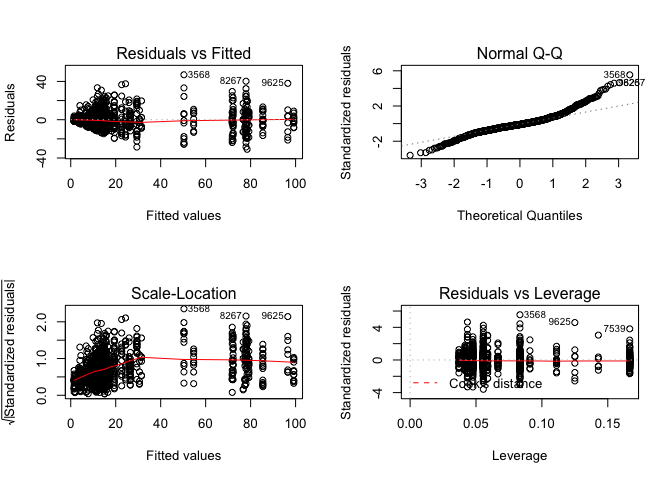

    ##          drc         lme4      lsmeans         plyr      plotrix 
    ##         TRUE         TRUE         TRUE         TRUE         TRUE 
    ##        knitr      ggplot2       lmtest     lmerTest        Rmisc 
    ##         TRUE         TRUE         TRUE         TRUE         TRUE 
    ##    gridExtra       plotly      webshot      ggpmisc multcompView 
    ##         TRUE         TRUE         TRUE         TRUE         TRUE 
    ##        ggsci          AER      betareg 
    ##         TRUE         TRUE         TRUE

Ethaboxam and Mefenoxam high throughput fungicide sensitivity data
------------------------------------------------------------------

Reading in data

``` r
growth.un.eth <- read.csv("ethaboxam_Set1-8_Trials1_2_Corrected.csv", na.strings = "na")
growth.un.eth <- data.frame(na.omit(growth.un.eth)) #omits missing values
growth.un.mef <- data.frame(read.csv("mefenoxam_Set1-8_Trials1_2_Corrected.csv", na.strings = "na"))
growth.un.mef <- data.frame(na.omit(growth.un.mef)) #omits missing values

combined <- rbind.data.frame(growth.un.eth, growth.un.mef)
```

Z'factor filtering
------------------

We are using Z'factor analysis as a screening method to pick out any isolates that did not grow enough compared to backround noise, or blank controls. This step ensures assay conditions and growth were good enough to be distiguished from backround noise. It does not nessesarily indicate high-quality data input into the non-linear regressions for EC50 evalutation, but does make it a little cleaner.

This is the code to do this analysis, but each isolate has been manually removed previously

``` r
Z <- function (sdPC, sdNC, mPC, mNC) {1-((3*(sdPC + sdNC))/abs(mPC - mNC))}
```

``` r
Zfactor <- function(df){
growth.un.eth <- df
df <- df[!df$genus == "BLANK",]
df <- df[!df$genus == "NTC",]
Zfactor.dataframe <- NULL
trial <- unique(growth.un.eth$trial)
set <- unique(growth.un.eth$set)
for(x in trial){
  for(y in set){
    growth.od_loop <- growth.un.eth[growth.un.eth$trial == x & growth.un.eth$set == y,]
    growth.od_loop$is <- factor(growth.od_loop$is)
    growth.od_loop$genus <- factor(growth.od_loop$genus)
    nm <- levels(growth.od_loop$is)
    sdPosControl <- sd(growth.od_loop$od600[growth.od_loop$genus == "BLANK" & growth.od_loop$trial == x & growth.od_loop$set == y])
    meanPosControl <- mean(growth.od_loop$od600[growth.od_loop$genus == "BLANK" & growth.od_loop$trial == x & growth.od_loop$set == y])
    for(i in seq_along(nm)){
      sdNegControl <- sd(growth.od_loop$od600[growth.od_loop$is == nm[[i]] & growth.od_loop$conc == 0 & growth.od_loop$trial == x & growth.od_loop$set == y])
      meanNegControl <- mean(growth.od_loop$od600[growth.od_loop$is == nm[[i]] & growth.od_loop$conc == 0 & growth.od_loop$trial == x & growth.od_loop$set == y])
      Zloop_is <- data.frame(nm[[i]], 
                             as.character(unique(growth.od_loop$species[growth.od_loop$is == nm[[i]]])),
                             as.character(unique(growth.od_loop$clade[growth.od_loop$is == nm[[i]]])),
                             as.character(unique(growth.od_loop$genus[growth.od_loop$is == nm[[i]]])),
                             x, 
                             y, 
                             as.character(unique(growth.od_loop$hrs[growth.od_loop$is == nm[[i]]])),
                             meanNegControl,
                             sdNegControl,
                             sdPosControl, 
                             meanPosControl)
      colnames(Zloop_is) <- c("isolate", 
                              "species",
                              "clade",
                              "genus",
                              "trial",
                              "set", 
                              "hours",
                              "meanod600",
                              "sdod600",
                              "sdblank",
                              "meanblank")
      Zfactor.dataframe <- rbind(Zfactor.dataframe, Zloop_is)
    }
  }
}
#Zfactor.dataframe <- Zfactor.dataframe[!Zfactor.dataframe$clade == "BLANK",]
#Zfactor.dataframe <- Zfactor.dataframe[!Zfactor.dataframe$clade == "NTC",]
#Zfactor.dataframe$Zfactor <- format(Zfactor.dataframe$Zfactor, scientific = F)
#Zfactor.dataframe$Zfactor <- as.numeric(as.character(Zfactor.dataframe$Zfactor))
#Zfactor.dataframe <- Zfactor.dataframe[order(Zfactor.dataframe$is),]
#Zfactor.dataframe$Zfactor <- ifelse(Zfactor.dataframe$Zfactor < 0, 0, Zfactor.dataframe$Zfactor)
return(Zfactor.dataframe)
}

# calculate
eth_Z <- Zfactor(growth.un.eth)
mef_Z <- Zfactor(growth.un.mef)
```

``` r
eth_Z$chem <- "ethaboxam"
mef_Z$chem <- "mefenoxam"

Z_factor <- rbind.data.frame(eth_Z, mef_Z)

Z_factor$Zfactor <- Z(Z_factor$sdblank, Z_factor$sdod600, Z_factor$meanblank, Z_factor$meanod600)
Z_factor$Zfactor <- ifelse(Z_factor$Zfactor < 0, 0, Z_factor$Zfactor)
Z_factor <- Z_factor[!Z_factor$species == "BLANK",]
Z_factor <- Z_factor[!Z_factor$species == "NTC",]
Z_factor <- Z_factor[!Z_factor$species == "REF",]

#write.csv(Z_factor, "Z_factor.csv")
ggplot(Z_factor, aes(x = reorder(isolate, Zfactor), y = Zfactor, shape = chem, color = hours)) + 
  geom_point() +
  geom_hline(yintercept = 0.4) +
  theme(axis.text.x = element_text(angle = 90, hjust = 1, size = 5)) +
  geom_text(aes(label=ifelse(Zfactor<0.4,as.character(isolate),'')),hjust=0,vjust=0) 
```


EC50 calculation and data gathering
-----------------------------------

The loop will run a regression for each individual isolate and will print out the summary statistics. It will also generate a table at the end, entitled EC50, ordered by species, showing the EC50, and some various summary statistics pulled out from the loop as it was running.

This will generate a table with the following information: Isolate Species Clade Trial EC50 estimation Std Error of EC50 Upper95 of EC50 Lower95 of EC50 Percent Relative Growth at 10 or 20 ppm mefenoxam or ethaboxam respecivley Std error of Percent Relative Growth Growth Rate Std error Growth Rate The hours each isolate was measured

``` r
genEC <- function(df, max.conc) {
    df <- df[!df$genus == "BLANK", ]
    df <- df[!df$genus == "NTC", ]
    df <- df[!df$genus == "REF", ]
    df$is <- factor(df$is)
    EC50 <- NULL
    colnames <- c("Isolate", "Species", "Clade", "Trial", "EC50", "StdErr", 
        "Upper95", "Lower95", "PercentRelGrowth", "StdErrRG", "GR", "StdErrGR", 
        "Hours")
    rel.grow <- NULL
    nm <- levels(df$is)
    for (i in seq_along(nm)) {
        a <- length(unique(df$loop[df$is == nm[[i]]]))
        for (t in 1:a) {
            growth.ed.ethmef <- drm(100 * relgrowth ~ conc, data = df[df$is == 
                nm[[i]] & df$loop == t, ], fct = LL.4(), na.action = na.omit)
            print(nm[[i]])
            print(t)
            
            # outputs the summary of the paramters including the estimate, standard
            # error, t-value, and p-value outputs it into a df frame called
            # summary.mef.fit for 'summary of fit'
            summary.mef.fit <- data.frame(summary(growth.ed.ethmef)[[3]])
            # outputs the summary of just the EC50 df including the estimate, standard
            # error, upper and lower bounds of the 95% confidence intervals around the
            # EC50
            EC50.od.rel <- data.frame(ED(growth.ed.ethmef, respLev = c(50), 
                type = "relative", interval = "delta"), level = 0.95)
            rel.ec50 <- EC50.od.rel[1][[1]]
            EC50.od.abs <- data.frame(ED(growth.ed.ethmef, respLev = c(50), 
                type = "absolute", interval = "delta"), level = 0.95)
            abs.ec50 <- EC50.od.abs[1][[1]]
            
            # grabbing some of the values we want from the model fit
            ec50 <- EC50.od.abs[1][[1]]
            stderr <- EC50.od.abs[2][[1]]
            lower <- EC50.od.abs[3][[1]]
            upper <- EC50.od.abs[4][[1]]
            
            # grabing the species and clade
            species <- as.character(unique(df$species[df$is == nm[[i]]]))
            clade <- as.character(unique(df$clade[df$is == nm[[i]]]))
            
            # calculating relative growth at 20 ppm
            relgrowth20 <- mean(100 * df$relgrowth[df$is == nm[[i]] & df$conc == 
                max.conc & df$loop == t])
            relgrowth20.sd <- sd(100 * df$relgrowth[df$is == nm[[i]] & df$conc == 
                max.conc & df$loop == t])
            stderr.rel <- relgrowth20.sd/sqrt(length(df$relgrowth[df$is == nm[[i]] & 
                df$conc == max.conc & df$loop == t]))
            growthrate <- mean(df$od600meanblank[df$is == nm[[i]] & df$conc == 
                0 & df$loop == t])/unique(df$hrs[df$is == nm[[i]] & df$conc == 
                0 & df$loop == t])
            stderr.gr <- growthrate/length(mean(df$od600meanblank[df$is == nm[[i]] & 
                df$conc == 0 & df$loop == t]))
            hours <- as.numeric(unique(df$hrs[df$is == nm[[i]]]))
            EC50_i <- data.frame(cbind.data.frame(nm[[i]], as.character(species), 
                as.character(clade), as.numeric(t), as.numeric(ec50), as.numeric(stderr), 
                as.numeric(lower), as.numeric(upper), as.numeric(relgrowth20), 
                as.numeric(stderr.rel), as.numeric(growthrate), as.numeric(stderr.gr), 
                as.numeric(hours)))
            colnames(EC50_i) <- colnames
            
            EC50 <- rbind.data.frame(EC50, EC50_i)
            colnames(EC50) <- colnames
            
            EC50$EC50 <- ifelse(EC50$EC50 > max.conc, max.conc, EC50$EC50)
            EC50$EC50[is.na(EC50$EC50)] <- max.conc
            EC50$StdErr <- ifelse(EC50$EC50 > max.conc, NA, EC50$StdErr)
            
        }
    }
    return(EC50)
}
EC50.eth <- genEC(growth.un.eth, 20)
EC50.mef <- genEC(growth.un.mef, 10)
EC50.mef$Chem <- "Mefenoxam"
EC50.eth$Chem <- "Ethaboxam"
combine.EC <- rbind.data.frame(EC50.eth, EC50.mef)
# write.csv(combine.EC, 'ec50.csv')
```

Growth Rate Plot
----------------

Objective: test if isolates measured at 24 hours had a significantly faster growth rate than those at 48 hours

``` r
ggplot(combine.EC, aes(x=GR)) + geom_density(aes(group=Hours, fill= as.factor(Hours)), alpha=0.3)
```


``` r
summary(combine.EC$GR[combine.EC$Hours == 24])
```

    ##     Min.  1st Qu.   Median     Mean  3rd Qu.     Max. 
    ## 0.007235 0.023050 0.028980 0.028170 0.033410 0.062170

``` r
summary(combine.EC$GR[combine.EC$Hours == 48])
```

    ##     Min.  1st Qu.   Median     Mean  3rd Qu.     Max. 
    ## 0.007472 0.013460 0.015840 0.015850 0.018320 0.025490

Two sample t-test

``` r
t.test(combine.EC$GR[combine.EC$Hours == 24], combine.EC$GR[combine.EC$Hours == 48])
```

    ## 
    ##  Welch Two Sample t-test
    ## 
    ## data:  combine.EC$GR[combine.EC$Hours == 24] and combine.EC$GR[combine.EC$Hours == 48]
    ## t = 28.616, df = 443.95, p-value < 2.2e-16
    ## alternative hypothesis: true difference in means is not equal to 0
    ## 95 percent confidence interval:
    ##  0.01147577 0.01316832
    ## sample estimates:
    ##  mean of x  mean of y 
    ## 0.02817176 0.01584971

``` r
#subsetting the data to not include the control data points
noblank <- c("BLANK", "REF", "NTC")
eth.noblank <- growth.un.eth[!growth.un.eth$clade %in% noblank,]
mef.noblank <- growth.un.mef[!growth.un.mef$clade %in% noblank,]
```

Testing the effect of species on percent relative growth at 20 ppm Ethaboxam
----------------------------------------------------------------------------

Model 1: Species as fixed effect Model 2: Species as fixed effect and experiment as random effect Model 3: Species as fixed effect and isolate nested within species as random effect Model 4: Species as fixed effect, experiment as random effect, and isolate nested within species as random effect

``` r
lm1_eth <- lm(relgrowth*100 ~ species, data = eth.noblank[eth.noblank$conc == 20,])
summary(lm1_eth, adjust="bon")
```

    ## 
    ## Call:
    ## lm(formula = relgrowth * 100 ~ species, data = eth.noblank[eth.noblank$conc == 
    ##     20, ])
    ## 
    ## Residuals:
    ##     Min      1Q  Median      3Q     Max 
    ## -30.927  -4.471  -0.852   3.526  46.962 
    ## 
    ## Coefficients:
    ##                                            Estimate Std. Error t value
    ## (Intercept)                                 19.2260     3.5987   5.342
    ## speciesPhytophthora drechsleri              -5.4369     5.0894  -1.068
    ## speciesPhytophthora inundata                -6.1031     4.2581  -1.433
    ## speciesPhytophthora megasperma              -4.8858     5.0894  -0.960
    ## speciesPhytophthora rosacearum              -4.3790     4.1554  -1.054
    ## speciesPhytophthora sansomeana              -8.3368     4.0235  -2.072
    ## speciesPhytophthora sojae                  -15.1678     4.1554  -3.650
    ## speciesPhytophthora sp.                     -4.2478     4.6459  -0.914
    ## speciesPhytopythium aff. vexans             -4.5157     4.4075  -1.025
    ## speciesPhytopythium helicoides              -4.1177     4.4075  -0.934
    ## speciesPhytopythium litorale                -8.1002     4.0806  -1.985
    ## speciesPhytopythium megacarpum              12.2431     5.0894   2.406
    ## speciesPythiogeton zeae                     -8.2870     5.0894  -1.628
    ## speciesPythium acanthicum                   -7.3974     4.1554  -1.780
    ## speciesPythium acanthophoron                -2.2705     5.0894  -0.446
    ## speciesPythium acrogynum                    59.2115     4.1554  14.249
    ## speciesPythium adhaerens                    -1.0333     5.0894  -0.203
    ## speciesPythium aff. diclinum                -4.1358     4.1554  -0.995
    ## speciesPythium aff. dictyosporum            -8.1135     4.4075  -1.841
    ## speciesPythium aff. dissotocum              -3.4040     4.0806  -0.834
    ## speciesPythium aff. hypogynum               57.4635     5.0894  11.291
    ## speciesPythium aff. iwayamai                 7.1961     5.0894   1.414
    ## speciesPythium aff. perplexum               -4.5412     4.2581  -1.066
    ## speciesPythium aff. torulosum               35.4387     4.6459   7.628
    ## speciesPythium amasculinum                 -15.1555     4.1554  -3.647
    ## speciesPythium angustatum                   -4.4490     5.0894  -0.874
    ## speciesPythium aphanidermatum               79.9535     4.4075  18.140
    ## speciesPythium aristosporum                 -4.6443     4.1554  -1.118
    ## speciesPythium arrhenomanes                 -9.2777     4.4738  -2.074
    ## speciesPythium attrantheridium              -5.3157     4.1554  -1.279
    ## speciesPythium camurandrum                  77.3044     4.7607  16.238
    ## speciesPythium carolinianum                 58.2418     4.4075  13.214
    ## speciesPythium catenulatum                  31.1190     4.4075   7.060
    ## speciesPythium chamaihyphon                  7.2878     4.1554   1.754
    ## speciesPythium chondricola                  -5.6121     5.0894  -1.103
    ## speciesPythium coloratum                    -3.6089     4.4075  -0.819
    ## speciesPythium conidiophorum                -7.9325     4.0806  -1.944
    ## speciesPythium contiguanum                  -7.0469     4.4075  -1.599
    ## speciesPythium cryptoirregulare             11.3272     5.0894   2.226
    ## speciesPythium glomeratum                  -12.3969     4.0235  -3.081
    ## speciesPythium heterothallicum              -3.6367     4.4075  -0.825
    ## speciesPythium hydnosporum                 -15.6693     4.4075  -3.555
    ## speciesPythium hypogynum                    66.2014     4.1554  15.931
    ## speciesPythium inflatum                    -14.7577     4.0806  -3.617
    ## speciesPythium intermedium                  -4.7583     4.1859  -1.137
    ## speciesPythium irregulare                   10.1799     4.0806   2.495
    ## speciesPythium kashmirense                  51.8774     5.0894  10.193
    ## speciesPythium kunmingense                   6.7177     4.4075   1.524
    ## speciesPythium litorale                     -5.3186     5.0894  -1.045
    ## speciesPythium longandrum                   52.9659     4.1554  12.746
    ## speciesPythium longisporangium              52.5998     4.1554  12.658
    ## speciesPythium lutarium                     -5.0272     4.1554  -1.210
    ## speciesPythium mercuriale                    3.4152     4.1554   0.822
    ## speciesPythium middletonii                  -8.0704     4.1554  -1.942
    ## speciesPythium minus                        -9.9418     4.1554  -2.392
    ## speciesPythium monospermum                 -14.8692     5.0894  -2.922
    ## speciesPythium nagaii                       -5.9978     4.0806  -1.470
    ## speciesPythium nodosum                      -9.6183     4.4075  -2.182
    ## speciesPythium nunn                         -9.7797     4.1554  -2.353
    ## speciesPythium oligandrum                  -17.7258     4.1554  -4.266
    ## speciesPythium oopapillum                   -3.3619     4.1554  -0.809
    ## speciesPythium orthogonon                  -12.0631     4.1554  -2.903
    ## speciesPythium pachycaule                    0.1637     4.1859   0.039
    ## speciesPythium paroecandrum                 -7.5903     4.0235  -1.886
    ## speciesPythium periilum                     -2.7658     4.1554  -0.666
    ## speciesPythium periplocum                  -17.3128     4.4075  -3.928
    ## speciesPythium perplexum                    -5.4201     3.9785  -1.362
    ## speciesPythium pleroticum                   -8.5576     4.1554  -2.059
    ## speciesPythium rhizosaccharum                5.1472     4.4075   1.168
    ## speciesPythium rostratifingens              61.1297     4.1859  14.604
    ## speciesPythium sp. balticum                 -6.9634     4.1554  -1.676
    ## speciesPythium spinosum                     -4.3041     4.0235  -1.070
    ## speciesPythium sterilum                     -5.9441     5.0894  -1.168
    ## speciesPythium sylvaticum                   -4.1485     4.0806  -1.017
    ## speciesPythium tardicrescens                -5.6105     4.0806  -1.375
    ## speciesPythium terrestris                   -7.7276     5.0894  -1.518
    ## speciesPythium torulosum                    59.9773     4.4075  13.608
    ## speciesPythium ultimum                     -11.4606     4.1554  -2.758
    ## speciesPythium ultimum var. sporangiiferum   0.1337     4.1554   0.032
    ## speciesPythium ultimum var. ultimum         -6.4378     4.0806  -1.578
    ## speciesPythium vanterpoolii                 -6.4212     4.1554  -1.545
    ##                                            Pr(>|t|)    
    ## (Intercept)                                1.11e-07 ***
    ## speciesPhytophthora drechsleri             0.285623    
    ## speciesPhytophthora inundata               0.152056    
    ## speciesPhytophthora megasperma             0.337265    
    ## speciesPhytophthora rosacearum             0.292211    
    ## speciesPhytophthora sansomeana             0.038496 *  
    ## speciesPhytophthora sojae                  0.000274 ***
    ## speciesPhytophthora sp.                    0.360758    
    ## speciesPhytopythium aff. vexans            0.305807    
    ## speciesPhytopythium helicoides             0.350378    
    ## speciesPhytopythium litorale               0.047384 *  
    ## speciesPhytopythium megacarpum             0.016309 *  
    ## speciesPythiogeton zeae                    0.103748    
    ## speciesPythium acanthicum                  0.075325 .  
    ## speciesPythium acanthophoron               0.655599    
    ## speciesPythium acrogynum                    < 2e-16 ***
    ## speciesPythium adhaerens                   0.839155    
    ## speciesPythium aff. diclinum               0.319819    
    ## speciesPythium aff. dictyosporum           0.065915 .  
    ## speciesPythium aff. dissotocum             0.404351    
    ## speciesPythium aff. hypogynum               < 2e-16 ***
    ## speciesPythium aff. iwayamai               0.157657    
    ## speciesPythium aff. perplexum              0.286436    
    ## speciesPythium aff. torulosum              5.15e-14 ***
    ## speciesPythium amasculinum                 0.000278 ***
    ## speciesPythium angustatum                  0.382210    
    ## speciesPythium aphanidermatum               < 2e-16 ***
    ## speciesPythium aristosporum                0.263964    
    ## speciesPythium arrhenomanes                0.038331 *  
    ## speciesPythium attrantheridium             0.201092    
    ## speciesPythium camurandrum                  < 2e-16 ***
    ## speciesPythium carolinianum                 < 2e-16 ***
    ## speciesPythium catenulatum                 2.94e-12 ***
    ## speciesPythium chamaihyphon                0.079745 .  
    ## speciesPythium chondricola                 0.270389    
    ## speciesPythium coloratum                   0.413079    
    ## speciesPythium conidiophorum               0.052153 .  
    ## speciesPythium contiguanum                 0.110146    
    ## speciesPythium cryptoirregulare            0.026239 *  
    ## speciesPythium glomeratum                  0.002113 ** 
    ## speciesPythium heterothallicum             0.409479    
    ## speciesPythium hydnosporum                 0.000394 ***
    ## speciesPythium hypogynum                    < 2e-16 ***
    ## speciesPythium inflatum                    0.000312 ***
    ## speciesPythium intermedium                 0.255890    
    ## speciesPythium irregulare                  0.012751 *  
    ## speciesPythium kashmirense                  < 2e-16 ***
    ## speciesPythium kunmingense                 0.127760    
    ## speciesPythium litorale                    0.296229    
    ## speciesPythium longandrum                   < 2e-16 ***
    ## speciesPythium longisporangium              < 2e-16 ***
    ## speciesPythium lutarium                    0.226620    
    ## speciesPythium mercuriale                  0.411330    
    ## speciesPythium middletonii                 0.052378 .  
    ## speciesPythium minus                       0.016902 *  
    ## speciesPythium monospermum                 0.003553 ** 
    ## speciesPythium nagaii                      0.141892    
    ## speciesPythium nodosum                     0.029301 *  
    ## speciesPythium nunn                        0.018774 *  
    ## speciesPythium oligandrum                  2.16e-05 ***
    ## speciesPythium oopapillum                  0.418673    
    ## speciesPythium orthogonon                  0.003770 ** 
    ## speciesPythium pachycaule                  0.968803    
    ## speciesPythium paroecandrum                0.059493 .  
    ## speciesPythium periilum                    0.505810    
    ## speciesPythium periplocum                  9.10e-05 ***
    ## speciesPythium perplexum                   0.173367    
    ## speciesPythium pleroticum                  0.039693 *  
    ## speciesPythium rhizosaccharum              0.243135    
    ## speciesPythium rostratifingens              < 2e-16 ***
    ## speciesPythium sp. balticum                0.094075 .  
    ## speciesPythium spinosum                    0.284966    
    ## speciesPythium sterilum                    0.243077    
    ## speciesPythium sylvaticum                  0.309549    
    ## speciesPythium tardicrescens               0.169433    
    ## speciesPythium terrestris                  0.129207    
    ## speciesPythium torulosum                    < 2e-16 ***
    ## speciesPythium ultimum                     0.005912 ** 
    ## speciesPythium ultimum var. sporangiiferum 0.974346    
    ## speciesPythium ultimum var. ultimum        0.114927    
    ## speciesPythium vanterpoolii                0.122573    
    ## ---
    ## Signif. codes:  0 '***' 0.001 '**' 0.01 '*' 0.05 '.' 0.1 ' ' 1
    ## 
    ## Residual standard error: 8.815 on 1099 degrees of freedom
    ## Multiple R-squared:  0.8808, Adjusted R-squared:  0.8722 
    ## F-statistic: 101.5 on 80 and 1099 DF,  p-value: < 2.2e-16

``` r
#Plotting diagnostic plots for fit1 model
par(mfrow=c(2,2)) # optional layout 
plot(lm1_eth)# diagnostic plots
```



``` r
#Plotting residuals
par(mfrow=c(1,1)) # optional layout 
hist(lm1_eth$residuals)
```


``` r
lm2_eth <- lmer(relgrowth*100 ~ species + (1|trial), data = eth.noblank[eth.noblank$conc == 20,])
summary(lm2_eth, adjust="bon")
```

    ## Linear mixed model fit by REML t-tests use Satterthwaite approximations
    ##   to degrees of freedom [lmerMod]
    ## Formula: relgrowth * 100 ~ species + (1 | trial)
    ##    Data: eth.noblank[eth.noblank$conc == 20, ]
    ## 
    ## REML criterion at convergence: 8111.7
    ## 
    ## Scaled residuals: 
    ##     Min      1Q  Median      3Q     Max 
    ## -3.5152 -0.5025 -0.0991  0.4005  5.3344 
    ## 
    ## Random effects:
    ##  Groups   Name        Variance Std.Dev.
    ##  trial    (Intercept)  0.03264 0.1807  
    ##  Residual             77.68765 8.8141  
    ## Number of obs: 1180, groups:  trial, 3
    ## 
    ## Fixed effects:
    ##                                             Estimate Std. Error        df
    ## (Intercept)                                  19.2288     3.6006 1063.0000
    ## speciesPhytophthora drechsleri               -5.4369     5.0888 1098.0000
    ## speciesPhytophthora inundata                 -6.0693     4.2582 1099.0000
    ## speciesPhytophthora megasperma               -4.8858     5.0888 1098.0000
    ## speciesPhytophthora rosacearum               -4.3790     4.1550 1098.0000
    ## speciesPhytophthora sansomeana               -8.3248     4.0235 1098.9000
    ## speciesPhytophthora sojae                   -15.1116     4.1566 1092.5000
    ## speciesPhytophthora sp.                      -4.2290     4.6456 1098.5000
    ## speciesPhytopythium aff. vexans              -4.5157     4.4070 1098.0000
    ## speciesPhytopythium helicoides               -4.1177     4.4070 1098.0000
    ## speciesPhytopythium litorale                 -8.1083     4.0802 1098.1000
    ## speciesPhytopythium megacarpum               12.2431     5.0888 1098.0000
    ## speciesPythiogeton zeae                      -8.2870     5.0888 1098.0000
    ## speciesPythium acanthicum                    -7.3786     4.1552 1098.6000
    ## speciesPythium acanthophoron                 -2.2705     5.0888 1098.0000
    ## speciesPythium acrogynum                     59.2115     4.1550 1098.0000
    ## speciesPythium adhaerens                     -1.0333     5.0888 1098.0000
    ## speciesPythium aff. diclinum                 -4.1171     4.1552 1098.6000
    ## speciesPythium aff. dictyosporum             -8.1135     4.4070 1098.0000
    ## speciesPythium aff. dissotocum               -3.4052     4.0802 1098.5000
    ## speciesPythium aff. hypogynum                57.4635     5.0888 1098.0000
    ## speciesPythium aff. iwayamai                  7.1961     5.0888 1098.0000
    ## speciesPythium aff. perplexum                -4.5524     4.2577 1098.2000
    ## speciesPythium aff. torulosum                35.4200     4.6456 1098.5000
    ## speciesPythium amasculinum                  -15.1555     4.1550 1098.0000
    ## speciesPythium angustatum                    -4.4490     5.0888 1098.0000
    ## speciesPythium aphanidermatum                79.9535     4.4070 1098.0000
    ## speciesPythium aristosporum                  -4.6443     4.1550 1098.0000
    ## speciesPythium arrhenomanes                  -9.2828     4.4733 1098.0000
    ## speciesPythium attrantheridium               -5.3157     4.1550 1098.0000
    ## speciesPythium camurandrum                   77.3326     4.7605 1098.9000
    ## speciesPythium carolinianum                  58.2418     4.4070 1098.0000
    ## speciesPythium catenulatum                   31.1190     4.4070 1098.0000
    ## speciesPythium chamaihyphon                   7.2878     4.1550 1098.0000
    ## speciesPythium chondricola                   -5.6121     5.0888 1098.0000
    ## speciesPythium coloratum                     -3.6089     4.4070 1098.0000
    ## speciesPythium conidiophorum                 -7.9566     4.0804 1098.9000
    ## speciesPythium contiguanum                   -7.0469     4.4070 1098.0000
    ## speciesPythium cryptoirregulare              11.2710     5.0901 1097.1000
    ## speciesPythium glomeratum                   -12.4110     4.0232 1098.4000
    ## speciesPythium heterothallicum               -3.6367     4.4070 1098.0000
    ## speciesPythium hydnosporum                  -15.6693     4.4070 1098.0000
    ## speciesPythium hypogynum                     66.2202     4.1552 1098.6000
    ## speciesPythium inflatum                     -14.7497     4.0802 1098.1000
    ## speciesPythium intermedium                   -4.7616     4.1854 1098.0000
    ## speciesPythium irregulare                    10.1718     4.0802 1098.1000
    ## speciesPythium kashmirense                   51.9337     5.0901 1097.1000
    ## speciesPythium kunmingense                    6.7177     4.4070 1098.0000
    ## speciesPythium litorale                      -5.3186     5.0888 1098.0000
    ## speciesPythium longandrum                    52.9472     4.1552 1098.6000
    ## speciesPythium longisporangium               52.6186     4.1552 1098.6000
    ## speciesPythium lutarium                      -5.0380     4.1552 1098.8000
    ## speciesPythium mercuriale                     3.4152     4.1550 1098.0000
    ## speciesPythium middletonii                   -8.0704     4.1550 1098.0000
    ## speciesPythium minus                         -9.9231     4.1552 1098.6000
    ## speciesPythium monospermum                  -14.8692     5.0888 1098.0000
    ## speciesPythium nagaii                        -6.0058     4.0802 1098.1000
    ## speciesPythium nodosum                       -9.6183     4.4070 1098.0000
    ## speciesPythium nunn                          -9.7797     4.1550 1098.0000
    ## speciesPythium oligandrum                   -17.7070     4.1552 1098.6000
    ## speciesPythium oopapillum                    -3.3619     4.1550 1098.0000
    ## speciesPythium orthogonon                   -12.0631     4.1550 1098.0000
    ## speciesPythium pachycaule                     0.1604     4.1854 1098.0000
    ## speciesPythium paroecandrum                  -7.5903     4.0230 1098.0000
    ## speciesPythium periilum                      -2.7658     4.1550 1098.0000
    ## speciesPythium periplocum                   -17.3128     4.4070 1098.0000
    ## speciesPythium perplexum                     -5.4264     3.9781 1098.1000
    ## speciesPythium pleroticum                    -8.5576     4.1550 1098.0000
    ## speciesPythium rhizosaccharum                 5.1472     4.4070 1098.0000
    ## speciesPythium rostratifingens               61.1462     4.1856 1098.5000
    ## speciesPythium sp. balticum                  -6.9634     4.1550 1098.0000
    ## speciesPythium spinosum                      -4.2901     4.0232 1098.4000
    ## speciesPythium sterilum                      -5.9441     5.0888 1098.0000
    ## speciesPythium sylvaticum                    -4.1496     4.0802 1098.5000
    ## speciesPythium tardicrescens                 -5.6185     4.0802 1098.1000
    ## speciesPythium terrestris                    -7.7276     5.0888 1098.0000
    ## speciesPythium torulosum                     59.9773     4.4070 1098.0000
    ## speciesPythium ultimum                      -11.4606     4.1550 1098.0000
    ## speciesPythium ultimum var. sporangiiferum    0.1229     4.1552 1098.8000
    ## speciesPythium ultimum var. ultimum          -6.4711     4.0808 1098.7000
    ## speciesPythium vanterpoolii                  -6.3837     4.1557 1098.7000
    ##                                            t value Pr(>|t|)    
    ## (Intercept)                                  5.340 1.13e-07 ***
    ## speciesPhytophthora drechsleri              -1.068 0.285571    
    ## speciesPhytophthora inundata                -1.425 0.154342    
    ## speciesPhytophthora megasperma              -0.960 0.337213    
    ## speciesPhytophthora rosacearum              -1.054 0.292159    
    ## speciesPhytophthora sansomeana              -2.069 0.038777 *  
    ## speciesPhytophthora sojae                   -3.636 0.000290 ***
    ## speciesPhytophthora sp.                     -0.910 0.362845    
    ## speciesPhytopythium aff. vexans             -1.025 0.305754    
    ## speciesPhytopythium helicoides              -0.934 0.350326    
    ## speciesPhytopythium litorale                -1.987 0.047143 *  
    ## speciesPhytopythium megacarpum               2.406 0.016298 *  
    ## speciesPythiogeton zeae                     -1.628 0.103710    
    ## speciesPythium acanthicum                   -1.776 0.076047 .  
    ## speciesPythium acanthophoron                -0.446 0.655564    
    ## speciesPythium acrogynum                    14.251  < 2e-16 ***
    ## speciesPythium adhaerens                    -0.203 0.839137    
    ## speciesPythium aff. diclinum                -0.991 0.321985    
    ## speciesPythium aff. dictyosporum            -1.841 0.065886 .  
    ## speciesPythium aff. dissotocum              -0.835 0.404150    
    ## speciesPythium aff. hypogynum               11.292  < 2e-16 ***
    ## speciesPythium aff. iwayamai                 1.414 0.157612    
    ## speciesPythium aff. perplexum               -1.069 0.285199    
    ## speciesPythium aff. torulosum                7.624 5.28e-14 ***
    ## speciesPythium amasculinum                  -3.648 0.000277 ***
    ## speciesPythium angustatum                   -0.874 0.382158    
    ## speciesPythium aphanidermatum               18.142  < 2e-16 ***
    ## speciesPythium aristosporum                 -1.118 0.263912    
    ## speciesPythium arrhenomanes                 -2.075 0.038204 *  
    ## speciesPythium attrantheridium              -1.279 0.201043    
    ## speciesPythium camurandrum                  16.245  < 2e-16 ***
    ## speciesPythium carolinianum                 13.216  < 2e-16 ***
    ## speciesPythium catenulatum                   7.061 2.92e-12 ***
    ## speciesPythium chamaihyphon                  1.754 0.079713 .  
    ## speciesPythium chondricola                  -1.103 0.270338    
    ## speciesPythium coloratum                    -0.819 0.413029    
    ## speciesPythium conidiophorum                -1.950 0.051435 .  
    ## speciesPythium contiguanum                  -1.599 0.110107    
    ## speciesPythium cryptoirregulare              2.214 0.027014 *  
    ## speciesPythium glomeratum                   -3.085 0.002087 ** 
    ## speciesPythium heterothallicum              -0.825 0.409428    
    ## speciesPythium hydnosporum                  -3.556 0.000393 ***
    ## speciesPythium hypogynum                    15.937  < 2e-16 ***
    ## speciesPythium inflatum                     -3.615 0.000314 ***
    ## speciesPythium intermedium                  -1.138 0.255509    
    ## speciesPythium irregulare                    2.493 0.012813 *  
    ## speciesPythium kashmirense                  10.203  < 2e-16 ***
    ## speciesPythium kunmingense                   1.524 0.127719    
    ## speciesPythium litorale                     -1.045 0.296176    
    ## speciesPythium longandrum                   12.742  < 2e-16 ***
    ## speciesPythium longisporangium              12.663  < 2e-16 ***
    ## speciesPythium lutarium                     -1.212 0.225601    
    ## speciesPythium mercuriale                    0.822 0.411279    
    ## speciesPythium middletonii                  -1.942 0.052353 .  
    ## speciesPythium minus                        -2.388 0.017102 *  
    ## speciesPythium monospermum                  -2.922 0.003550 ** 
    ## speciesPythium nagaii                       -1.472 0.141320    
    ## speciesPythium nodosum                      -2.183 0.029284 *  
    ## speciesPythium nunn                         -2.354 0.018762 *  
    ## speciesPythium oligandrum                   -4.261 2.21e-05 ***
    ## speciesPythium oopapillum                   -0.809 0.418622    
    ## speciesPythium orthogonon                   -2.903 0.003766 ** 
    ## speciesPythium pachycaule                    0.038 0.969429    
    ## speciesPythium paroecandrum                 -1.887 0.059465 .  
    ## speciesPythium periilum                     -0.666 0.505764    
    ## speciesPythium periplocum                   -3.928 9.08e-05 ***
    ## speciesPythium perplexum                    -1.364 0.172829    
    ## speciesPythium pleroticum                   -2.060 0.039672 *  
    ## speciesPythium rhizosaccharum                1.168 0.243084    
    ## speciesPythium rostratifingens              14.609  < 2e-16 ***
    ## speciesPythium sp. balticum                 -1.676 0.094040 .  
    ## speciesPythium spinosum                     -1.066 0.286501    
    ## speciesPythium sterilum                     -1.168 0.243026    
    ## speciesPythium sylvaticum                   -1.017 0.309373    
    ## speciesPythium tardicrescens                -1.377 0.168781    
    ## speciesPythium terrestris                   -1.519 0.129165    
    ## speciesPythium torulosum                    13.609  < 2e-16 ***
    ## speciesPythium ultimum                      -2.758 0.005907 ** 
    ## speciesPythium ultimum var. sporangiiferum   0.030 0.976409    
    ## speciesPythium ultimum var. ultimum         -1.586 0.113080    
    ## speciesPythium vanterpoolii                 -1.536 0.124793    
    ## ---
    ## Signif. codes:  0 '***' 0.001 '**' 0.01 '*' 0.05 '.' 0.1 ' ' 1

    ## 
    ## Correlation matrix not shown by default, as p = 81 > 12.
    ## Use print(x, correlation=TRUE)  or
    ##   vcov(x)     if you need it

``` r
#Model 4 with fixed effect (species) and random nested effect (species:isolate)
lm3_eth <- lmer(relgrowth*100 ~ species + (1|species:is), data = eth.noblank[eth.noblank$conc == 20,])
summary(lm3_eth, adjust="bon")
```

    ## Linear mixed model fit by REML t-tests use Satterthwaite approximations
    ##   to degrees of freedom [lmerMod]
    ## Formula: relgrowth * 100 ~ species + (1 | species:is)
    ##    Data: eth.noblank[eth.noblank$conc == 20, ]
    ## 
    ## REML criterion at convergence: 7982.5
    ## 
    ## Scaled residuals: 
    ##     Min      1Q  Median      3Q     Max 
    ## -3.8704 -0.4914 -0.0601  0.4397  5.4845 
    ## 
    ## Random effects:
    ##  Groups     Name        Variance Std.Dev.
    ##  species:is (Intercept) 29.15    5.399   
    ##  Residual               60.31    7.766   
    ## Number of obs: 1180, groups:  species:is, 189
    ## 
    ## Fixed effects:
    ##                                            Estimate Std. Error       df
    ## (Intercept)                                 19.2260     6.2612 108.0600
    ## speciesPhytophthora drechsleri              -5.4369     8.8546 108.0600
    ## speciesPhytophthora inundata                -5.4379     7.6111 104.7200
    ## speciesPhytophthora megasperma              -4.8858     8.8546 108.0600
    ## speciesPhytophthora rosacearum              -4.3790     7.2298 108.0600
    ## speciesPhytophthora sansomeana              -8.1661     7.1766 104.8200
    ## speciesPhytophthora sojae                  -15.1678     7.2298 108.0600
    ## speciesPhytophthora sp.                     -4.2478     8.6634  99.0000
    ## speciesPhytopythium aff. vexans             -4.5157     7.6683 108.0600
    ## speciesPhytopythium helicoides              -4.1177     7.6683 108.0600
    ## speciesPhytopythium litorale                -8.2677     7.2024 106.3300
    ## speciesPhytopythium megacarpum              12.2431     8.8546 108.0600
    ## speciesPythiogeton zeae                     -8.2870     8.8546 108.0600
    ## speciesPythium acanthicum                   -7.3974     7.2298 108.0600
    ## speciesPythium acanthophoron                -2.2705     8.8546 108.0600
    ## speciesPythium acrogynum                    59.2115     7.2298 108.0600
    ## speciesPythium adhaerens                    -1.0333     8.8546 108.0600
    ## speciesPythium aff. diclinum                -4.1358     7.2298 108.0600
    ## speciesPythium aff. dictyosporum            -8.1135     7.6683 108.0600
    ## speciesPythium aff. dissotocum              -3.3133     7.2024 106.3300
    ## speciesPythium aff. hypogynum               57.4635     8.8546 108.0600
    ## speciesPythium aff. iwayamai                 7.1961     8.8546 108.0600
    ## speciesPythium aff. perplexum               -4.3552     7.6111 104.7200
    ## speciesPythium aff. torulosum               35.4387     8.6634  99.0000
    ## speciesPythium amasculinum                 -15.1555     7.2298 108.0600
    ## speciesPythium angustatum                   -4.4490     8.8546 108.0600
    ## speciesPythium aphanidermatum               79.9535     7.6683 108.0600
    ## speciesPythium aristosporum                 -4.6443     7.2298 108.0600
    ## speciesPythium arrhenomanes                 -9.1639     7.7002 109.8200
    ## speciesPythium attrantheridium              -5.3157     7.2298 108.0600
    ## speciesPythium camurandrum                  77.3044     8.7116 101.2300
    ## speciesPythium carolinianum                 58.2418     7.6683 108.0600
    ## speciesPythium catenulatum                  31.1190     7.6683 108.0600
    ## speciesPythium chamaihyphon                  7.2878     7.2298 108.0600
    ## speciesPythium chondricola                  -5.6121     8.8546 108.0600
    ## speciesPythium coloratum                    -3.6089     7.6683 108.0600
    ## speciesPythium conidiophorum                -8.0953     7.2024 106.3300
    ## speciesPythium contiguanum                  -7.0469     7.6683 108.0600
    ## speciesPythium cryptoirregulare             11.3272     8.8546 108.0600
    ## speciesPythium glomeratum                  -12.3969     7.0002 108.0600
    ## speciesPythium heterothallicum              -3.6367     7.6683 108.0600
    ## speciesPythium hydnosporum                 -15.6693     7.6683 108.0600
    ## speciesPythium hypogynum                    66.2014     7.2298 108.0600
    ## speciesPythium inflatum                    -14.7893     7.2024 106.3300
    ## speciesPythium intermedium                  -4.8834     7.2447 108.9200
    ## speciesPythium irregulare                    9.1981     7.2024 106.3300
    ## speciesPythium kashmirense                  51.8774     8.8546 108.0600
    ## speciesPythium kunmingense                   6.7177     7.6683 108.0600
    ## speciesPythium litorale                     -5.3186     8.8546 108.0600
    ## speciesPythium longandrum                   52.9659     7.2298 108.0600
    ## speciesPythium longisporangium              52.5998     7.2298 108.0600
    ## speciesPythium lutarium                     -5.0272     7.2298 108.0600
    ## speciesPythium mercuriale                    3.4152     7.2298 108.0600
    ## speciesPythium middletonii                  -8.0704     7.2298 108.0600
    ## speciesPythium minus                        -9.9418     7.2298 108.0600
    ## speciesPythium monospermum                 -14.8692     8.8546 108.0600
    ## speciesPythium nagaii                       -5.4420     7.2024 106.3300
    ## speciesPythium nodosum                      -9.6183     7.6683 108.0600
    ## speciesPythium nunn                         -9.7797     7.2298 108.0600
    ## speciesPythium oligandrum                  -17.7258     7.2298 108.0600
    ## speciesPythium oopapillum                   -3.3619     7.2298 108.0600
    ## speciesPythium orthogonon                  -12.0631     7.2298 108.0600
    ## speciesPythium pachycaule                   -0.1244     7.2447 108.9200
    ## speciesPythium paroecandrum                 -7.5903     7.0002 108.0600
    ## speciesPythium periilum                     -2.7658     7.2298 108.0600
    ## speciesPythium periplocum                  -17.3128     7.6683 108.0600
    ## speciesPythium perplexum                    -5.2118     6.9842 107.0100
    ## speciesPythium pleroticum                   -8.5576     7.2298 108.0600
    ## speciesPythium rhizosaccharum                5.1472     7.6683 108.0600
    ## speciesPythium rostratifingens              61.9031     7.2447 108.9200
    ## speciesPythium sp. balticum                 -6.9634     7.2298 108.0600
    ## speciesPythium spinosum                     -4.3041     7.0002 108.0600
    ## speciesPythium sterilum                     -5.9441     8.8546 108.0600
    ## speciesPythium sylvaticum                   -4.8043     7.2024 106.3300
    ## speciesPythium tardicrescens                -5.9456     7.2024 106.3300
    ## speciesPythium terrestris                   -7.7276     8.8546 108.0600
    ## speciesPythium torulosum                    59.9773     7.6683 108.0600
    ## speciesPythium ultimum                     -11.4606     7.2298 108.0600
    ## speciesPythium ultimum var. sporangiiferum   0.1337     7.2298 108.0600
    ## speciesPythium ultimum var. ultimum         -6.2923     7.2024 106.3300
    ## speciesPythium vanterpoolii                 -6.4212     7.2298 108.0600
    ##                                            t value Pr(>|t|)    
    ## (Intercept)                                  3.071   0.0027 ** 
    ## speciesPhytophthora drechsleri              -0.614   0.5405    
    ## speciesPhytophthora inundata                -0.714   0.4765    
    ## speciesPhytophthora megasperma              -0.552   0.5822    
    ## speciesPhytophthora rosacearum              -0.606   0.5460    
    ## speciesPhytophthora sansomeana              -1.138   0.2578    
    ## speciesPhytophthora sojae                   -2.098   0.0382 *  
    ## speciesPhytophthora sp.                     -0.490   0.6250    
    ## speciesPhytopythium aff. vexans             -0.589   0.5572    
    ## speciesPhytopythium helicoides              -0.537   0.5924    
    ## speciesPhytopythium litorale                -1.148   0.2536    
    ## speciesPhytopythium megacarpum               1.383   0.1696    
    ## speciesPythiogeton zeae                     -0.936   0.3514    
    ## speciesPythium acanthicum                   -1.023   0.3085    
    ## speciesPythium acanthophoron                -0.256   0.7981    
    ## speciesPythium acrogynum                     8.190 5.70e-13 ***
    ## speciesPythium adhaerens                    -0.117   0.9073    
    ## speciesPythium aff. diclinum                -0.572   0.5685    
    ## speciesPythium aff. dictyosporum            -1.058   0.2924    
    ## speciesPythium aff. dissotocum              -0.460   0.6464    
    ## speciesPythium aff. hypogynum                6.490 2.68e-09 ***
    ## speciesPythium aff. iwayamai                 0.813   0.4182    
    ## speciesPythium aff. perplexum               -0.572   0.5684    
    ## speciesPythium aff. torulosum                4.091 8.77e-05 ***
    ## speciesPythium amasculinum                  -2.096   0.0384 *  
    ## speciesPythium angustatum                   -0.502   0.6164    
    ## speciesPythium aphanidermatum               10.426  < 2e-16 ***
    ## speciesPythium aristosporum                 -0.642   0.5220    
    ## speciesPythium arrhenomanes                 -1.190   0.2366    
    ## speciesPythium attrantheridium              -0.735   0.4638    
    ## speciesPythium camurandrum                   8.874 2.66e-14 ***
    ## speciesPythium carolinianum                  7.595 1.17e-11 ***
    ## speciesPythium catenulatum                   4.058 9.38e-05 ***
    ## speciesPythium chamaihyphon                  1.008   0.3157    
    ## speciesPythium chondricola                  -0.634   0.5275    
    ## speciesPythium coloratum                    -0.471   0.6389    
    ## speciesPythium conidiophorum                -1.124   0.2636    
    ## speciesPythium contiguanum                  -0.919   0.3602    
    ## speciesPythium cryptoirregulare              1.279   0.2036    
    ## speciesPythium glomeratum                   -1.771   0.0794 .  
    ## speciesPythium heterothallicum              -0.474   0.6363    
    ## speciesPythium hydnosporum                  -2.043   0.0434 *  
    ## speciesPythium hypogynum                     9.157 3.77e-15 ***
    ## speciesPythium inflatum                     -2.053   0.0425 *  
    ## speciesPythium intermedium                  -0.674   0.5017    
    ## speciesPythium irregulare                    1.277   0.2044    
    ## speciesPythium kashmirense                   5.859 5.11e-08 ***
    ## speciesPythium kunmingense                   0.876   0.3830    
    ## speciesPythium litorale                     -0.601   0.5493    
    ## speciesPythium longandrum                    7.326 4.51e-11 ***
    ## speciesPythium longisporangium               7.275 5.80e-11 ***
    ## speciesPythium lutarium                     -0.695   0.4883    
    ## speciesPythium mercuriale                    0.472   0.6376    
    ## speciesPythium middletonii                  -1.116   0.2668    
    ## speciesPythium minus                        -1.375   0.1719    
    ## speciesPythium monospermum                  -1.679   0.0960 .  
    ## speciesPythium nagaii                       -0.756   0.4516    
    ## speciesPythium nodosum                      -1.254   0.2124    
    ## speciesPythium nunn                         -1.353   0.1790    
    ## speciesPythium oligandrum                   -2.452   0.0158 *  
    ## speciesPythium oopapillum                   -0.465   0.6429    
    ## speciesPythium orthogonon                   -1.669   0.0981 .  
    ## speciesPythium pachycaule                   -0.017   0.9863    
    ## speciesPythium paroecandrum                 -1.084   0.2806    
    ## speciesPythium periilum                     -0.383   0.7028    
    ## speciesPythium periplocum                   -2.258   0.0260 *  
    ## speciesPythium perplexum                    -0.746   0.4572    
    ## speciesPythium pleroticum                   -1.184   0.2391    
    ## speciesPythium rhizosaccharum                0.671   0.5035    
    ## speciesPythium rostratifingens               8.545 8.75e-14 ***
    ## speciesPythium sp. balticum                 -0.963   0.3376    
    ## speciesPythium spinosum                     -0.615   0.5399    
    ## speciesPythium sterilum                     -0.671   0.5035    
    ## speciesPythium sylvaticum                   -0.667   0.5062    
    ## speciesPythium tardicrescens                -0.826   0.4109    
    ## speciesPythium terrestris                   -0.873   0.3848    
    ## speciesPythium torulosum                     7.821 3.73e-12 ***
    ## speciesPythium ultimum                      -1.585   0.1158    
    ## speciesPythium ultimum var. sporangiiferum   0.018   0.9853    
    ## speciesPythium ultimum var. ultimum         -0.874   0.3843    
    ## speciesPythium vanterpoolii                 -0.888   0.3764    
    ## ---
    ## Signif. codes:  0 '***' 0.001 '**' 0.01 '*' 0.05 '.' 0.1 ' ' 1

    ## 
    ## Correlation matrix not shown by default, as p = 81 > 12.
    ## Use print(x, correlation=TRUE)  or
    ##   vcov(x)     if you need it

``` r
#Model 3 with fixed effect (species) and random effect (set) and nested effect (species:isolate)
lm4_eth <- lmer(relgrowth*100 ~ species + (1|trial) + (1|species:is), data = eth.noblank[eth.noblank$conc == 20,])
summary(lm3_eth, adjust="bon")
```

    ## Linear mixed model fit by REML t-tests use Satterthwaite approximations
    ##   to degrees of freedom [lmerMod]
    ## Formula: relgrowth * 100 ~ species + (1 | species:is)
    ##    Data: eth.noblank[eth.noblank$conc == 20, ]
    ## 
    ## REML criterion at convergence: 7982.5
    ## 
    ## Scaled residuals: 
    ##     Min      1Q  Median      3Q     Max 
    ## -3.8704 -0.4914 -0.0601  0.4397  5.4845 
    ## 
    ## Random effects:
    ##  Groups     Name        Variance Std.Dev.
    ##  species:is (Intercept) 29.15    5.399   
    ##  Residual               60.31    7.766   
    ## Number of obs: 1180, groups:  species:is, 189
    ## 
    ## Fixed effects:
    ##                                            Estimate Std. Error       df
    ## (Intercept)                                 19.2260     6.2612 108.0600
    ## speciesPhytophthora drechsleri              -5.4369     8.8546 108.0600
    ## speciesPhytophthora inundata                -5.4379     7.6111 104.7200
    ## speciesPhytophthora megasperma              -4.8858     8.8546 108.0600
    ## speciesPhytophthora rosacearum              -4.3790     7.2298 108.0600
    ## speciesPhytophthora sansomeana              -8.1661     7.1766 104.8200
    ## speciesPhytophthora sojae                  -15.1678     7.2298 108.0600
    ## speciesPhytophthora sp.                     -4.2478     8.6634  99.0000
    ## speciesPhytopythium aff. vexans             -4.5157     7.6683 108.0600
    ## speciesPhytopythium helicoides              -4.1177     7.6683 108.0600
    ## speciesPhytopythium litorale                -8.2677     7.2024 106.3300
    ## speciesPhytopythium megacarpum              12.2431     8.8546 108.0600
    ## speciesPythiogeton zeae                     -8.2870     8.8546 108.0600
    ## speciesPythium acanthicum                   -7.3974     7.2298 108.0600
    ## speciesPythium acanthophoron                -2.2705     8.8546 108.0600
    ## speciesPythium acrogynum                    59.2115     7.2298 108.0600
    ## speciesPythium adhaerens                    -1.0333     8.8546 108.0600
    ## speciesPythium aff. diclinum                -4.1358     7.2298 108.0600
    ## speciesPythium aff. dictyosporum            -8.1135     7.6683 108.0600
    ## speciesPythium aff. dissotocum              -3.3133     7.2024 106.3300
    ## speciesPythium aff. hypogynum               57.4635     8.8546 108.0600
    ## speciesPythium aff. iwayamai                 7.1961     8.8546 108.0600
    ## speciesPythium aff. perplexum               -4.3552     7.6111 104.7200
    ## speciesPythium aff. torulosum               35.4387     8.6634  99.0000
    ## speciesPythium amasculinum                 -15.1555     7.2298 108.0600
    ## speciesPythium angustatum                   -4.4490     8.8546 108.0600
    ## speciesPythium aphanidermatum               79.9535     7.6683 108.0600
    ## speciesPythium aristosporum                 -4.6443     7.2298 108.0600
    ## speciesPythium arrhenomanes                 -9.1639     7.7002 109.8200
    ## speciesPythium attrantheridium              -5.3157     7.2298 108.0600
    ## speciesPythium camurandrum                  77.3044     8.7116 101.2300
    ## speciesPythium carolinianum                 58.2418     7.6683 108.0600
    ## speciesPythium catenulatum                  31.1190     7.6683 108.0600
    ## speciesPythium chamaihyphon                  7.2878     7.2298 108.0600
    ## speciesPythium chondricola                  -5.6121     8.8546 108.0600
    ## speciesPythium coloratum                    -3.6089     7.6683 108.0600
    ## speciesPythium conidiophorum                -8.0953     7.2024 106.3300
    ## speciesPythium contiguanum                  -7.0469     7.6683 108.0600
    ## speciesPythium cryptoirregulare             11.3272     8.8546 108.0600
    ## speciesPythium glomeratum                  -12.3969     7.0002 108.0600
    ## speciesPythium heterothallicum              -3.6367     7.6683 108.0600
    ## speciesPythium hydnosporum                 -15.6693     7.6683 108.0600
    ## speciesPythium hypogynum                    66.2014     7.2298 108.0600
    ## speciesPythium inflatum                    -14.7893     7.2024 106.3300
    ## speciesPythium intermedium                  -4.8834     7.2447 108.9200
    ## speciesPythium irregulare                    9.1981     7.2024 106.3300
    ## speciesPythium kashmirense                  51.8774     8.8546 108.0600
    ## speciesPythium kunmingense                   6.7177     7.6683 108.0600
    ## speciesPythium litorale                     -5.3186     8.8546 108.0600
    ## speciesPythium longandrum                   52.9659     7.2298 108.0600
    ## speciesPythium longisporangium              52.5998     7.2298 108.0600
    ## speciesPythium lutarium                     -5.0272     7.2298 108.0600
    ## speciesPythium mercuriale                    3.4152     7.2298 108.0600
    ## speciesPythium middletonii                  -8.0704     7.2298 108.0600
    ## speciesPythium minus                        -9.9418     7.2298 108.0600
    ## speciesPythium monospermum                 -14.8692     8.8546 108.0600
    ## speciesPythium nagaii                       -5.4420     7.2024 106.3300
    ## speciesPythium nodosum                      -9.6183     7.6683 108.0600
    ## speciesPythium nunn                         -9.7797     7.2298 108.0600
    ## speciesPythium oligandrum                  -17.7258     7.2298 108.0600
    ## speciesPythium oopapillum                   -3.3619     7.2298 108.0600
    ## speciesPythium orthogonon                  -12.0631     7.2298 108.0600
    ## speciesPythium pachycaule                   -0.1244     7.2447 108.9200
    ## speciesPythium paroecandrum                 -7.5903     7.0002 108.0600
    ## speciesPythium periilum                     -2.7658     7.2298 108.0600
    ## speciesPythium periplocum                  -17.3128     7.6683 108.0600
    ## speciesPythium perplexum                    -5.2118     6.9842 107.0100
    ## speciesPythium pleroticum                   -8.5576     7.2298 108.0600
    ## speciesPythium rhizosaccharum                5.1472     7.6683 108.0600
    ## speciesPythium rostratifingens              61.9031     7.2447 108.9200
    ## speciesPythium sp. balticum                 -6.9634     7.2298 108.0600
    ## speciesPythium spinosum                     -4.3041     7.0002 108.0600
    ## speciesPythium sterilum                     -5.9441     8.8546 108.0600
    ## speciesPythium sylvaticum                   -4.8043     7.2024 106.3300
    ## speciesPythium tardicrescens                -5.9456     7.2024 106.3300
    ## speciesPythium terrestris                   -7.7276     8.8546 108.0600
    ## speciesPythium torulosum                    59.9773     7.6683 108.0600
    ## speciesPythium ultimum                     -11.4606     7.2298 108.0600
    ## speciesPythium ultimum var. sporangiiferum   0.1337     7.2298 108.0600
    ## speciesPythium ultimum var. ultimum         -6.2923     7.2024 106.3300
    ## speciesPythium vanterpoolii                 -6.4212     7.2298 108.0600
    ##                                            t value Pr(>|t|)    
    ## (Intercept)                                  3.071   0.0027 ** 
    ## speciesPhytophthora drechsleri              -0.614   0.5405    
    ## speciesPhytophthora inundata                -0.714   0.4765    
    ## speciesPhytophthora megasperma              -0.552   0.5822    
    ## speciesPhytophthora rosacearum              -0.606   0.5460    
    ## speciesPhytophthora sansomeana              -1.138   0.2578    
    ## speciesPhytophthora sojae                   -2.098   0.0382 *  
    ## speciesPhytophthora sp.                     -0.490   0.6250    
    ## speciesPhytopythium aff. vexans             -0.589   0.5572    
    ## speciesPhytopythium helicoides              -0.537   0.5924    
    ## speciesPhytopythium litorale                -1.148   0.2536    
    ## speciesPhytopythium megacarpum               1.383   0.1696    
    ## speciesPythiogeton zeae                     -0.936   0.3514    
    ## speciesPythium acanthicum                   -1.023   0.3085    
    ## speciesPythium acanthophoron                -0.256   0.7981    
    ## speciesPythium acrogynum                     8.190 5.70e-13 ***
    ## speciesPythium adhaerens                    -0.117   0.9073    
    ## speciesPythium aff. diclinum                -0.572   0.5685    
    ## speciesPythium aff. dictyosporum            -1.058   0.2924    
    ## speciesPythium aff. dissotocum              -0.460   0.6464    
    ## speciesPythium aff. hypogynum                6.490 2.68e-09 ***
    ## speciesPythium aff. iwayamai                 0.813   0.4182    
    ## speciesPythium aff. perplexum               -0.572   0.5684    
    ## speciesPythium aff. torulosum                4.091 8.77e-05 ***
    ## speciesPythium amasculinum                  -2.096   0.0384 *  
    ## speciesPythium angustatum                   -0.502   0.6164    
    ## speciesPythium aphanidermatum               10.426  < 2e-16 ***
    ## speciesPythium aristosporum                 -0.642   0.5220    
    ## speciesPythium arrhenomanes                 -1.190   0.2366    
    ## speciesPythium attrantheridium              -0.735   0.4638    
    ## speciesPythium camurandrum                   8.874 2.66e-14 ***
    ## speciesPythium carolinianum                  7.595 1.17e-11 ***
    ## speciesPythium catenulatum                   4.058 9.38e-05 ***
    ## speciesPythium chamaihyphon                  1.008   0.3157    
    ## speciesPythium chondricola                  -0.634   0.5275    
    ## speciesPythium coloratum                    -0.471   0.6389    
    ## speciesPythium conidiophorum                -1.124   0.2636    
    ## speciesPythium contiguanum                  -0.919   0.3602    
    ## speciesPythium cryptoirregulare              1.279   0.2036    
    ## speciesPythium glomeratum                   -1.771   0.0794 .  
    ## speciesPythium heterothallicum              -0.474   0.6363    
    ## speciesPythium hydnosporum                  -2.043   0.0434 *  
    ## speciesPythium hypogynum                     9.157 3.77e-15 ***
    ## speciesPythium inflatum                     -2.053   0.0425 *  
    ## speciesPythium intermedium                  -0.674   0.5017    
    ## speciesPythium irregulare                    1.277   0.2044    
    ## speciesPythium kashmirense                   5.859 5.11e-08 ***
    ## speciesPythium kunmingense                   0.876   0.3830    
    ## speciesPythium litorale                     -0.601   0.5493    
    ## speciesPythium longandrum                    7.326 4.51e-11 ***
    ## speciesPythium longisporangium               7.275 5.80e-11 ***
    ## speciesPythium lutarium                     -0.695   0.4883    
    ## speciesPythium mercuriale                    0.472   0.6376    
    ## speciesPythium middletonii                  -1.116   0.2668    
    ## speciesPythium minus                        -1.375   0.1719    
    ## speciesPythium monospermum                  -1.679   0.0960 .  
    ## speciesPythium nagaii                       -0.756   0.4516    
    ## speciesPythium nodosum                      -1.254   0.2124    
    ## speciesPythium nunn                         -1.353   0.1790    
    ## speciesPythium oligandrum                   -2.452   0.0158 *  
    ## speciesPythium oopapillum                   -0.465   0.6429    
    ## speciesPythium orthogonon                   -1.669   0.0981 .  
    ## speciesPythium pachycaule                   -0.017   0.9863    
    ## speciesPythium paroecandrum                 -1.084   0.2806    
    ## speciesPythium periilum                     -0.383   0.7028    
    ## speciesPythium periplocum                   -2.258   0.0260 *  
    ## speciesPythium perplexum                    -0.746   0.4572    
    ## speciesPythium pleroticum                   -1.184   0.2391    
    ## speciesPythium rhizosaccharum                0.671   0.5035    
    ## speciesPythium rostratifingens               8.545 8.75e-14 ***
    ## speciesPythium sp. balticum                 -0.963   0.3376    
    ## speciesPythium spinosum                     -0.615   0.5399    
    ## speciesPythium sterilum                     -0.671   0.5035    
    ## speciesPythium sylvaticum                   -0.667   0.5062    
    ## speciesPythium tardicrescens                -0.826   0.4109    
    ## speciesPythium terrestris                   -0.873   0.3848    
    ## speciesPythium torulosum                     7.821 3.73e-12 ***
    ## speciesPythium ultimum                      -1.585   0.1158    
    ## speciesPythium ultimum var. sporangiiferum   0.018   0.9853    
    ## speciesPythium ultimum var. ultimum         -0.874   0.3843    
    ## speciesPythium vanterpoolii                 -0.888   0.3764    
    ## ---
    ## Signif. codes:  0 '***' 0.001 '**' 0.01 '*' 0.05 '.' 0.1 ' ' 1

    ## 
    ## Correlation matrix not shown by default, as p = 81 > 12.
    ## Use print(x, correlation=TRUE)  or
    ##   vcov(x)     if you need it

``` r
#Comparing models 2 and 3 and 4
anova(lm2_eth, lm3_eth, lm4_eth)
```

    ## refitting model(s) with ML (instead of REML)

    ## Data: eth.noblank[eth.noblank$conc == 20, ]
    ## Models:
    ## object: relgrowth * 100 ~ species + (1 | trial)
    ## ..1: relgrowth * 100 ~ species + (1 | species:is)
    ## ..2: relgrowth * 100 ~ species + (1 | trial) + (1 | species:is)
    ##        Df    AIC    BIC  logLik deviance  Chisq Chi Df Pr(>Chisq)    
    ## object 83 8567.2 8988.3 -4200.6   8401.2                             
    ## ..1    83 8507.7 8928.8 -4170.9   8341.7 59.483      0     <2e-16 ***
    ## ..2    84 8509.7 8935.9 -4170.9   8341.7  0.000      1          1    
    ## ---
    ## Signif. codes:  0 '***' 0.001 '**' 0.01 '*' 0.05 '.' 0.1 ' ' 1

The ANOVA between model two and three and four indicate that model 4 is the best model, indicating that there was enough variance of isolates within species to indicate a different fit to the data. Therefore, we will go with model three to do multiple comparisons among species, controling for this variance.

``` r
lmerTest::anova(lm4_eth, test.statistic="F", type = 2) # using type II ANOVA for unbalanced data. Some isolates have more biological replicates than others. So the mean over all isolates is different.  
```

    ## Analysis of Variance Table of type II  with  Satterthwaite 
    ## approximation for degrees of freedom
    ##         Sum Sq Mean Sq NumDF  DenDF F.value    Pr(>F)    
    ## species 158978  1987.2    80 106.24  32.953 < 2.2e-16 ***
    ## ---
    ## Signif. codes:  0 '***' 0.001 '**' 0.01 '*' 0.05 '.' 0.1 ' ' 1

``` r
lsmeans_EC.eth <- lsmeans::lsmeans(lm4_eth, "species") #estimates the lsmeans
#does a multiple comparison based on bonferonii correction and adds letters to the table
Results_lsmeansEC.eth <- cld(lsmeans_EC.eth, alpha = 0.05, adjust = "bon", Letters = letters, reversed = FALSE)
```

``` r
#plots the lsmeans
plot(Results_lsmeansEC.eth)
```


Testing the effect of species on percent relative growth at 10 ppm Mefenoxam
----------------------------------------------------------------------------

Model 1: Species as fixed effect Model 2: Species as fixed effect and experiment as random effect Model 3: Species as fixed effect and isolate nested within species as random effect Model 4: Species as fixed effect, experiment as random effect, and isolate nested within species as random effect

``` r
lm1_mef <- lm(relgrowth*100 ~ species, data = mef.noblank[mef.noblank$conc == 10,])
summary(lm1_mef, adjust="bon")
```

    ## 
    ## Call:
    ## lm(formula = relgrowth * 100 ~ species, data = mef.noblank[mef.noblank$conc == 
    ##     10, ])
    ## 
    ## Residuals:
    ##     Min      1Q  Median      3Q     Max 
    ## -21.740  -4.442  -0.924   3.664  36.525 
    ## 
    ## Coefficients:
    ##                                            Estimate Std. Error t value
    ## (Intercept)                                12.28000    3.17122   3.872
    ## speciesPhytophthora drechsleri             -2.46667    4.48478  -0.550
    ## speciesPhytophthora inundata               -0.77533    3.75223  -0.207
    ## speciesPhytophthora megasperma              0.51833    4.48478   0.116
    ## speciesPhytophthora rosacearum              0.72944    3.66180   0.199
    ## speciesPhytophthora sansomeana             -6.88722    3.66180  -1.881
    ## speciesPhytophthora sojae                  -9.98833    3.66180  -2.728
    ## speciesPhytophthora sp.                    -4.15000    4.48478  -0.925
    ## speciesPhytopythium aff. vexans            -0.83500    3.88393  -0.215
    ## speciesPhytopythium helicoides             -3.32417    3.88393  -0.856
    ## speciesPhytopythium litorale               13.74048    3.59582   3.821
    ## speciesPhytopythium megacarpum             42.05167    4.48478   9.377
    ## speciesPythiogeton zeae                    -0.17500    4.48478  -0.039
    ## speciesPythium acanthicum                   3.07611    3.66180   0.840
    ## speciesPythium acanthophoron               -1.58833    4.48478  -0.354
    ## speciesPythium acrogynum                   -2.79000    3.66180  -0.762
    ## speciesPythium adhaerens                    4.37000    4.48478   0.974
    ## speciesPythium aff. diclinum                2.79222    3.66180   0.763
    ## speciesPythium aff. dictyosporum           -2.21750    3.88393  -0.571
    ## speciesPythium aff. dissotocum             -1.28037    3.50591  -0.365
    ## speciesPythium aff. hypogynum              -4.04000    4.48478  -0.901
    ## speciesPythium aff. iwayamai               -6.59667    4.48478  -1.471
    ## speciesPythium aff. perplexum               7.41800    3.75223   1.977
    ## speciesPythium aff. torulosum              -0.76417    3.88393  -0.197
    ## speciesPythium amasculinum                 -7.31167    3.66180  -1.997
    ## speciesPythium angustatum                   6.62833    4.48478   1.478
    ## speciesPythium aphanidermatum               8.39667    3.66180   2.293
    ## speciesPythium aristosporum                14.37667    3.66180   3.926
    ## speciesPythium arrhenomanes                12.09111    4.09402   2.953
    ## speciesPythium attrantheridium              0.77167    3.66180   0.211
    ## speciesPythium camurandrum                 -6.74000    4.48478  -1.503
    ## speciesPythium carolinianum                -0.03417    3.88393  -0.009
    ## speciesPythium catenulatum                  0.49000    3.88393   0.126
    ## speciesPythium chamaihyphon                -1.47167    3.66180  -0.402
    ## speciesPythium chondricola                  8.47400    4.70367   1.802
    ## speciesPythium coloratum                    1.26333    3.88393   0.325
    ## speciesPythium conidiophorum                0.16476    3.59582   0.046
    ## speciesPythium contiguanum                  5.06250    3.88393   1.303
    ## speciesPythium cryptoirregulare            11.84111    4.09402   2.892
    ## speciesPythium glomeratum                  -5.52792    3.54553  -1.559
    ## speciesPythium heterothallicum             -2.35667    3.75223  -0.628
    ## speciesPythium hydnosporum                 -8.19000    3.88393  -2.109
    ## speciesPythium hypogynum                   -6.63444    3.66180  -1.812
    ## speciesPythium inflatum                    -2.41588    3.68863  -0.655
    ## speciesPythium intermedium                 -2.92333    3.66180  -0.798
    ## speciesPythium irregulare                   6.36633    3.47389   1.833
    ## speciesPythium kashmirense                 -7.45000    4.48478  -1.661
    ## speciesPythium kunmingense                 16.68417    3.88393   4.296
    ## speciesPythium litorale                    10.45500    4.48478   2.331
    ## speciesPythium longandrum                  -6.29810    3.59582  -1.752
    ## speciesPythium longisporangium             -4.34556    3.66180  -1.187
    ## speciesPythium lutarium                     3.37519    3.50591   0.963
    ## speciesPythium mercuriale                   9.72229    3.66180   2.655
    ## speciesPythium middletonii                 -2.09238    3.59582  -0.582
    ## speciesPythium minus                       -3.47833    3.66180  -0.950
    ## speciesPythium monospermum                 16.17000    4.48478   3.606
    ## speciesPythium nagaii                      -7.06238    3.59582  -1.964
    ## speciesPythium nodosum                      1.19750    3.88393   0.308
    ## speciesPythium nunn                        -3.73056    3.66180  -1.019
    ## speciesPythium oligandrum                  -8.96778    3.66180  -2.449
    ## speciesPythium oopapillum                  -0.57030    3.44748  -0.165
    ## speciesPythium orthogonon                  -4.72056    3.66180  -1.289
    ## speciesPythium pachycaule                   3.45833    3.66180   0.944
    ## speciesPythium paroecandrum                 2.17375    3.54553   0.613
    ## speciesPythium periilum                     1.04889    3.66180   0.286
    ## speciesPythium periplocum                  -7.81333    3.88393  -2.012
    ## speciesPythium perplexum                   -2.29472    3.42530  -0.670
    ## speciesPythium pleroticum                  -5.07056    3.66180  -1.385
    ## speciesPythium rhizosaccharum               0.71500    3.88393   0.184
    ## speciesPythium rostratifingens             -3.39654    3.66180  -0.928
    ## speciesPythium sp. balticum                 1.42167    3.66180   0.388
    ## speciesPythium spinosum                    -0.40333    3.47389  -0.116
    ## speciesPythium sterilum                    16.77000    4.48478   3.739
    ## speciesPythium sylvaticum                  -6.31788    3.44748  -1.833
    ## speciesPythium tardicrescens               -3.14857    3.59582  -0.876
    ## speciesPythium terrestris                  -2.28500    4.48478  -0.510
    ## speciesPythium torulosum                    1.72611    3.66180   0.471
    ## speciesPythium ultimum                     -6.83500    3.66180  -1.867
    ## speciesPythium ultimum var. sporangiiferum -4.99857    3.59582  -1.390
    ## speciesPythium ultimum var. ultimum        -5.62667    3.59582  -1.565
    ## speciesPythium vanterpoolii                 0.38444    3.66180   0.105
    ##                                            Pr(>|t|)    
    ## (Intercept)                                0.000114 ***
    ## speciesPhytophthora drechsleri             0.582417    
    ## speciesPhytophthora inundata               0.836333    
    ## speciesPhytophthora megasperma             0.908008    
    ## speciesPhytophthora rosacearum             0.842138    
    ## speciesPhytophthora sansomeana             0.060242 .  
    ## speciesPhytophthora sojae                  0.006472 ** 
    ## speciesPhytophthora sp.                    0.354972    
    ## speciesPhytopythium aff. vexans            0.829814    
    ## speciesPhytopythium helicoides             0.392240    
    ## speciesPhytopythium litorale               0.000140 ***
    ## speciesPhytopythium megacarpum              < 2e-16 ***
    ## speciesPythiogeton zeae                    0.968880    
    ## speciesPythium acanthicum                  0.401049    
    ## speciesPythium acanthophoron               0.723281    
    ## speciesPythium acrogynum                   0.446260    
    ## speciesPythium adhaerens                   0.330054    
    ## speciesPythium aff. diclinum               0.445898    
    ## speciesPythium aff. dictyosporum           0.568148    
    ## speciesPythium aff. dissotocum             0.715025    
    ## speciesPythium aff. hypogynum              0.367865    
    ## speciesPythium aff. iwayamai               0.141584    
    ## speciesPythium aff. perplexum              0.048279 *  
    ## speciesPythium aff. torulosum              0.844056    
    ## speciesPythium amasculinum                 0.046083 *  
    ## speciesPythium angustatum                  0.139685    
    ## speciesPythium aphanidermatum              0.022021 *  
    ## speciesPythium aristosporum                9.13e-05 ***
    ## speciesPythium arrhenomanes                0.003206 ** 
    ## speciesPythium attrantheridium             0.833131    
    ## speciesPythium camurandrum                 0.133142    
    ## speciesPythium carolinianum                0.992983    
    ## speciesPythium catenulatum                 0.899626    
    ## speciesPythium chamaihyphon                0.687833    
    ## speciesPythium chondricola                 0.071868 .  
    ## speciesPythium coloratum                   0.745033    
    ## speciesPythium conidiophorum               0.963461    
    ## speciesPythium contiguanum                 0.192676    
    ## speciesPythium cryptoirregulare            0.003895 ** 
    ## speciesPythium glomeratum                  0.119235    
    ## speciesPythium heterothallicum             0.530079    
    ## speciesPythium hydnosporum                 0.035182 *  
    ## speciesPythium hypogynum                   0.070272 .  
    ## speciesPythium inflatum                    0.512625    
    ## speciesPythium intermedium                 0.424839    
    ## speciesPythium irregulare                  0.067111 .  
    ## speciesPythium kashmirense                 0.096944 .  
    ## speciesPythium kunmingense                 1.88e-05 ***
    ## speciesPythium litorale                    0.019909 *  
    ## speciesPythium longandrum                  0.080119 .  
    ## speciesPythium longisporangium             0.235575    
    ## speciesPythium lutarium                    0.335889    
    ## speciesPythium mercuriale                  0.008036 ** 
    ## speciesPythium middletonii                 0.560750    
    ## speciesPythium minus                       0.342360    
    ## speciesPythium monospermum                 0.000325 ***
    ## speciesPythium nagaii                      0.049758 *  
    ## speciesPythium nodosum                     0.757892    
    ## speciesPythium nunn                        0.308519    
    ## speciesPythium oligandrum                  0.014470 *  
    ## speciesPythium oopapillum                  0.868637    
    ## speciesPythium orthogonon                  0.197604    
    ## speciesPythium pachycaule                  0.345141    
    ## speciesPythium paroecandrum                0.539931    
    ## speciesPythium periilum                    0.774591    
    ## speciesPythium periplocum                  0.044478 *  
    ## speciesPythium perplexum                   0.503032    
    ## speciesPythium pleroticum                  0.166401    
    ## speciesPythium rhizosaccharum              0.853973    
    ## speciesPythium rostratifingens             0.353826    
    ## speciesPythium sp. balticum                0.697907    
    ## speciesPythium spinosum                    0.907590    
    ## speciesPythium sterilum                    0.000193 ***
    ## speciesPythium sylvaticum                  0.067112 .  
    ## speciesPythium tardicrescens               0.381415    
    ## speciesPythium terrestris                  0.610496    
    ## speciesPythium torulosum                   0.637455    
    ## speciesPythium ultimum                     0.062210 .  
    ## speciesPythium ultimum var. sporangiiferum 0.164759    
    ## speciesPythium ultimum var. ultimum        0.117903    
    ## speciesPythium vanterpoolii                0.916403    
    ## ---
    ## Signif. codes:  0 '***' 0.001 '**' 0.01 '*' 0.05 '.' 0.1 ' ' 1
    ## 
    ## Residual standard error: 7.768 on 1180 degrees of freedom
    ## Multiple R-squared:  0.4261, Adjusted R-squared:  0.3872 
    ## F-statistic: 10.95 on 80 and 1180 DF,  p-value: < 2.2e-16

``` r
#Plotting diagnostic plots for fit1 model
par(mfrow=c(2,2)) # optional layout 
plot(lm1_mef)# diagnostic plots
```


``` r
#Plotting residuals
par(mfrow=c(1,1)) # optional layout 
hist(lm1_mef$residuals)
```


``` r
lm2_mef <- lmer(relgrowth*100 ~ species + (1|trial), data = mef.noblank[mef.noblank$conc == 10,])
```

``` r
#Model 3 with fixed effect (species) and random effect (set) and nested effect (species:isolate)
lm3_mef <- lmer(relgrowth*100 ~ species + (1|species:is), data = mef.noblank[mef.noblank$conc == 10,])
```

``` r
#Model 3 with fixed effect (species) and random effect (set) and nested effect (species:isolate)
lm4_mef <- lmer(relgrowth*100 ~ species + (1|trial) + (1|species:is), data = mef.noblank[mef.noblank$conc == 10,])
summary(lm4_mef, adjust="bon")
```

    ## Linear mixed model fit by REML t-tests use Satterthwaite approximations
    ##   to degrees of freedom [lmerMod]
    ## Formula: relgrowth * 100 ~ species + (1 | trial) + (1 | species:is)
    ##    Data: mef.noblank[mef.noblank$conc == 10, ]
    ## 
    ## REML criterion at convergence: 8202.5
    ## 
    ## Scaled residuals: 
    ##     Min      1Q  Median      3Q     Max 
    ## -3.3094 -0.5049 -0.0888  0.4152  4.6219 
    ## 
    ## Random effects:
    ##  Groups     Name        Variance Std.Dev.
    ##  species:is (Intercept) 24.59    4.959   
    ##  trial      (Intercept)  2.72    1.649   
    ##  Residual               44.16    6.645   
    ## Number of obs: 1261, groups:  species:is, 189; trial, 3
    ## 
    ## Fixed effects:
    ##                                             Estimate Std. Error        df
    ## (Intercept)                                 11.58603    5.73741 110.59000
    ## speciesPhytophthora drechsleri              -2.46667    7.99356 109.48000
    ## speciesPhytophthora inundata                -0.24283    6.87650 106.47000
    ## speciesPhytophthora megasperma               0.51833    7.99356 109.48000
    ## speciesPhytophthora rosacearum               0.72944    6.52671 109.48000
    ## speciesPhytophthora sansomeana              -6.19325    6.53152 109.80000
    ## speciesPhytophthora sojae                   -8.96605    6.52990 109.69000
    ## speciesPhytophthora sp.                     -3.12771    7.99616 109.62000
    ## speciesPhytopythium aff. vexans             -0.83500    6.92262 109.48000
    ## speciesPhytopythium helicoides              -3.32417    6.92262 109.48000
    ## speciesPhytopythium litorale                13.24994    6.50471 107.93000
    ## speciesPhytopythium megacarpum              42.05167    7.99356 109.48000
    ## speciesPythiogeton zeae                     -0.17500    7.99356 109.48000
    ## speciesPythium acanthicum                    3.41687    6.52707 109.50000
    ## speciesPythium acanthophoron                -1.58833    7.99356 109.48000
    ## speciesPythium acrogynum                    -2.79000    6.52671 109.48000
    ## speciesPythium adhaerens                     4.37000    7.99356 109.48000
    ## speciesPythium aff. diclinum                 3.13298    6.52707 109.50000
    ## speciesPythium aff. dictyosporum            -2.21750    6.92262 109.48000
    ## speciesPythium aff. dissotocum              -0.58640    6.46862 105.62000
    ## speciesPythium aff. hypogynum               -4.04000    7.99356 109.48000
    ## speciesPythium aff. iwayamai                -6.59667    7.99356 109.48000
    ## speciesPythium aff. perplexum                8.42408    6.87650 106.47000
    ## speciesPythium aff. torulosum               -0.76417    7.75997  97.19000
    ## speciesPythium amasculinum                  -7.31167    6.52671 109.48000
    ## speciesPythium angustatum                    6.62833    7.99356 109.48000
    ## speciesPythium aphanidermatum                9.09064    6.83805 104.21000
    ## speciesPythium aristosporum                 14.37667    6.52671 109.48000
    ## speciesPythium arrhenomanes                  9.92899    7.04137 116.34000
    ## speciesPythium attrantheridium               0.77167    6.52671 109.48000
    ## speciesPythium camurandrum                  -6.74000    7.99356 109.48000
    ## speciesPythium carolinianum                 -0.03417    6.92262 109.48000
    ## speciesPythium catenulatum                   0.49000    6.92262 109.48000
    ## speciesPythium chamaihyphon                 -1.47167    6.52671 109.48000
    ## speciesPythium chondricola                   8.26954    8.08520 114.58000
    ## speciesPythium coloratum                     1.26333    6.92262 109.48000
    ## speciesPythium conidiophorum                -0.47211    6.50471 107.93000
    ## speciesPythium contiguanum                   5.06250    6.92262 109.48000
    ## speciesPythium cryptoirregulare             10.81883    7.84126 101.35000
    ## speciesPythium glomeratum                   -5.78349    6.31967 109.49000
    ## speciesPythium heterothallicum              -2.04630    6.87764 106.55000
    ## speciesPythium hydnosporum                  -8.19000    6.92262 109.48000
    ## speciesPythium hypogynum                    -6.29368    6.52707 109.50000
    ## speciesPythium inflatum                     -2.22415    6.53887 110.27000
    ## speciesPythium intermedium                  -2.92333    6.52671 109.48000
    ## speciesPythium irregulare                    6.35144    6.45978 105.03000
    ## speciesPythium kashmirense                  -6.42771    7.99616 109.62000
    ## speciesPythium kunmingense                  16.68417    6.92262 109.48000
    ## speciesPythium litorale                     10.45500    7.99356 109.48000
    ## speciesPythium longandrum                   -6.23189    6.50471 107.93000
    ## speciesPythium longisporangium              -4.00479    6.52707 109.50000
    ## speciesPythium lutarium                      4.06915    6.46862 105.62000
    ## speciesPythium mercuriale                    9.72229    6.52671 109.48000
    ## speciesPythium middletonii                  -2.51510    6.50471 107.93000
    ## speciesPythium minus                        -3.13757    6.52707 109.50000
    ## speciesPythium monospermum                  16.17000    7.99356 109.48000
    ## speciesPythium nagaii                       -7.36463    6.50471 107.93000
    ## speciesPythium nodosum                       1.19750    6.92262 109.48000
    ## speciesPythium nunn                         -3.73056    6.52671 109.48000
    ## speciesPythium oligandrum                   -8.62702    6.52707 109.50000
    ## speciesPythium oopapillum                    0.45626    6.45106 104.46000
    ## speciesPythium orthogonon                   -4.72056    6.52671 109.48000
    ## speciesPythium pachycaule                    3.45833    6.52671 109.48000
    ## speciesPythium paroecandrum                  2.17375    6.31946 109.48000
    ## speciesPythium periilum                      1.04889    6.52671 109.48000
    ## speciesPythium periplocum                   -7.81333    6.92262 109.48000
    ## speciesPythium perplexum                    -1.85944    6.27360 106.33000
    ## speciesPythium pleroticum                   -5.07056    6.52671 109.48000
    ## speciesPythium rhizosaccharum                0.71500    6.92262 109.48000
    ## speciesPythium rostratifingens              -3.05578    6.52707 109.50000
    ## speciesPythium sp. balticum                  1.42167    6.52671 109.48000
    ## speciesPythium spinosum                      0.33316    6.29570 107.77000
    ## speciesPythium sterilum                     16.77000    7.99356 109.48000
    ## speciesPythium sylvaticum                   -5.50204    6.45106 104.46000
    ## speciesPythium tardicrescens                -3.63462    6.50471 107.93000
    ## speciesPythium terrestris                   -2.28500    7.99356 109.48000
    ## speciesPythium torulosum                     2.42008    6.83805 104.21000
    ## speciesPythium ultimum                      -6.49424    6.52707 109.50000
    ## speciesPythium ultimum var. sporangiiferum  -4.82714    6.50816 108.16000
    ## speciesPythium ultimum var. ultimum         -5.13292    6.51353 108.50000
    ## speciesPythium vanterpoolii                  1.06597    6.52813 109.57000
    ##                                            t value Pr(>|t|)    
    ## (Intercept)                                  2.019   0.0459 *  
    ## speciesPhytophthora drechsleri              -0.309   0.7582    
    ## speciesPhytophthora inundata                -0.035   0.9719    
    ## speciesPhytophthora megasperma               0.065   0.9484    
    ## speciesPhytophthora rosacearum               0.112   0.9112    
    ## speciesPhytophthora sansomeana              -0.948   0.3451    
    ## speciesPhytophthora sojae                   -1.373   0.1725    
    ## speciesPhytophthora sp.                     -0.391   0.6964    
    ## speciesPhytopythium aff. vexans             -0.121   0.9042    
    ## speciesPhytopythium helicoides              -0.480   0.6321    
    ## speciesPhytopythium litorale                 2.037   0.0441 *  
    ## speciesPhytopythium megacarpum               5.261 7.19e-07 ***
    ## speciesPythiogeton zeae                     -0.022   0.9826    
    ## speciesPythium acanthicum                    0.523   0.6017    
    ## speciesPythium acanthophoron                -0.199   0.8429    
    ## speciesPythium acrogynum                    -0.427   0.6699    
    ## speciesPythium adhaerens                     0.547   0.5857    
    ## speciesPythium aff. diclinum                 0.480   0.6322    
    ## speciesPythium aff. dictyosporum            -0.320   0.7493    
    ## speciesPythium aff. dissotocum              -0.091   0.9279    
    ## speciesPythium aff. hypogynum               -0.505   0.6143    
    ## speciesPythium aff. iwayamai                -0.825   0.4110    
    ## speciesPythium aff. perplexum                1.225   0.2233    
    ## speciesPythium aff. torulosum               -0.098   0.9218    
    ## speciesPythium amasculinum                  -1.120   0.2651    
    ## speciesPythium angustatum                    0.829   0.4088    
    ## speciesPythium aphanidermatum                1.329   0.1866    
    ## speciesPythium aristosporum                  2.203   0.0297 *  
    ## speciesPythium arrhenomanes                  1.410   0.1612    
    ## speciesPythium attrantheridium               0.118   0.9061    
    ## speciesPythium camurandrum                  -0.843   0.4010    
    ## speciesPythium carolinianum                 -0.005   0.9961    
    ## speciesPythium catenulatum                   0.071   0.9437    
    ## speciesPythium chamaihyphon                 -0.225   0.8220    
    ## speciesPythium chondricola                   1.023   0.3086    
    ## speciesPythium coloratum                     0.182   0.8555    
    ## speciesPythium conidiophorum                -0.073   0.9423    
    ## speciesPythium contiguanum                   0.731   0.4662    
    ## speciesPythium cryptoirregulare              1.380   0.1707    
    ## speciesPythium glomeratum                   -0.915   0.3621    
    ## speciesPythium heterothallicum              -0.298   0.7666    
    ## speciesPythium hydnosporum                  -1.183   0.2393    
    ## speciesPythium hypogynum                    -0.964   0.3370    
    ## speciesPythium inflatum                     -0.340   0.7344    
    ## speciesPythium intermedium                  -0.448   0.6551    
    ## speciesPythium irregulare                    0.983   0.3278    
    ## speciesPythium kashmirense                  -0.804   0.4232    
    ## speciesPythium kunmingense                   2.410   0.0176 *  
    ## speciesPythium litorale                      1.308   0.1936    
    ## speciesPythium longandrum                   -0.958   0.3402    
    ## speciesPythium longisporangium              -0.614   0.5408    
    ## speciesPythium lutarium                      0.629   0.5307    
    ## speciesPythium mercuriale                    1.490   0.1392    
    ## speciesPythium middletonii                  -0.387   0.6998    
    ## speciesPythium minus                        -0.481   0.6317    
    ## speciesPythium monospermum                   2.023   0.0455 *  
    ## speciesPythium nagaii                       -1.132   0.2601    
    ## speciesPythium nodosum                       0.173   0.8630    
    ## speciesPythium nunn                         -0.572   0.5688    
    ## speciesPythium oligandrum                   -1.322   0.1890    
    ## speciesPythium oopapillum                    0.071   0.9438    
    ## speciesPythium orthogonon                   -0.723   0.4711    
    ## speciesPythium pachycaule                    0.530   0.5973    
    ## speciesPythium paroecandrum                  0.344   0.7315    
    ## speciesPythium periilum                      0.161   0.8726    
    ## speciesPythium periplocum                   -1.129   0.2615    
    ## speciesPythium perplexum                    -0.296   0.7675    
    ## speciesPythium pleroticum                   -0.777   0.4389    
    ## speciesPythium rhizosaccharum                0.103   0.9179    
    ## speciesPythium rostratifingens              -0.468   0.6406    
    ## speciesPythium sp. balticum                  0.218   0.8280    
    ## speciesPythium spinosum                      0.053   0.9579    
    ## speciesPythium sterilum                      2.098   0.0382 *  
    ## speciesPythium sylvaticum                   -0.853   0.3957    
    ## speciesPythium tardicrescens                -0.559   0.5775    
    ## speciesPythium terrestris                   -0.286   0.7755    
    ## speciesPythium torulosum                     0.354   0.7241    
    ## speciesPythium ultimum                      -0.995   0.3219    
    ## speciesPythium ultimum var. sporangiiferum  -0.742   0.4599    
    ## speciesPythium ultimum var. ultimum         -0.788   0.4324    
    ## speciesPythium vanterpoolii                  0.163   0.8706    
    ## ---
    ## Signif. codes:  0 '***' 0.001 '**' 0.01 '*' 0.05 '.' 0.1 ' ' 1

    ## 
    ## Correlation matrix not shown by default, as p = 81 > 12.
    ## Use print(x, correlation=TRUE)  or
    ##   vcov(x)     if you need it

``` r
#Comparing models 2 and 3
anova(lm2_mef, lm3_mef, lm4_mef)
```

    ## refitting model(s) with ML (instead of REML)

    ## Data: mef.noblank[mef.noblank$conc == 10, ]
    ## Models:
    ## object: relgrowth * 100 ~ species + (1 | trial)
    ## ..1: relgrowth * 100 ~ species + (1 | species:is)
    ## ..2: relgrowth * 100 ~ species + (1 | trial) + (1 | species:is)
    ##        Df    AIC    BIC  logLik deviance  Chisq Chi Df Pr(>Chisq)    
    ## object 83 8802.8 9229.4 -4318.4   8636.8                             
    ## ..1    83 8740.9 9167.5 -4287.5   8574.9 61.894      0  < 2.2e-16 ***
    ## ..2    84 8715.1 9146.8 -4273.5   8547.1 27.845      1  1.314e-07 ***
    ## ---
    ## Signif. codes:  0 '***' 0.001 '**' 0.01 '*' 0.05 '.' 0.1 ' ' 1

Again, the ANOVA between model two and three indicate that model 4 is the best model, indicating that there was enough variance of isolates within species to indicate a different fit to the data. Therefore, we will go with model three to do multiple comparisons among species, controling for this variance.

``` r
lmerTest::anova(lm4_mef, test.statistic="F", type = 2) # using type II ANOVA for unbalanced data. Some isolates have more technical replicates than others. So the mean over all isolates is different.  
```

    ## Analysis of Variance Table of type II  with  Satterthwaite 
    ## approximation for degrees of freedom
    ##         Sum Sq Mean Sq NumDF  DenDF F.value    Pr(>F)    
    ## species  11248   140.6    80 106.37   3.184 1.619e-08 ***
    ## ---
    ## Signif. codes:  0 '***' 0.001 '**' 0.01 '*' 0.05 '.' 0.1 ' ' 1

``` r
lsmeans_EC.mef <- lsmeans::lsmeans(lm4_mef, "species") #estimates the lsmeans
#does a multiple comparison based on bonferonii correction and adds letters to the table
Results_lsmeansEC.mef <- cld(lsmeans_EC.mef, alpha = 0.05, adjust = "bon", Letters = letters, reversed = FALSE)
```

``` r
#plots the lsmeans
plot(Results_lsmeansEC.mef)
```


Summarizing the data for plotting
---------------------------------

``` r
#summarizing the mean of each isolate and keeping the species clade and chemistry information
EC50 <- ddply(combine.EC, c("Isolate", "Species", "Clade", "Chem"), summarise,
      N    = length(PercentRelGrowth),
      mean_rel = mean(PercentRelGrowth),
      se_rel   = sd(PercentRelGrowth)/sqrt(N), 
      mean_EC50 = mean(EC50),
      se_EC50   = sd(EC50)/sqrt(N),
      mean_gr = mean(GR), 
      se_gr = sd(GR)/sqrt(N))
```

``` r
#Summarizing the mean relative percent response at 10 and 20 ppm mefenoxam and ethaboxam, repspectivley 
EC50_Nis_rel <- summarySE(EC50, measurevar = "mean_rel", groupvars = c("Species", "Chem", "Clade"))
```

    ## Warning in qt(conf.interval/2 + 0.5, datac$N - 1): NaNs produced

``` r
EC50_Nis_rel[,5:8] <- round(EC50_Nis_rel[,5:8], 2)
```

``` r
#summarizing the mean EC50 
EC50_Nis <- summarySE(EC50, measurevar = "mean_EC50", groupvars = c("Species", "Chem", "Clade"))
```

    ## Warning in qt(conf.interval/2 + 0.5, datac$N - 1): NaNs produced

``` r
EC50_Nis[,5:8] <- round(EC50_Nis[,5:8], 2)
```

``` r
#The final table
EC50_final <- cbind.data.frame(EC50_Nis, EC50_Nis_rel[,5:8]); colnames(EC50_final) <- c("Species", "Chem", "Clade", "N", "mean_EC50", "EC50sd", "EC50se", "EC50ci", "mean_rel", "rel_sd", "rel_se", "rel_ci")

#Splitting it into mefenoxam and ethaboxam final tables
Mefenoxam_Final <- EC50_final[EC50_final$Chem == "Mefenoxam",]
Ethaboxam_Final <- EC50_final[EC50_final$Chem == "Ethaboxam",]
```

``` r
#Adding on the contrast letters for ethaboxam
Ethaboxam_Final <- Ethaboxam_Final[order(as.character(Ethaboxam_Final$Species)),]
Results_lsmeansEC.eth <- Results_lsmeansEC.eth[order(Results_lsmeansEC.eth$species),]
Ethaboxam_Final$rel_group <- Results_lsmeansEC.eth$.group

#Print it in a nice form
kable(Ethaboxam_Final[order(-Ethaboxam_Final$mean_rel),], digits = 2, format = "markdown")
```

<table>
<colgroup>
<col width="3%" />
<col width="24%" />
<col width="7%" />
<col width="9%" />
<col width="2%" />
<col width="7%" />
<col width="5%" />
<col width="5%" />
<col width="5%" />
<col width="6%" />
<col width="5%" />
<col width="5%" />
<col width="5%" />
<col width="7%" />
</colgroup>
<thead>
<tr class="header">
<th align="left"></th>
<th align="left">Species</th>
<th align="left">Chem</th>
<th align="left">Clade</th>
<th align="right">N</th>
<th align="right">mean_EC50</th>
<th align="right">EC50sd</th>
<th align="right">EC50se</th>
<th align="right">EC50ci</th>
<th align="right">mean_rel</th>
<th align="right">rel_sd</th>
<th align="right">rel_se</th>
<th align="right">rel_ci</th>
<th align="left">rel_group</th>
</tr>
</thead>
<tbody>
<tr class="odd">
<td align="left">111</td>
<td align="left">Pythium aphanidermatum</td>
<td align="left">Ethaboxam</td>
<td align="left">A</td>
<td align="right">2</td>
<td align="right">20.00</td>
<td align="right">0.00</td>
<td align="right">0.00</td>
<td align="right">0.00</td>
<td align="right">99.18</td>
<td align="right">4.89</td>
<td align="right">3.46</td>
<td align="right">43.95</td>
<td align="left">i</td>
</tr>
<tr class="even">
<td align="left">47</td>
<td align="left">Pythium camurandrum</td>
<td align="left">Ethaboxam</td>
<td align="left">E</td>
<td align="right">1</td>
<td align="right">20.00</td>
<td align="right">NA</td>
<td align="right">NA</td>
<td align="right">NA</td>
<td align="right">94.33</td>
<td align="right">NA</td>
<td align="right">NA</td>
<td align="right">NA</td>
<td align="left">hi</td>
</tr>
<tr class="odd">
<td align="left">11</td>
<td align="left">Pythium hypogynum</td>
<td align="left">Ethaboxam</td>
<td align="left">E</td>
<td align="right">3</td>
<td align="right">20.00</td>
<td align="right">0.00</td>
<td align="right">0.00</td>
<td align="right">0.00</td>
<td align="right">85.43</td>
<td align="right">8.31</td>
<td align="right">4.80</td>
<td align="right">20.65</td>
<td align="left">ghi</td>
</tr>
<tr class="even">
<td align="left">25</td>
<td align="left">Pythium rostratifingens</td>
<td align="left">Ethaboxam</td>
<td align="left">E</td>
<td align="right">3</td>
<td align="right">20.00</td>
<td align="right">0.00</td>
<td align="right">0.00</td>
<td align="right">0.00</td>
<td align="right">80.47</td>
<td align="right">16.03</td>
<td align="right">9.25</td>
<td align="right">39.81</td>
<td align="left">ghi</td>
</tr>
<tr class="odd">
<td align="left">73</td>
<td align="left">Pythium torulosum</td>
<td align="left">Ethaboxam</td>
<td align="left">B</td>
<td align="right">2</td>
<td align="right">20.00</td>
<td align="right">0.00</td>
<td align="right">0.00</td>
<td align="right">0.00</td>
<td align="right">79.20</td>
<td align="right">6.43</td>
<td align="right">4.55</td>
<td align="right">57.78</td>
<td align="left">ghi</td>
</tr>
<tr class="even">
<td align="left">23</td>
<td align="left">Pythium acrogynum</td>
<td align="left">Ethaboxam</td>
<td align="left">E</td>
<td align="right">3</td>
<td align="right">20.00</td>
<td align="right">0.00</td>
<td align="right">0.00</td>
<td align="right">0.00</td>
<td align="right">78.44</td>
<td align="right">12.72</td>
<td align="right">7.35</td>
<td align="right">31.60</td>
<td align="left">ghi</td>
</tr>
<tr class="odd">
<td align="left">83</td>
<td align="left">Pythium carolinianum</td>
<td align="left">Ethaboxam</td>
<td align="left">E</td>
<td align="right">2</td>
<td align="right">20.00</td>
<td align="right">0.00</td>
<td align="right">0.00</td>
<td align="right">0.00</td>
<td align="right">77.47</td>
<td align="right">3.95</td>
<td align="right">2.79</td>
<td align="right">35.49</td>
<td align="left">fghi</td>
</tr>
<tr class="even">
<td align="left">15</td>
<td align="left">Pythium aff. hypogynum</td>
<td align="left">Ethaboxam</td>
<td align="left">E</td>
<td align="right">1</td>
<td align="right">20.00</td>
<td align="right">NA</td>
<td align="right">NA</td>
<td align="right">NA</td>
<td align="right">76.69</td>
<td align="right">NA</td>
<td align="right">NA</td>
<td align="right">NA</td>
<td align="left">fghi</td>
</tr>
<tr class="odd">
<td align="left">53</td>
<td align="left">Pythium longandrum</td>
<td align="left">Ethaboxam</td>
<td align="left">E</td>
<td align="right">3</td>
<td align="right">20.00</td>
<td align="right">0.00</td>
<td align="right">0.00</td>
<td align="right">0.00</td>
<td align="right">72.19</td>
<td align="right">8.52</td>
<td align="right">4.92</td>
<td align="right">21.18</td>
<td align="left">fgh</td>
</tr>
<tr class="even">
<td align="left">105</td>
<td align="left">Pythium longisporangium</td>
<td align="left">Ethaboxam</td>
<td align="left">E</td>
<td align="right">3</td>
<td align="right">20.00</td>
<td align="right">0.00</td>
<td align="right">0.00</td>
<td align="right">0.01</td>
<td align="right">71.83</td>
<td align="right">10.42</td>
<td align="right">6.02</td>
<td align="right">25.89</td>
<td align="left">fgh</td>
</tr>
<tr class="odd">
<td align="left">147</td>
<td align="left">Pythium kashmirense</td>
<td align="left">Ethaboxam</td>
<td align="left">B</td>
<td align="right">1</td>
<td align="right">20.00</td>
<td align="right">NA</td>
<td align="right">NA</td>
<td align="right">NA</td>
<td align="right">71.10</td>
<td align="right">NA</td>
<td align="right">NA</td>
<td align="right">NA</td>
<td align="left">efghi</td>
</tr>
<tr class="even">
<td align="left">117</td>
<td align="left">Pythium aff. torulosum</td>
<td align="left">Ethaboxam</td>
<td align="left">B</td>
<td align="right">1</td>
<td align="right">19.94</td>
<td align="right">NA</td>
<td align="right">NA</td>
<td align="right">NA</td>
<td align="right">54.66</td>
<td align="right">NA</td>
<td align="right">NA</td>
<td align="right">NA</td>
<td align="left">defg</td>
</tr>
<tr class="odd">
<td align="left">21</td>
<td align="left">Pythium catenulatum</td>
<td align="left">Ethaboxam</td>
<td align="left">B</td>
<td align="right">2</td>
<td align="right">14.72</td>
<td align="right">3.87</td>
<td align="right">2.74</td>
<td align="right">34.79</td>
<td align="right">50.34</td>
<td align="right">8.31</td>
<td align="right">5.88</td>
<td align="right">74.69</td>
<td align="left">def</td>
</tr>
<tr class="even">
<td align="left">151</td>
<td align="left">Phytopythium megacarpum</td>
<td align="left">Ethaboxam</td>
<td align="left">K</td>
<td align="right">1</td>
<td align="right">0.12</td>
<td align="right">NA</td>
<td align="right">NA</td>
<td align="right">NA</td>
<td align="right">31.47</td>
<td align="right">NA</td>
<td align="right">NA</td>
<td align="right">NA</td>
<td align="left">abcde</td>
</tr>
<tr class="odd">
<td align="left">71</td>
<td align="left">Pythium cryptoirregulare</td>
<td align="left">Ethaboxam</td>
<td align="left">F</td>
<td align="right">1</td>
<td align="right">0.79</td>
<td align="right">NA</td>
<td align="right">NA</td>
<td align="right">NA</td>
<td align="right">30.55</td>
<td align="right">NA</td>
<td align="right">NA</td>
<td align="right">NA</td>
<td align="left">abcd</td>
</tr>
<tr class="even">
<td align="left">1</td>
<td align="left">Pythium irregulare</td>
<td align="left">Ethaboxam</td>
<td align="left">F</td>
<td align="right">3</td>
<td align="right">1.04</td>
<td align="right">0.45</td>
<td align="right">0.26</td>
<td align="right">1.12</td>
<td align="right">28.16</td>
<td align="right">15.30</td>
<td align="right">8.83</td>
<td align="right">38.01</td>
<td align="left">cd</td>
</tr>
<tr class="odd">
<td align="left">115</td>
<td align="left">Pythium chamaihyphon</td>
<td align="left">Ethaboxam</td>
<td align="left">K</td>
<td align="right">3</td>
<td align="right">3.22</td>
<td align="right">1.32</td>
<td align="right">0.76</td>
<td align="right">3.28</td>
<td align="right">26.51</td>
<td align="right">3.03</td>
<td align="right">1.75</td>
<td align="right">7.52</td>
<td align="left">bcd</td>
</tr>
<tr class="even">
<td align="left">55</td>
<td align="left">Pythium aff. iwayamai</td>
<td align="left">Ethaboxam</td>
<td align="left">G</td>
<td align="right">1</td>
<td align="right">3.26</td>
<td align="right">NA</td>
<td align="right">NA</td>
<td align="right">NA</td>
<td align="right">26.42</td>
<td align="right">NA</td>
<td align="right">NA</td>
<td align="right">NA</td>
<td align="left">abcd</td>
</tr>
<tr class="odd">
<td align="left">5</td>
<td align="left">Pythium kunmingense</td>
<td align="left">Ethaboxam</td>
<td align="left">F</td>
<td align="right">2</td>
<td align="right">0.32</td>
<td align="right">0.01</td>
<td align="right">0.00</td>
<td align="right">0.06</td>
<td align="right">25.94</td>
<td align="right">9.04</td>
<td align="right">6.39</td>
<td align="right">81.24</td>
<td align="left">abcd</td>
</tr>
<tr class="even">
<td align="left">135</td>
<td align="left">Pythium rhizosaccharum</td>
<td align="left">Ethaboxam</td>
<td align="left">E</td>
<td align="right">2</td>
<td align="right">0.33</td>
<td align="right">0.25</td>
<td align="right">0.18</td>
<td align="right">2.27</td>
<td align="right">24.37</td>
<td align="right">14.37</td>
<td align="right">10.16</td>
<td align="right">129.09</td>
<td align="left">abcd</td>
</tr>
<tr class="odd">
<td align="left">45</td>
<td align="left">Pythium mercuriale</td>
<td align="left">Ethaboxam</td>
<td align="left">K</td>
<td align="right">3</td>
<td align="right">0.14</td>
<td align="right">0.04</td>
<td align="right">0.02</td>
<td align="right">0.10</td>
<td align="right">22.64</td>
<td align="right">9.78</td>
<td align="right">5.65</td>
<td align="right">24.29</td>
<td align="left">abc</td>
</tr>
<tr class="even">
<td align="left">107</td>
<td align="left">Pythium ultimum var. sporangiiferum</td>
<td align="left">Ethaboxam</td>
<td align="left">I</td>
<td align="right">3</td>
<td align="right">1.55</td>
<td align="right">1.03</td>
<td align="right">0.59</td>
<td align="right">2.55</td>
<td align="right">19.36</td>
<td align="right">2.86</td>
<td align="right">1.65</td>
<td align="right">7.11</td>
<td align="left">abc</td>
</tr>
<tr class="odd">
<td align="left">157</td>
<td align="left">Phytophthora aff. rosacearum</td>
<td align="left">Ethaboxam</td>
<td align="left">6</td>
<td align="right">1</td>
<td align="right">0.08</td>
<td align="right">NA</td>
<td align="right">NA</td>
<td align="right">NA</td>
<td align="right">19.23</td>
<td align="right">NA</td>
<td align="right">NA</td>
<td align="right">NA</td>
<td align="left">abcd</td>
</tr>
<tr class="even">
<td align="left">75</td>
<td align="left">Pythium pachycaule</td>
<td align="left">Ethaboxam</td>
<td align="left">B</td>
<td align="right">3</td>
<td align="right">0.03</td>
<td align="right">0.00</td>
<td align="right">0.00</td>
<td align="right">0.01</td>
<td align="right">19.11</td>
<td align="right">5.70</td>
<td align="right">3.29</td>
<td align="right">14.16</td>
<td align="left">abc</td>
</tr>
<tr class="odd">
<td align="left">139</td>
<td align="left">Pythium adhaerens</td>
<td align="left">Ethaboxam</td>
<td align="left">A</td>
<td align="right">1</td>
<td align="right">0.59</td>
<td align="right">NA</td>
<td align="right">NA</td>
<td align="right">NA</td>
<td align="right">18.19</td>
<td align="right">NA</td>
<td align="right">NA</td>
<td align="right">NA</td>
<td align="left">abcd</td>
</tr>
<tr class="even">
<td align="left">161</td>
<td align="left">Pythium acanthophoron</td>
<td align="left">Ethaboxam</td>
<td align="left">J</td>
<td align="right">1</td>
<td align="right">0.10</td>
<td align="right">NA</td>
<td align="right">NA</td>
<td align="right">NA</td>
<td align="right">16.96</td>
<td align="right">NA</td>
<td align="right">NA</td>
<td align="right">NA</td>
<td align="left">abcd</td>
</tr>
<tr class="odd">
<td align="left">131</td>
<td align="left">Pythium periilum</td>
<td align="left">Ethaboxam</td>
<td align="left">B</td>
<td align="right">3</td>
<td align="right">0.77</td>
<td align="right">0.15</td>
<td align="right">0.09</td>
<td align="right">0.37</td>
<td align="right">16.46</td>
<td align="right">2.58</td>
<td align="right">1.49</td>
<td align="right">6.40</td>
<td align="left">abc</td>
</tr>
<tr class="even">
<td align="left">93</td>
<td align="left">Pythium aff. dissotocum</td>
<td align="left">Ethaboxam</td>
<td align="left">B</td>
<td align="right">3</td>
<td align="right">0.93</td>
<td align="right">0.27</td>
<td align="right">0.16</td>
<td align="right">0.67</td>
<td align="right">15.94</td>
<td align="right">2.12</td>
<td align="right">1.22</td>
<td align="right">5.27</td>
<td align="left">abc</td>
</tr>
<tr class="odd">
<td align="left">103</td>
<td align="left">Pythium oopapillum</td>
<td align="left">Ethaboxam</td>
<td align="left">B</td>
<td align="right">3</td>
<td align="right">0.76</td>
<td align="right">0.24</td>
<td align="right">0.14</td>
<td align="right">0.60</td>
<td align="right">15.86</td>
<td align="right">6.30</td>
<td align="right">3.64</td>
<td align="right">15.65</td>
<td align="left">abc</td>
</tr>
<tr class="even">
<td align="left">35</td>
<td align="left">Pythium coloratum</td>
<td align="left">Ethaboxam</td>
<td align="left">B</td>
<td align="right">2</td>
<td align="right">1.24</td>
<td align="right">0.45</td>
<td align="right">0.31</td>
<td align="right">4.00</td>
<td align="right">15.62</td>
<td align="right">10.24</td>
<td align="right">7.24</td>
<td align="right">92.01</td>
<td align="left">abc</td>
</tr>
<tr class="odd">
<td align="left">133</td>
<td align="left">Pythium heterothallicum</td>
<td align="left">Ethaboxam</td>
<td align="left">I</td>
<td align="right">2</td>
<td align="right">0.93</td>
<td align="right">0.52</td>
<td align="right">0.37</td>
<td align="right">4.71</td>
<td align="right">15.59</td>
<td align="right">3.56</td>
<td align="right">2.52</td>
<td align="right">31.97</td>
<td align="left">abc</td>
</tr>
<tr class="even">
<td align="left">143</td>
<td align="left">Phytopythium helicoides</td>
<td align="left">Ethaboxam</td>
<td align="left">K</td>
<td align="right">2</td>
<td align="right">1.78</td>
<td align="right">0.58</td>
<td align="right">0.41</td>
<td align="right">5.20</td>
<td align="right">15.11</td>
<td align="right">0.85</td>
<td align="right">0.60</td>
<td align="right">7.61</td>
<td align="left">abc</td>
</tr>
<tr class="odd">
<td align="left">101</td>
<td align="left">Pythium aff. diclinum</td>
<td align="left">Ethaboxam</td>
<td align="left">B</td>
<td align="right">3</td>
<td align="right">1.47</td>
<td align="right">1.18</td>
<td align="right">0.68</td>
<td align="right">2.93</td>
<td align="right">15.09</td>
<td align="right">2.84</td>
<td align="right">1.64</td>
<td align="right">7.05</td>
<td align="left">abc</td>
</tr>
<tr class="even">
<td align="left">155</td>
<td align="left">Phytophthora sp.</td>
<td align="left">Ethaboxam</td>
<td align="left">Phytophthora</td>
<td align="right">1</td>
<td align="right">0.10</td>
<td align="right">NA</td>
<td align="right">NA</td>
<td align="right">NA</td>
<td align="right">14.98</td>
<td align="right">NA</td>
<td align="right">NA</td>
<td align="right">NA</td>
<td align="left">abc</td>
</tr>
<tr class="odd">
<td align="left">95</td>
<td align="left">Pythium aff. perplexum</td>
<td align="left">Ethaboxam</td>
<td align="left">J</td>
<td align="right">2</td>
<td align="right">0.07</td>
<td align="right">0.02</td>
<td align="right">0.01</td>
<td align="right">0.17</td>
<td align="right">14.92</td>
<td align="right">1.69</td>
<td align="right">1.20</td>
<td align="right">15.21</td>
<td align="left">abc</td>
</tr>
<tr class="even">
<td align="left">7</td>
<td align="left">Pythium spinosum</td>
<td align="left">Ethaboxam</td>
<td align="left">F</td>
<td align="right">4</td>
<td align="right">0.54</td>
<td align="right">0.28</td>
<td align="right">0.14</td>
<td align="right">0.45</td>
<td align="right">14.92</td>
<td align="right">3.11</td>
<td align="right">1.55</td>
<td align="right">4.95</td>
<td align="left">abc</td>
</tr>
<tr class="odd">
<td align="left">79</td>
<td align="left">Phytophthora rosacearum</td>
<td align="left">Ethaboxam</td>
<td align="left">6</td>
<td align="right">3</td>
<td align="right">2.88</td>
<td align="right">4.59</td>
<td align="right">2.65</td>
<td align="right">11.39</td>
<td align="right">14.85</td>
<td align="right">5.49</td>
<td align="right">3.17</td>
<td align="right">13.63</td>
<td align="left">abc</td>
</tr>
<tr class="even">
<td align="left">145</td>
<td align="left">Pythium angustatum</td>
<td align="left">Ethaboxam</td>
<td align="left">B</td>
<td align="right">1</td>
<td align="right">0.04</td>
<td align="right">NA</td>
<td align="right">NA</td>
<td align="right">NA</td>
<td align="right">14.78</td>
<td align="right">NA</td>
<td align="right">NA</td>
<td align="right">NA</td>
<td align="left">abc</td>
</tr>
<tr class="odd">
<td align="left">51</td>
<td align="left">Phytopythium aff. vexans</td>
<td align="left">Ethaboxam</td>
<td align="left">K</td>
<td align="right">2</td>
<td align="right">0.83</td>
<td align="right">0.15</td>
<td align="right">0.11</td>
<td align="right">1.39</td>
<td align="right">14.71</td>
<td align="right">9.48</td>
<td align="right">6.70</td>
<td align="right">85.16</td>
<td align="left">abc</td>
</tr>
<tr class="even">
<td align="left">31</td>
<td align="left">Pythium aristosporum</td>
<td align="left">Ethaboxam</td>
<td align="left">B</td>
<td align="right">3</td>
<td align="right">0.19</td>
<td align="right">0.17</td>
<td align="right">0.10</td>
<td align="right">0.41</td>
<td align="right">14.58</td>
<td align="right">7.82</td>
<td align="right">4.51</td>
<td align="right">19.42</td>
<td align="left">abc</td>
</tr>
<tr class="odd">
<td align="left">159</td>
<td align="left">Phytophthora megasperma</td>
<td align="left">Ethaboxam</td>
<td align="left">6</td>
<td align="right">1</td>
<td align="right">0.11</td>
<td align="right">NA</td>
<td align="right">NA</td>
<td align="right">NA</td>
<td align="right">14.34</td>
<td align="right">NA</td>
<td align="right">NA</td>
<td align="right">NA</td>
<td align="left">abc</td>
</tr>
<tr class="even">
<td align="left">113</td>
<td align="left">Pythium sylvaticum</td>
<td align="left">Ethaboxam</td>
<td align="left">F</td>
<td align="right">3</td>
<td align="right">0.55</td>
<td align="right">0.05</td>
<td align="right">0.03</td>
<td align="right">0.11</td>
<td align="right">14.25</td>
<td align="right">5.10</td>
<td align="right">2.94</td>
<td align="right">12.67</td>
<td align="left">abc</td>
</tr>
<tr class="odd">
<td align="left">85</td>
<td align="left">Pythium intermedium</td>
<td align="left">Ethaboxam</td>
<td align="left">F</td>
<td align="right">3</td>
<td align="right">2.50</td>
<td align="right">2.16</td>
<td align="right">1.25</td>
<td align="right">5.38</td>
<td align="right">14.24</td>
<td align="right">7.59</td>
<td align="right">4.38</td>
<td align="right">18.85</td>
<td align="left">abc</td>
</tr>
<tr class="even">
<td align="left">9</td>
<td align="left">Pythium lutarium</td>
<td align="left">Ethaboxam</td>
<td align="left">B</td>
<td align="right">3</td>
<td align="right">0.64</td>
<td align="right">0.35</td>
<td align="right">0.20</td>
<td align="right">0.86</td>
<td align="right">14.20</td>
<td align="right">2.05</td>
<td align="right">1.18</td>
<td align="right">5.09</td>
<td align="left">abc</td>
</tr>
<tr class="odd">
<td align="left">81</td>
<td align="left">Pythium perplexum</td>
<td align="left">Ethaboxam</td>
<td align="left">J</td>
<td align="right">4</td>
<td align="right">0.15</td>
<td align="right">0.03</td>
<td align="right">0.02</td>
<td align="right">0.05</td>
<td align="right">14.07</td>
<td align="right">3.14</td>
<td align="right">1.57</td>
<td align="right">5.00</td>
<td align="left">abc</td>
</tr>
<tr class="even">
<td align="left">57</td>
<td align="left">Phytophthora inundata</td>
<td align="left">Ethaboxam</td>
<td align="left">6</td>
<td align="right">2</td>
<td align="right">0.13</td>
<td align="right">0.11</td>
<td align="right">0.08</td>
<td align="right">0.98</td>
<td align="right">13.98</td>
<td align="right">6.06</td>
<td align="right">4.28</td>
<td align="right">54.40</td>
<td align="left">abc</td>
</tr>
<tr class="odd">
<td align="left">77</td>
<td align="left">Pythium nagaii</td>
<td align="left">Ethaboxam</td>
<td align="left">G</td>
<td align="right">3</td>
<td align="right">1.91</td>
<td align="right">0.30</td>
<td align="right">0.17</td>
<td align="right">0.74</td>
<td align="right">13.93</td>
<td align="right">4.38</td>
<td align="right">2.53</td>
<td align="right">10.89</td>
<td align="left">abc</td>
</tr>
<tr class="even">
<td align="left">89</td>
<td align="left">Pythium attrantheridium</td>
<td align="left">Ethaboxam</td>
<td align="left">F</td>
<td align="right">3</td>
<td align="right">0.35</td>
<td align="right">0.21</td>
<td align="right">0.12</td>
<td align="right">0.52</td>
<td align="right">13.91</td>
<td align="right">5.87</td>
<td align="right">3.39</td>
<td align="right">14.59</td>
<td align="left">abc</td>
</tr>
<tr class="odd">
<td align="left">127</td>
<td align="left">Pythium litorale</td>
<td align="left">Ethaboxam</td>
<td align="left">K</td>
<td align="right">1</td>
<td align="right">0.17</td>
<td align="right">NA</td>
<td align="right">NA</td>
<td align="right">NA</td>
<td align="right">13.91</td>
<td align="right">NA</td>
<td align="right">NA</td>
<td align="right">NA</td>
<td align="left">abc</td>
</tr>
<tr class="even">
<td align="left">129</td>
<td align="left">Phytophthora drechsleri</td>
<td align="left">Ethaboxam</td>
<td align="left">8</td>
<td align="right">1</td>
<td align="right">0.12</td>
<td align="right">NA</td>
<td align="right">NA</td>
<td align="right">NA</td>
<td align="right">13.79</td>
<td align="right">NA</td>
<td align="right">NA</td>
<td align="right">NA</td>
<td align="left">abc</td>
</tr>
<tr class="odd">
<td align="left">65</td>
<td align="left">Pythium chondricola</td>
<td align="left">Ethaboxam</td>
<td align="left">A</td>
<td align="right">1</td>
<td align="right">0.83</td>
<td align="right">NA</td>
<td align="right">NA</td>
<td align="right">NA</td>
<td align="right">13.61</td>
<td align="right">NA</td>
<td align="right">NA</td>
<td align="right">NA</td>
<td align="left">abc</td>
</tr>
<tr class="even">
<td align="left">149</td>
<td align="left">Pythium sterilum</td>
<td align="left">Ethaboxam</td>
<td align="left">K</td>
<td align="right">1</td>
<td align="right">0.23</td>
<td align="right">NA</td>
<td align="right">NA</td>
<td align="right">NA</td>
<td align="right">13.28</td>
<td align="right">NA</td>
<td align="right">NA</td>
<td align="right">NA</td>
<td align="left">abc</td>
</tr>
<tr class="odd">
<td align="left">119</td>
<td align="left">Pythium tardicrescens</td>
<td align="left">Ethaboxam</td>
<td align="left">B</td>
<td align="right">3</td>
<td align="right">1.14</td>
<td align="right">0.63</td>
<td align="right">0.36</td>
<td align="right">1.55</td>
<td align="right">13.19</td>
<td align="right">2.59</td>
<td align="right">1.49</td>
<td align="right">6.43</td>
<td align="left">abc</td>
</tr>
<tr class="even">
<td align="left">123</td>
<td align="left">Pythium ultimum var. ultimum</td>
<td align="left">Ethaboxam</td>
<td align="left">I</td>
<td align="right">3</td>
<td align="right">1.44</td>
<td align="right">0.71</td>
<td align="right">0.41</td>
<td align="right">1.77</td>
<td align="right">12.97</td>
<td align="right">1.16</td>
<td align="right">0.67</td>
<td align="right">2.89</td>
<td align="left">abc</td>
</tr>
<tr class="odd">
<td align="left">67</td>
<td align="left">Pythium vanterpoolii</td>
<td align="left">Ethaboxam</td>
<td align="left">B</td>
<td align="right">3</td>
<td align="right">0.02</td>
<td align="right">0.00</td>
<td align="right">0.00</td>
<td align="right">0.01</td>
<td align="right">12.80</td>
<td align="right">3.02</td>
<td align="right">1.74</td>
<td align="right">7.50</td>
<td align="left">abc</td>
</tr>
<tr class="even">
<td align="left">109</td>
<td align="left">Pythium sp. balticum</td>
<td align="left">Ethaboxam</td>
<td align="left">F</td>
<td align="right">3</td>
<td align="right">0.32</td>
<td align="right">0.05</td>
<td align="right">0.03</td>
<td align="right">0.13</td>
<td align="right">12.26</td>
<td align="right">5.32</td>
<td align="right">3.07</td>
<td align="right">13.21</td>
<td align="left">abc</td>
</tr>
<tr class="odd">
<td align="left">69</td>
<td align="left">Pythium contiguanum</td>
<td align="left">Ethaboxam</td>
<td align="left">B</td>
<td align="right">2</td>
<td align="right">0.02</td>
<td align="right">0.01</td>
<td align="right">0.00</td>
<td align="right">0.05</td>
<td align="right">12.18</td>
<td align="right">9.81</td>
<td align="right">6.94</td>
<td align="right">88.13</td>
<td align="left">abc</td>
</tr>
<tr class="even">
<td align="left">49</td>
<td align="left">Pythium acanthicum</td>
<td align="left">Ethaboxam</td>
<td align="left">D</td>
<td align="right">3</td>
<td align="right">1.06</td>
<td align="right">0.82</td>
<td align="right">0.48</td>
<td align="right">2.05</td>
<td align="right">11.83</td>
<td align="right">12.44</td>
<td align="right">7.18</td>
<td align="right">30.90</td>
<td align="left">abc</td>
</tr>
<tr class="odd">
<td align="left">3</td>
<td align="left">Pythium paroecandrum</td>
<td align="left">Ethaboxam</td>
<td align="left">F</td>
<td align="right">4</td>
<td align="right">0.65</td>
<td align="right">0.38</td>
<td align="right">0.19</td>
<td align="right">0.60</td>
<td align="right">11.64</td>
<td align="right">2.58</td>
<td align="right">1.29</td>
<td align="right">4.11</td>
<td align="left">abc</td>
</tr>
<tr class="even">
<td align="left">27</td>
<td align="left">Pythium terrestris</td>
<td align="left">Ethaboxam</td>
<td align="left">F</td>
<td align="right">1</td>
<td align="right">0.47</td>
<td align="right">NA</td>
<td align="right">NA</td>
<td align="right">NA</td>
<td align="right">11.50</td>
<td align="right">NA</td>
<td align="right">NA</td>
<td align="right">NA</td>
<td align="left">abc</td>
</tr>
<tr class="odd">
<td align="left">19</td>
<td align="left">Pythium middletonii</td>
<td align="left">Ethaboxam</td>
<td align="left">E</td>
<td align="right">3</td>
<td align="right">0.43</td>
<td align="right">0.18</td>
<td align="right">0.10</td>
<td align="right">0.44</td>
<td align="right">11.16</td>
<td align="right">1.31</td>
<td align="right">0.76</td>
<td align="right">3.26</td>
<td align="left">abc</td>
</tr>
<tr class="even">
<td align="left">125</td>
<td align="left">Phytophthora sansomeana</td>
<td align="left">Ethaboxam</td>
<td align="left">8</td>
<td align="right">3</td>
<td align="right">0.05</td>
<td align="right">0.01</td>
<td align="right">0.01</td>
<td align="right">0.02</td>
<td align="right">11.11</td>
<td align="right">3.70</td>
<td align="right">2.14</td>
<td align="right">9.19</td>
<td align="left">abc</td>
</tr>
<tr class="odd">
<td align="left">99</td>
<td align="left">Pythium aff. dictyosporum</td>
<td align="left">Ethaboxam</td>
<td align="left">B</td>
<td align="right">2</td>
<td align="right">0.73</td>
<td align="right">0.51</td>
<td align="right">0.36</td>
<td align="right">4.55</td>
<td align="right">11.11</td>
<td align="right">3.50</td>
<td align="right">2.48</td>
<td align="right">31.48</td>
<td align="left">abc</td>
</tr>
<tr class="even">
<td align="left">91</td>
<td align="left">Pythium conidiophorum</td>
<td align="left">Ethaboxam</td>
<td align="left">B</td>
<td align="right">3</td>
<td align="right">0.50</td>
<td align="right">0.18</td>
<td align="right">0.11</td>
<td align="right">0.45</td>
<td align="right">11.09</td>
<td align="right">1.64</td>
<td align="right">0.95</td>
<td align="right">4.08</td>
<td align="left">abc</td>
</tr>
<tr class="odd">
<td align="left">153</td>
<td align="left">Pythiogeton zeae</td>
<td align="left">Ethaboxam</td>
<td align="left">Pythiogeton</td>
<td align="right">1</td>
<td align="right">0.37</td>
<td align="right">NA</td>
<td align="right">NA</td>
<td align="right">NA</td>
<td align="right">10.94</td>
<td align="right">NA</td>
<td align="right">NA</td>
<td align="right">NA</td>
<td align="left">abc</td>
</tr>
<tr class="even">
<td align="left">43</td>
<td align="left">Phytopythium litorale</td>
<td align="left">Ethaboxam</td>
<td align="left">K</td>
<td align="right">3</td>
<td align="right">0.15</td>
<td align="right">0.05</td>
<td align="right">0.03</td>
<td align="right">0.14</td>
<td align="right">10.91</td>
<td align="right">3.00</td>
<td align="right">1.73</td>
<td align="right">7.45</td>
<td align="left">abc</td>
</tr>
<tr class="odd">
<td align="left">13</td>
<td align="left">Pythium pleroticum</td>
<td align="left">Ethaboxam</td>
<td align="left">E</td>
<td align="right">3</td>
<td align="right">0.58</td>
<td align="right">0.17</td>
<td align="right">0.10</td>
<td align="right">0.43</td>
<td align="right">10.67</td>
<td align="right">2.29</td>
<td align="right">1.32</td>
<td align="right">5.69</td>
<td align="left">abc</td>
</tr>
<tr class="even">
<td align="left">59</td>
<td align="left">Pythium nodosum</td>
<td align="left">Ethaboxam</td>
<td align="left">J</td>
<td align="right">2</td>
<td align="right">0.05</td>
<td align="right">0.00</td>
<td align="right">0.00</td>
<td align="right">0.00</td>
<td align="right">9.61</td>
<td align="right">0.54</td>
<td align="right">0.38</td>
<td align="right">4.84</td>
<td align="left">abc</td>
</tr>
<tr class="odd">
<td align="left">29</td>
<td align="left">Pythium arrhenomanes</td>
<td align="left">Ethaboxam</td>
<td align="left">B</td>
<td align="right">2</td>
<td align="right">0.08</td>
<td align="right">0.04</td>
<td align="right">0.03</td>
<td align="right">0.38</td>
<td align="right">9.60</td>
<td align="right">1.73</td>
<td align="right">1.23</td>
<td align="right">15.58</td>
<td align="left">abc</td>
</tr>
<tr class="even">
<td align="left">41</td>
<td align="left">Pythium nunn</td>
<td align="left">Ethaboxam</td>
<td align="left">J</td>
<td align="right">3</td>
<td align="right">0.07</td>
<td align="right">0.02</td>
<td align="right">0.01</td>
<td align="right">0.05</td>
<td align="right">9.45</td>
<td align="right">2.08</td>
<td align="right">1.20</td>
<td align="right">5.17</td>
<td align="left">abc</td>
</tr>
<tr class="odd">
<td align="left">137</td>
<td align="left">Pythium minus</td>
<td align="left">Ethaboxam</td>
<td align="left">E</td>
<td align="right">3</td>
<td align="right">0.48</td>
<td align="right">0.05</td>
<td align="right">0.03</td>
<td align="right">0.13</td>
<td align="right">9.28</td>
<td align="right">1.34</td>
<td align="right">0.77</td>
<td align="right">3.32</td>
<td align="left">abc</td>
</tr>
<tr class="even">
<td align="left">33</td>
<td align="left">Pythium ultimum</td>
<td align="left">Ethaboxam</td>
<td align="left">I</td>
<td align="right">3</td>
<td align="right">1.51</td>
<td align="right">0.43</td>
<td align="right">0.25</td>
<td align="right">1.06</td>
<td align="right">7.77</td>
<td align="right">5.25</td>
<td align="right">3.03</td>
<td align="right">13.03</td>
<td align="left">abc</td>
</tr>
<tr class="odd">
<td align="left">87</td>
<td align="left">Pythium orthogonon</td>
<td align="left">Ethaboxam</td>
<td align="left">J</td>
<td align="right">3</td>
<td align="right">0.09</td>
<td align="right">0.04</td>
<td align="right">0.03</td>
<td align="right">0.11</td>
<td align="right">7.16</td>
<td align="right">3.09</td>
<td align="right">1.78</td>
<td align="right">7.68</td>
<td align="left">abc</td>
</tr>
<tr class="even">
<td align="left">141</td>
<td align="left">Pythium glomeratum</td>
<td align="left">Ethaboxam</td>
<td align="left">I</td>
<td align="right">4</td>
<td align="right">0.76</td>
<td align="right">0.43</td>
<td align="right">0.21</td>
<td align="right">0.68</td>
<td align="right">6.83</td>
<td align="right">2.84</td>
<td align="right">1.42</td>
<td align="right">4.51</td>
<td align="left">ab</td>
</tr>
<tr class="odd">
<td align="left">37</td>
<td align="left">Pythium inflatum</td>
<td align="left">Ethaboxam</td>
<td align="left">B</td>
<td align="right">3</td>
<td align="right">0.43</td>
<td align="right">0.45</td>
<td align="right">0.26</td>
<td align="right">1.13</td>
<td align="right">4.43</td>
<td align="right">0.77</td>
<td align="right">0.44</td>
<td align="right">1.90</td>
<td align="left">ab</td>
</tr>
<tr class="even">
<td align="left">39</td>
<td align="left">Pythium monospermum</td>
<td align="left">Ethaboxam</td>
<td align="left">A</td>
<td align="right">1</td>
<td align="right">0.59</td>
<td align="right">NA</td>
<td align="right">NA</td>
<td align="right">NA</td>
<td align="right">4.36</td>
<td align="right">NA</td>
<td align="right">NA</td>
<td align="right">NA</td>
<td align="left">abc</td>
</tr>
<tr class="odd">
<td align="left">17</td>
<td align="left">Pythium amasculinum</td>
<td align="left">Ethaboxam</td>
<td align="left">D</td>
<td align="right">3</td>
<td align="right">1.31</td>
<td align="right">1.18</td>
<td align="right">0.68</td>
<td align="right">2.94</td>
<td align="right">4.07</td>
<td align="right">2.77</td>
<td align="right">1.60</td>
<td align="right">6.87</td>
<td align="left">ab</td>
</tr>
<tr class="even">
<td align="left">97</td>
<td align="left">Phytophthora sojae</td>
<td align="left">Ethaboxam</td>
<td align="left">7</td>
<td align="right">3</td>
<td align="right">0.02</td>
<td align="right">0.01</td>
<td align="right">0.01</td>
<td align="right">0.03</td>
<td align="right">4.06</td>
<td align="right">1.62</td>
<td align="right">0.94</td>
<td align="right">4.03</td>
<td align="left">ab</td>
</tr>
<tr class="odd">
<td align="left">61</td>
<td align="left">Pythium hydnosporum</td>
<td align="left">Ethaboxam</td>
<td align="left">D</td>
<td align="right">2</td>
<td align="right">1.23</td>
<td align="right">0.41</td>
<td align="right">0.29</td>
<td align="right">3.67</td>
<td align="right">3.56</td>
<td align="right">1.01</td>
<td align="right">0.72</td>
<td align="right">9.09</td>
<td align="left">abc</td>
</tr>
<tr class="even">
<td align="left">121</td>
<td align="left">Pythium periplocum</td>
<td align="left">Ethaboxam</td>
<td align="left">D</td>
<td align="right">2</td>
<td align="right">0.80</td>
<td align="right">0.34</td>
<td align="right">0.24</td>
<td align="right">3.10</td>
<td align="right">1.91</td>
<td align="right">0.58</td>
<td align="right">0.41</td>
<td align="right">5.24</td>
<td align="left">ab</td>
</tr>
<tr class="odd">
<td align="left">63</td>
<td align="left">Pythium oligandrum</td>
<td align="left">Ethaboxam</td>
<td align="left">D</td>
<td align="right">3</td>
<td align="right">1.25</td>
<td align="right">0.17</td>
<td align="right">0.10</td>
<td align="right">0.42</td>
<td align="right">1.50</td>
<td align="right">0.43</td>
<td align="right">0.25</td>
<td align="right">1.06</td>
<td align="left">a</td>
</tr>
</tbody>
</table>

``` r
#write a csv file to edit in excel for publication
#write.csv(EC50_final, "EC50_final.csv", na = "-")
```

``` r
#Adding on the contrast letters for ethaboxam
Mefenoxam_Final <- Mefenoxam_Final[order(as.character(Mefenoxam_Final$Species)),]
Results_lsmeansEC.mef <- Results_lsmeansEC.mef[order(Results_lsmeansEC.mef$species),]
Mefenoxam_Final$rel_group <- Results_lsmeansEC.mef$.group

#Print it in a nice form
kable(Mefenoxam_Final[order(-Mefenoxam_Final$mean_rel),], digits = 2, format = "markdown")
```

<table>
<colgroup>
<col width="3%" />
<col width="24%" />
<col width="7%" />
<col width="9%" />
<col width="2%" />
<col width="7%" />
<col width="5%" />
<col width="5%" />
<col width="5%" />
<col width="6%" />
<col width="5%" />
<col width="5%" />
<col width="5%" />
<col width="7%" />
</colgroup>
<thead>
<tr class="header">
<th align="left"></th>
<th align="left">Species</th>
<th align="left">Chem</th>
<th align="left">Clade</th>
<th align="right">N</th>
<th align="right">mean_EC50</th>
<th align="right">EC50sd</th>
<th align="right">EC50se</th>
<th align="right">EC50ci</th>
<th align="right">mean_rel</th>
<th align="right">rel_sd</th>
<th align="right">rel_se</th>
<th align="right">rel_ci</th>
<th align="left">rel_group</th>
</tr>
</thead>
<tbody>
<tr class="odd">
<td align="left">152</td>
<td align="left">Phytopythium megacarpum</td>
<td align="left">Mefenoxam</td>
<td align="left">K</td>
<td align="right">1</td>
<td align="right">10.00</td>
<td align="right">NA</td>
<td align="right">NA</td>
<td align="right">NA</td>
<td align="right">54.33</td>
<td align="right">NA</td>
<td align="right">NA</td>
<td align="right">NA</td>
<td align="left">d</td>
</tr>
<tr class="even">
<td align="left">150</td>
<td align="left">Pythium sterilum</td>
<td align="left">Mefenoxam</td>
<td align="left">K</td>
<td align="right">1</td>
<td align="right">0.80</td>
<td align="right">NA</td>
<td align="right">NA</td>
<td align="right">NA</td>
<td align="right">29.05</td>
<td align="right">NA</td>
<td align="right">NA</td>
<td align="right">NA</td>
<td align="left">abcd</td>
</tr>
<tr class="odd">
<td align="left">6</td>
<td align="left">Pythium kunmingense</td>
<td align="left">Mefenoxam</td>
<td align="left">F</td>
<td align="right">2</td>
<td align="right">0.08</td>
<td align="right">0.01</td>
<td align="right">0.01</td>
<td align="right">0.09</td>
<td align="right">28.96</td>
<td align="right">6.35</td>
<td align="right">4.49</td>
<td align="right">57.02</td>
<td align="left">cd</td>
</tr>
<tr class="even">
<td align="left">40</td>
<td align="left">Pythium monospermum</td>
<td align="left">Mefenoxam</td>
<td align="left">A</td>
<td align="right">1</td>
<td align="right">1.98</td>
<td align="right">NA</td>
<td align="right">NA</td>
<td align="right">NA</td>
<td align="right">28.45</td>
<td align="right">NA</td>
<td align="right">NA</td>
<td align="right">NA</td>
<td align="left">abcd</td>
</tr>
<tr class="odd">
<td align="left">32</td>
<td align="left">Pythium aristosporum</td>
<td align="left">Mefenoxam</td>
<td align="left">B</td>
<td align="right">3</td>
<td align="right">0.59</td>
<td align="right">0.30</td>
<td align="right">0.17</td>
<td align="right">0.74</td>
<td align="right">26.66</td>
<td align="right">5.18</td>
<td align="right">2.99</td>
<td align="right">12.88</td>
<td align="left">cd</td>
</tr>
<tr class="even">
<td align="left">44</td>
<td align="left">Phytopythium litorale</td>
<td align="left">Mefenoxam</td>
<td align="left">K</td>
<td align="right">3</td>
<td align="right">0.89</td>
<td align="right">0.56</td>
<td align="right">0.33</td>
<td align="right">1.40</td>
<td align="right">25.56</td>
<td align="right">14.46</td>
<td align="right">8.35</td>
<td align="right">35.93</td>
<td align="left">bcd</td>
</tr>
<tr class="odd">
<td align="left">72</td>
<td align="left">Pythium cryptoirregulare</td>
<td align="left">Mefenoxam</td>
<td align="left">F</td>
<td align="right">1</td>
<td align="right">0.12</td>
<td align="right">NA</td>
<td align="right">NA</td>
<td align="right">NA</td>
<td align="right">24.12</td>
<td align="right">NA</td>
<td align="right">NA</td>
<td align="right">NA</td>
<td align="left">abcd</td>
</tr>
<tr class="even">
<td align="left">128</td>
<td align="left">Pythium litorale</td>
<td align="left">Mefenoxam</td>
<td align="left">K</td>
<td align="right">1</td>
<td align="right">0.52</td>
<td align="right">NA</td>
<td align="right">NA</td>
<td align="right">NA</td>
<td align="right">22.73</td>
<td align="right">NA</td>
<td align="right">NA</td>
<td align="right">NA</td>
<td align="left">abcd</td>
</tr>
<tr class="odd">
<td align="left">46</td>
<td align="left">Pythium mercuriale</td>
<td align="left">Mefenoxam</td>
<td align="left">K</td>
<td align="right">3</td>
<td align="right">0.37</td>
<td align="right">0.30</td>
<td align="right">0.17</td>
<td align="right">0.73</td>
<td align="right">22.00</td>
<td align="right">9.93</td>
<td align="right">5.73</td>
<td align="right">24.67</td>
<td align="left">abc</td>
</tr>
<tr class="even">
<td align="left">96</td>
<td align="left">Pythium aff. perplexum</td>
<td align="left">Mefenoxam</td>
<td align="left">J</td>
<td align="right">2</td>
<td align="right">0.08</td>
<td align="right">0.03</td>
<td align="right">0.02</td>
<td align="right">0.25</td>
<td align="right">21.18</td>
<td align="right">10.45</td>
<td align="right">7.39</td>
<td align="right">93.92</td>
<td align="left">abc</td>
</tr>
<tr class="odd">
<td align="left">112</td>
<td align="left">Pythium aphanidermatum</td>
<td align="left">Mefenoxam</td>
<td align="left">A</td>
<td align="right">2</td>
<td align="right">0.48</td>
<td align="right">0.01</td>
<td align="right">0.01</td>
<td align="right">0.09</td>
<td align="right">20.68</td>
<td align="right">7.09</td>
<td align="right">5.02</td>
<td align="right">63.74</td>
<td align="left">abc</td>
</tr>
<tr class="even">
<td align="left">30</td>
<td align="left">Pythium arrhenomanes</td>
<td align="left">Mefenoxam</td>
<td align="left">B</td>
<td align="right">2</td>
<td align="right">0.37</td>
<td align="right">0.33</td>
<td align="right">0.23</td>
<td align="right">2.97</td>
<td align="right">20.57</td>
<td align="right">16.11</td>
<td align="right">11.39</td>
<td align="right">144.73</td>
<td align="left">abc</td>
</tr>
<tr class="odd">
<td align="left">66</td>
<td align="left">Pythium chondricola</td>
<td align="left">Mefenoxam</td>
<td align="left">A</td>
<td align="right">1</td>
<td align="right">0.11</td>
<td align="right">NA</td>
<td align="right">NA</td>
<td align="right">NA</td>
<td align="right">20.19</td>
<td align="right">NA</td>
<td align="right">NA</td>
<td align="right">NA</td>
<td align="left">abcd</td>
</tr>
<tr class="even">
<td align="left">146</td>
<td align="left">Pythium angustatum</td>
<td align="left">Mefenoxam</td>
<td align="left">B</td>
<td align="right">1</td>
<td align="right">0.30</td>
<td align="right">NA</td>
<td align="right">NA</td>
<td align="right">NA</td>
<td align="right">18.91</td>
<td align="right">NA</td>
<td align="right">NA</td>
<td align="right">NA</td>
<td align="left">abcd</td>
</tr>
<tr class="odd">
<td align="left">2</td>
<td align="left">Pythium irregulare</td>
<td align="left">Mefenoxam</td>
<td align="left">F</td>
<td align="right">3</td>
<td align="right">0.25</td>
<td align="right">0.02</td>
<td align="right">0.01</td>
<td align="right">0.06</td>
<td align="right">17.94</td>
<td align="right">8.17</td>
<td align="right">4.71</td>
<td align="right">20.29</td>
<td align="left">abc</td>
</tr>
<tr class="even">
<td align="left">70</td>
<td align="left">Pythium contiguanum</td>
<td align="left">Mefenoxam</td>
<td align="left">B</td>
<td align="right">2</td>
<td align="right">0.55</td>
<td align="right">0.51</td>
<td align="right">0.36</td>
<td align="right">4.62</td>
<td align="right">17.34</td>
<td align="right">3.28</td>
<td align="right">2.32</td>
<td align="right">29.51</td>
<td align="left">abc</td>
</tr>
<tr class="odd">
<td align="left">140</td>
<td align="left">Pythium adhaerens</td>
<td align="left">Mefenoxam</td>
<td align="left">A</td>
<td align="right">1</td>
<td align="right">0.09</td>
<td align="right">NA</td>
<td align="right">NA</td>
<td align="right">NA</td>
<td align="right">16.65</td>
<td align="right">NA</td>
<td align="right">NA</td>
<td align="right">NA</td>
<td align="left">abc</td>
</tr>
<tr class="even">
<td align="left">76</td>
<td align="left">Pythium pachycaule</td>
<td align="left">Mefenoxam</td>
<td align="left">B</td>
<td align="right">3</td>
<td align="right">0.23</td>
<td align="right">0.11</td>
<td align="right">0.07</td>
<td align="right">0.28</td>
<td align="right">15.74</td>
<td align="right">9.87</td>
<td align="right">5.70</td>
<td align="right">24.51</td>
<td align="left">abc</td>
</tr>
<tr class="odd">
<td align="left">10</td>
<td align="left">Pythium lutarium</td>
<td align="left">Mefenoxam</td>
<td align="left">B</td>
<td align="right">3</td>
<td align="right">0.21</td>
<td align="right">0.11</td>
<td align="right">0.07</td>
<td align="right">0.28</td>
<td align="right">15.66</td>
<td align="right">5.45</td>
<td align="right">3.14</td>
<td align="right">13.53</td>
<td align="left">abc</td>
</tr>
<tr class="even">
<td align="left">50</td>
<td align="left">Pythium acanthicum</td>
<td align="left">Mefenoxam</td>
<td align="left">D</td>
<td align="right">3</td>
<td align="right">0.13</td>
<td align="right">0.05</td>
<td align="right">0.03</td>
<td align="right">0.13</td>
<td align="right">15.36</td>
<td align="right">8.99</td>
<td align="right">5.19</td>
<td align="right">22.34</td>
<td align="left">abc</td>
</tr>
<tr class="odd">
<td align="left">102</td>
<td align="left">Pythium aff. diclinum</td>
<td align="left">Mefenoxam</td>
<td align="left">B</td>
<td align="right">3</td>
<td align="right">0.11</td>
<td align="right">0.06</td>
<td align="right">0.03</td>
<td align="right">0.15</td>
<td align="right">15.07</td>
<td align="right">9.51</td>
<td align="right">5.49</td>
<td align="right">23.63</td>
<td align="left">abc</td>
</tr>
<tr class="even">
<td align="left">4</td>
<td align="left">Pythium paroecandrum</td>
<td align="left">Mefenoxam</td>
<td align="left">F</td>
<td align="right">4</td>
<td align="right">0.20</td>
<td align="right">0.17</td>
<td align="right">0.09</td>
<td align="right">0.28</td>
<td align="right">14.45</td>
<td align="right">3.28</td>
<td align="right">1.64</td>
<td align="right">5.22</td>
<td align="left">abc</td>
</tr>
<tr class="odd">
<td align="left">74</td>
<td align="left">Pythium torulosum</td>
<td align="left">Mefenoxam</td>
<td align="left">B</td>
<td align="right">2</td>
<td align="right">0.23</td>
<td align="right">0.00</td>
<td align="right">0.00</td>
<td align="right">0.01</td>
<td align="right">14.01</td>
<td align="right">0.87</td>
<td align="right">0.62</td>
<td align="right">7.83</td>
<td align="left">abc</td>
</tr>
<tr class="even">
<td align="left">110</td>
<td align="left">Pythium sp. balticum</td>
<td align="left">Mefenoxam</td>
<td align="left">F</td>
<td align="right">3</td>
<td align="right">0.18</td>
<td align="right">0.14</td>
<td align="right">0.08</td>
<td align="right">0.35</td>
<td align="right">13.70</td>
<td align="right">8.54</td>
<td align="right">4.93</td>
<td align="right">21.22</td>
<td align="left">abc</td>
</tr>
<tr class="odd">
<td align="left">36</td>
<td align="left">Pythium coloratum</td>
<td align="left">Mefenoxam</td>
<td align="left">B</td>
<td align="right">2</td>
<td align="right">0.15</td>
<td align="right">0.17</td>
<td align="right">0.12</td>
<td align="right">1.53</td>
<td align="right">13.54</td>
<td align="right">0.38</td>
<td align="right">0.27</td>
<td align="right">3.39</td>
<td align="left">abc</td>
</tr>
<tr class="even">
<td align="left">60</td>
<td align="left">Pythium nodosum</td>
<td align="left">Mefenoxam</td>
<td align="left">J</td>
<td align="right">2</td>
<td align="right">0.11</td>
<td align="right">0.00</td>
<td align="right">0.00</td>
<td align="right">0.01</td>
<td align="right">13.48</td>
<td align="right">1.49</td>
<td align="right">1.05</td>
<td align="right">13.39</td>
<td align="left">abc</td>
</tr>
<tr class="odd">
<td align="left">132</td>
<td align="left">Pythium periilum</td>
<td align="left">Mefenoxam</td>
<td align="left">B</td>
<td align="right">3</td>
<td align="right">0.50</td>
<td align="right">0.51</td>
<td align="right">0.29</td>
<td align="right">1.26</td>
<td align="right">13.33</td>
<td align="right">3.59</td>
<td align="right">2.07</td>
<td align="right">8.92</td>
<td align="left">abc</td>
</tr>
<tr class="even">
<td align="left">90</td>
<td align="left">Pythium attrantheridium</td>
<td align="left">Mefenoxam</td>
<td align="left">F</td>
<td align="right">3</td>
<td align="right">0.22</td>
<td align="right">0.30</td>
<td align="right">0.17</td>
<td align="right">0.75</td>
<td align="right">13.05</td>
<td align="right">4.16</td>
<td align="right">2.40</td>
<td align="right">10.32</td>
<td align="left">abc</td>
</tr>
<tr class="odd">
<td align="left">80</td>
<td align="left">Phytophthora rosacearum</td>
<td align="left">Mefenoxam</td>
<td align="left">6</td>
<td align="right">3</td>
<td align="right">0.10</td>
<td align="right">0.04</td>
<td align="right">0.02</td>
<td align="right">0.09</td>
<td align="right">13.01</td>
<td align="right">3.10</td>
<td align="right">1.79</td>
<td align="right">7.70</td>
<td align="left">abc</td>
</tr>
<tr class="even">
<td align="left">136</td>
<td align="left">Pythium rhizosaccharum</td>
<td align="left">Mefenoxam</td>
<td align="left">E</td>
<td align="right">2</td>
<td align="right">0.05</td>
<td align="right">0.01</td>
<td align="right">0.01</td>
<td align="right">0.10</td>
<td align="right">13.00</td>
<td align="right">0.23</td>
<td align="right">0.16</td>
<td align="right">2.03</td>
<td align="left">abc</td>
</tr>
<tr class="odd">
<td align="left">160</td>
<td align="left">Phytophthora megasperma</td>
<td align="left">Mefenoxam</td>
<td align="left">6</td>
<td align="right">1</td>
<td align="right">0.06</td>
<td align="right">NA</td>
<td align="right">NA</td>
<td align="right">NA</td>
<td align="right">12.80</td>
<td align="right">NA</td>
<td align="right">NA</td>
<td align="right">NA</td>
<td align="left">abc</td>
</tr>
<tr class="even">
<td align="left">22</td>
<td align="left">Pythium catenulatum</td>
<td align="left">Mefenoxam</td>
<td align="left">B</td>
<td align="right">2</td>
<td align="right">0.29</td>
<td align="right">0.12</td>
<td align="right">0.08</td>
<td align="right">1.07</td>
<td align="right">12.77</td>
<td align="right">3.24</td>
<td align="right">2.29</td>
<td align="right">29.08</td>
<td align="left">abc</td>
</tr>
<tr class="odd">
<td align="left">68</td>
<td align="left">Pythium vanterpoolii</td>
<td align="left">Mefenoxam</td>
<td align="left">B</td>
<td align="right">3</td>
<td align="right">0.13</td>
<td align="right">0.04</td>
<td align="right">0.02</td>
<td align="right">0.10</td>
<td align="right">12.66</td>
<td align="right">6.52</td>
<td align="right">3.77</td>
<td align="right">16.20</td>
<td align="left">abc</td>
</tr>
<tr class="even">
<td align="left">158</td>
<td align="left">Phytophthora aff. rosacearum</td>
<td align="left">Mefenoxam</td>
<td align="left">6</td>
<td align="right">1</td>
<td align="right">0.04</td>
<td align="right">NA</td>
<td align="right">NA</td>
<td align="right">NA</td>
<td align="right">12.28</td>
<td align="right">NA</td>
<td align="right">NA</td>
<td align="right">NA</td>
<td align="left">abc</td>
</tr>
<tr class="odd">
<td align="left">84</td>
<td align="left">Pythium carolinianum</td>
<td align="left">Mefenoxam</td>
<td align="left">E</td>
<td align="right">2</td>
<td align="right">0.21</td>
<td align="right">0.19</td>
<td align="right">0.14</td>
<td align="right">1.75</td>
<td align="right">12.25</td>
<td align="right">7.62</td>
<td align="right">5.39</td>
<td align="right">68.43</td>
<td align="left">abc</td>
</tr>
<tr class="even">
<td align="left">154</td>
<td align="left">Pythiogeton zeae</td>
<td align="left">Mefenoxam</td>
<td align="left">Pythiogeton</td>
<td align="right">1</td>
<td align="right">0.16</td>
<td align="right">NA</td>
<td align="right">NA</td>
<td align="right">NA</td>
<td align="right">12.11</td>
<td align="right">NA</td>
<td align="right">NA</td>
<td align="right">NA</td>
<td align="left">abc</td>
</tr>
<tr class="odd">
<td align="left">8</td>
<td align="left">Pythium spinosum</td>
<td align="left">Mefenoxam</td>
<td align="left">F</td>
<td align="right">4</td>
<td align="right">0.14</td>
<td align="right">0.08</td>
<td align="right">0.04</td>
<td align="right">0.12</td>
<td align="right">12.04</td>
<td align="right">7.81</td>
<td align="right">3.90</td>
<td align="right">12.43</td>
<td align="left">abc</td>
</tr>
<tr class="even">
<td align="left">58</td>
<td align="left">Phytophthora inundata</td>
<td align="left">Mefenoxam</td>
<td align="left">6</td>
<td align="right">2</td>
<td align="right">0.07</td>
<td align="right">0.03</td>
<td align="right">0.02</td>
<td align="right">0.26</td>
<td align="right">11.95</td>
<td align="right">3.14</td>
<td align="right">2.22</td>
<td align="right">28.20</td>
<td align="left">abc</td>
</tr>
<tr class="odd">
<td align="left">104</td>
<td align="left">Pythium oopapillum</td>
<td align="left">Mefenoxam</td>
<td align="left">B</td>
<td align="right">3</td>
<td align="right">0.19</td>
<td align="right">0.05</td>
<td align="right">0.03</td>
<td align="right">0.11</td>
<td align="right">11.83</td>
<td align="right">1.59</td>
<td align="right">0.92</td>
<td align="right">3.95</td>
<td align="left">abc</td>
</tr>
<tr class="even">
<td align="left">92</td>
<td align="left">Pythium conidiophorum</td>
<td align="left">Mefenoxam</td>
<td align="left">B</td>
<td align="right">3</td>
<td align="right">0.21</td>
<td align="right">0.09</td>
<td align="right">0.05</td>
<td align="right">0.22</td>
<td align="right">11.81</td>
<td align="right">4.13</td>
<td align="right">2.39</td>
<td align="right">10.27</td>
<td align="left">abc</td>
</tr>
<tr class="odd">
<td align="left">118</td>
<td align="left">Pythium aff. torulosum</td>
<td align="left">Mefenoxam</td>
<td align="left">B</td>
<td align="right">1</td>
<td align="right">0.12</td>
<td align="right">NA</td>
<td align="right">NA</td>
<td align="right">NA</td>
<td align="right">11.52</td>
<td align="right">NA</td>
<td align="right">NA</td>
<td align="right">NA</td>
<td align="left">abc</td>
</tr>
<tr class="even">
<td align="left">52</td>
<td align="left">Phytopythium aff. vexans</td>
<td align="left">Mefenoxam</td>
<td align="left">K</td>
<td align="right">2</td>
<td align="right">0.05</td>
<td align="right">0.02</td>
<td align="right">0.01</td>
<td align="right">0.16</td>
<td align="right">11.45</td>
<td align="right">10.61</td>
<td align="right">7.50</td>
<td align="right">95.30</td>
<td align="left">abc</td>
</tr>
<tr class="odd">
<td align="left">94</td>
<td align="left">Pythium aff. dissotocum</td>
<td align="left">Mefenoxam</td>
<td align="left">B</td>
<td align="right">3</td>
<td align="right">0.24</td>
<td align="right">0.05</td>
<td align="right">0.03</td>
<td align="right">0.14</td>
<td align="right">11.00</td>
<td align="right">1.44</td>
<td align="right">0.83</td>
<td align="right">3.58</td>
<td align="left">abc</td>
</tr>
<tr class="even">
<td align="left">116</td>
<td align="left">Pythium chamaihyphon</td>
<td align="left">Mefenoxam</td>
<td align="left">K</td>
<td align="right">3</td>
<td align="right">0.13</td>
<td align="right">0.02</td>
<td align="right">0.01</td>
<td align="right">0.04</td>
<td align="right">10.81</td>
<td align="right">3.61</td>
<td align="right">2.09</td>
<td align="right">8.98</td>
<td align="left">abc</td>
</tr>
<tr class="odd">
<td align="left">162</td>
<td align="left">Pythium acanthophoron</td>
<td align="left">Mefenoxam</td>
<td align="left">J</td>
<td align="right">1</td>
<td align="right">0.17</td>
<td align="right">NA</td>
<td align="right">NA</td>
<td align="right">NA</td>
<td align="right">10.69</td>
<td align="right">NA</td>
<td align="right">NA</td>
<td align="right">NA</td>
<td align="left">abc</td>
</tr>
<tr class="even">
<td align="left">38</td>
<td align="left">Pythium inflatum</td>
<td align="left">Mefenoxam</td>
<td align="left">B</td>
<td align="right">3</td>
<td align="right">0.74</td>
<td align="right">0.71</td>
<td align="right">0.41</td>
<td align="right">1.76</td>
<td align="right">10.37</td>
<td align="right">5.39</td>
<td align="right">3.11</td>
<td align="right">13.38</td>
<td align="left">abc</td>
</tr>
<tr class="odd">
<td align="left">100</td>
<td align="left">Pythium aff. dictyosporum</td>
<td align="left">Mefenoxam</td>
<td align="left">B</td>
<td align="right">2</td>
<td align="right">0.03</td>
<td align="right">0.02</td>
<td align="right">0.02</td>
<td align="right">0.22</td>
<td align="right">10.06</td>
<td align="right">4.76</td>
<td align="right">3.37</td>
<td align="right">42.77</td>
<td align="left">abc</td>
</tr>
<tr class="even">
<td align="left">28</td>
<td align="left">Pythium terrestris</td>
<td align="left">Mefenoxam</td>
<td align="left">F</td>
<td align="right">1</td>
<td align="right">0.04</td>
<td align="right">NA</td>
<td align="right">NA</td>
<td align="right">NA</td>
<td align="right">10.00</td>
<td align="right">NA</td>
<td align="right">NA</td>
<td align="right">NA</td>
<td align="left">abc</td>
</tr>
<tr class="odd">
<td align="left">82</td>
<td align="left">Pythium perplexum</td>
<td align="left">Mefenoxam</td>
<td align="left">J</td>
<td align="right">4</td>
<td align="right">0.17</td>
<td align="right">0.03</td>
<td align="right">0.01</td>
<td align="right">0.04</td>
<td align="right">9.99</td>
<td align="right">3.73</td>
<td align="right">1.87</td>
<td align="right">5.94</td>
<td align="left">abc</td>
</tr>
<tr class="even">
<td align="left">134</td>
<td align="left">Pythium heterothallicum</td>
<td align="left">Mefenoxam</td>
<td align="left">I</td>
<td align="right">2</td>
<td align="right">0.03</td>
<td align="right">0.01</td>
<td align="right">0.00</td>
<td align="right">0.05</td>
<td align="right">9.86</td>
<td align="right">0.45</td>
<td align="right">0.32</td>
<td align="right">4.01</td>
<td align="left">abc</td>
</tr>
<tr class="odd">
<td align="left">130</td>
<td align="left">Phytophthora drechsleri</td>
<td align="left">Mefenoxam</td>
<td align="left">8</td>
<td align="right">1</td>
<td align="right">0.05</td>
<td align="right">NA</td>
<td align="right">NA</td>
<td align="right">NA</td>
<td align="right">9.81</td>
<td align="right">NA</td>
<td align="right">NA</td>
<td align="right">NA</td>
<td align="left">abc</td>
</tr>
<tr class="even">
<td align="left">20</td>
<td align="left">Pythium middletonii</td>
<td align="left">Mefenoxam</td>
<td align="left">E</td>
<td align="right">3</td>
<td align="right">0.06</td>
<td align="right">0.03</td>
<td align="right">0.02</td>
<td align="right">0.08</td>
<td align="right">9.54</td>
<td align="right">2.61</td>
<td align="right">1.50</td>
<td align="right">6.47</td>
<td align="left">abc</td>
</tr>
<tr class="odd">
<td align="left">24</td>
<td align="left">Pythium acrogynum</td>
<td align="left">Mefenoxam</td>
<td align="left">E</td>
<td align="right">3</td>
<td align="right">0.15</td>
<td align="right">0.16</td>
<td align="right">0.10</td>
<td align="right">0.41</td>
<td align="right">9.49</td>
<td align="right">2.93</td>
<td align="right">1.69</td>
<td align="right">7.28</td>
<td align="left">abc</td>
</tr>
<tr class="even">
<td align="left">86</td>
<td align="left">Pythium intermedium</td>
<td align="left">Mefenoxam</td>
<td align="left">F</td>
<td align="right">3</td>
<td align="right">0.18</td>
<td align="right">0.03</td>
<td align="right">0.02</td>
<td align="right">0.08</td>
<td align="right">9.36</td>
<td align="right">9.76</td>
<td align="right">5.64</td>
<td align="right">24.25</td>
<td align="left">abc</td>
</tr>
<tr class="odd">
<td align="left">144</td>
<td align="left">Phytopythium helicoides</td>
<td align="left">Mefenoxam</td>
<td align="left">K</td>
<td align="right">2</td>
<td align="right">0.09</td>
<td align="right">0.05</td>
<td align="right">0.03</td>
<td align="right">0.42</td>
<td align="right">8.96</td>
<td align="right">0.60</td>
<td align="right">0.42</td>
<td align="right">5.39</td>
<td align="left">abc</td>
</tr>
<tr class="even">
<td align="left">26</td>
<td align="left">Pythium rostratifingens</td>
<td align="left">Mefenoxam</td>
<td align="left">E</td>
<td align="right">3</td>
<td align="right">0.04</td>
<td align="right">0.03</td>
<td align="right">0.02</td>
<td align="right">0.08</td>
<td align="right">8.88</td>
<td align="right">10.03</td>
<td align="right">5.79</td>
<td align="right">24.92</td>
<td align="left">abc</td>
</tr>
<tr class="odd">
<td align="left">138</td>
<td align="left">Pythium minus</td>
<td align="left">Mefenoxam</td>
<td align="left">E</td>
<td align="right">3</td>
<td align="right">0.06</td>
<td align="right">0.01</td>
<td align="right">0.00</td>
<td align="right">0.01</td>
<td align="right">8.80</td>
<td align="right">0.86</td>
<td align="right">0.50</td>
<td align="right">2.15</td>
<td align="left">abc</td>
</tr>
<tr class="even">
<td align="left">120</td>
<td align="left">Pythium tardicrescens</td>
<td align="left">Mefenoxam</td>
<td align="left">B</td>
<td align="right">3</td>
<td align="right">0.16</td>
<td align="right">0.06</td>
<td align="right">0.04</td>
<td align="right">0.16</td>
<td align="right">8.68</td>
<td align="right">3.00</td>
<td align="right">1.73</td>
<td align="right">7.45</td>
<td align="left">abc</td>
</tr>
<tr class="odd">
<td align="left">42</td>
<td align="left">Pythium nunn</td>
<td align="left">Mefenoxam</td>
<td align="left">J</td>
<td align="right">3</td>
<td align="right">0.17</td>
<td align="right">0.05</td>
<td align="right">0.03</td>
<td align="right">0.12</td>
<td align="right">8.55</td>
<td align="right">1.13</td>
<td align="right">0.65</td>
<td align="right">2.81</td>
<td align="left">abc</td>
</tr>
<tr class="even">
<td align="left">16</td>
<td align="left">Pythium aff. hypogynum</td>
<td align="left">Mefenoxam</td>
<td align="left">E</td>
<td align="right">1</td>
<td align="right">0.04</td>
<td align="right">NA</td>
<td align="right">NA</td>
<td align="right">NA</td>
<td align="right">8.24</td>
<td align="right">NA</td>
<td align="right">NA</td>
<td align="right">NA</td>
<td align="left">abc</td>
</tr>
<tr class="odd">
<td align="left">156</td>
<td align="left">Phytophthora sp.</td>
<td align="left">Mefenoxam</td>
<td align="left">Phytophthora</td>
<td align="right">1</td>
<td align="right">0.04</td>
<td align="right">NA</td>
<td align="right">NA</td>
<td align="right">NA</td>
<td align="right">8.13</td>
<td align="right">NA</td>
<td align="right">NA</td>
<td align="right">NA</td>
<td align="left">abc</td>
</tr>
<tr class="even">
<td align="left">106</td>
<td align="left">Pythium longisporangium</td>
<td align="left">Mefenoxam</td>
<td align="left">E</td>
<td align="right">3</td>
<td align="right">0.05</td>
<td align="right">0.01</td>
<td align="right">0.01</td>
<td align="right">0.03</td>
<td align="right">7.93</td>
<td align="right">6.10</td>
<td align="right">3.52</td>
<td align="right">15.15</td>
<td align="left">abc</td>
</tr>
<tr class="odd">
<td align="left">88</td>
<td align="left">Pythium orthogonon</td>
<td align="left">Mefenoxam</td>
<td align="left">J</td>
<td align="right">3</td>
<td align="right">0.24</td>
<td align="right">0.09</td>
<td align="right">0.05</td>
<td align="right">0.24</td>
<td align="right">7.56</td>
<td align="right">5.54</td>
<td align="right">3.20</td>
<td align="right">13.76</td>
<td align="left">abc</td>
</tr>
<tr class="even">
<td align="left">14</td>
<td align="left">Pythium pleroticum</td>
<td align="left">Mefenoxam</td>
<td align="left">E</td>
<td align="right">3</td>
<td align="right">0.05</td>
<td align="right">0.03</td>
<td align="right">0.02</td>
<td align="right">0.08</td>
<td align="right">7.21</td>
<td align="right">1.03</td>
<td align="right">0.60</td>
<td align="right">2.56</td>
<td align="left">abc</td>
</tr>
<tr class="odd">
<td align="left">108</td>
<td align="left">Pythium ultimum var. sporangiiferum</td>
<td align="left">Mefenoxam</td>
<td align="left">I</td>
<td align="right">3</td>
<td align="right">0.08</td>
<td align="right">0.06</td>
<td align="right">0.03</td>
<td align="right">0.15</td>
<td align="right">6.98</td>
<td align="right">3.70</td>
<td align="right">2.14</td>
<td align="right">9.20</td>
<td align="left">abc</td>
</tr>
<tr class="even">
<td align="left">142</td>
<td align="left">Pythium glomeratum</td>
<td align="left">Mefenoxam</td>
<td align="left">I</td>
<td align="right">4</td>
<td align="right">0.05</td>
<td align="right">0.04</td>
<td align="right">0.02</td>
<td align="right">0.06</td>
<td align="right">6.75</td>
<td align="right">4.68</td>
<td align="right">2.34</td>
<td align="right">7.45</td>
<td align="left">ab</td>
</tr>
<tr class="odd">
<td align="left">124</td>
<td align="left">Pythium ultimum var. ultimum</td>
<td align="left">Mefenoxam</td>
<td align="left">I</td>
<td align="right">3</td>
<td align="right">0.10</td>
<td align="right">0.05</td>
<td align="right">0.03</td>
<td align="right">0.13</td>
<td align="right">6.54</td>
<td align="right">3.11</td>
<td align="right">1.79</td>
<td align="right">7.71</td>
<td align="left">abc</td>
</tr>
<tr class="even">
<td align="left">54</td>
<td align="left">Pythium longandrum</td>
<td align="left">Mefenoxam</td>
<td align="left">E</td>
<td align="right">3</td>
<td align="right">0.05</td>
<td align="right">0.02</td>
<td align="right">0.01</td>
<td align="right">0.04</td>
<td align="right">6.21</td>
<td align="right">3.13</td>
<td align="right">1.81</td>
<td align="right">7.77</td>
<td align="left">abc</td>
</tr>
<tr class="odd">
<td align="left">114</td>
<td align="left">Pythium sylvaticum</td>
<td align="left">Mefenoxam</td>
<td align="left">F</td>
<td align="right">3</td>
<td align="right">0.12</td>
<td align="right">0.08</td>
<td align="right">0.04</td>
<td align="right">0.19</td>
<td align="right">5.83</td>
<td align="right">2.53</td>
<td align="right">1.46</td>
<td align="right">6.29</td>
<td align="left">abc</td>
</tr>
<tr class="even">
<td align="left">56</td>
<td align="left">Pythium aff. iwayamai</td>
<td align="left">Mefenoxam</td>
<td align="left">G</td>
<td align="right">1</td>
<td align="right">0.07</td>
<td align="right">NA</td>
<td align="right">NA</td>
<td align="right">NA</td>
<td align="right">5.68</td>
<td align="right">NA</td>
<td align="right">NA</td>
<td align="right">NA</td>
<td align="left">abc</td>
</tr>
<tr class="odd">
<td align="left">12</td>
<td align="left">Pythium hypogynum</td>
<td align="left">Mefenoxam</td>
<td align="left">E</td>
<td align="right">3</td>
<td align="right">0.39</td>
<td align="right">0.54</td>
<td align="right">0.31</td>
<td align="right">1.34</td>
<td align="right">5.65</td>
<td align="right">4.38</td>
<td align="right">2.53</td>
<td align="right">10.89</td>
<td align="left">abc</td>
</tr>
<tr class="even">
<td align="left">48</td>
<td align="left">Pythium camurandrum</td>
<td align="left">Mefenoxam</td>
<td align="left">E</td>
<td align="right">1</td>
<td align="right">0.02</td>
<td align="right">NA</td>
<td align="right">NA</td>
<td align="right">NA</td>
<td align="right">5.54</td>
<td align="right">NA</td>
<td align="right">NA</td>
<td align="right">NA</td>
<td align="left">abc</td>
</tr>
<tr class="odd">
<td align="left">34</td>
<td align="left">Pythium ultimum</td>
<td align="left">Mefenoxam</td>
<td align="left">I</td>
<td align="right">3</td>
<td align="right">0.08</td>
<td align="right">0.01</td>
<td align="right">0.00</td>
<td align="right">0.01</td>
<td align="right">5.45</td>
<td align="right">1.78</td>
<td align="right">1.03</td>
<td align="right">4.41</td>
<td align="left">abc</td>
</tr>
<tr class="even">
<td align="left">126</td>
<td align="left">Phytophthora sansomeana</td>
<td align="left">Mefenoxam</td>
<td align="left">8</td>
<td align="right">3</td>
<td align="right">0.10</td>
<td align="right">0.06</td>
<td align="right">0.03</td>
<td align="right">0.14</td>
<td align="right">5.39</td>
<td align="right">1.72</td>
<td align="right">0.99</td>
<td align="right">4.28</td>
<td align="left">abc</td>
</tr>
<tr class="odd">
<td align="left">78</td>
<td align="left">Pythium nagaii</td>
<td align="left">Mefenoxam</td>
<td align="left">G</td>
<td align="right">3</td>
<td align="right">0.02</td>
<td align="right">0.00</td>
<td align="right">0.00</td>
<td align="right">0.00</td>
<td align="right">4.99</td>
<td align="right">1.72</td>
<td align="right">0.99</td>
<td align="right">4.27</td>
<td align="left">ab</td>
</tr>
<tr class="even">
<td align="left">18</td>
<td align="left">Pythium amasculinum</td>
<td align="left">Mefenoxam</td>
<td align="left">D</td>
<td align="right">3</td>
<td align="right">0.09</td>
<td align="right">0.03</td>
<td align="right">0.02</td>
<td align="right">0.08</td>
<td align="right">4.97</td>
<td align="right">3.22</td>
<td align="right">1.86</td>
<td align="right">8.01</td>
<td align="left">ab</td>
</tr>
<tr class="odd">
<td align="left">148</td>
<td align="left">Pythium kashmirense</td>
<td align="left">Mefenoxam</td>
<td align="left">B</td>
<td align="right">1</td>
<td align="right">0.05</td>
<td align="right">NA</td>
<td align="right">NA</td>
<td align="right">NA</td>
<td align="right">4.83</td>
<td align="right">NA</td>
<td align="right">NA</td>
<td align="right">NA</td>
<td align="left">abc</td>
</tr>
<tr class="even">
<td align="left">122</td>
<td align="left">Pythium periplocum</td>
<td align="left">Mefenoxam</td>
<td align="left">D</td>
<td align="right">2</td>
<td align="right">0.03</td>
<td align="right">0.01</td>
<td align="right">0.01</td>
<td align="right">0.10</td>
<td align="right">4.47</td>
<td align="right">0.24</td>
<td align="right">0.17</td>
<td align="right">2.16</td>
<td align="left">abc</td>
</tr>
<tr class="odd">
<td align="left">62</td>
<td align="left">Pythium hydnosporum</td>
<td align="left">Mefenoxam</td>
<td align="left">D</td>
<td align="right">2</td>
<td align="right">0.08</td>
<td align="right">0.01</td>
<td align="right">0.01</td>
<td align="right">0.07</td>
<td align="right">4.09</td>
<td align="right">1.94</td>
<td align="right">1.37</td>
<td align="right">17.41</td>
<td align="left">abc</td>
</tr>
<tr class="even">
<td align="left">64</td>
<td align="left">Pythium oligandrum</td>
<td align="left">Mefenoxam</td>
<td align="left">D</td>
<td align="right">3</td>
<td align="right">0.12</td>
<td align="right">0.01</td>
<td align="right">0.01</td>
<td align="right">0.03</td>
<td align="right">3.31</td>
<td align="right">1.74</td>
<td align="right">1.00</td>
<td align="right">4.32</td>
<td align="left">a</td>
</tr>
<tr class="odd">
<td align="left">98</td>
<td align="left">Phytophthora sojae</td>
<td align="left">Mefenoxam</td>
<td align="left">7</td>
<td align="right">3</td>
<td align="right">0.07</td>
<td align="right">0.01</td>
<td align="right">0.01</td>
<td align="right">0.03</td>
<td align="right">2.29</td>
<td align="right">0.66</td>
<td align="right">0.38</td>
<td align="right">1.63</td>
<td align="left">a</td>
</tr>
</tbody>
</table>

Plots
-----

This plot is a bar plot of the mean percent optical density relative to the non-amended control +/- SE for that species. The number below the bars represent the number of isolates tested per specie (n).

The colors of bars represent the clade to which species belong according to [Robideau et. al. 2011](http://www.ncbi.nlm.nih.gov/pmc/articles/PMC3195333/)

``` r
n_fun <- function(x){return(data.frame(y = mean(x)*0 - 5, label = paste0(length(x))))}

ggplot(EC50, aes(x = reorder(factor(Species), as.numeric(mean_rel)), y = mean_rel)) +
  stat_summary(fun.y = mean, geom = "bar") + 
  stat_summary(fun.data = mean_se, geom = "errorbar", size = 0.5) +
  stat_summary(fun.data = n_fun, geom = "text", size = 3.5) +
  theme_classic() +
  guides(fill = guide_legend(title = "Clade", title.position = "top")) +
  scale_y_continuous(limits = c(-10, 120), breaks = seq(from = 0, to = 100, by = 10)) +
  coord_cartesian(ylim=c(-10, 100)) +
  coord_flip() +
  theme(axis.text.x = element_text(size = 20, face = "bold", family = "serif"),
          axis.text.y = element_text(size = 8, face = "bold", family = "serif"),
          axis.title.x = element_text(size = 25, face = "bold", family = "serif"),
          axis.title.y = element_text(size = 25, face = "bold", family = "serif"),
          axis.line.x = element_line(colour = 'black', size=0.5, linetype='solid'),
          axis.line.y = element_line(colour = 'black', size=0.5, linetype='solid'),
          legend.text = element_text(size = 10, face = "bold", family = "serif"),
          legend.key = element_blank(),
          legend.title = element_text(size = 10, face="bold", family = "serif"),
          legend.position = "right", 
          strip.text.x = element_text(size = 25, face = "bold", family = "serif"),
        title = element_text(size = 16, family = "serif")) +
  facet_wrap(~Chem, ncol = 1, scales = "fixed") +
  labs(list(x = "Species",  
            y = expression(bold("Mean % OD"[600] ~ "relative to 0 g ml"^-1))))
```


 The EC50 distribution with colored by clade.
