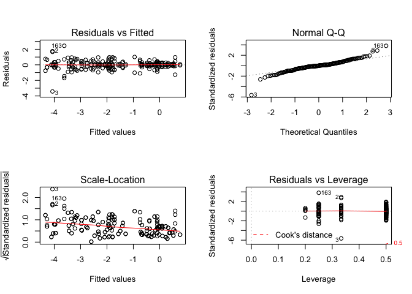

A function to do a t-test to determine if varias values in a linear model is significantly different than others. Arguments: reg = the linear model coefnum = 1 = intercept, 2 = beta ... val = value you would like to test, the default lm tests if value is significantly different from zero.

``` r
ttest <- function(reg, coefnum, val){
  co <- coef(summary(reg))
  tstat <- (co[coefnum,1]-val)/co[coefnum,2]
  2 * pt(abs(tstat), reg$df.residual, lower.tail = FALSE)
} 

# ipak function: install and load multiple R packages.
# check to see if packages are installed. Install them if they are not, then load them into the R session.
# Source: https://gist.github.com/stevenworthington/3178163
ipak <- function(pkg){
new.pkg <- pkg[!(pkg %in% installed.packages()[,"Package"])]
if (length(new.pkg)) 
    install.packages(new.pkg, dependencies = TRUE)
sapply(pkg, require, character.only = TRUE)
}
```

### Libraries

``` r
packages <- c("drc", "lme4", "lsmeans", "plyr", "plotrix", "knitr", "ggplot2", "lmtest", "lmerTest", "Rmisc", "gridExtra", "plotly", "webshot", "ggpmisc", "ggsci","scales")
ipak(packages)
```

    ##       drc      lme4   lsmeans      plyr   plotrix     knitr   ggplot2 
    ##      TRUE      TRUE      TRUE      TRUE      TRUE      TRUE      TRUE 
    ##    lmtest  lmerTest     Rmisc gridExtra    plotly   webshot   ggpmisc 
    ##      TRUE      TRUE      TRUE      TRUE      TRUE      TRUE      TRUE 
    ##     ggsci    scales 
    ##      TRUE      TRUE

### Read Data

``` r
cor <- data.frame(read.csv("correlation.csv", na.strings = "na"))
cor <- data.frame(na.omit(cor)) #omits missing values
```

This function will run a linear model of the percent relative growth, as well as correlations in both pearson and spearman and will also plot it in ggplot, if desired.

data = data.frame concentration = concentration plot = logical

``` r
RelGrowth.lm <- function(data, concentration, plot){
  data.string.y <- data$odrelgrowth[data$conc == concentration]
  data.string.x <- data$ppmeanrelgrowth[data$conc == concentration]
  lin.mod <- lm(data.string.y ~ data.string.x)
  sum.linmod <- summary(lin.mod)
  pearson <- cor.test(data.string.x, data.string.y, method = "pearson")
  spearman <- cor.test(data.string.x, data.string.y, method = "spearman")
  beta <- ttest(lin.mod, 2, 1) # t-test for Beta significantly different than one
  bias <- (sum.linmod[[4]][2] - 1)*100 #percent Bias
  coeff.var <- (sum.linmod[[4]][4]/sum.linmod[[4]][2])*100
  if(plot == TRUE){
  p <- ggplot(data[data$conc == concentration,], aes(y = odrelgrowth, x = ppmeanrelgrowth)) +
    geom_point(aes(colour = factor(species))) +
    guides(colour = guide_legend(title = "Species")) +
    scale_y_continuous(limits = c(0, 110), breaks = c(0, 25, 50, 75, 100)) +
    scale_x_continuous(limits = c(0, 110), breaks = c(0, 25, 50, 75, 100)) +
    geom_smooth(method = "lm", se = FALSE, fullrange = TRUE, col = "black") +
    xlab("% Poison Plate Growth, relative to control") + 
    ylab("% Optical Density growth, relative to control") + 
    theme_bw() +
    theme(axis.text.x = element_text(size = 10, face = "bold"),
          axis.text.y = element_text(size = 10, face = "bold"),
          axis.title.x = element_text(size = 15, face = "bold"),
          axis.title.y = element_text(size = 15, face = "bold"),
          legend.text = element_text(size = 10, face = "bold.italic"),
          legend.key = element_blank(),
          legend.title = element_text(size = 15, face="bold"))
  results <- list(sum.linmod, pearson, spearman, beta, bias, coeff.var, p)
  names(results) <- c("lm", "pearson", "spearman", "beta.t", "per.bias","coeff.var", "plot")
  return(results)
  } else {
    results <- list(sum.linmod, pearson, spearman, beta, bias, coeff.var)
    names(results) <- c("lm", "pearson", "spearman", "beta.t", "per.bias", "coeff.var")
    return(results)
  }
}
```

We want to look at the correlation of the two methods, poison plate and optical density, to determine if the optical density method is any good.

Ethaboxam relative growth correlations

``` r
eth.cor.pp <- ddply(cor[cor$chem == "ethaboxam" & cor$method == "poison_plate",], c("is", "species", "conc"), 
      summarize, 
      ppmeanrelgrowth = 100*mean(relgrowth, na.rm = TRUE))
eth.cor.od <- ddply(cor[cor$chem == "ethaboxam" & cor$method == "optical_density",], c("is", "species", "conc"), 
      summarize, 
      odmeanrelgrowth = 100*mean(relgrowth, na.rm = TRUE))
eth.cor <- cbind.data.frame(eth.cor.pp, eth.cor.od$odmeanrelgrowth)

colnames(eth.cor) <- c("is", "species", "conc", "ppmeanrelgrowth", "odrelgrowth")
eth.001 <- RelGrowth.lm(eth.cor, concentration = 0.01, plot = TRUE)
eth.001
```

    ## $lm
    ## 
    ## Call:
    ## lm(formula = data.string.y ~ data.string.x)
    ## 
    ## Residuals:
    ##      Min       1Q   Median       3Q      Max 
    ## -15.0564  -1.5956   0.6452   1.9085   6.0361 
    ## 
    ## Coefficients:
    ##               Estimate Std. Error t value       Pr(>|t|)    
    ## (Intercept)   14.87111    8.74019   1.701         0.0999 .  
    ## data.string.x  0.85958    0.09191   9.353 0.000000000413 ***
    ## ---
    ## Signif. codes:  0 '***' 0.001 '**' 0.01 '*' 0.05 '.' 0.1 ' ' 1
    ## 
    ## Residual standard error: 3.953 on 28 degrees of freedom
    ## Multiple R-squared:  0.7575, Adjusted R-squared:  0.7489 
    ## F-statistic: 87.47 on 1 and 28 DF,  p-value: 0.0000000004127
    ## 
    ## 
    ## $pearson
    ## 
    ##  Pearson's product-moment correlation
    ## 
    ## data:  data.string.x and data.string.y
    ## t = 9.3528, df = 28, p-value = 0.0000000004127
    ## alternative hypothesis: true correlation is not equal to 0
    ## 95 percent confidence interval:
    ##  0.7430963 0.9368618
    ## sample estimates:
    ##       cor 
    ## 0.8703579 
    ## 
    ## 
    ## $spearman
    ## 
    ##  Spearman's rank correlation rho
    ## 
    ## data:  data.string.x and data.string.y
    ## S = 1734, p-value = 0.0004029
    ## alternative hypothesis: true rho is not equal to 0
    ## sample estimates:
    ##      rho 
    ## 0.614238 
    ## 
    ## 
    ## $beta.t
    ## [1] 0.1377708
    ## 
    ## $per.bias
    ## [1] -14.04184
    ## 
    ## $coeff.var
    ## [1] 10.69199
    ## 
    ## $plot


``` r
eth.01 <- RelGrowth.lm(eth.cor, concentration = 0.1, plot = TRUE)
eth.01
```

    ## $lm
    ## 
    ## Call:
    ## lm(formula = data.string.y ~ data.string.x)
    ## 
    ## Residuals:
    ##      Min       1Q   Median       3Q      Max 
    ## -20.9532  -3.3288  -0.7175   4.8422  15.0876 
    ## 
    ## Coefficients:
    ##               Estimate Std. Error t value           Pr(>|t|)    
    ## (Intercept)   29.26006    4.10788   7.123 0.0000000946325955 ***
    ## data.string.x  0.74368    0.05093  14.602 0.0000000000000128 ***
    ## ---
    ## Signif. codes:  0 '***' 0.001 '**' 0.01 '*' 0.05 '.' 0.1 ' ' 1
    ## 
    ## Residual standard error: 7.187 on 28 degrees of freedom
    ## Multiple R-squared:  0.8839, Adjusted R-squared:  0.8798 
    ## F-statistic: 213.2 on 1 and 28 DF,  p-value: 0.00000000000001276
    ## 
    ## 
    ## $pearson
    ## 
    ##  Pearson's product-moment correlation
    ## 
    ## data:  data.string.x and data.string.y
    ## t = 14.602, df = 28, p-value = 0.00000000000001276
    ## alternative hypothesis: true correlation is not equal to 0
    ## 95 percent confidence interval:
    ##  0.8769341 0.9714102
    ## sample estimates:
    ##       cor 
    ## 0.9401724 
    ## 
    ## 
    ## $spearman
    ## 
    ##  Spearman's rank correlation rho
    ## 
    ## data:  data.string.x and data.string.y
    ## S = 606, p-value = 0.0000005663
    ## alternative hypothesis: true rho is not equal to 0
    ## sample estimates:
    ##       rho 
    ## 0.8651835 
    ## 
    ## 
    ## $beta.t
    ## [1] 0.00002534679
    ## 
    ## $per.bias
    ## [1] -25.63232
    ## 
    ## $coeff.var
    ## [1] 6.848325
    ## 
    ## $plot

    ## Warning: Removed 2 rows containing missing values (geom_smooth).


``` r
eth.05 <- RelGrowth.lm(eth.cor, concentration = 0.5, plot = TRUE)
eth.05
```

    ## $lm
    ## 
    ## Call:
    ## lm(formula = data.string.y ~ data.string.x)
    ## 
    ## Residuals:
    ##     Min      1Q  Median      3Q     Max 
    ## -27.431  -4.319   1.050   5.400  21.930 
    ## 
    ## Coefficients:
    ##               Estimate Std. Error t value         Pr(>|t|)    
    ## (Intercept)   17.56121    4.22120    4.16         0.000273 ***
    ## data.string.x  0.81890    0.06602   12.40 0.00000000000068 ***
    ## ---
    ## Signif. codes:  0 '***' 0.001 '**' 0.01 '*' 0.05 '.' 0.1 ' ' 1
    ## 
    ## Residual standard error: 11.24 on 28 degrees of freedom
    ## Multiple R-squared:  0.846,  Adjusted R-squared:  0.8405 
    ## F-statistic: 153.9 on 1 and 28 DF,  p-value: 0.0000000000006796
    ## 
    ## 
    ## $pearson
    ## 
    ##  Pearson's product-moment correlation
    ## 
    ## data:  data.string.x and data.string.y
    ## t = 12.404, df = 28, p-value = 0.0000000000006796
    ## alternative hypothesis: true correlation is not equal to 0
    ## 95 percent confidence interval:
    ##  0.8368378 0.9614634
    ## sample estimates:
    ##       cor 
    ## 0.9197995 
    ## 
    ## 
    ## $spearman
    ## 
    ##  Spearman's rank correlation rho
    ## 
    ## data:  data.string.x and data.string.y
    ## S = 586, p-value = 0.0000005246
    ## alternative hypothesis: true rho is not equal to 0
    ## sample estimates:
    ##       rho 
    ## 0.8696329 
    ## 
    ## 
    ## $beta.t
    ## [1] 0.01049333
    ## 
    ## $per.bias
    ## [1] -18.11014
    ## 
    ## $coeff.var
    ## [1] 8.062027
    ## 
    ## $plot


``` r
eth.1 <- RelGrowth.lm(eth.cor, concentration = 1, plot = TRUE)
eth.1
```

    ## $lm
    ## 
    ## Call:
    ## lm(formula = data.string.y ~ data.string.x)
    ## 
    ## Residuals:
    ##     Min      1Q  Median      3Q     Max 
    ## -35.804  -7.556   0.999  11.640  20.084 
    ## 
    ## Coefficients:
    ##               Estimate Std. Error t value     Pr(>|t|)    
    ## (Intercept)    9.13243    5.28545   1.728        0.095 .  
    ## data.string.x  0.74812    0.09552   7.832 0.0000000157 ***
    ## ---
    ## Signif. codes:  0 '***' 0.001 '**' 0.01 '*' 0.05 '.' 0.1 ' ' 1
    ## 
    ## Residual standard error: 16.69 on 28 degrees of freedom
    ## Multiple R-squared:  0.6866, Adjusted R-squared:  0.6754 
    ## F-statistic: 61.34 on 1 and 28 DF,  p-value: 0.00000001569
    ## 
    ## 
    ## $pearson
    ## 
    ##  Pearson's product-moment correlation
    ## 
    ## data:  data.string.x and data.string.y
    ## t = 7.8318, df = 28, p-value = 0.00000001569
    ## alternative hypothesis: true correlation is not equal to 0
    ## 95 percent confidence interval:
    ##  0.6676330 0.9155582
    ## sample estimates:
    ##       cor 
    ## 0.8286008 
    ## 
    ## 
    ## $spearman
    ## 
    ##  Spearman's rank correlation rho
    ## 
    ## data:  data.string.x and data.string.y
    ## S = 1004, p-value = 0.000001908
    ## alternative hypothesis: true rho is not equal to 0
    ## sample estimates:
    ##       rho 
    ## 0.7766407 
    ## 
    ## 
    ## $beta.t
    ## [1] 0.01350023
    ## 
    ## $per.bias
    ## [1] -25.18779
    ## 
    ## $coeff.var
    ## [1] 12.76849
    ## 
    ## $plot


``` r
eth.5 <- RelGrowth.lm(eth.cor, concentration = 5, plot = TRUE)
```

    ## Warning in cor.test.default(data.string.x, data.string.y, method =
    ## "spearman"): Cannot compute exact p-value with ties

``` r
eth.5
```

    ## $lm
    ## 
    ## Call:
    ## lm(formula = data.string.y ~ data.string.x)
    ## 
    ## Residuals:
    ##      Min       1Q   Median       3Q      Max 
    ## -19.5394  -3.2108   0.2078   4.2866  14.9406 
    ## 
    ## Coefficients:
    ##               Estimate Std. Error t value             Pr(>|t|)    
    ## (Intercept)   11.26559    1.45532   7.741         0.0000000197 ***
    ## data.string.x  1.01056    0.04476  22.579 < 0.0000000000000002 ***
    ## ---
    ## Signif. codes:  0 '***' 0.001 '**' 0.01 '*' 0.05 '.' 0.1 ' ' 1
    ## 
    ## Residual standard error: 6.873 on 28 degrees of freedom
    ## Multiple R-squared:  0.9479, Adjusted R-squared:  0.9461 
    ## F-statistic: 509.8 on 1 and 28 DF,  p-value: < 0.00000000000000022
    ## 
    ## 
    ## $pearson
    ## 
    ##  Pearson's product-moment correlation
    ## 
    ## data:  data.string.x and data.string.y
    ## t = 22.579, df = 28, p-value < 0.00000000000000022
    ## alternative hypothesis: true correlation is not equal to 0
    ## 95 percent confidence interval:
    ##  0.9447310 0.9875068
    ## sample estimates:
    ##      cor 
    ## 0.973621 
    ## 
    ## 
    ## $spearman
    ## 
    ##  Spearman's rank correlation rho
    ## 
    ## data:  data.string.x and data.string.y
    ## S = 2067.7, p-value = 0.00207
    ## alternative hypothesis: true rho is not equal to 0
    ## sample estimates:
    ##       rho 
    ## 0.5399933 
    ## 
    ## 
    ## $beta.t
    ## [1] 0.8152027
    ## 
    ## $per.bias
    ## [1] 1.055944
    ## 
    ## $coeff.var
    ## [1] 4.428861
    ## 
    ## $plot

    ## Warning: Removed 9 rows containing missing values (geom_smooth).


``` r
eth.20 <- RelGrowth.lm(eth.cor, concentration = 20, plot = TRUE)
```

    ## Warning in cor.test.default(data.string.x, data.string.y, method =
    ## "spearman"): Cannot compute exact p-value with ties

``` r
eth.20
```

    ## $lm
    ## 
    ## Call:
    ## lm(formula = data.string.y ~ data.string.x)
    ## 
    ## Residuals:
    ##    Min     1Q Median     3Q    Max 
    ## -8.389 -3.986 -1.106  2.896 14.971 
    ## 
    ## Coefficients:
    ##               Estimate Std. Error t value             Pr(>|t|)    
    ## (Intercept)   12.86069    1.18461   10.86      0.0000000000152 ***
    ## data.string.x  0.95357    0.04008   23.79 < 0.0000000000000002 ***
    ## ---
    ## Signif. codes:  0 '***' 0.001 '**' 0.01 '*' 0.05 '.' 0.1 ' ' 1
    ## 
    ## Residual standard error: 5.816 on 28 degrees of freedom
    ## Multiple R-squared:  0.9529, Adjusted R-squared:  0.9512 
    ## F-statistic: 566.2 on 1 and 28 DF,  p-value: < 0.00000000000000022
    ## 
    ## 
    ## $pearson
    ## 
    ##  Pearson's product-moment correlation
    ## 
    ## data:  data.string.x and data.string.y
    ## t = 23.794, df = 28, p-value < 0.00000000000000022
    ## alternative hypothesis: true correlation is not equal to 0
    ## 95 percent confidence interval:
    ##  0.9499662 0.9887137
    ## sample estimates:
    ##       cor 
    ## 0.9761532 
    ## 
    ## 
    ## $spearman
    ## 
    ##  Spearman's rank correlation rho
    ## 
    ## data:  data.string.x and data.string.y
    ## S = 2402.7, p-value = 0.009538
    ## alternative hypothesis: true rho is not equal to 0
    ## sample estimates:
    ##       rho 
    ## 0.4654791 
    ## 
    ## 
    ## $beta.t
    ## [1] 0.256445
    ## 
    ## $per.bias
    ## [1] -4.642783
    ## 
    ## $coeff.var
    ## [1] 4.202696
    ## 
    ## $plot

    ## Warning: Removed 6 rows containing missing values (geom_smooth).


Mefenoxam relative growth correlations

``` r
mef.cor.pp <- ddply(cor[cor$chem == "mefenoxam" & cor$method == "poison_plate",], c("is", "species", "conc"), 
      summarize, 
      ppmeanrelgrowth = 100*mean(relgrowth, na.rm = TRUE))
mef.cor.od <- ddply(cor[cor$chem == "mefenoxam" & cor$method == "optical_density",], c("is", "species", "conc"), 
      summarize, 
      odmeanrelgrowth = 100*mean(relgrowth, na.rm = TRUE))
mef.cor.od <- mef.cor.od[!mef.cor.od$conc == 100,]
mef.cor.pp <- mef.cor.pp[!mef.cor.pp$conc == 100,]
mef.cor <- cbind.data.frame(mef.cor.pp, mef.cor.od$odmeanrelgrowth)
colnames(mef.cor) <- c("is", "species", "conc", "ppmeanrelgrowth", "odrelgrowth")
mef.001 <- RelGrowth.lm(mef.cor, concentration = 0.01, plot = TRUE)
mef.001
```

    ## $lm
    ## 
    ## Call:
    ## lm(formula = data.string.y ~ data.string.x)
    ## 
    ## Residuals:
    ##     Min      1Q  Median      3Q     Max 
    ## -22.401  -7.896   1.015   4.075  43.111 
    ## 
    ## Coefficients:
    ##               Estimate Std. Error t value Pr(>|t|)    
    ## (Intercept)   -19.1481    24.1889  -0.792 0.437439    
    ## data.string.x   1.2270     0.2699   4.546 0.000176 ***
    ## ---
    ## Signif. codes:  0 '***' 0.001 '**' 0.01 '*' 0.05 '.' 0.1 ' ' 1
    ## 
    ## Residual standard error: 12.54 on 21 degrees of freedom
    ## Multiple R-squared:  0.496,  Adjusted R-squared:  0.472 
    ## F-statistic: 20.67 on 1 and 21 DF,  p-value: 0.000176
    ## 
    ## 
    ## $pearson
    ## 
    ##  Pearson's product-moment correlation
    ## 
    ## data:  data.string.x and data.string.y
    ## t = 4.5464, df = 21, p-value = 0.000176
    ## alternative hypothesis: true correlation is not equal to 0
    ## 95 percent confidence interval:
    ##  0.4115842 0.8652940
    ## sample estimates:
    ##       cor 
    ## 0.7042981 
    ## 
    ## 
    ## $spearman
    ## 
    ##  Spearman's rank correlation rho
    ## 
    ## data:  data.string.x and data.string.y
    ## S = 630, p-value = 0.0003984
    ## alternative hypothesis: true rho is not equal to 0
    ## sample estimates:
    ##       rho 
    ## 0.6887352 
    ## 
    ## 
    ## $beta.t
    ## [1] 0.40976
    ## 
    ## $per.bias
    ## [1] 22.70046
    ## 
    ## $coeff.var
    ## [1] 21.99549
    ## 
    ## $plot

    ## Warning: Removed 2 rows containing non-finite values (stat_smooth).

    ## Warning: Removed 2 rows containing missing values (geom_point).

    ## Warning: Removed 17 rows containing missing values (geom_smooth).


``` r
mef.01 <- RelGrowth.lm(mef.cor, concentration = 0.1, plot = TRUE)
mef.01
```

    ## $lm
    ## 
    ## Call:
    ## lm(formula = data.string.y ~ data.string.x)
    ## 
    ## Residuals:
    ##     Min      1Q  Median      3Q     Max 
    ## -32.649  -2.905   0.878   7.645  22.297 
    ## 
    ## Coefficients:
    ##               Estimate Std. Error t value    Pr(>|t|)    
    ## (Intercept)    18.9711     5.4371   3.489     0.00219 ** 
    ## data.string.x   0.8021     0.1037   7.733 0.000000141 ***
    ## ---
    ## Signif. codes:  0 '***' 0.001 '**' 0.01 '*' 0.05 '.' 0.1 ' ' 1
    ## 
    ## Residual standard error: 14.39 on 21 degrees of freedom
    ## Multiple R-squared:  0.7401, Adjusted R-squared:  0.7277 
    ## F-statistic:  59.8 on 1 and 21 DF,  p-value: 0.0000001413
    ## 
    ## 
    ## $pearson
    ## 
    ##  Pearson's product-moment correlation
    ## 
    ## data:  data.string.x and data.string.y
    ## t = 7.7329, df = 21, p-value = 0.0000001413
    ## alternative hypothesis: true correlation is not equal to 0
    ## 95 percent confidence interval:
    ##  0.6942861 0.9393749
    ## sample estimates:
    ##       cor 
    ## 0.8602862 
    ## 
    ## 
    ## $spearman
    ## 
    ##  Spearman's rank correlation rho
    ## 
    ## data:  data.string.x and data.string.y
    ## S = 406, p-value = 0.000006679
    ## alternative hypothesis: true rho is not equal to 0
    ## sample estimates:
    ##       rho 
    ## 0.7994071 
    ## 
    ## 
    ## $beta.t
    ## [1] 0.07015903
    ## 
    ## $per.bias
    ## [1] -19.79059
    ## 
    ## $coeff.var
    ## [1] 12.93174
    ## 
    ## $plot

    ## Warning: Removed 1 rows containing non-finite values (stat_smooth).

    ## Warning: Removed 1 rows containing missing values (geom_point).


``` r
mef.05 <- RelGrowth.lm(mef.cor, concentration = 0.5, plot = TRUE)
```

    ## Warning in cor.test.default(data.string.x, data.string.y, method =
    ## "spearman"): Cannot compute exact p-value with ties

``` r
mef.05
```

    ## $lm
    ## 
    ## Call:
    ## lm(formula = data.string.y ~ data.string.x)
    ## 
    ## Residuals:
    ##     Min      1Q  Median      3Q     Max 
    ## -22.660  -5.341   1.958   6.462  15.363 
    ## 
    ## Coefficients:
    ##               Estimate Std. Error t value        Pr(>|t|)    
    ## (Intercept)    4.26495    2.80053   1.523           0.143    
    ## data.string.x  0.85202    0.06936  12.285 0.0000000000472 ***
    ## ---
    ## Signif. codes:  0 '***' 0.001 '**' 0.01 '*' 0.05 '.' 0.1 ' ' 1
    ## 
    ## Residual standard error: 10.1 on 21 degrees of freedom
    ## Multiple R-squared:  0.8778, Adjusted R-squared:  0.872 
    ## F-statistic: 150.9 on 1 and 21 DF,  p-value: 0.00000000004719
    ## 
    ## 
    ## $pearson
    ## 
    ##  Pearson's product-moment correlation
    ## 
    ## data:  data.string.x and data.string.y
    ## t = 12.285, df = 21, p-value = 0.00000000004719
    ## alternative hypothesis: true correlation is not equal to 0
    ## 95 percent confidence interval:
    ##  0.8549021 0.9732585
    ## sample estimates:
    ##       cor 
    ## 0.9369353 
    ## 
    ## 
    ## $spearman
    ## 
    ##  Spearman's rank correlation rho
    ## 
    ## data:  data.string.x and data.string.y
    ## S = 654.61, p-value = 0.0003928
    ## alternative hypothesis: true rho is not equal to 0
    ## sample estimates:
    ##       rho 
    ## 0.6765746 
    ## 
    ## 
    ## $beta.t
    ## [1] 0.04482393
    ## 
    ## $per.bias
    ## [1] -14.79826
    ## 
    ## $coeff.var
    ## [1] 8.140131
    ## 
    ## $plot


``` r
mef.1 <- RelGrowth.lm(mef.cor, concentration = 1, plot = TRUE)
```

    ## Warning in cor.test.default(data.string.x, data.string.y, method =
    ## "spearman"): Cannot compute exact p-value with ties

``` r
mef.1
```

    ## $lm
    ## 
    ## Call:
    ## lm(formula = data.string.y ~ data.string.x)
    ## 
    ## Residuals:
    ##      Min       1Q   Median       3Q      Max 
    ## -14.9107  -4.1638  -0.1698   3.8249  17.1635 
    ## 
    ## Coefficients:
    ##               Estimate Std. Error t value         Pr(>|t|)    
    ## (Intercept)    4.67813    2.25130   2.078           0.0502 .  
    ## data.string.x  0.95010    0.06453  14.723 0.00000000000154 ***
    ## ---
    ## Signif. codes:  0 '***' 0.001 '**' 0.01 '*' 0.05 '.' 0.1 ' ' 1
    ## 
    ## Residual standard error: 8.859 on 21 degrees of freedom
    ## Multiple R-squared:  0.9117, Adjusted R-squared:  0.9075 
    ## F-statistic: 216.8 on 1 and 21 DF,  p-value: 0.00000000000154
    ## 
    ## 
    ## $pearson
    ## 
    ##  Pearson's product-moment correlation
    ## 
    ## data:  data.string.x and data.string.y
    ## t = 14.723, df = 21, p-value = 0.00000000000154
    ## alternative hypothesis: true correlation is not equal to 0
    ## 95 percent confidence interval:
    ##  0.8947867 0.9809434
    ## sample estimates:
    ##       cor 
    ## 0.9548198 
    ## 
    ## 
    ## $spearman
    ## 
    ##  Spearman's rank correlation rho
    ## 
    ## data:  data.string.x and data.string.y
    ## S = 769.79, p-value = 0.001613
    ## alternative hypothesis: true rho is not equal to 0
    ## sample estimates:
    ##     rho 
    ## 0.61967 
    ## 
    ## 
    ## $beta.t
    ## [1] 0.447949
    ## 
    ## $per.bias
    ## [1] -4.990287
    ## 
    ## $coeff.var
    ## [1] 6.791979
    ## 
    ## $plot


``` r
mef.10 <- RelGrowth.lm(mef.cor, concentration = 10, plot = TRUE)
```

    ## Warning in cor.test.default(data.string.x, data.string.y, method =
    ## "spearman"): Cannot compute exact p-value with ties

``` r
mef.10
```

    ## $lm
    ## 
    ## Call:
    ## lm(formula = data.string.y ~ data.string.x)
    ## 
    ## Residuals:
    ##     Min      1Q  Median      3Q     Max 
    ## -12.824  -3.896  -1.956   2.918  15.945 
    ## 
    ## Coefficients:
    ##               Estimate Std. Error t value          Pr(>|t|)    
    ## (Intercept)    4.74129    1.96068   2.418            0.0248 *  
    ## data.string.x  1.00253    0.06259  16.017 0.000000000000302 ***
    ## ---
    ## Signif. codes:  0 '***' 0.001 '**' 0.01 '*' 0.05 '.' 0.1 ' ' 1
    ## 
    ## Residual standard error: 8.252 on 21 degrees of freedom
    ## Multiple R-squared:  0.9243, Adjusted R-squared:  0.9207 
    ## F-statistic: 256.6 on 1 and 21 DF,  p-value: 0.0000000000003015
    ## 
    ## 
    ## $pearson
    ## 
    ##  Pearson's product-moment correlation
    ## 
    ## data:  data.string.x and data.string.y
    ## t = 16.017, df = 21, p-value = 0.0000000000003015
    ## alternative hypothesis: true correlation is not equal to 0
    ## 95 percent confidence interval:
    ##  0.9097649 0.9837614
    ## sample estimates:
    ##       cor 
    ## 0.9614256 
    ## 
    ## 
    ## $spearman
    ## 
    ##  Spearman's rank correlation rho
    ## 
    ## data:  data.string.x and data.string.y
    ## S = 810.55, p-value = 0.002498
    ## alternative hypothesis: true rho is not equal to 0
    ## sample estimates:
    ##       rho 
    ## 0.5995292 
    ## 
    ## 
    ## $beta.t
    ## [1] 0.9681302
    ## 
    ## $per.bias
    ## [1] 0.2530688
    ## 
    ## $coeff.var
    ## [1] 6.243239
    ## 
    ## $plot

    ## Warning: Removed 1 rows containing non-finite values (stat_smooth).

    ## Warning: Removed 1 rows containing missing values (geom_point).


From the analysis above it looks like there are some isolates with percent relative growth above 50% at the highest concentration tested. Therefore those isolates will not have an EC50 and cannot be calculated. We will express these isolates in terms of their relative growth.

``` r
# briefly we are going to split up the data frame into each concentration to make it easier to take out individual isolates
cor_eth <- cor[cor$chem == "ethaboxam",]
cor_mef <- cor[cor$chem == "mefenoxam",]

# taking out insensitive isolates, otherwise convergence would not occur with the ll.4 model
insens_iso_eth <- c("MISO_8-29.1", "C-MNSO2_2-21", "NDSO_L-8-6", "ILSO_6-15C")
insens_iso_mef <- c("V-MISO2_6-46", "23.4B", "1.18A")

# creating a dataframe with only those isolates
insenscor_eth <- cor_eth[cor_eth$is %in% insens_iso_eth,]
insenscor_mef <- cor_mef[cor_mef$is %in% insens_iso_mef,]

# taking out those isolates
cor_eth <- cor_eth[!cor_eth$is %in% insens_iso_eth,]
cor_mef <- cor_mef[!cor_mef$is %in% insens_iso_mef,]
cor_eth$is <- factor(cor_eth$is)
cor_mef$is <- factor(cor_mef$is)

cor <- rbind.data.frame(cor_eth, cor_mef)
```

This code iterates through every isolate and generates a relative and absolute EC50 using the LL.4 model of drc and saves the output. I already went through and picked out the isolates for both mefenoxam and ethaboxam that have an EC50 beyond the concentration range tested in this study.

``` r
relative <- function(data){
  EC50.pp.rel <- data.frame(ED(data, 
                             respLev = c(50), 
                             type = "relative",
                             interval = "delta"),
                          level = 0.95)
rel.ec50.pp <- EC50.pp.rel[1][[1]]
return(rel.ec50.pp)
}
absolute <- function(data){
  EC50.pp.abs <- data.frame(ED(data, 
                             respLev = c(50), 
                             type = "absolute",
                             interval = "delta"),
                          level = 0.95)
abs.ec50.pp <- EC50.pp.abs[1][[1]]
return(abs.ec50.pp)
}
plug_EC <- function(chemistry){
  nm <- unique(cor$is[cor$chem == as.character(chemistry)])
dataframe_names <- c("is", "species", "method", "trial", "chem", "absolute", "relative")
meth.cor <- NULL
for (i in seq_along(nm)){
mefcor.pp.drc <- drm(100*relgrowth ~ conc, data = cor[cor$is == nm[[i]] & cor$method == "poison_plate" & cor$chem == as.character(chemistry),], curveid = trial, fct = LL.4(), na.action = na.omit)
mefcor.od.drc <- drm(100*relgrowth ~ conc, data = cor[cor$is == nm[[i]] & cor$method == "optical_density" & cor$chem == as.character(chemistry),], curveid = trial, fct = LL.4(), na.action = na.omit)
paste(print(nm[[i]]))
# RELATIVE 
rel.pp.mef <- relative(mefcor.pp.drc)
rel.od.mef <- relative(mefcor.od.drc)

# ABSOLUTE 
abs.pp.mef <- absolute(mefcor.pp.drc)
abs.od.mef <- absolute(mefcor.od.drc)

mef.cor_od <- data.frame(cbind.data.frame( 
                  nm[[i]], 
                  as.character(unique(cor$species[cor$is == nm[[i]]])),
                  as.character(unique(cor$method[cor$is == nm[[i]] & cor$method == "optical_density"])),
                  unique(cor$trial[cor$is == nm[[i]] & cor$method == "optical_density"]),
                  as.character(chemistry),
                  as.numeric(abs.od.mef),
                  as.numeric(rel.od.mef)))
colnames(mef.cor_od) <- dataframe_names
mef.cor_pp <- data.frame(cbind.data.frame( 
                  nm[[i]], 
                  as.character(unique(cor$species[cor$is == nm[[i]]])),
                  as.character(unique(cor$method[cor$is == nm[[i]] & cor$method == "poison_plate"])),
                  unique(cor$trial[cor$is == nm[[i]] & cor$method == "poison_plate"]),
                  as.character(chemistry),
                  as.numeric(abs.pp.mef),
                  as.numeric(rel.pp.mef)))
colnames(mef.cor_pp) <- dataframe_names

meth.cor <- rbind.data.frame(meth.cor, mef.cor_od, mef.cor_pp)
  }
return(meth.cor)
}

mefenoxam_ec50 <- plug_EC("mefenoxam")
ethaboxam_ec50 <- plug_EC("ethaboxam")

ec50_cor <- rbind.data.frame(ethaboxam_ec50, mefenoxam_ec50)
dim(ec50_cor)

# not sure why one of the isolates had duplicates but they did, so this code will find duplicates in the absolute ec50s and delete the entire row. 
ec50_cor <- ec50_cor[-which(duplicated(ec50_cor$absolute)),] 
dim(ec50_cor)
```

Table of EC50 values for every isolate tested for both mefenoxam and ethaboxam on both poison plate and optical density method.

| is               | species                             | chem      | method           |   mean.abs|    std.abs|   mean.rel|    std.rel|
|:-----------------|:------------------------------------|:----------|:-----------------|----------:|----------:|----------:|----------:|
| AR\_127.S.2.3.A  | Pythium irregulare                  | ethaboxam | optical\_density |  0.6017397|  0.4608413|  0.3258476|  0.2118367|
| AR\_127.S.2.3.A  | Pythium irregulare                  | ethaboxam | poison\_plate    |  0.6474189|  0.0242181|  0.7462384|  0.1600082|
| AR\_127.S.2.3.A  | Pythium irregulare                  | mefenoxam | optical\_density |  0.1831292|  0.0722302|  0.1036954|  0.0178995|
| AR\_127.S.2.3.A  | Pythium irregulare                  | mefenoxam | poison\_plate    |  0.1259047|  0.0503855|  0.1228202|  0.0557411|
| AR\_262.S.1.6.A  | Pythium spinosum                    | ethaboxam | optical\_density |  0.4890281|  0.0532135|  0.4472674|  0.0672784|
| AR\_262.S.1.6.A  | Pythium spinosum                    | ethaboxam | poison\_plate    |  0.2093399|  0.0147487|  0.1991737|  0.0172343|
| ARS\_284.S1.4.A  | Pythium lutarium                    | ethaboxam | optical\_density |  0.2669444|  0.0983561|  0.2488793|  0.0977931|
| ARS\_284.S1.4.A  | Pythium lutarium                    | ethaboxam | poison\_plate    |  0.2260918|  0.0293079|  0.1949081|  0.0054857|
| C-NDSO2\_1-11    | Pythium perplexum                   | ethaboxam | optical\_density |  0.1673536|  0.0045666|  0.1324687|  0.0026915|
| C-NDSO2\_1-11    | Pythium perplexum                   | ethaboxam | poison\_plate    |  0.0983410|  0.0112713|  0.0977276|  0.0100928|
| IASO\_10-37.8RT  | Pythium aff. dissotocum             | ethaboxam | optical\_density |  1.1413192|  0.3019554|  1.0115718|  0.2570090|
| IASO\_10-37.8RT  | Pythium aff. dissotocum             | ethaboxam | poison\_plate    |  1.0220161|  0.6068654|  1.0072584|  0.5928676|
| IASO\_10-38.14RT | Pythium aff. dissotocum             | ethaboxam | optical\_density |  1.0125252|  0.2669542|  0.9121016|  0.1950198|
| IASO\_10-38.14RT | Pythium aff. dissotocum             | ethaboxam | poison\_plate    |  1.7250785|  0.2861205|  1.8877660|  0.3800343|
| IASO\_10-39.16RT | Pythium aff. dissotocum             | ethaboxam | optical\_density |  0.6248467|  0.0759800|  0.5562301|  0.0206426|
| IASO\_10-39.16RT | Pythium aff. dissotocum             | ethaboxam | poison\_plate    |  1.6056028|  0.1531086|  1.7370847|  0.1606027|
| IASO\_6-10.15H   | Pythium oopapillum                  | ethaboxam | optical\_density |  0.5136203|  0.0286944|  0.4836774|  0.0102900|
| IASO\_6-10.15H   | Pythium oopapillum                  | ethaboxam | poison\_plate    |  1.1130479|  0.2173577|  1.0919763|  0.2239991|
| IASO\_6-10.15H   | Pythium oopapillum                  | mefenoxam | optical\_density |  0.2521354|  0.0684946|  0.2051422|  0.0498267|
| IASO\_6-10.15H   | Pythium oopapillum                  | mefenoxam | poison\_plate    |  0.1447404|  0.1073336|  0.1252434|  0.0924627|
| ILSO\_1-31       | Pythium irregulare                  | ethaboxam | optical\_density |  0.8616940|  0.1247902|  0.8372427|  0.0556342|
| ILSO\_1-31       | Pythium irregulare                  | ethaboxam | poison\_plate    |  0.8058171|  0.0387544|  1.0671747|  0.0765512|
| ILSO\_3-48C      | Pythium irregulare                  | ethaboxam | optical\_density |  0.9968918|  0.2276545|  0.5450930|  0.1574642|
| ILSO\_3-48C      | Pythium irregulare                  | ethaboxam | poison\_plate    |  0.7286362|  0.0211646|  0.9552630|  0.0460969|
| ILSO\_3-48C      | Pythium irregulare                  | mefenoxam | optical\_density |  0.2218693|  0.0780914|  0.1509015|  0.0575959|
| ILSO\_3-48C      | Pythium irregulare                  | mefenoxam | poison\_plate    |  0.1263038|  0.0133000|  0.1136575|  0.0248296|
| ILSO\_5-42C      | Pythium oopapillum                  | ethaboxam | optical\_density |  1.0026325|  0.4214322|  0.9374770|  0.3795077|
| ILSO\_5-42C      | Pythium oopapillum                  | ethaboxam | poison\_plate    |  1.3388329|  0.0166538|  1.5284298|  0.1501364|
| ILSO\_5-42C      | Pythium oopapillum                  | mefenoxam | optical\_density |  0.0934891|  0.0727647|  0.0828173|  0.0621251|
| ILSO\_5-42C      | Pythium oopapillum                  | mefenoxam | poison\_plate    |  0.0176811|  0.0013969|  0.0190659|  0.0028424|
| ILSO\_6-2B       | Pythium oopapillum                  | ethaboxam | optical\_density |  0.7590296|  0.0573760|  0.6391139|  0.0124021|
| ILSO\_6-2B       | Pythium oopapillum                  | ethaboxam | poison\_plate    |  0.9836553|  0.0599357|  0.9708861|  0.0039751|
| ILSO\_6-2B       | Pythium oopapillum                  | mefenoxam | optical\_density |  0.1616391|  0.0430944|  0.1512861|  0.0385509|
| ILSO\_6-2B       | Pythium oopapillum                  | mefenoxam | poison\_plate    |  0.1374047|  0.0218105|  0.1122750|  0.0353251|
| INSO\_1-10C      | Pythium sylvaticum                  | ethaboxam | optical\_density |  0.6021485|  0.2261376|  0.4896181|  0.2288380|
| INSO\_1-10C      | Pythium sylvaticum                  | ethaboxam | poison\_plate    |  0.1023615|  0.0310532|  0.1085730|  0.0178761|
| INSO\_1-10C      | Pythium sylvaticum                  | mefenoxam | optical\_density |  0.0556356|  0.0142788|  0.0540463|  0.0146426|
| INSO\_1-10C      | Pythium sylvaticum                  | mefenoxam | poison\_plate    |  0.0240773|  0.0109447|  0.0240587|  0.0109250|
| INSO\_1-8A       | Pythium lutarium                    | ethaboxam | optical\_density |  0.6975005|  0.1292836|  0.6548995|  0.0999101|
| INSO\_1-8A       | Pythium lutarium                    | ethaboxam | poison\_plate    |  1.4568919|  0.1234575|  1.5417715|  0.0704994|
| KSSO\_6-1        | Pythium ultimum var. ultimum        | ethaboxam | optical\_density |  2.1738744|  0.1268949|  1.8935903|  0.0802024|
| KSSO\_6-1        | Pythium ultimum var. ultimum        | ethaboxam | poison\_plate    |  1.4760269|  0.1444716|  1.6207549|  0.0955815|
| KSSO\_6-47       | Phytophthora sansomeana             | ethaboxam | optical\_density |  0.0634017|  0.0315296|  0.0526138|  0.0286371|
| KSSO\_6-47       | Phytophthora sansomeana             | ethaboxam | poison\_plate    |  0.0324276|  0.0043185|  0.0324150|  0.0039692|
| MISO\_1-4        | Pythium lutarium                    | ethaboxam | optical\_density |  0.9515964|  0.1695581|  0.8880759|  0.1894814|
| MISO\_1-4        | Pythium lutarium                    | ethaboxam | poison\_plate    |  0.6058080|  0.0382837|  0.6033125|  0.0375648|
| MISO\_5-19H      | Pythium glomeratum                  | ethaboxam | optical\_density |  1.3033651|  0.3326300|  0.9839949|  0.2931130|
| MISO\_5-19H      | Pythium glomeratum                  | ethaboxam | poison\_plate    |  1.1133215|  0.0441768|  1.1914970|  0.0877672|
| MISO\_8-10       | Pythium ultimum var. ultimum        | ethaboxam | optical\_density |  0.7494623|  0.2384325|  0.6596120|  0.2148583|
| MISO\_8-10       | Pythium ultimum var. ultimum        | ethaboxam | poison\_plate    |  1.2705569|  0.0327597|  1.3791427|  0.0529921|
| NDSO\_1-42       | Pythium sylvaticum                  | ethaboxam | optical\_density |  0.5083377|  0.0455087|  0.4342847|  0.0397514|
| NDSO\_1-42       | Pythium sylvaticum                  | ethaboxam | poison\_plate    |  0.5029008|  0.0315540|  0.5163838|  0.0454677|
| NDSO\_1-42       | Pythium sylvaticum                  | mefenoxam | optical\_density |  0.0843794|  0.0395403|  0.0776105|  0.0309785|
| NDSO\_1-42       | Pythium sylvaticum                  | mefenoxam | poison\_plate    |  0.0584407|  0.0271372|  0.0592125|  0.0288098|
| NESO\_2-13       | Pythium sylvaticum                  | ethaboxam | optical\_density |  0.5351099|  0.1587134|  0.4859459|  0.1842366|
| NESO\_2-13       | Pythium sylvaticum                  | ethaboxam | poison\_plate    |  0.2755640|  0.0195702|  0.3037442|  0.0022381|
| NESO\_2-13       | Pythium sylvaticum                  | mefenoxam | optical\_density |  0.1626739|  0.0513231|  0.1500946|  0.0446556|
| NESO\_2-13       | Pythium sylvaticum                  | mefenoxam | poison\_plate    |  0.0659475|  0.0136608|  0.0657198|  0.0179300|
| NESO\_4-29       | Pythium perplexum                   | ethaboxam | optical\_density |  0.0997645|  0.0070532|  0.0880328|  0.0143253|
| NESO\_4-29       | Pythium perplexum                   | ethaboxam | poison\_plate    |  0.1238281|  0.0031861|  0.1199439|  0.0006862|
| V-KSSO2\_1-7     | Phytophthora sansomeana             | ethaboxam | optical\_density |  0.0477238|  0.0204292|  0.0408790|  0.0145521|
| V-KSSO2\_1-7     | Phytophthora sansomeana             | ethaboxam | poison\_plate    |  0.0164446|  0.0004557|  0.0161274|  0.0007975|
| V-KSSO2\_3-6     | Phytophthora sansomeana             | ethaboxam | optical\_density |  0.0527088|  0.0075370|  0.0435138|  0.0123592|
| V-KSSO2\_3-6     | Phytophthora sansomeana             | ethaboxam | poison\_plate    |  0.0331940|  0.0092453|  0.0336671|  0.0089418|
| V-MISO2\_2-57    | Pythium perplexum                   | ethaboxam | optical\_density |  0.1575673|  0.0323676|  0.1342038|  0.0319532|
| V-MISO2\_2-57    | Pythium perplexum                   | ethaboxam | poison\_plate    |  0.0746280|  0.0000147|  0.0735610|  0.0014948|
| WISO\_4-13       | Pythium ultimum var. ultimum        | ethaboxam | optical\_density |  1.4114181|  0.3025662|  1.2496867|  0.2475802|
| WISO\_4-13       | Pythium ultimum var. ultimum        | ethaboxam | poison\_plate    |  1.6811566|  0.0761205|  1.7426576|  0.0073123|
| AR\_96.S.2.1.A   | Pythium spinosum                    | mefenoxam | optical\_density |  0.0640711|  0.0155281|  0.0552741|  0.0148170|
| AR\_96.S.2.1.A   | Pythium spinosum                    | mefenoxam | poison\_plate    |  0.0408055|  0.0210795|  0.0416514|  0.0219245|
| C-KSSO2\_1-25    | Phytopythium litorale               | mefenoxam | optical\_density |  1.1289415|  0.2611411|  0.6216587|  0.0899566|
| C-KSSO2\_1-25    | Phytopythium litorale               | mefenoxam | poison\_plate    |  0.9949350|  0.1711380|  0.6115304|  0.1309216|
| C-SDSO2\_5-35    | Pythium intermedium                 | mefenoxam | optical\_density |  0.1038246|  0.0015915|  0.1042345|  0.0085674|
| C-SDSO2\_5-35    | Pythium intermedium                 | mefenoxam | poison\_plate    |  0.2039187|  0.0848682|  0.1791958|  0.0740958|
| IASO\_3-41.17    | Phytophthora sojae                  | mefenoxam | optical\_density |  0.0564770|  0.0357976|  0.0646445|  0.0374231|
| IASO\_3-41.17    | Phytophthora sojae                  | mefenoxam | poison\_plate    |  0.0193404|  0.0062906|  0.0193835|  0.0063338|
| ILSO\_3-21A      | Pythium ultimum var. sporangiiferum | mefenoxam | optical\_density |  0.0171647|  0.0110661|  0.0164300|  0.0103643|
| ILSO\_3-21A      | Pythium ultimum var. sporangiiferum | mefenoxam | poison\_plate    |  0.0444185|  0.0319651|  0.0486010|  0.0361461|
| INSO\_3-10       | Pythium pleroticum                  | mefenoxam | optical\_density |  0.0354960|  0.0029223|  0.0307489|  0.0010692|
| INSO\_3-10       | Pythium pleroticum                  | mefenoxam | poison\_plate    |  0.0199470|  0.0063061|  0.0201349|  0.0064933|
| INSO\_3-43       | Pythium spinosum                    | mefenoxam | optical\_density |  0.2043519|  0.0807916|  0.1498540|  0.0461110|
| INSO\_3-43       | Pythium spinosum                    | mefenoxam | poison\_plate    |  0.0983442|  0.0584485|  0.0984697|  0.0614379|
| INSO\_4-40       | Pythium spinosum                    | mefenoxam | optical\_density |  0.0905818|  0.0403220|  0.0878968|  0.0396769|
| INSO\_4-40       | Pythium spinosum                    | mefenoxam | poison\_plate    |  0.0502867|  0.0279427|  0.0467290|  0.0252301|
| INSO\_5-50       | Pythium ultimum var. sporangiiferum | mefenoxam | optical\_density |  0.0193989|  0.0011695|  0.0195310|  0.0012364|
| INSO\_5-50       | Pythium ultimum var. sporangiiferum | mefenoxam | poison\_plate    |  0.0394601|  0.0130432|  0.0409852|  0.0183301|
| KSSO\_6-30       | Pythium ultimum var. sporangiiferum | mefenoxam | optical\_density |  0.0155855|  0.0055027|  0.0140713|  0.0044018|
| KSSO\_6-30       | Pythium ultimum var. sporangiiferum | mefenoxam | poison\_plate    |  0.0729989|  0.0409378|  0.0843618|  0.0553740|
| V-IASO2\_6-55\_1 | Phytopythium litorale               | mefenoxam | optical\_density |  0.9960691|  0.2530901|  0.4135866|  0.1211882|
| V-IASO2\_6-55\_1 | Phytopythium litorale               | mefenoxam | poison\_plate    |  2.4032623|  0.9107058|  0.9779876|  0.5341688|
| V-SDSO2\_1-53    | Phytophthora sojae                  | mefenoxam | optical\_density |  0.0846261|  0.0036287|  0.0807847|  0.0015759|
| V-SDSO2\_1-53    | Phytophthora sojae                  | mefenoxam | poison\_plate    |  0.0525604|  0.0387617|  0.0529119|  0.0391127|

Lets do an ANOVA for each chemistry and the effect of method.

model 1: method as fixed effect and isolate as random effect

We are treating isolate as a random effect because we we sampled these isolates from a larger possible population of isolates and we want to generalize over all isolates

``` r
lm_mef <- lmer(absolute ~ method + (1|is), data = ec50_cor[ec50_cor$chem == "mefenoxam",])
hist(residuals(lm_mef)) # not normally distributed residuals 
```


``` r
qqnorm(resid(lm_mef), main = "not log transformed"); qqline(resid(lm_mef))
```


``` r
lm_mef <- lmer(log(absolute) ~ method + (1|is), data = ec50_cor[ec50_cor$chem == "mefenoxam",])
hist(residuals(lm_mef)) # log transformation is good
```


``` r
qqnorm(resid(lm_mef), main = "log transformed"); qqline(resid(lm_mef))
```


``` r
lmerTest::anova(lm_mef, test.statistic="F", type = 2) # using type II ANOVA for unbalanced data. Some isolates have more technical replicates than others. So the mean over all isolates is different.  
```

    ## Analysis of Variance Table of type II  with  Satterthwaite 
    ## approximation for degrees of freedom
    ##         Sum Sq Mean Sq NumDF  DenDF F.value Pr(>F)
    ## method 0.69902 0.69902     1 83.141  1.1442 0.2879

``` r
plot(lm_mef, type = c("p", "smooth"), id = 0.05) # regression diagnostics
```


``` r
lsmeans_mef <- lsmeans::lsmeans(lm_mef, "method")
plot(lsmeans_mef)
```

 This is what we expected, no significant differnces for the method.

Lets do the same for ethaboxam.

``` r
lm_eth <- lmer(absolute ~ method + (1|is), data = ec50_cor[ec50_cor$chem == "ethaboxam",])
hist(residuals(lm_eth)) # not normally distributed residuals 
```


``` r
qqnorm(resid(lm_eth), main = "not log transformed"); qqline(resid(lm_eth))
```


``` r
lm_eth <- lmer(log(absolute) ~ method + (1|is), data = ec50_cor[ec50_cor$chem == "ethaboxam",])
hist(residuals(lm_eth)) # not normally distributed residuals 
```


``` r
qqnorm(resid(lm_eth), main = "log transformed"); qqline(resid(lm_eth))
```


``` r
lmerTest::anova(lm_eth, test.statistic="F", type = 2) # using type II ANOVA for unbalanced data. Some isolates have more technical replicates than others. So the mean over all isolates is different.  
```

    ## Analysis of Variance Table of type II  with  Satterthwaite 
    ## approximation for degrees of freedom
    ##          Sum Sq  Mean Sq NumDF  DenDF F.value Pr(>F)
    ## method 0.079644 0.079644     1 82.253 0.17557 0.6763

``` r
plot(lm_eth, type = c("p", "smooth"), id = 0.05)# regression diagnostics
```


``` r
lsmeans_eth <- lsmeans::lsmeans(lm_eth, "method")
plot(lsmeans_eth)
```


Now lets put chemistry in as a fixed effect and fit the interaction bewtween chemistry and method.

We have log-transformed these data for homogienity of variance

``` r
lm3 <- lm(log(absolute) ~ is * chem * method, data = ec50_cor)
hist(residuals(lm3)) # log transformation is good
```


``` r
qqnorm(resid(lm3), main = "log transformed"); qqline(resid(lm3))
```


``` r
anova(lm3)
```

    ## Analysis of Variance Table
    ## 
    ## Response: log(absolute)
    ##                 Df Sum Sq Mean Sq  F value               Pr(>F)    
    ## is              37 360.33   9.739  17.6824 < 0.0000000000000002 ***
    ## chem             1  69.51  69.506 126.2004 < 0.0000000000000002 ***
    ## method           1   0.72   0.717   1.3022              0.25609    
    ## is:chem          7  11.59   1.655   3.0050              0.00607 ** 
    ## is:method       37  19.05   0.515   0.9349              0.58070    
    ## chem:method      1   0.74   0.736   1.3368              0.24990    
    ## is:chem:method   7   1.81   0.259   0.4700              0.85463    
    ## Residuals      120  66.09   0.551                                  
    ## ---
    ## Signif. codes:  0 '***' 0.001 '**' 0.01 '*' 0.05 '.' 0.1 ' ' 1

``` r
#Plotting diagnostic plots for fit1 model
par(mfrow=c(2,2)) # optional layout 
plot(lm3)# diagnostic plotspar
```



``` r
(mfrow=c(1,1)) # optional layout
```

    ## [1] 1 1

``` r
lsmeans3 <- lsmeans::lsmeans(lm3, c("is", "chem", "method"))
plot(lsmeans3)
```


Lets do correlation analysis between the two methods separated by chemistry.

We are testing the correlation of the absolute EC50s between the two methods. We are going to use spearman's correlation coeffiecient since it is rank based it can handle outliers with high leverage.

``` r
cor_mef <- lm(mean.abs.pp ~ mean.abs.od, data = EC50[EC50$chem == "mefenoxam",])
summary(cor_mef)
```

    ## 
    ## Call:
    ## lm(formula = mean.abs.pp ~ mean.abs.od, data = EC50[EC50$chem == 
    ##     "mefenoxam", ])
    ## 
    ## Residuals:
    ##      Min       1Q   Median       3Q      Max 
    ## -0.69853 -0.08912  0.00233  0.05494  0.91848 
    ## 
    ## Coefficients:
    ##             Estimate Std. Error t value    Pr(>|t|)    
    ## (Intercept) -0.07954    0.07748  -1.027       0.318    
    ## mean.abs.od  1.57050    0.21647   7.255 0.000000958 ***
    ## ---
    ## Signif. codes:  0 '***' 0.001 '**' 0.01 '*' 0.05 '.' 0.1 ' ' 1
    ## 
    ## Residual standard error: 0.2863 on 18 degrees of freedom
    ## Multiple R-squared:  0.7452, Adjusted R-squared:  0.731 
    ## F-statistic: 52.63 on 1 and 18 DF,  p-value: 0.0000009579

``` r
par(mfrow = c(2,2))
plot(cor_mef)
```


``` r
(mfrow=c(1,1)) # optional layout
```

    ## [1] 1 1

``` r
ttest(cor_mef, 1, 0) # tests if intercept is significantly different than 0
```

    ## [1] 0.3182124

``` r
ttest(cor_mef, 2, 1) # tests if slope (beta) is significantly different than 1
```

    ## [1] 0.01679858

``` r
(summary(cor_mef)[[4]][2] - 1)*100 #percent Bias
```

    ## [1] 57.04972

There is a significant linear relationship between the mean absolute EC50 using either method. Since it looked like there were some points with a bit of leverage we will use spearman's correlation to test the significance of the correlation.We will also look at the spearman:pearson correlation ratio to see if the correlation is more monotonic or linear.

``` r
spear.cor.mef <- cor.test(EC50$mean.abs.pp[EC50$chem == "mefenoxam"], 
         EC50$mean.abs.od[EC50$chem == "mefenoxam"], 
         method = "spearman")
pear.cor.mef <- cor.test(EC50$mean.abs.pp[EC50$chem == "mefenoxam"], 
         EC50$mean.abs.od[EC50$chem == "mefenoxam"], 
         method = "pearson")
spear.cor.mef
```

    ## 
    ##  Spearman's rank correlation rho
    ## 
    ## data:  EC50$mean.abs.pp[EC50$chem == "mefenoxam"] and EC50$mean.abs.od[EC50$chem == "mefenoxam"]
    ## S = 348, p-value = 0.0003031
    ## alternative hypothesis: true rho is not equal to 0
    ## sample estimates:
    ##       rho 
    ## 0.7383459

``` r
pear.cor.mef
```

    ## 
    ##  Pearson's product-moment correlation
    ## 
    ## data:  EC50$mean.abs.pp[EC50$chem == "mefenoxam"] and EC50$mean.abs.od[EC50$chem == "mefenoxam"]
    ## t = 7.2549, df = 18, p-value = 0.0000009579
    ## alternative hypothesis: true correlation is not equal to 0
    ## 95 percent confidence interval:
    ##  0.6807537 0.9448283
    ## sample estimates:
    ##       cor 
    ## 0.8632288

Since the spearman correlation coeficient is lower than the pearson coefficient, this indicates we have more of a linear relationship than a monotonic one. This is a good thing because we would expect a perfect linear relationship between the methods.

``` r
cor_eth <- lm(mean.abs.pp ~ mean.abs.od, data = EC50[EC50$chem == "ethaboxam",])
summary(cor_eth)
```

    ## 
    ## Call:
    ## lm(formula = mean.abs.pp ~ mean.abs.od, data = EC50[EC50$chem == 
    ##     "ethaboxam", ])
    ## 
    ## Residuals:
    ##     Min      1Q  Median      3Q     Max 
    ## -0.5862 -0.1956 -0.1347  0.2654  0.9172 
    ## 
    ## Coefficients:
    ##             Estimate Std. Error t value  Pr(>|t|)    
    ## (Intercept)   0.1342     0.1364   0.984     0.335    
    ## mean.abs.od   0.8869     0.1625   5.457 0.0000131 ***
    ## ---
    ## Signif. codes:  0 '***' 0.001 '**' 0.01 '*' 0.05 '.' 0.1 ' ' 1
    ## 
    ## Residual standard error: 0.4029 on 24 degrees of freedom
    ## Multiple R-squared:  0.5538, Adjusted R-squared:  0.5352 
    ## F-statistic: 29.78 on 1 and 24 DF,  p-value: 0.00001312

``` r
par(mfrow = c(2,2))
plot(cor_eth)
```


``` r
ttest(cor_eth, 1, 0) # tests if intercept is significantly different than 0
```

    ## [1] 0.3350091

``` r
ttest(cor_eth, 2, 1) # tests if slope (beta) is significantly different than 1
```

    ## [1] 0.4931335

``` r
(summary(cor_eth)[[4]][2] - 1)*100 #percent Bias
```

    ## [1] -11.31059

There is a significant linear relationship between the mean absolute EC50 using either method. Since it looked like there were some points with a bit of leverage we will use spearman's correlation to test the significance of the correlation.

``` r
spear.cor.eth <- cor.test(EC50$mean.abs.pp[EC50$chem == "ethaboxam"], 
         EC50$mean.abs.od[EC50$chem == "ethaboxam"], 
         method = "spearman")
pear.cor.eth <- cor.test(EC50$mean.abs.pp[EC50$chem == "ethaboxam"], 
         EC50$mean.abs.od[EC50$chem == "ethaboxam"], 
         method = "pearson")
spear.cor.eth
```

    ## 
    ##  Spearman's rank correlation rho
    ## 
    ## data:  EC50$mean.abs.pp[EC50$chem == "ethaboxam"] and EC50$mean.abs.od[EC50$chem == "ethaboxam"]
    ## S = 482, p-value = 0.000001932
    ## alternative hypothesis: true rho is not equal to 0
    ## sample estimates:
    ##       rho 
    ## 0.8352137

``` r
pear.cor.eth
```

    ## 
    ##  Pearson's product-moment correlation
    ## 
    ## data:  EC50$mean.abs.pp[EC50$chem == "ethaboxam"] and EC50$mean.abs.od[EC50$chem == "ethaboxam"]
    ## t = 5.4573, df = 24, p-value = 0.00001312
    ## alternative hypothesis: true correlation is not equal to 0
    ## 95 percent confidence interval:
    ##  0.5012888 0.8783242
    ## sample estimates:
    ##      cor 
    ## 0.744146

``` r
spear.cor.mef <- cor.test(EC50$mean.abs.pp[EC50$chem == "mefenoxam"], 
         EC50$mean.abs.od[EC50$chem == "mefenoxam"], 
         method = "spearman")
pear.cor.mef <- cor.test(EC50$mean.abs.pp[EC50$chem == "mefenoxam"], 
         EC50$mean.abs.od[EC50$chem == "mefenoxam"], 
         method = "pearson")
spear.cor.mef
```

    ## 
    ##  Spearman's rank correlation rho
    ## 
    ## data:  EC50$mean.abs.pp[EC50$chem == "mefenoxam"] and EC50$mean.abs.od[EC50$chem == "mefenoxam"]
    ## S = 348, p-value = 0.0003031
    ## alternative hypothesis: true rho is not equal to 0
    ## sample estimates:
    ##       rho 
    ## 0.7383459

``` r
pear.cor.mef
```

    ## 
    ##  Pearson's product-moment correlation
    ## 
    ## data:  EC50$mean.abs.pp[EC50$chem == "mefenoxam"] and EC50$mean.abs.od[EC50$chem == "mefenoxam"]
    ## t = 7.2549, df = 18, p-value = 0.0000009579
    ## alternative hypothesis: true correlation is not equal to 0
    ## 95 percent confidence interval:
    ##  0.6807537 0.9448283
    ## sample estimates:
    ##       cor 
    ## 0.8632288

``` r
EC50_spec <- ddply(EC50, c("species_od","chem", "method"), 
      summarize, 
      mean.abs.pp = mean(mean.abs.pp, na.rm = TRUE),
      std.abs.pp = std.error(std.abs.pp, na.rm = TRUE),
      mean.abs.od = mean(mean.abs.od, na.rm = TRUE),
      std.abs.od = std.error(std.abs.od, na.rm = TRUE))

ggplot(EC50_spec, aes(mean.abs.pp, mean.abs.od)) + 
  geom_point(aes(colour = species_od, shape = chem)) +
  #geom_errorbarh(aes(xmax = mean.abs.pp + std.abs.pp, xmin = mean.abs.pp - std.abs.pp, height = .01)) +
  #geom_errorbar(aes(ymax = mean.abs.od + std.abs.od, ymin = mean.abs.od - std.abs.od, width = .01)) +
  geom_smooth(method = "lm", se = FALSE) + 
  theme_bw() +
  guides(colour = guide_legend(title = "Species"),
         shape = guide_legend(title = "Chemistry")) + 
  xlab(expression(bold("Poison Plate EC"[50]))) + 
  ylab(expression(bold("Optical Density EC"[50]))) + 
  scale_y_continuous(limits = c(0, 2), breaks = c(0, 0.5, 1, 1.5, 2)) +
  scale_x_continuous(limits = c(0, 2), breaks = c(0, 0.5, 1, 1.5, 2)) +
  theme(axis.text.x = element_text(family = "Times New Roman", size = 10, face = "bold"),
          axis.text.y = element_text(family = "Times New Roman", size = 10, face = "bold"),
          axis.title.x = element_text(family = "Times New Roman", size = 10, face = "bold"),
          axis.title.y = element_text(family = "Times New Roman", size = 10, face = "bold"),
          legend.text = element_text(family = "Times New Roman", size = 10, face = "bold.italic"),
          legend.key = element_blank(),
          legend.title = element_text(family = "Times New Roman", size = 15, face="bold"),
   strip.text.x = element_text(family = "Times New Roman",size = 15, face = "bold"))
```


``` r
summary(lm(mean.abs.pp ~ mean.abs.od, data = EC50_spec))
```

    ## 
    ## Call:
    ## lm(formula = mean.abs.pp ~ mean.abs.od, data = EC50_spec)
    ## 
    ## Residuals:
    ##      Min       1Q   Median       3Q      Max 
    ## -0.36124 -0.11458 -0.02171  0.06966  0.50522 
    ## 
    ## Coefficients:
    ##             Estimate Std. Error t value     Pr(>|t|)    
    ## (Intercept) -0.04433    0.07840  -0.565        0.579    
    ## mean.abs.od  1.16536    0.12005   9.707 0.0000000239 ***
    ## ---
    ## Signif. codes:  0 '***' 0.001 '**' 0.01 '*' 0.05 '.' 0.1 ' ' 1
    ## 
    ## Residual standard error: 0.2351 on 17 degrees of freedom
    ## Multiple R-squared:  0.8472, Adjusted R-squared:  0.8382 
    ## F-statistic: 94.23 on 1 and 17 DF,  p-value: 0.0000000239

Based on the above analysis, we will select the relative growth at 0.5

``` r
mef.cor$chem <- "Mefenoxam"
eth.cor$chem <- "Ethaboxam"
cor.plot.relgrowth <- rbind.data.frame(eth.cor[eth.cor$conc == 0.5,], mef.cor[mef.cor$conc == 0.5,])
EC50$chem2 <- factor(EC50$chem, labels = c("Ethaboxam", "Mefenoxam"))
length(levels(cor.plot.relgrowth$is))
```

    ## [1] 45

``` r
label.names.p <- c("Phytophthora sansomeana", 
                 "Phytophthora sojae", 
                                 "Phytopythium litorale",
                                 "Phytopythium megacarpum", 
                                 "Pythium aff. dissotocum", 
                                 "Pythium aphanidermatum", 
                                 "Pythium glomeratum", 
                                 "Pythium intermedium",
                                 "Pythium irregulare",
                                 "Pythium lutarium",
                                 "Pythium oopapillum",
                                 "Pythium perplexum",
                                 "Pythium pleroticum",
                                 "Pythium spinosum",
                                 "Pythium sylvaticum",
                                 "Pythium torulosum",
                                 "Pythium ultimum", 
                                 "Pythium ultimum var. sporangiiferum",
                                 "Pythium ultimum var. ultimum")

shape.p <- c(4,4,18,18,19,8,15,17,17,19,19,10,7,17,17,19,15,15,15)
color.names.p <- rep(pal_npg("nrc")(10),3)
labels <- data.frame(label.names.p, shape.p, color.names.p[1:19])
colnames(labels) <- c("Species", "Shape", "Color")

label.names.p1 <- c("Phytophthora sansomeana",
                    "Pythium aff. dissotocum",
                    "Pythium lutarium",
                    "Pythium oopapillum",
                    "Pythium irregulare",
                    "Pythium spinosum",
                    "Pythium sylvaticum",
                    "Pythium glomeratum",
                    "Pythium ultimum var. ultimum",
                    "Pythium perplexum",
                    "Phytophthora sojae",
                    "Pythium pleroticum",
                    "Pythium ultimum var. sporangiiferum",
                    "Phytopythium litorale",
                    "Pythium intermedium")
shapes.p1 <- labels$Shape[labels$Species %in% label.names.p1]
color.names.p1 <- labels$Color[labels$Species %in% label.names.p1]
labels$EC50.plot <- labels$Species %in% levels(EC50$species_od)
```

``` r
 p <- ggplot(cor.plot.relgrowth, aes(y = odrelgrowth, x = ppmeanrelgrowth)) +
    geom_point(aes(shape = species, color = species), size = 4) +
    scale_y_continuous(limits = c(0, 125), breaks = c(0, 25, 50, 75, 100, 125)) +
    scale_x_continuous(limits = c(0, 125), breaks = c(0, 25, 50, 75, 100, 125)) +
     geom_smooth(method = "lm", se=FALSE, color="black", formula = y ~ x, fullrange = TRUE) +
  stat_poly_eq(formula = y ~ x, 
               aes(label = paste(..eq.label.., ..adj.rr.label.., sep = "~~~")), 
               parse = TRUE, size = 5) +
    xlab("% Relative Growth, Poison Plate") + 
    ylab("% Relative Growth, Optical Density") + 
    theme_classic() +
    scale_shape_manual(name = "Species", 
                      labels = as.character(labels$Species[labels$Species %in% levels(cor.plot.relgrowth$species)]),
                      values = labels$Shape[labels$Species %in% levels(cor.plot.relgrowth$species)]) +
    scale_colour_manual(name = "Species",
                      labels = as.character(labels$Species[labels$Species %in% levels(cor.plot.relgrowth$species)]),
                      values = as.character(labels$Color[labels$Species %in% levels(cor.plot.relgrowth$species)])) +   
    theme(axis.text.x = element_text(size = 15, face = "bold", family = "serif"),
          axis.text.y = element_text(size = 15, face = "bold", family = "serif"),
          axis.title.x = element_text(size = 15, face = "bold", family = "serif"),
          axis.title.y = element_text(size = 15, face = "bold", family = "serif"),
          axis.line.x = element_line(colour = 'black', size=0.5, linetype='solid'),
          axis.line.y = element_line(colour = 'black', size=0.5, linetype='solid'),
          legend.text = element_text(size = 10, face = "bold.italic", family = "serif"),
          legend.key = element_blank(),
          legend.title = element_text(size = 10, face="bold", family = "serif"),
          legend.position = "bottom", 
          strip.text.x = element_text(size = 15, face = "bold", family = "serif")) + 
   facet_wrap(~chem)


EC50 <- EC50[order(as.character(EC50$species_pp)),]
x <- levels(EC50$species_pp)
x <- x[order(levels(EC50$species_pp))]

p1 <- ggplot(EC50, aes(mean.abs.pp, mean.abs.od)) + 
  geom_point(aes(color = factor(species_pp,levels = x), shape = factor(species_pp,levels = x)), size = 4) +
  geom_smooth(method = "lm", se=FALSE, color="black", formula = y ~ x, fullrange = TRUE) +
  stat_poly_eq(formula = y ~ x, 
               aes(label = paste(..eq.label.., ..adj.rr.label.., sep = "~~~")), 
               parse = TRUE, size = 5) +
  scale_shape_manual(name = "Species", 
                      labels = as.character(labels$Species[labels$Species %in% levels(EC50$species_pp)]),
                      values = labels$Shape[labels$Species %in% levels(EC50$species_pp)]) +
    scale_colour_manual(name = "Species",
                      labels = as.character(labels$Species[labels$Species %in% levels(EC50$species_pp)]),
                      values = as.character(labels$Color[labels$Species %in% levels(EC50$species_pp)])) + 
  xlab(expression(bold("Poison plate EC"[50]))) + 
  ylab(expression(bold("Optical density EC"[50]))) + 
  theme_classic() + 
  theme(axis.text.x = element_text(size = 15, face = "bold", family = "serif"),
        axis.text.y = element_text(size = 15, face = "bold", family = "serif"),
        axis.title.x = element_text(size = 15, face = "bold", family = "serif"),
        axis.title.y = element_text(size = 15, face = "bold", family = "serif"),
        axis.line.x = element_line(colour = 'black', size=0.5, linetype='solid'),
        axis.line.y = element_line(colour = 'black', size=0.5, linetype='solid'),
        legend.text = element_text(size = 10, face = "bold.italic", family = "serif"),
        legend.key = element_blank(),
        legend.title = element_text(size = 10, face="bold", family = "serif"),
        strip.text.x = element_text(size = 15, face = "bold", family = "serif")) +
  facet_wrap(~chem2)
```

``` r
#extract legend
#https://github.com/hadley/ggplot2/wiki/Share-a-legend-between-two-ggplot2-graphs
g_legend<-function(a.gplot){
  tmp <- ggplot_gtable(ggplot_build(a.gplot))
  leg <- which(sapply(tmp$grobs, function(x) x$name) == "guide-box")
  legend <- tmp$grobs[[leg]]
  return(legend)}

mylegend<-g_legend(p)
```

``` r
p3 <- grid.arrange(arrangeGrob(p1 + theme(legend.position="none"),
                         p + theme(legend.position="none"),
                         nrow=2),
             mylegend, nrow=2,heights=c(7, 1))
```


``` r
print(p3)
```

    ## TableGrob (2 x 1) "arrange": 2 grobs
    ##   z     cells    name              grob
    ## 1 1 (1-1,1-1) arrange   gtable[arrange]
    ## 2 2 (2-2,1-1) arrange gtable[guide-box]

``` r
#ggsave(file="FigureCorrelation.pdf", plot = p3, width = 12, height = 9, dpi = 300)
```
