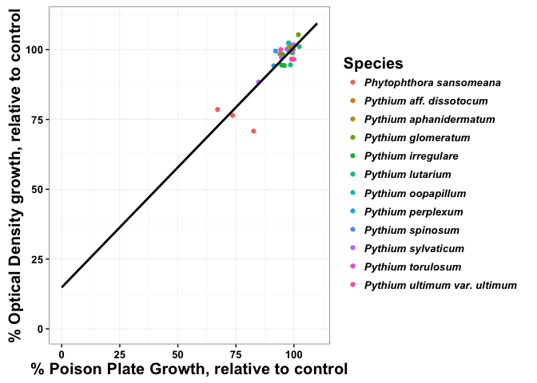
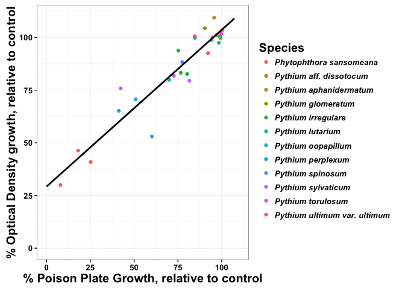
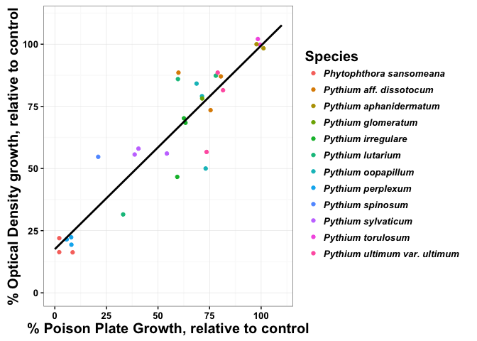
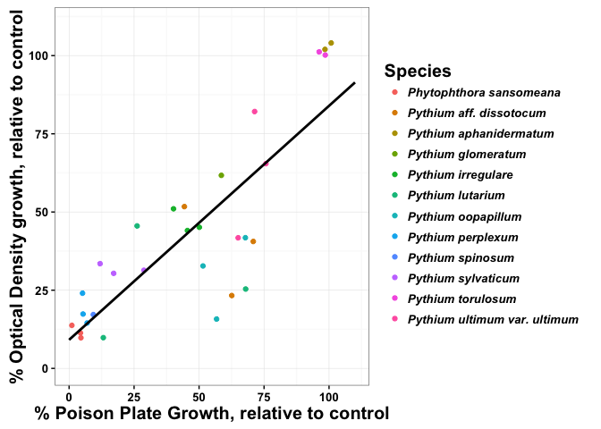
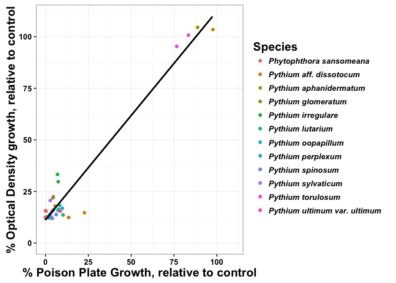
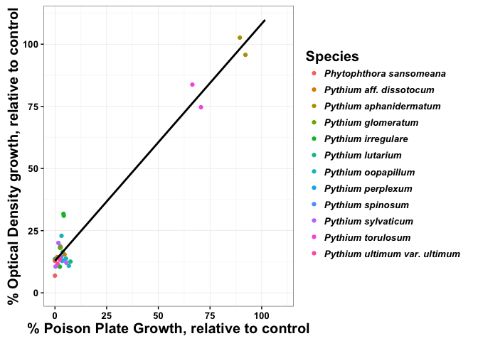
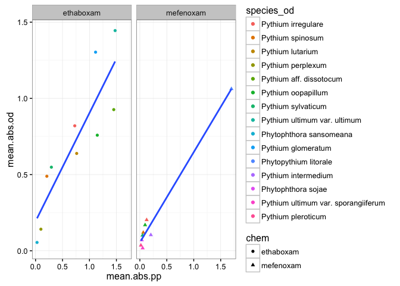

A function to do a t-test to determine if varias values in a linear
model is significantly different than others. Arguments: reg = the
linear model coefnum = 1 = intercept, 2 = beta ... val = value you would
like to test, the default lm tests if value is significantly different
from zero.

This function will run a linear model of the percent relative growth, as
well as correlations in both pearson and spearman and will also plot it
in ggplot, if desired.

data = data.frame concentration = concentration plot = logical

    RelGrowth.lm <- function(data, concentration, plot){
      lin.mod <- lm(data$ppmeanrelgrowth[data$conc == concentration] ~ data$odrelgrowth[data$conc == concentration])
      sum.linmod <- summary(lin.mod)
      pearson <- cor.test(data$ppmeanrelgrowth[data$conc == concentration], 
               data$odrelgrowth[data$conc == concentration], method = "pearson")
      spearman <- cor.test(data$ppmeanrelgrowth[data$conc == concentration], 
               data$odrelgrowth[data$conc == concentration], method = "spearman")
      beta <- ttest(lin.mod, 2, 1) # t-test for Beta significantly different than one
      bias <- (sum.linmod[[4]][2] - 1)*100 #percent Bias
      coeff.var <- (sum.linmod[[4]][4]/sum.linmod[[4]][2])*100

      if(plot == TRUE){
        library(ggplot2)
      p <- ggplot(data[data$conc == concentration,], aes(y = odrelgrowth, x = ppmeanrelgrowth)) +
        geom_point(aes(colour = factor(species))) +
        guides(colour = guide_legend(title = "Species")) +
        scale_y_continuous(limits = c(0, 110), breaks = c(0, 25, 50, 75, 100)) +
        scale_x_continuous(limits = c(0, 110), breaks = c(0, 25, 50, 75, 100)) +
        geom_smooth(method = "lm", se = FALSE, fullrange = TRUE, col = "black") +
        xlab("% Poison Plate Growth, relative to control") + 
        ylab("% Optical Density growth, relative to control") + 
        theme_bw() +
        theme(axis.text.x = element_text(size = 10, face = "bold"),
              axis.text.y = element_text(size = 10, face = "bold"),
              axis.title.x = element_text(size = 15, face = "bold"),
              axis.title.y = element_text(size = 15, face = "bold"),
              legend.text = element_text(size = 10, face = "bold.italic"),
              legend.key = element_blank(),
              legend.title = element_text(size = 15, face="bold"))
      results <- list(sum.linmod, pearson, spearman, beta, bias, coeff.var, p)
      names(results) <- c("lm", "pearson", "spearman", "beta.t", "per.bias","coeff.var", "plot")
      return(results)
      } else {
        results <- list(sum.linmod, pearson, spearman, beta, bias, coeff.var)
        names(results) <- c("lm", "pearson", "spearman", "beta.t", "per.bias", "coeff.var")
        return(results)
      }
    }

We want to look at the correlation of the two methods, poison plate and
optical density, to determine if the optical density method is any good.

Ethaboxam relative growth correlations

    eth.cor.pp <- ddply(cor[cor$chem == "ethaboxam" & cor$method == "poison_plate",], c("is", "species", "conc"), 
          summarize, 
          ppmeanrelgrowth = 100*mean(relgrowth, na.rm = TRUE))
    eth.cor.od <- ddply(cor[cor$chem == "ethaboxam" & cor$method == "optical_density",], c("is", "species", "conc"), 
          summarize, 
          odmeanrelgrowth = 100*mean(relgrowth, na.rm = TRUE))
    eth.cor <- cbind.data.frame(eth.cor.pp, eth.cor.od$odmeanrelgrowth)
    colnames(eth.cor) <- c("is", "species", "conc", "ppmeanrelgrowth", "odrelgrowth")
    eth.001 <- RelGrowth.lm(eth.cor, concentration = 0.01, plot = TRUE)
    eth.001

    ## $lm
    ## 
    ## Call:
    ## lm(formula = data$ppmeanrelgrowth[data$conc == concentration] ~ 
    ##     data$odrelgrowth[data$conc == concentration])
    ## 
    ## Residuals:
    ##      Min       1Q   Median       3Q      Max 
    ## -12.0305  -1.9817   0.2627   1.7828  10.3217 
    ## 
    ## Coefficients:
    ##                                              Estimate Std. Error t value
    ## (Intercept)                                   9.87510    9.10676   1.084
    ## data$odrelgrowth[data$conc == concentration]  0.88127    0.09423   9.353
    ##                                                    Pr(>|t|)    
    ## (Intercept)                                           0.287    
    ## data$odrelgrowth[data$conc == concentration] 0.000000000413 ***
    ## ---
    ## Signif. codes:  0 '***' 0.001 '**' 0.01 '*' 0.05 '.' 0.1 ' ' 1
    ## 
    ## Residual standard error: 4.003 on 28 degrees of freedom
    ## Multiple R-squared:  0.7575, Adjusted R-squared:  0.7489 
    ## F-statistic: 87.47 on 1 and 28 DF,  p-value: 0.0000000004127
    ## 
    ## 
    ## $pearson
    ## 
    ##  Pearson's product-moment correlation
    ## 
    ## data:  data$ppmeanrelgrowth[data$conc == concentration] and data$odrelgrowth[data$conc == concentration]
    ## t = 9.3528, df = 28, p-value = 0.0000000004127
    ## alternative hypothesis: true correlation is not equal to 0
    ## 95 percent confidence interval:
    ##  0.7430963 0.9368618
    ## sample estimates:
    ##       cor 
    ## 0.8703579 
    ## 
    ## 
    ## $spearman
    ## 
    ##  Spearman's rank correlation rho
    ## 
    ## data:  data$ppmeanrelgrowth[data$conc == concentration] and data$odrelgrowth[data$conc == concentration]
    ## S = 1734, p-value = 0.0004029
    ## alternative hypothesis: true rho is not equal to 0
    ## sample estimates:
    ##      rho 
    ## 0.614238 
    ## 
    ## 
    ## $beta.t
    ## [1] 0.2180441
    ## 
    ## $per.bias
    ## [1] -11.87307
    ## 
    ## $coeff.var
    ## [1] 10.69199
    ## 
    ## $plot

<!-- -->

    eth.01 <- RelGrowth.lm(eth.cor, concentration = 0.1, plot = TRUE)
    eth.01

    ## $lm
    ## 
    ## Call:
    ## lm(formula = data$ppmeanrelgrowth[data$conc == concentration] ~ 
    ##     data$odrelgrowth[data$conc == concentration])
    ## 
    ## Residuals:
    ##     Min      1Q  Median      3Q     Max 
    ## -21.889  -7.973   2.162   5.245  23.011 
    ## 
    ## Coefficients:
    ##                                              Estimate Std. Error t value
    ## (Intercept)                                  -25.9061     7.2021  -3.597
    ## data$odrelgrowth[data$conc == concentration]   1.1886     0.0814  14.602
    ##                                                        Pr(>|t|)    
    ## (Intercept)                                             0.00122 ** 
    ## data$odrelgrowth[data$conc == concentration] 0.0000000000000128 ***
    ## ---
    ## Signif. codes:  0 '***' 0.001 '**' 0.01 '*' 0.05 '.' 0.1 ' ' 1
    ## 
    ## Residual standard error: 9.086 on 28 degrees of freedom
    ## Multiple R-squared:  0.8839, Adjusted R-squared:  0.8798 
    ## F-statistic: 213.2 on 1 and 28 DF,  p-value: 0.00000000000001276
    ## 
    ## 
    ## $pearson
    ## 
    ##  Pearson's product-moment correlation
    ## 
    ## data:  data$ppmeanrelgrowth[data$conc == concentration] and data$odrelgrowth[data$conc == concentration]
    ## t = 14.602, df = 28, p-value = 0.00000000000001288
    ## alternative hypothesis: true correlation is not equal to 0
    ## 95 percent confidence interval:
    ##  0.8769341 0.9714102
    ## sample estimates:
    ##       cor 
    ## 0.9401724 
    ## 
    ## 
    ## $spearman
    ## 
    ##  Spearman's rank correlation rho
    ## 
    ## data:  data$ppmeanrelgrowth[data$conc == concentration] and data$odrelgrowth[data$conc == concentration]
    ## S = 606, p-value = 0.0000005663
    ## alternative hypothesis: true rho is not equal to 0
    ## sample estimates:
    ##       rho 
    ## 0.8651835 
    ## 
    ## 
    ## $beta.t
    ## [1] 0.02804733
    ## 
    ## $per.bias
    ## [1] 18.85864
    ## 
    ## $coeff.var
    ## [1] 6.848325
    ## 
    ## $plot

    ## Warning: Removed 2 rows containing missing values (geom_smooth).

<!-- -->

    eth.05 <- RelGrowth.lm(eth.cor, concentration = 0.5, plot = TRUE)
    eth.05

    ## $lm
    ## 
    ## Call:
    ## lm(formula = data$ppmeanrelgrowth[data$conc == concentration] ~ 
    ##     data$odrelgrowth[data$conc == concentration])
    ## 
    ## Residuals:
    ##      Min       1Q   Median       3Q      Max 
    ## -25.9634  -6.6009  -0.1541   5.9694  30.9924 
    ## 
    ## Coefficients:
    ##                                              Estimate Std. Error t value
    ## (Intercept)                                  -9.53909    5.75551  -1.657
    ## data$odrelgrowth[data$conc == concentration]  1.03313    0.08329  12.404
    ##                                                      Pr(>|t|)    
    ## (Intercept)                                             0.109    
    ## data$odrelgrowth[data$conc == concentration] 0.00000000000068 ***
    ## ---
    ## Signif. codes:  0 '***' 0.001 '**' 0.01 '*' 0.05 '.' 0.1 ' ' 1
    ## 
    ## Residual standard error: 12.62 on 28 degrees of freedom
    ## Multiple R-squared:  0.846,  Adjusted R-squared:  0.8405 
    ## F-statistic: 153.9 on 1 and 28 DF,  p-value: 0.0000000000006796
    ## 
    ## 
    ## $pearson
    ## 
    ##  Pearson's product-moment correlation
    ## 
    ## data:  data$ppmeanrelgrowth[data$conc == concentration] and data$odrelgrowth[data$conc == concentration]
    ## t = 12.404, df = 28, p-value = 0.0000000000006795
    ## alternative hypothesis: true correlation is not equal to 0
    ## 95 percent confidence interval:
    ##  0.8368378 0.9614634
    ## sample estimates:
    ##       cor 
    ## 0.9197995 
    ## 
    ## 
    ## $spearman
    ## 
    ##  Spearman's rank correlation rho
    ## 
    ## data:  data$ppmeanrelgrowth[data$conc == concentration] and data$odrelgrowth[data$conc == concentration]
    ## S = 586, p-value = 0.0000005246
    ## alternative hypothesis: true rho is not equal to 0
    ## sample estimates:
    ##       rho 
    ## 0.8696329 
    ## 
    ## 
    ## $beta.t
    ## [1] 0.6937975
    ## 
    ## $per.bias
    ## [1] 3.313298
    ## 
    ## $coeff.var
    ## [1] 8.062027
    ## 
    ## $plot

<!-- -->

    eth.1 <- RelGrowth.lm(eth.cor, concentration = 1, plot = TRUE)
    eth.1

    ## $lm
    ## 
    ## Call:
    ## lm(formula = data$ppmeanrelgrowth[data$conc == concentration] ~ 
    ##     data$odrelgrowth[data$conc == concentration])
    ## 
    ## Residuals:
    ##    Min     1Q Median     3Q    Max 
    ## -24.60 -12.24  -3.15   8.12  38.86 
    ## 
    ## Coefficients:
    ##                                              Estimate Std. Error t value
    ## (Intercept)                                    5.7876     6.0603   0.955
    ## data$odrelgrowth[data$conc == concentration]   0.9177     0.1172   7.832
    ##                                                  Pr(>|t|)    
    ## (Intercept)                                         0.348    
    ## data$odrelgrowth[data$conc == concentration] 0.0000000157 ***
    ## ---
    ## Signif. codes:  0 '***' 0.001 '**' 0.01 '*' 0.05 '.' 0.1 ' ' 1
    ## 
    ## Residual standard error: 18.49 on 28 degrees of freedom
    ## Multiple R-squared:  0.6866, Adjusted R-squared:  0.6754 
    ## F-statistic: 61.34 on 1 and 28 DF,  p-value: 0.00000001569
    ## 
    ## 
    ## $pearson
    ## 
    ##  Pearson's product-moment correlation
    ## 
    ## data:  data$ppmeanrelgrowth[data$conc == concentration] and data$odrelgrowth[data$conc == concentration]
    ## t = 7.8318, df = 28, p-value = 0.00000001569
    ## alternative hypothesis: true correlation is not equal to 0
    ## 95 percent confidence interval:
    ##  0.6676330 0.9155582
    ## sample estimates:
    ##       cor 
    ## 0.8286008 
    ## 
    ## 
    ## $spearman
    ## 
    ##  Spearman's rank correlation rho
    ## 
    ## data:  data$ppmeanrelgrowth[data$conc == concentration] and data$odrelgrowth[data$conc == concentration]
    ## S = 1004, p-value = 0.000001908
    ## alternative hypothesis: true rho is not equal to 0
    ## sample estimates:
    ##       rho 
    ## 0.7766407 
    ## 
    ## 
    ## $beta.t
    ## [1] 0.4884646
    ## 
    ## $per.bias
    ## [1] -8.226295
    ## 
    ## $coeff.var
    ## [1] 12.76849
    ## 
    ## $plot

<!-- -->

    eth.5 <- RelGrowth.lm(eth.cor, concentration = 5, plot = TRUE)

    ## Warning in cor.test.default(data$ppmeanrelgrowth[data$conc ==
    ## concentration], : Cannot compute exact p-value with ties

    eth.5

    ## $lm
    ## 
    ## Call:
    ## lm(formula = data$ppmeanrelgrowth[data$conc == concentration] ~ 
    ##     data$odrelgrowth[data$conc == concentration])
    ## 
    ## Residuals:
    ##      Min       1Q   Median       3Q      Max 
    ## -14.5090  -2.7679  -0.7679   2.4037  18.6542 
    ## 
    ## Coefficients:
    ##                                              Estimate Std. Error t value
    ## (Intercept)                                  -9.70995    1.67512  -5.797
    ## data$odrelgrowth[data$conc == concentration]  0.93803    0.04154  22.579
    ##                                                          Pr(>|t|)    
    ## (Intercept)                                            0.00000317 ***
    ## data$odrelgrowth[data$conc == concentration] < 0.0000000000000002 ***
    ## ---
    ## Signif. codes:  0 '***' 0.001 '**' 0.01 '*' 0.05 '.' 0.1 ' ' 1
    ## 
    ## Residual standard error: 6.622 on 28 degrees of freedom
    ## Multiple R-squared:  0.9479, Adjusted R-squared:  0.9461 
    ## F-statistic: 509.8 on 1 and 28 DF,  p-value: < 0.00000000000000022
    ## 
    ## 
    ## $pearson
    ## 
    ##  Pearson's product-moment correlation
    ## 
    ## data:  data$ppmeanrelgrowth[data$conc == concentration] and data$odrelgrowth[data$conc == concentration]
    ## t = 22.579, df = 28, p-value < 0.00000000000000022
    ## alternative hypothesis: true correlation is not equal to 0
    ## 95 percent confidence interval:
    ##  0.9447310 0.9875068
    ## sample estimates:
    ##      cor 
    ## 0.973621 
    ## 
    ## 
    ## $spearman
    ## 
    ##  Spearman's rank correlation rho
    ## 
    ## data:  data$ppmeanrelgrowth[data$conc == concentration] and data$odrelgrowth[data$conc == concentration]
    ## S = 2067.7, p-value = 0.00207
    ## alternative hypothesis: true rho is not equal to 0
    ## sample estimates:
    ##       rho 
    ## 0.5399933 
    ## 
    ## 
    ## $beta.t
    ## [1] 0.146986
    ## 
    ## $per.bias
    ## [1] -6.196723
    ## 
    ## $coeff.var
    ## [1] 4.428861
    ## 
    ## $plot

    ## Warning: Removed 9 rows containing missing values (geom_smooth).

<!-- -->

    eth.20 <- RelGrowth.lm(eth.cor, concentration = 20, plot = TRUE)

    ## Warning in cor.test.default(data$ppmeanrelgrowth[data$conc ==
    ## concentration], : Cannot compute exact p-value with ties

    eth.20

    ## $lm
    ## 
    ## Call:
    ## lm(formula = data$ppmeanrelgrowth[data$conc == concentration] ~ 
    ##     data$odrelgrowth[data$conc == concentration])
    ## 
    ## Residuals:
    ##     Min      1Q  Median      3Q     Max 
    ## -15.383  -2.803   0.611   3.599   8.722 
    ## 
    ## Coefficients:
    ##                                              Estimate Std. Error t value
    ## (Intercept)                                  -12.2340     1.5216   -8.04
    ## data$odrelgrowth[data$conc == concentration]   0.9993     0.0420   23.79
    ##                                                          Pr(>|t|)    
    ## (Intercept)                                         0.00000000936 ***
    ## data$odrelgrowth[data$conc == concentration] < 0.0000000000000002 ***
    ## ---
    ## Signif. codes:  0 '***' 0.001 '**' 0.01 '*' 0.05 '.' 0.1 ' ' 1
    ## 
    ## Residual standard error: 5.954 on 28 degrees of freedom
    ## Multiple R-squared:  0.9529, Adjusted R-squared:  0.9512 
    ## F-statistic: 566.2 on 1 and 28 DF,  p-value: < 0.00000000000000022
    ## 
    ## 
    ## $pearson
    ## 
    ##  Pearson's product-moment correlation
    ## 
    ## data:  data$ppmeanrelgrowth[data$conc == concentration] and data$odrelgrowth[data$conc == concentration]
    ## t = 23.794, df = 28, p-value < 0.00000000000000022
    ## alternative hypothesis: true correlation is not equal to 0
    ## 95 percent confidence interval:
    ##  0.9499662 0.9887137
    ## sample estimates:
    ##       cor 
    ## 0.9761532 
    ## 
    ## 
    ## $spearman
    ## 
    ##  Spearman's rank correlation rho
    ## 
    ## data:  data$ppmeanrelgrowth[data$conc == concentration] and data$odrelgrowth[data$conc == concentration]
    ## S = 2402.7, p-value = 0.009538
    ## alternative hypothesis: true rho is not equal to 0
    ## sample estimates:
    ##       rho 
    ## 0.4654791 
    ## 
    ## 
    ## $beta.t
    ## [1] 0.9862368
    ## 
    ## $per.bias
    ## [1] -0.0730954
    ## 
    ## $coeff.var
    ## [1] 4.202696
    ## 
    ## $plot

    ## Warning: Removed 6 rows containing missing values (geom_smooth).

<!-- -->

Mefenoxam relative growth correlations

    mef.cor.pp <- ddply(cor[cor$chem == "mefenoxam" & cor$method == "poison_plate",], c("is", "species", "conc"), 
          summarize, 
          ppmeanrelgrowth = 100*mean(relgrowth, na.rm = TRUE))
    mef.cor.od <- ddply(cor[cor$chem == "mefenoxam" & cor$method == "optical_density",], c("is", "species", "conc"), 
          summarize, 
          odmeanrelgrowth = 100*mean(relgrowth, na.rm = TRUE))
    mef.cor.od <- mef.cor.od[!mef.cor.od$conc == 100,]
    mef.cor.pp <- mef.cor.pp[!mef.cor.pp$conc == 100,]
    mef.cor <- cbind.data.frame(mef.cor.pp, mef.cor.od$odmeanrelgrowth)
    colnames(mef.cor) <- c("is", "species", "conc", "ppmeanrelgrowth", "odrelgrowth")
    mef.001 <- RelGrowth.lm(mef.cor, concentration = 0.01, plot = TRUE)
    mef.001

    ## $lm
    ## 
    ## Call:
    ## lm(formula = data$ppmeanrelgrowth[data$conc == concentration] ~ 
    ##     data$odrelgrowth[data$conc == concentration])
    ## 
    ## Residuals:
    ##      Min       1Q   Median       3Q      Max 
    ## -19.7226  -2.4279   0.2544   4.7137  11.5604 
    ## 
    ## Coefficients:
    ##                                              Estimate Std. Error t value
    ## (Intercept)                                  52.53813    8.14792   6.448
    ## data$odrelgrowth[data$conc == concentration]  0.40612    0.08881   4.573
    ##                                                Pr(>|t|)    
    ## (Intercept)                                  0.00000217 ***
    ## data$odrelgrowth[data$conc == concentration]   0.000165 ***
    ## ---
    ## Signif. codes:  0 '***' 0.001 '**' 0.01 '*' 0.05 '.' 0.1 ' ' 1
    ## 
    ## Residual standard error: 7.191 on 21 degrees of freedom
    ## Multiple R-squared:  0.4989, Adjusted R-squared:  0.4751 
    ## F-statistic: 20.91 on 1 and 21 DF,  p-value: 0.0001652
    ## 
    ## 
    ## $pearson
    ## 
    ##  Pearson's product-moment correlation
    ## 
    ## data:  data$ppmeanrelgrowth[data$conc == concentration] and data$odrelgrowth[data$conc == concentration]
    ## t = 4.5729, df = 21, p-value = 0.0001652
    ## alternative hypothesis: true correlation is not equal to 0
    ## 95 percent confidence interval:
    ##  0.4149891 0.8663221
    ## sample estimates:
    ##       cor 
    ## 0.7063615 
    ## 
    ## 
    ## $spearman
    ## 
    ##  Spearman's rank correlation rho
    ## 
    ## data:  data$ppmeanrelgrowth[data$conc == concentration] and data$odrelgrowth[data$conc == concentration]
    ## S = 628, p-value = 0.000388
    ## alternative hypothesis: true rho is not equal to 0
    ## sample estimates:
    ##       rho 
    ## 0.6897233 
    ## 
    ## 
    ## $beta.t
    ## [1] 0.00000128355
    ## 
    ## $per.bias
    ## [1] -59.38804
    ## 
    ## $coeff.var
    ## [1] 21.86781
    ## 
    ## $plot

    ## Warning: Removed 2 rows containing non-finite values (stat_smooth).

    ## Warning: Removed 2 rows containing missing values (geom_point).

    ## Warning: Removed 17 rows containing missing values (geom_smooth).

<!-- -->

    mef.01 <- RelGrowth.lm(mef.cor, concentration = 0.1, plot = TRUE)
    mef.01

    ## $lm
    ## 
    ## Call:
    ## lm(formula = data$ppmeanrelgrowth[data$conc == concentration] ~ 
    ##     data$odrelgrowth[data$conc == concentration])
    ## 
    ## Residuals:
    ##      Min       1Q   Median       3Q      Max 
    ## -30.4901  -9.9562   0.6523   9.6580  28.9574 
    ## 
    ## Coefficients:
    ##                                              Estimate Std. Error t value
    ## (Intercept)                                   -6.2375     7.1482  -0.873
    ## data$odrelgrowth[data$conc == concentration]   0.9262     0.1184   7.825
    ##                                                 Pr(>|t|)    
    ## (Intercept)                                        0.393    
    ## data$odrelgrowth[data$conc == concentration] 0.000000117 ***
    ## ---
    ## Signif. codes:  0 '***' 0.001 '**' 0.01 '*' 0.05 '.' 0.1 ' ' 1
    ## 
    ## Residual standard error: 15.31 on 21 degrees of freedom
    ## Multiple R-squared:  0.7446, Adjusted R-squared:  0.7325 
    ## F-statistic: 61.23 on 1 and 21 DF,  p-value: 0.0000001171
    ## 
    ## 
    ## $pearson
    ## 
    ##  Pearson's product-moment correlation
    ## 
    ## data:  data$ppmeanrelgrowth[data$conc == concentration] and data$odrelgrowth[data$conc == concentration]
    ## t = 7.8253, df = 21, p-value = 0.0000001171
    ## alternative hypothesis: true correlation is not equal to 0
    ## 95 percent confidence interval:
    ##  0.6995462 0.9405659
    ## sample estimates:
    ##       cor 
    ## 0.8629212 
    ## 
    ## 
    ## $spearman
    ## 
    ##  Spearman's rank correlation rho
    ## 
    ## data:  data$ppmeanrelgrowth[data$conc == concentration] and data$odrelgrowth[data$conc == concentration]
    ## S = 406, p-value = 0.000006679
    ## alternative hypothesis: true rho is not equal to 0
    ## sample estimates:
    ##       rho 
    ## 0.7994071 
    ## 
    ## 
    ## $beta.t
    ## [1] 0.5398335
    ## 
    ## $per.bias
    ## [1] -7.377004
    ## 
    ## $coeff.var
    ## [1] 12.77914
    ## 
    ## $plot

    ## Warning: Removed 1 rows containing non-finite values (stat_smooth).

    ## Warning: Removed 1 rows containing missing values (geom_point).

<!-- -->

    mef.05 <- RelGrowth.lm(mef.cor, concentration = 0.5, plot = TRUE)

    ## Warning in cor.test.default(data$ppmeanrelgrowth[data$conc ==
    ## concentration], : Cannot compute exact p-value with ties

    mef.05

    ## $lm
    ## 
    ## Call:
    ## lm(formula = data$ppmeanrelgrowth[data$conc == concentration] ~ 
    ##     data$odrelgrowth[data$conc == concentration])
    ## 
    ## Residuals:
    ##     Min      1Q  Median      3Q     Max 
    ## -18.970  -6.336  -3.075   5.887  23.732 
    ## 
    ## Coefficients:
    ##                                              Estimate Std. Error t value
    ## (Intercept)                                  -1.24754    3.25583  -0.383
    ## data$odrelgrowth[data$conc == concentration]  1.03001    0.08439  12.205
    ##                                                     Pr(>|t|)    
    ## (Intercept)                                            0.705    
    ## data$odrelgrowth[data$conc == concentration] 0.0000000000532 ***
    ## ---
    ## Signif. codes:  0 '***' 0.001 '**' 0.01 '*' 0.05 '.' 0.1 ' ' 1
    ## 
    ## Residual standard error: 11.17 on 21 degrees of freedom
    ## Multiple R-squared:  0.8764, Adjusted R-squared:  0.8706 
    ## F-statistic:   149 on 1 and 21 DF,  p-value: 0.00000000005324
    ## 
    ## 
    ## $pearson
    ## 
    ##  Pearson's product-moment correlation
    ## 
    ## data:  data$ppmeanrelgrowth[data$conc == concentration] and data$odrelgrowth[data$conc == concentration]
    ## t = 12.205, df = 21, p-value = 0.00000000005324
    ## alternative hypothesis: true correlation is not equal to 0
    ## 95 percent confidence interval:
    ##  0.8532511 0.9729345
    ## sample estimates:
    ##       cor 
    ## 0.9361856 
    ## 
    ## 
    ## $spearman
    ## 
    ##  Spearman's rank correlation rho
    ## 
    ## data:  data$ppmeanrelgrowth[data$conc == concentration] and data$odrelgrowth[data$conc == concentration]
    ## S = 654.61, p-value = 0.0003928
    ## alternative hypothesis: true rho is not equal to 0
    ## sample estimates:
    ##       rho 
    ## 0.6765746 
    ## 
    ## 
    ## $beta.t
    ## [1] 0.7257129
    ## 
    ## $per.bias
    ## [1] 3.000686
    ## 
    ## $coeff.var
    ## [1] 8.193344
    ## 
    ## $plot

<!-- -->

    mef.1 <- RelGrowth.lm(mef.cor, concentration = 1, plot = TRUE)

    ## Warning in cor.test.default(data$ppmeanrelgrowth[data$conc ==
    ## concentration], : Cannot compute exact p-value with ties

    mef.1

    ## $lm
    ## 
    ## Call:
    ## lm(formula = data$ppmeanrelgrowth[data$conc == concentration] ~ 
    ##     data$odrelgrowth[data$conc == concentration])
    ## 
    ## Residuals:
    ##      Min       1Q   Median       3Q      Max 
    ## -18.2073  -5.1524  -0.6551   6.1889  16.6888 
    ## 
    ## Coefficients:
    ##                                              Estimate Std. Error t value
    ## (Intercept)                                  -2.75342    2.41411  -1.141
    ## data$odrelgrowth[data$conc == concentration]  0.95967    0.06523  14.711
    ##                                                      Pr(>|t|)    
    ## (Intercept)                                             0.267    
    ## data$odrelgrowth[data$conc == concentration] 0.00000000000156 ***
    ## ---
    ## Signif. codes:  0 '***' 0.001 '**' 0.01 '*' 0.05 '.' 0.1 ' ' 1
    ## 
    ## Residual standard error: 8.912 on 21 degrees of freedom
    ## Multiple R-squared:  0.9115, Adjusted R-squared:  0.9073 
    ## F-statistic: 216.4 on 1 and 21 DF,  p-value: 0.000000000001565
    ## 
    ## 
    ## $pearson
    ## 
    ##  Pearson's product-moment correlation
    ## 
    ## data:  data$ppmeanrelgrowth[data$conc == concentration] and data$odrelgrowth[data$conc == concentration]
    ## t = 14.711, df = 21, p-value = 0.000000000001565
    ## alternative hypothesis: true correlation is not equal to 0
    ## 95 percent confidence interval:
    ##  0.8946287 0.9809135
    ## sample estimates:
    ##       cor 
    ## 0.9547498 
    ## 
    ## 
    ## $spearman
    ## 
    ##  Spearman's rank correlation rho
    ## 
    ## data:  data$ppmeanrelgrowth[data$conc == concentration] and data$odrelgrowth[data$conc == concentration]
    ## S = 769.79, p-value = 0.001613
    ## alternative hypothesis: true rho is not equal to 0
    ## sample estimates:
    ##     rho 
    ## 0.61967 
    ## 
    ## 
    ## $beta.t
    ## [1] 0.5430472
    ## 
    ## $per.bias
    ## [1] -4.033238
    ## 
    ## $coeff.var
    ## [1] 6.797615
    ## 
    ## $plot

<!-- -->

    mef.10 <- RelGrowth.lm(mef.cor, concentration = 10, plot = TRUE)

    ## Warning in cor.test.default(data$ppmeanrelgrowth[data$conc ==
    ## concentration], : Cannot compute exact p-value with ties

    mef.10

    ## $lm
    ## 
    ## Call:
    ## lm(formula = data$ppmeanrelgrowth[data$conc == concentration] ~ 
    ##     data$odrelgrowth[data$conc == concentration])
    ## 
    ## Residuals:
    ##     Min      1Q  Median      3Q     Max 
    ## -15.708  -3.826   1.015   4.699  14.033 
    ## 
    ## Coefficients:
    ##                                              Estimate Std. Error t value
    ## (Intercept)                                  -3.32081    2.01807  -1.646
    ## data$odrelgrowth[data$conc == concentration]  0.92239    0.05793  15.923
    ##                                                       Pr(>|t|)    
    ## (Intercept)                                              0.115    
    ## data$odrelgrowth[data$conc == concentration] 0.000000000000338 ***
    ## ---
    ## Signif. codes:  0 '***' 0.001 '**' 0.01 '*' 0.05 '.' 0.1 ' ' 1
    ## 
    ## Residual standard error: 7.963 on 21 degrees of freedom
    ## Multiple R-squared:  0.9235, Adjusted R-squared:  0.9199 
    ## F-statistic: 253.6 on 1 and 21 DF,  p-value: 0.0000000000003381
    ## 
    ## 
    ## $pearson
    ## 
    ##  Pearson's product-moment correlation
    ## 
    ## data:  data$ppmeanrelgrowth[data$conc == concentration] and data$odrelgrowth[data$conc == concentration]
    ## t = 15.923, df = 21, p-value = 0.000000000000338
    ## alternative hypothesis: true correlation is not equal to 0
    ## 95 percent confidence interval:
    ##  0.9087863 0.9835784
    ## sample estimates:
    ##       cor 
    ## 0.9609959 
    ## 
    ## 
    ## $spearman
    ## 
    ##  Spearman's rank correlation rho
    ## 
    ## data:  data$ppmeanrelgrowth[data$conc == concentration] and data$odrelgrowth[data$conc == concentration]
    ## S = 828.94, p-value = 0.003016
    ## alternative hypothesis: true rho is not equal to 0
    ## sample estimates:
    ##       rho 
    ## 0.5904454 
    ## 
    ## 
    ## $beta.t
    ## [1] 0.1946402
    ## 
    ## $per.bias
    ## [1] -7.760812
    ## 
    ## $coeff.var
    ## [1] 6.280042
    ## 
    ## $plot

    ## Warning: Removed 1 rows containing non-finite values (stat_smooth).

    ## Warning: Removed 1 rows containing missing values (geom_point).

<!-- -->

This code iterates through every isolate and generates a relative and
absolute EC50 using the LL.4 model of drc and saves the output. I
already went through and picked out the isolates for both mefenoxam and
ethaboxam that have an EC50 beyond the concentration range tested in
this study.

    # briefly we are going to split up the data frame into each concentration to make it easier to take out individual isolates
    cor_eth <- cor[cor$chem == "ethaboxam",]
    cor_mef <- cor[cor$chem == "mefenoxam",]

    # taking out insensitive isolates, otherwise convergence would not occur with the ll.4 model
    insens_iso_eth <- c("MISO_8-29.1", "C-MNSO2_2-21", "NDSO_L-8-6", "ILSO_6-15C")
    insens_iso_mef <- c("V-MISO2_6-46", "23.4B", "1.18A")

    cor_eth <- cor_eth[!cor_eth$is %in% insens_iso_eth,]
    cor_mef <- cor_mef[!cor_mef$is %in% insens_iso_mef,]
    cor_eth$is <- factor(cor_eth$is)
    cor_mef$is <- factor(cor_mef$is)

    cor <- rbind.data.frame(cor_eth, cor_mef)

    relative <- function(data){
      EC50.pp.rel <- data.frame(ED(data, 
                                 respLev = c(50), 
                                 type = "relative",
                                 interval = "delta"),
                              level = 0.95)
    rel.ec50.pp <- EC50.pp.rel[1][[1]]
    return(rel.ec50.pp)
    }
    absolute <- function(data){
      EC50.pp.abs <- data.frame(ED(data, 
                                 respLev = c(50), 
                                 type = "absolute",
                                 interval = "delta"),
                              level = 0.95)
    abs.ec50.pp <- EC50.pp.abs[1][[1]]
    return(abs.ec50.pp)
    }
    plug_EC <- function(chemistry){
      nm <- unique(cor$is[cor$chem == as.character(chemistry)])
    dataframe_names <- c("is", "species", "method", "trial", "chem", "absolute", "relative")
    meth.cor <- NULL
    for (i in seq_along(nm)){
    mefcor.pp.drc <- drm(100*relgrowth ~ conc, data = cor[cor$is == nm[[i]] & cor$method == "poison_plate" & cor$chem == as.character(chemistry),], curveid = trial, fct = LL.4(), na.action = na.omit)
    mefcor.od.drc <- drm(100*relgrowth ~ conc, data = cor[cor$is == nm[[i]] & cor$method == "optical_density" & cor$chem == as.character(chemistry),], curveid = trial, fct = LL.4(), na.action = na.omit)
    paste(print(nm[[i]]))
    # RELATIVE 
    rel.pp.mef <- relative(mefcor.pp.drc)
    rel.od.mef <- relative(mefcor.od.drc)

    # ABSOLUTE 
    abs.pp.mef <- absolute(mefcor.pp.drc)
    abs.od.mef <- absolute(mefcor.od.drc)

    mef.cor_od <- data.frame(cbind.data.frame( 
                      nm[[i]], 
                      as.character(unique(cor$species[cor$is == nm[[i]]])),
                      as.character(unique(cor$method[cor$is == nm[[i]] & cor$method == "optical_density"])),
                      unique(cor$trial[cor$is == nm[[i]] & cor$method == "optical_density"]),
                      as.character(chemistry),
                      as.numeric(abs.od.mef),
                      as.numeric(rel.od.mef)))
    colnames(mef.cor_od) <- dataframe_names
    mef.cor_pp <- data.frame(cbind.data.frame( 
                      nm[[i]], 
                      as.character(unique(cor$species[cor$is == nm[[i]]])),
                      as.character(unique(cor$method[cor$is == nm[[i]] & cor$method == "poison_plate"])),
                      unique(cor$trial[cor$is == nm[[i]] & cor$method == "poison_plate"]),
                      as.character(chemistry),
                      as.numeric(abs.pp.mef),
                      as.numeric(rel.pp.mef)))
    colnames(mef.cor_pp) <- dataframe_names

    meth.cor <- rbind.data.frame(meth.cor, mef.cor_od, mef.cor_pp)
      }
    return(meth.cor)
    }

    mefenoxam_ec50 <- plug_EC("mefenoxam")
    ethaboxam_ec50 <- plug_EC("ethaboxam")

    ec50_cor <- rbind.data.frame(ethaboxam_ec50, mefenoxam_ec50)

    # not sure why one of the isolates had duplicates but they did, so this code will find duplicates in the absolute ec50s and delete the entire row. 
    ec50_cor <- ec50_cor[-which(duplicated(ec50_cor$absolute)),] 

Table of EC50 values for every isolate tested for both mefenoxam and
ethaboxam on both poison plate and optical density method.

<table>
<thead>
<tr class="header">
<th align="left">is</th>
<th align="left">species</th>
<th align="left">chem</th>
<th align="left">method</th>
<th align="right">mean.abs</th>
<th align="right">std.abs</th>
<th align="right">mean.rel</th>
<th align="right">std.rel</th>
</tr>
</thead>
<tbody>
<tr class="odd">
<td align="left">AR_127.S.2.3.A</td>
<td align="left">Pythium irregulare</td>
<td align="left">ethaboxam</td>
<td align="left">optical_density</td>
<td align="right">0.6017397</td>
<td align="right">0.4608413</td>
<td align="right">0.3258476</td>
<td align="right">0.2118367</td>
</tr>
<tr class="even">
<td align="left">AR_127.S.2.3.A</td>
<td align="left">Pythium irregulare</td>
<td align="left">ethaboxam</td>
<td align="left">poison_plate</td>
<td align="right">0.6474189</td>
<td align="right">0.0242181</td>
<td align="right">0.7462384</td>
<td align="right">0.1600082</td>
</tr>
<tr class="odd">
<td align="left">AR_127.S.2.3.A</td>
<td align="left">Pythium irregulare</td>
<td align="left">mefenoxam</td>
<td align="left">optical_density</td>
<td align="right">0.1831292</td>
<td align="right">0.0722302</td>
<td align="right">0.1036954</td>
<td align="right">0.0178995</td>
</tr>
<tr class="even">
<td align="left">AR_127.S.2.3.A</td>
<td align="left">Pythium irregulare</td>
<td align="left">mefenoxam</td>
<td align="left">poison_plate</td>
<td align="right">0.1259046</td>
<td align="right">0.0503855</td>
<td align="right">0.1228201</td>
<td align="right">0.0557412</td>
</tr>
<tr class="odd">
<td align="left">AR_262.S.1.6.A</td>
<td align="left">Pythium aphanidermatum</td>
<td align="left">ethaboxam</td>
<td align="left">optical_density</td>
<td align="right">0.4890281</td>
<td align="right">0.0532135</td>
<td align="right">0.4472674</td>
<td align="right">0.0672784</td>
</tr>
<tr class="even">
<td align="left">AR_262.S.1.6.A</td>
<td align="left">Pythium aphanidermatum</td>
<td align="left">ethaboxam</td>
<td align="left">poison_plate</td>
<td align="right">0.2093399</td>
<td align="right">0.0147487</td>
<td align="right">0.1991737</td>
<td align="right">0.0172343</td>
</tr>
<tr class="odd">
<td align="left">ARS_284.S1.4.A</td>
<td align="left">Pythium lutarium</td>
<td align="left">ethaboxam</td>
<td align="left">optical_density</td>
<td align="right">0.2669444</td>
<td align="right">0.0983561</td>
<td align="right">0.2488793</td>
<td align="right">0.0977931</td>
</tr>
<tr class="even">
<td align="left">ARS_284.S1.4.A</td>
<td align="left">Pythium lutarium</td>
<td align="left">ethaboxam</td>
<td align="left">poison_plate</td>
<td align="right">0.2260918</td>
<td align="right">0.0293079</td>
<td align="right">0.1949081</td>
<td align="right">0.0054857</td>
</tr>
<tr class="odd">
<td align="left">C-NDSO2_1-11</td>
<td align="left">Pythium perplexum</td>
<td align="left">ethaboxam</td>
<td align="left">optical_density</td>
<td align="right">0.1673536</td>
<td align="right">0.0045666</td>
<td align="right">0.1324687</td>
<td align="right">0.0026915</td>
</tr>
<tr class="even">
<td align="left">C-NDSO2_1-11</td>
<td align="left">Pythium perplexum</td>
<td align="left">ethaboxam</td>
<td align="left">poison_plate</td>
<td align="right">0.0983410</td>
<td align="right">0.0112713</td>
<td align="right">0.0977276</td>
<td align="right">0.0100928</td>
</tr>
<tr class="odd">
<td align="left">IASO_10-37.8RT</td>
<td align="left">Pythium aff. dissotocum</td>
<td align="left">ethaboxam</td>
<td align="left">optical_density</td>
<td align="right">1.1413192</td>
<td align="right">0.3019554</td>
<td align="right">1.0115718</td>
<td align="right">0.2570090</td>
</tr>
<tr class="even">
<td align="left">IASO_10-37.8RT</td>
<td align="left">Pythium aff. dissotocum</td>
<td align="left">ethaboxam</td>
<td align="left">poison_plate</td>
<td align="right">1.0220161</td>
<td align="right">0.6068654</td>
<td align="right">1.0072584</td>
<td align="right">0.5928676</td>
</tr>
<tr class="odd">
<td align="left">IASO_10-38.14RT</td>
<td align="left">Pythium aff. dissotocum</td>
<td align="left">ethaboxam</td>
<td align="left">optical_density</td>
<td align="right">1.0125252</td>
<td align="right">0.2669542</td>
<td align="right">0.9121016</td>
<td align="right">0.1950198</td>
</tr>
<tr class="even">
<td align="left">IASO_10-38.14RT</td>
<td align="left">Pythium aff. dissotocum</td>
<td align="left">ethaboxam</td>
<td align="left">poison_plate</td>
<td align="right">1.7250786</td>
<td align="right">0.2861206</td>
<td align="right">1.8877662</td>
<td align="right">0.3800344</td>
</tr>
<tr class="odd">
<td align="left">IASO_10-39.16rt</td>
<td align="left">Pythium aff. dissotocum</td>
<td align="left">ethaboxam</td>
<td align="left">optical_density</td>
<td align="right">0.6248467</td>
<td align="right">0.0759800</td>
<td align="right">0.5562301</td>
<td align="right">0.0206426</td>
</tr>
<tr class="even">
<td align="left">IASO_10-39.16rt</td>
<td align="left">Pythium aff. dissotocum</td>
<td align="left">ethaboxam</td>
<td align="left">poison_plate</td>
<td align="right">1.6056028</td>
<td align="right">0.1531086</td>
<td align="right">1.7370847</td>
<td align="right">0.1606027</td>
</tr>
<tr class="odd">
<td align="left">IASO_6-10.15h</td>
<td align="left">Pythium oopapillum</td>
<td align="left">ethaboxam</td>
<td align="left">optical_density</td>
<td align="right">0.5136203</td>
<td align="right">0.0286944</td>
<td align="right">0.4836774</td>
<td align="right">0.0102900</td>
</tr>
<tr class="even">
<td align="left">IASO_6-10.15h</td>
<td align="left">Pythium oopapillum</td>
<td align="left">ethaboxam</td>
<td align="left">poison_plate</td>
<td align="right">1.1130479</td>
<td align="right">0.2173577</td>
<td align="right">1.0919763</td>
<td align="right">0.2239991</td>
</tr>
<tr class="odd">
<td align="left">ILSO_1-31</td>
<td align="left">Pythium irregulare</td>
<td align="left">ethaboxam</td>
<td align="left">optical_density</td>
<td align="right">0.8616940</td>
<td align="right">0.1247902</td>
<td align="right">0.8372427</td>
<td align="right">0.0556342</td>
</tr>
<tr class="even">
<td align="left">ILSO_1-31</td>
<td align="left">Pythium irregulare</td>
<td align="left">ethaboxam</td>
<td align="left">poison_plate</td>
<td align="right">0.8058171</td>
<td align="right">0.0387544</td>
<td align="right">1.0671747</td>
<td align="right">0.0765512</td>
</tr>
<tr class="odd">
<td align="left">ILSO_3-48C</td>
<td align="left">Pythium irregulare</td>
<td align="left">ethaboxam</td>
<td align="left">optical_density</td>
<td align="right">0.9968918</td>
<td align="right">0.2276545</td>
<td align="right">0.5450930</td>
<td align="right">0.1574642</td>
</tr>
<tr class="even">
<td align="left">ILSO_3-48C</td>
<td align="left">Pythium irregulare</td>
<td align="left">ethaboxam</td>
<td align="left">poison_plate</td>
<td align="right">0.7286362</td>
<td align="right">0.0211646</td>
<td align="right">0.9552630</td>
<td align="right">0.0460969</td>
</tr>
<tr class="odd">
<td align="left">ILSO_3-48C</td>
<td align="left">Pythium irregulare</td>
<td align="left">mefenoxam</td>
<td align="left">optical_density</td>
<td align="right">0.2218693</td>
<td align="right">0.0780914</td>
<td align="right">0.1509015</td>
<td align="right">0.0575959</td>
</tr>
<tr class="even">
<td align="left">ILSO_3-48C</td>
<td align="left">Pythium irregulare</td>
<td align="left">mefenoxam</td>
<td align="left">poison_plate</td>
<td align="right">0.1263038</td>
<td align="right">0.0133000</td>
<td align="right">0.1136575</td>
<td align="right">0.0248296</td>
</tr>
<tr class="odd">
<td align="left">ILSO_5-42C</td>
<td align="left">Pythium oopapillum</td>
<td align="left">ethaboxam</td>
<td align="left">optical_density</td>
<td align="right">1.0026325</td>
<td align="right">0.4214322</td>
<td align="right">0.9374770</td>
<td align="right">0.3795077</td>
</tr>
<tr class="even">
<td align="left">ILSO_5-42C</td>
<td align="left">Pythium oopapillum</td>
<td align="left">ethaboxam</td>
<td align="left">poison_plate</td>
<td align="right">1.3388329</td>
<td align="right">0.0166538</td>
<td align="right">1.5284298</td>
<td align="right">0.1501364</td>
</tr>
<tr class="odd">
<td align="left">ILSO_5-42C</td>
<td align="left">Pythium oopapillum</td>
<td align="left">mefenoxam</td>
<td align="left">optical_density</td>
<td align="right">0.0934891</td>
<td align="right">0.0727647</td>
<td align="right">0.0828173</td>
<td align="right">0.0621251</td>
</tr>
<tr class="even">
<td align="left">ILSO_5-42C</td>
<td align="left">Pythium oopapillum</td>
<td align="left">mefenoxam</td>
<td align="left">poison_plate</td>
<td align="right">0.0176811</td>
<td align="right">0.0013969</td>
<td align="right">0.0190659</td>
<td align="right">0.0028424</td>
</tr>
<tr class="odd">
<td align="left">ILSO_6-2B</td>
<td align="left">Pythium oopapillum</td>
<td align="left">ethaboxam</td>
<td align="left">optical_density</td>
<td align="right">0.7590296</td>
<td align="right">0.0573760</td>
<td align="right">0.6391139</td>
<td align="right">0.0124021</td>
</tr>
<tr class="even">
<td align="left">ILSO_6-2B</td>
<td align="left">Pythium oopapillum</td>
<td align="left">ethaboxam</td>
<td align="left">poison_plate</td>
<td align="right">0.9836553</td>
<td align="right">0.0599357</td>
<td align="right">0.9708861</td>
<td align="right">0.0039751</td>
</tr>
<tr class="odd">
<td align="left">ILSO_6-2B</td>
<td align="left">Pythium oopapillum</td>
<td align="left">mefenoxam</td>
<td align="left">optical_density</td>
<td align="right">0.1616391</td>
<td align="right">0.0430944</td>
<td align="right">0.1512861</td>
<td align="right">0.0385509</td>
</tr>
<tr class="even">
<td align="left">ILSO_6-2B</td>
<td align="left">Pythium oopapillum</td>
<td align="left">mefenoxam</td>
<td align="left">poison_plate</td>
<td align="right">0.1374047</td>
<td align="right">0.0218105</td>
<td align="right">0.1122750</td>
<td align="right">0.0353251</td>
</tr>
<tr class="odd">
<td align="left">INSO_1-10C</td>
<td align="left">Pythium sylvaticum</td>
<td align="left">ethaboxam</td>
<td align="left">optical_density</td>
<td align="right">0.6021485</td>
<td align="right">0.2261376</td>
<td align="right">0.4896181</td>
<td align="right">0.2288380</td>
</tr>
<tr class="even">
<td align="left">INSO_1-10C</td>
<td align="left">Pythium sylvaticum</td>
<td align="left">ethaboxam</td>
<td align="left">poison_plate</td>
<td align="right">0.1023615</td>
<td align="right">0.0310532</td>
<td align="right">0.1085730</td>
<td align="right">0.0178761</td>
</tr>
<tr class="odd">
<td align="left">INSO_1-10C</td>
<td align="left">Pythium sylvaticum</td>
<td align="left">mefenoxam</td>
<td align="left">optical_density</td>
<td align="right">0.0556356</td>
<td align="right">0.0142788</td>
<td align="right">0.0540463</td>
<td align="right">0.0146426</td>
</tr>
<tr class="even">
<td align="left">INSO_1-10C</td>
<td align="left">Pythium sylvaticum</td>
<td align="left">mefenoxam</td>
<td align="left">poison_plate</td>
<td align="right">0.0240773</td>
<td align="right">0.0109447</td>
<td align="right">0.0240587</td>
<td align="right">0.0109250</td>
</tr>
<tr class="odd">
<td align="left">INSO_1-8A</td>
<td align="left">Pythium lutarium</td>
<td align="left">ethaboxam</td>
<td align="left">optical_density</td>
<td align="right">0.6975005</td>
<td align="right">0.1292836</td>
<td align="right">0.6548995</td>
<td align="right">0.0999101</td>
</tr>
<tr class="even">
<td align="left">INSO_1-8A</td>
<td align="left">Pythium lutarium</td>
<td align="left">ethaboxam</td>
<td align="left">poison_plate</td>
<td align="right">1.4568919</td>
<td align="right">0.1234575</td>
<td align="right">1.5417715</td>
<td align="right">0.0704994</td>
</tr>
<tr class="odd">
<td align="left">KSSO_6-1</td>
<td align="left">Pythium ultimum var. ultimum</td>
<td align="left">ethaboxam</td>
<td align="left">optical_density</td>
<td align="right">2.1738744</td>
<td align="right">0.1268949</td>
<td align="right">1.8935903</td>
<td align="right">0.0802024</td>
</tr>
<tr class="even">
<td align="left">KSSO_6-1</td>
<td align="left">Pythium ultimum var. ultimum</td>
<td align="left">ethaboxam</td>
<td align="left">poison_plate</td>
<td align="right">1.4760269</td>
<td align="right">0.1444716</td>
<td align="right">1.6207549</td>
<td align="right">0.0955815</td>
</tr>
<tr class="odd">
<td align="left">KSSO_6-47</td>
<td align="left">Phytophthora sansomeana</td>
<td align="left">ethaboxam</td>
<td align="left">optical_density</td>
<td align="right">0.0634017</td>
<td align="right">0.0315296</td>
<td align="right">0.0526138</td>
<td align="right">0.0286371</td>
</tr>
<tr class="even">
<td align="left">KSSO_6-47</td>
<td align="left">Phytophthora sansomeana</td>
<td align="left">ethaboxam</td>
<td align="left">poison_plate</td>
<td align="right">0.0324276</td>
<td align="right">0.0043185</td>
<td align="right">0.0324150</td>
<td align="right">0.0039692</td>
</tr>
<tr class="odd">
<td align="left">MISO_1-4</td>
<td align="left">Pythium lutarium</td>
<td align="left">ethaboxam</td>
<td align="left">optical_density</td>
<td align="right">0.9515964</td>
<td align="right">0.1695581</td>
<td align="right">0.8880759</td>
<td align="right">0.1894814</td>
</tr>
<tr class="even">
<td align="left">MISO_1-4</td>
<td align="left">Pythium lutarium</td>
<td align="left">ethaboxam</td>
<td align="left">poison_plate</td>
<td align="right">0.6058080</td>
<td align="right">0.0382837</td>
<td align="right">0.6033125</td>
<td align="right">0.0375648</td>
</tr>
<tr class="odd">
<td align="left">MISO_5-19H</td>
<td align="left">Pythium torulosum</td>
<td align="left">ethaboxam</td>
<td align="left">optical_density</td>
<td align="right">1.3033651</td>
<td align="right">0.3326300</td>
<td align="right">0.9839949</td>
<td align="right">0.2931130</td>
</tr>
<tr class="even">
<td align="left">MISO_5-19H</td>
<td align="left">Pythium torulosum</td>
<td align="left">ethaboxam</td>
<td align="left">poison_plate</td>
<td align="right">1.1133215</td>
<td align="right">0.0441768</td>
<td align="right">1.1914970</td>
<td align="right">0.0877672</td>
</tr>
<tr class="odd">
<td align="left">MISO_8-10</td>
<td align="left">Pythium ultimum var. ultimum</td>
<td align="left">ethaboxam</td>
<td align="left">optical_density</td>
<td align="right">0.7494623</td>
<td align="right">0.2384325</td>
<td align="right">0.6596120</td>
<td align="right">0.2148583</td>
</tr>
<tr class="even">
<td align="left">MISO_8-10</td>
<td align="left">Pythium ultimum var. ultimum</td>
<td align="left">ethaboxam</td>
<td align="left">poison_plate</td>
<td align="right">1.2705559</td>
<td align="right">0.0327570</td>
<td align="right">1.3791302</td>
<td align="right">0.0529770</td>
</tr>
<tr class="odd">
<td align="left">NDSO_1-42</td>
<td align="left">Pythium sylvaticum</td>
<td align="left">ethaboxam</td>
<td align="left">optical_density</td>
<td align="right">0.5083377</td>
<td align="right">0.0455087</td>
<td align="right">0.4342847</td>
<td align="right">0.0397514</td>
</tr>
<tr class="even">
<td align="left">NDSO_1-42</td>
<td align="left">Pythium sylvaticum</td>
<td align="left">ethaboxam</td>
<td align="left">poison_plate</td>
<td align="right">0.5029008</td>
<td align="right">0.0315540</td>
<td align="right">0.5163838</td>
<td align="right">0.0454677</td>
</tr>
<tr class="odd">
<td align="left">NDSO_1-42</td>
<td align="left">Pythium sylvaticum</td>
<td align="left">mefenoxam</td>
<td align="left">optical_density</td>
<td align="right">0.0843794</td>
<td align="right">0.0395403</td>
<td align="right">0.0776105</td>
<td align="right">0.0309785</td>
</tr>
<tr class="even">
<td align="left">NDSO_1-42</td>
<td align="left">Pythium sylvaticum</td>
<td align="left">mefenoxam</td>
<td align="left">poison_plate</td>
<td align="right">0.0584407</td>
<td align="right">0.0271372</td>
<td align="right">0.0592125</td>
<td align="right">0.0288098</td>
</tr>
<tr class="odd">
<td align="left">NESO_2-13</td>
<td align="left">Pythium sylvaticum</td>
<td align="left">ethaboxam</td>
<td align="left">optical_density</td>
<td align="right">0.5351099</td>
<td align="right">0.1587134</td>
<td align="right">0.4859459</td>
<td align="right">0.1842366</td>
</tr>
<tr class="even">
<td align="left">NESO_2-13</td>
<td align="left">Pythium sylvaticum</td>
<td align="left">ethaboxam</td>
<td align="left">poison_plate</td>
<td align="right">0.2755640</td>
<td align="right">0.0195702</td>
<td align="right">0.3037442</td>
<td align="right">0.0022381</td>
</tr>
<tr class="odd">
<td align="left">NESO_2-13</td>
<td align="left">Pythium sylvaticum</td>
<td align="left">mefenoxam</td>
<td align="left">optical_density</td>
<td align="right">0.1626739</td>
<td align="right">0.0513231</td>
<td align="right">0.1500946</td>
<td align="right">0.0446556</td>
</tr>
<tr class="even">
<td align="left">NESO_2-13</td>
<td align="left">Pythium sylvaticum</td>
<td align="left">mefenoxam</td>
<td align="left">poison_plate</td>
<td align="right">0.0659475</td>
<td align="right">0.0136608</td>
<td align="right">0.0657198</td>
<td align="right">0.0179300</td>
</tr>
<tr class="odd">
<td align="left">NESO_4-29</td>
<td align="left">Pythium perplexum</td>
<td align="left">ethaboxam</td>
<td align="left">optical_density</td>
<td align="right">0.0997645</td>
<td align="right">0.0070532</td>
<td align="right">0.0880328</td>
<td align="right">0.0143253</td>
</tr>
<tr class="even">
<td align="left">NESO_4-29</td>
<td align="left">Pythium perplexum</td>
<td align="left">ethaboxam</td>
<td align="left">poison_plate</td>
<td align="right">0.1238281</td>
<td align="right">0.0031861</td>
<td align="right">0.1199439</td>
<td align="right">0.0006862</td>
</tr>
<tr class="odd">
<td align="left">V-KSSO2_1-7</td>
<td align="left">Phytophthora sansomeana</td>
<td align="left">ethaboxam</td>
<td align="left">optical_density</td>
<td align="right">0.0477238</td>
<td align="right">0.0204292</td>
<td align="right">0.0408790</td>
<td align="right">0.0145521</td>
</tr>
<tr class="even">
<td align="left">V-KSSO2_1-7</td>
<td align="left">Phytophthora sansomeana</td>
<td align="left">ethaboxam</td>
<td align="left">poison_plate</td>
<td align="right">0.0164446</td>
<td align="right">0.0004557</td>
<td align="right">0.0161274</td>
<td align="right">0.0007975</td>
</tr>
<tr class="odd">
<td align="left">V-KSSO2_3-6</td>
<td align="left">Phytophthora sansomeana</td>
<td align="left">ethaboxam</td>
<td align="left">optical_density</td>
<td align="right">0.0527088</td>
<td align="right">0.0075370</td>
<td align="right">0.0435138</td>
<td align="right">0.0123592</td>
</tr>
<tr class="even">
<td align="left">V-KSSO2_3-6</td>
<td align="left">Phytophthora sansomeana</td>
<td align="left">ethaboxam</td>
<td align="left">poison_plate</td>
<td align="right">0.0331940</td>
<td align="right">0.0092453</td>
<td align="right">0.0336671</td>
<td align="right">0.0089418</td>
</tr>
<tr class="odd">
<td align="left">V-MISO2_2-57</td>
<td align="left">Pythium perplexum</td>
<td align="left">ethaboxam</td>
<td align="left">optical_density</td>
<td align="right">0.1575673</td>
<td align="right">0.0323676</td>
<td align="right">0.1342038</td>
<td align="right">0.0319532</td>
</tr>
<tr class="even">
<td align="left">V-MISO2_2-57</td>
<td align="left">Pythium perplexum</td>
<td align="left">ethaboxam</td>
<td align="left">poison_plate</td>
<td align="right">0.0746280</td>
<td align="right">0.0000147</td>
<td align="right">0.0735610</td>
<td align="right">0.0014948</td>
</tr>
<tr class="odd">
<td align="left">WISO_4-13</td>
<td align="left">Pythium ultimum var. ultimum</td>
<td align="left">ethaboxam</td>
<td align="left">optical_density</td>
<td align="right">1.4114181</td>
<td align="right">0.3025662</td>
<td align="right">1.2496867</td>
<td align="right">0.2475802</td>
</tr>
<tr class="even">
<td align="left">WISO_4-13</td>
<td align="left">Pythium ultimum var. ultimum</td>
<td align="left">ethaboxam</td>
<td align="left">poison_plate</td>
<td align="right">1.6811566</td>
<td align="right">0.0761205</td>
<td align="right">1.7426576</td>
<td align="right">0.0073123</td>
</tr>
<tr class="odd">
<td align="left">AR_96.S.2.1.A</td>
<td align="left">Pythium spinosum</td>
<td align="left">mefenoxam</td>
<td align="left">optical_density</td>
<td align="right">0.0640711</td>
<td align="right">0.0155281</td>
<td align="right">0.0552741</td>
<td align="right">0.0148170</td>
</tr>
<tr class="even">
<td align="left">AR_96.S.2.1.A</td>
<td align="left">Pythium spinosum</td>
<td align="left">mefenoxam</td>
<td align="left">poison_plate</td>
<td align="right">0.0408055</td>
<td align="right">0.0210795</td>
<td align="right">0.0416514</td>
<td align="right">0.0219245</td>
</tr>
<tr class="odd">
<td align="left">C-KSSO2_1-25</td>
<td align="left">Phytopythium litorale</td>
<td align="left">mefenoxam</td>
<td align="left">optical_density</td>
<td align="right">1.1289415</td>
<td align="right">0.2611411</td>
<td align="right">0.6216587</td>
<td align="right">0.0899566</td>
</tr>
<tr class="even">
<td align="left">C-KSSO2_1-25</td>
<td align="left">Phytopythium litorale</td>
<td align="left">mefenoxam</td>
<td align="left">poison_plate</td>
<td align="right">0.9949350</td>
<td align="right">0.1711380</td>
<td align="right">0.6115304</td>
<td align="right">0.1309216</td>
</tr>
<tr class="odd">
<td align="left">C-SDSO2_5-35</td>
<td align="left">Pythium intermedium</td>
<td align="left">mefenoxam</td>
<td align="left">optical_density</td>
<td align="right">0.1038246</td>
<td align="right">0.0015915</td>
<td align="right">0.1042345</td>
<td align="right">0.0085674</td>
</tr>
<tr class="even">
<td align="left">C-SDSO2_5-35</td>
<td align="left">Pythium intermedium</td>
<td align="left">mefenoxam</td>
<td align="left">poison_plate</td>
<td align="right">0.2039187</td>
<td align="right">0.0848682</td>
<td align="right">0.1791958</td>
<td align="right">0.0740958</td>
</tr>
<tr class="odd">
<td align="left">IASO_3-41.17</td>
<td align="left">Phytophthora sojae</td>
<td align="left">mefenoxam</td>
<td align="left">optical_density</td>
<td align="right">0.0564770</td>
<td align="right">0.0357976</td>
<td align="right">0.0646445</td>
<td align="right">0.0374231</td>
</tr>
<tr class="even">
<td align="left">IASO_3-41.17</td>
<td align="left">Phytophthora sojae</td>
<td align="left">mefenoxam</td>
<td align="left">poison_plate</td>
<td align="right">0.0193404</td>
<td align="right">0.0062906</td>
<td align="right">0.0193835</td>
<td align="right">0.0063338</td>
</tr>
<tr class="odd">
<td align="left">IASO_6-10.15H</td>
<td align="left">Pythium oopapillum</td>
<td align="left">mefenoxam</td>
<td align="left">optical_density</td>
<td align="right">0.2521354</td>
<td align="right">0.0684946</td>
<td align="right">0.2051422</td>
<td align="right">0.0498267</td>
</tr>
<tr class="even">
<td align="left">IASO_6-10.15H</td>
<td align="left">Pythium oopapillum</td>
<td align="left">mefenoxam</td>
<td align="left">poison_plate</td>
<td align="right">0.1369200</td>
<td align="right">0.0624607</td>
<td align="right">0.1212678</td>
<td align="right">0.0535314</td>
</tr>
<tr class="odd">
<td align="left">ILSO_3-21A</td>
<td align="left">Pythium ultimum var. sporangiiferum</td>
<td align="left">mefenoxam</td>
<td align="left">optical_density</td>
<td align="right">0.0171647</td>
<td align="right">0.0110661</td>
<td align="right">0.0164300</td>
<td align="right">0.0103643</td>
</tr>
<tr class="even">
<td align="left">ILSO_3-21A</td>
<td align="left">Pythium ultimum var. sporangiiferum</td>
<td align="left">mefenoxam</td>
<td align="left">poison_plate</td>
<td align="right">0.0444185</td>
<td align="right">0.0319651</td>
<td align="right">0.0486010</td>
<td align="right">0.0361461</td>
</tr>
<tr class="odd">
<td align="left">INSO_3-10</td>
<td align="left">Pythium pleroticum</td>
<td align="left">mefenoxam</td>
<td align="left">optical_density</td>
<td align="right">0.0354960</td>
<td align="right">0.0029223</td>
<td align="right">0.0307489</td>
<td align="right">0.0010692</td>
</tr>
<tr class="even">
<td align="left">INSO_3-10</td>
<td align="left">Pythium pleroticum</td>
<td align="left">mefenoxam</td>
<td align="left">poison_plate</td>
<td align="right">0.0199470</td>
<td align="right">0.0063061</td>
<td align="right">0.0201349</td>
<td align="right">0.0064933</td>
</tr>
<tr class="odd">
<td align="left">INSO_3-43</td>
<td align="left">Pythium spinosum</td>
<td align="left">mefenoxam</td>
<td align="left">optical_density</td>
<td align="right">0.2043519</td>
<td align="right">0.0807916</td>
<td align="right">0.1498540</td>
<td align="right">0.0461110</td>
</tr>
<tr class="even">
<td align="left">INSO_3-43</td>
<td align="left">Pythium spinosum</td>
<td align="left">mefenoxam</td>
<td align="left">poison_plate</td>
<td align="right">0.0983442</td>
<td align="right">0.0584485</td>
<td align="right">0.0984697</td>
<td align="right">0.0614379</td>
</tr>
<tr class="odd">
<td align="left">INSO_4-40</td>
<td align="left">Pythium spinosum</td>
<td align="left">mefenoxam</td>
<td align="left">optical_density</td>
<td align="right">0.0905818</td>
<td align="right">0.0403220</td>
<td align="right">0.0878968</td>
<td align="right">0.0396769</td>
</tr>
<tr class="even">
<td align="left">INSO_4-40</td>
<td align="left">Pythium spinosum</td>
<td align="left">mefenoxam</td>
<td align="left">poison_plate</td>
<td align="right">0.0502867</td>
<td align="right">0.0279427</td>
<td align="right">0.0467290</td>
<td align="right">0.0252301</td>
</tr>
<tr class="odd">
<td align="left">INSO_5-50</td>
<td align="left">Pythium ultimum var. sporangiiferum</td>
<td align="left">mefenoxam</td>
<td align="left">optical_density</td>
<td align="right">0.0193989</td>
<td align="right">0.0011695</td>
<td align="right">0.0195310</td>
<td align="right">0.0012364</td>
</tr>
<tr class="even">
<td align="left">INSO_5-50</td>
<td align="left">Pythium ultimum var. sporangiiferum</td>
<td align="left">mefenoxam</td>
<td align="left">poison_plate</td>
<td align="right">0.0394601</td>
<td align="right">0.0130432</td>
<td align="right">0.0409852</td>
<td align="right">0.0183301</td>
</tr>
<tr class="odd">
<td align="left">KSSO_6-30</td>
<td align="left">Pythium ultimum var. sporangiiferum</td>
<td align="left">mefenoxam</td>
<td align="left">optical_density</td>
<td align="right">0.0155855</td>
<td align="right">0.0055027</td>
<td align="right">0.0140713</td>
<td align="right">0.0044018</td>
</tr>
<tr class="even">
<td align="left">KSSO_6-30</td>
<td align="left">Pythium ultimum var. sporangiiferum</td>
<td align="left">mefenoxam</td>
<td align="left">poison_plate</td>
<td align="right">0.0729989</td>
<td align="right">0.0409378</td>
<td align="right">0.0843618</td>
<td align="right">0.0553740</td>
</tr>
<tr class="odd">
<td align="left">V-IASO2_6-55_1</td>
<td align="left">Phytopythium litorale</td>
<td align="left">mefenoxam</td>
<td align="left">optical_density</td>
<td align="right">0.9960691</td>
<td align="right">0.2530901</td>
<td align="right">0.4135866</td>
<td align="right">0.1211882</td>
</tr>
<tr class="even">
<td align="left">V-IASO2_6-55_1</td>
<td align="left">Phytopythium litorale</td>
<td align="left">mefenoxam</td>
<td align="left">poison_plate</td>
<td align="right">2.4032623</td>
<td align="right">0.9107058</td>
<td align="right">0.9779876</td>
<td align="right">0.5341688</td>
</tr>
<tr class="odd">
<td align="left">V-SDSO2_1-53</td>
<td align="left">Phytophthora sojae</td>
<td align="left">mefenoxam</td>
<td align="left">optical_density</td>
<td align="right">0.0846261</td>
<td align="right">0.0036287</td>
<td align="right">0.0807847</td>
<td align="right">0.0015759</td>
</tr>
<tr class="even">
<td align="left">V-SDSO2_1-53</td>
<td align="left">Phytophthora sojae</td>
<td align="left">mefenoxam</td>
<td align="left">poison_plate</td>
<td align="right">0.0525604</td>
<td align="right">0.0387617</td>
<td align="right">0.0529119</td>
<td align="right">0.0391127</td>
</tr>
</tbody>
</table>

Lets do an ANOVA for each chemistry and the effect of method. We have
log transformed these data for homogeneity of variance.

model 1: method as fixed effect and isolate as random effect

We are treating isolate as a random effect because we we sampled these
isolates from a larger possible population of isolates and we want to
generalize over all isolates

    lm_mef <- lmer(absolute ~ method + (1|is), data = ec50_cor[ec50_cor$chem == "mefenoxam",])

    car::Anova(lm_mef, test.statistic="F", type = 2) # using type II ANOVA for unbalanced data. Some isolates have more technical replicates than others. So the mean over all isolates is different.  

    ## Analysis of Deviance Table (Type II Wald F tests with Kenward-Roger df)
    ## 
    ## Response: absolute
    ##             F Df Df.res Pr(>F)
    ## method 0.8358  1 84.598 0.3632

    plot(lm_mef, type = c("p", "smooth"), id = 0.05) # regression diagnostics

<!-- -->

    lsmeans_mef <- lsmeans::lsmeans(lm_mef, "method")
    plot(lsmeans_mef)

<!-- -->
This is what we expected, no significant differnces for the method.

Lets do the same for ethaboxam.

    lm_eth <- lmer(absolute ~ method + (1|is), data = ec50_cor[ec50_cor$chem == "ethaboxam",])
    car::Anova(lm_eth, test.statistic="F", type = 2) # using type II ANOVA for unbalanced data. Some isolates have more technical replicates than others. So the mean over all isolates is different.  

    ## Analysis of Deviance Table (Type II Wald F tests with Kenward-Roger df)
    ## 
    ## Response: absolute
    ##             F Df Df.res Pr(>F)
    ## method 1.1121  1 82.098 0.2947

    plot(lm_eth, type = c("p", "smooth"), id = 0.05)# regression diagnostics

<!-- -->

    lsmeans_eth <- lsmeans::lsmeans(lm_eth, "method")
    plot(lsmeans_eth)

<!-- -->

Lets do correlation analysis between the two methods separated by
chemistry.

We are testing the correlation of the absolute EC50s between the two
methods. We are going to use spearman's correlation coeffiecient since
it is rank based it can handle outliers with high leverage.

    cor_mef <- lm(mean.abs.pp ~ mean.abs.od, data = EC50[EC50$chem == "mefenoxam",])
    summary(cor_mef)

    ## 
    ## Call:
    ## lm(formula = mean.abs.pp ~ mean.abs.od, data = EC50[EC50$chem == 
    ##     "mefenoxam", ])
    ## 
    ## Residuals:
    ##      Min       1Q   Median       3Q      Max 
    ## -0.69793 -0.08873  0.00269  0.05529  0.91905 
    ## 
    ## Coefficients:
    ##             Estimate Std. Error t value    Pr(>|t|)    
    ## (Intercept) -0.07988    0.07755  -1.030       0.317    
    ## mean.abs.od  1.57027    0.21667   7.247 0.000000972 ***
    ## ---
    ## Signif. codes:  0 '***' 0.001 '**' 0.01 '*' 0.05 '.' 0.1 ' ' 1
    ## 
    ## Residual standard error: 0.2866 on 18 degrees of freedom
    ## Multiple R-squared:  0.7448, Adjusted R-squared:  0.7306 
    ## F-statistic: 52.52 on 1 and 18 DF,  p-value: 0.000000972

    par(mfrow = c(2,2))
    plot(cor_mef)

<!-- -->

    ttest(cor_mef, 1, 0) # tests if intercept is significantly different than 0

    ## [1] 0.3166105

    ttest(cor_mef, 2, 1) # tests if slope (beta) is significantly different than 1

    ## [1] 0.01692273

There is a significant linear relationship between the mean absolute
EC50 using either method. Since it looked like there were some points
with a bit of leverage we will use spearman's correlation to test the
significance of the correlation.We will also look at the
spearman:pearson correlation ratio to see if the correlation is more
monotonic or linear.

    spear.cor <- cor.test(EC50$mean.abs.pp[EC50$chem == "mefenoxam"], 
             EC50$mean.abs.od[EC50$chem == "mefenoxam"], 
             method = "spearman")
    pear.cor <- cor.test(EC50$mean.abs.pp[EC50$chem == "mefenoxam"], 
             EC50$mean.abs.od[EC50$chem == "mefenoxam"], 
             method = "pearson")
    spear.cor

    ## 
    ##  Spearman's rank correlation rho
    ## 
    ## data:  EC50$mean.abs.pp[EC50$chem == "mefenoxam"] and EC50$mean.abs.od[EC50$chem == "mefenoxam"]
    ## S = 358, p-value = 0.0003757
    ## alternative hypothesis: true rho is not equal to 0
    ## sample estimates:
    ##       rho 
    ## 0.7308271

    pear.cor

    ## 
    ##  Pearson's product-moment correlation
    ## 
    ## data:  EC50$mean.abs.pp[EC50$chem == "mefenoxam"] and EC50$mean.abs.od[EC50$chem == "mefenoxam"]
    ## t = 7.2471, df = 18, p-value = 0.000000972
    ## alternative hypothesis: true correlation is not equal to 0
    ## 95 percent confidence interval:
    ##  0.6802565 0.9447289
    ## sample estimates:
    ##       cor 
    ## 0.8629927

Since the spearman correlation coeficient is lower than the pearson
coefficient, this indicates we have more of a linear relationship than a
monotonic one. This is a good thing because we would expect a perfect
linear relationship between the methods.

    cor_eth <- lm(mean.abs.pp ~ mean.abs.od, data = EC50[EC50$chem == "ethaboxam",])
    summary(cor_eth)

    ## 
    ## Call:
    ## lm(formula = mean.abs.pp ~ mean.abs.od, data = EC50[EC50$chem == 
    ##     "ethaboxam", ])
    ## 
    ## Residuals:
    ##     Min      1Q  Median      3Q     Max 
    ## -0.5862 -0.1956 -0.1347  0.2654  0.9172 
    ## 
    ## Coefficients:
    ##             Estimate Std. Error t value  Pr(>|t|)    
    ## (Intercept)   0.1342     0.1364   0.984     0.335    
    ## mean.abs.od   0.8869     0.1625   5.457 0.0000131 ***
    ## ---
    ## Signif. codes:  0 '***' 0.001 '**' 0.01 '*' 0.05 '.' 0.1 ' ' 1
    ## 
    ## Residual standard error: 0.4029 on 24 degrees of freedom
    ## Multiple R-squared:  0.5538, Adjusted R-squared:  0.5352 
    ## F-statistic: 29.78 on 1 and 24 DF,  p-value: 0.00001312

    par(mfrow = c(2,2))
    plot(cor_eth)

<!-- -->

    ttest(cor_eth, 1, 0) # tests if intercept is significantly different than 0

    ## [1] 0.3350091

    ttest(cor_eth, 2, 1) # tests if slope (beta) is significantly different than 1

    ## [1] 0.4931334

There is a significant linear relationship between the mean absolute
EC50 using either method. Since it looked like there were some points
with a bit of leverage we will use spearman's correlation to test the
significance of the correlation.

    spear.cor <- cor.test(EC50$mean.abs.pp[EC50$chem == "ethaboxam"], 
             EC50$mean.abs.od[EC50$chem == "ethaboxam"], 
             method = "spearman")
    pear.cor <- cor.test(EC50$mean.abs.pp[EC50$chem == "ethaboxam"], 
             EC50$mean.abs.od[EC50$chem == "ethaboxam"], 
             method = "pearson")

    spear.cor

    ## 
    ##  Spearman's rank correlation rho
    ## 
    ## data:  EC50$mean.abs.pp[EC50$chem == "ethaboxam"] and EC50$mean.abs.od[EC50$chem == "ethaboxam"]
    ## S = 482, p-value = 0.000001932
    ## alternative hypothesis: true rho is not equal to 0
    ## sample estimates:
    ##       rho 
    ## 0.8352137

    pear.cor

    ## 
    ##  Pearson's product-moment correlation
    ## 
    ## data:  EC50$mean.abs.pp[EC50$chem == "ethaboxam"] and EC50$mean.abs.od[EC50$chem == "ethaboxam"]
    ## t = 5.4573, df = 24, p-value = 0.00001312
    ## alternative hypothesis: true correlation is not equal to 0
    ## 95 percent confidence interval:
    ##  0.5012888 0.8783242
    ## sample estimates:
    ##       cor 
    ## 0.7441461

Since the spearman correlation coeficient is higher than the pearson
coefficient, this indicates we have more of a monotonic relationship
than a linear one. This is ok, but we would like to see it flipped
around.

Lets look at the correlation of the relative growth values

    ggplot(EC50, aes(mean.abs.pp, mean.abs.od)) + 
      geom_point(aes(colour = species_od)) +
      #geom_errorbarh(aes(xmax = mean.rel.pp + std.rel.pp, xmin = mean.rel.pp - std.rel.pp, height = .01)) +
      #geom_errorbar(aes(ymax = mean.rel.od + std.rel.od, ymin = mean.rel.od - std.rel.od, width = .01)) +
      geom_smooth(method = "lm", se = FALSE) + 
      theme_bw() + 
      facet_wrap(~chem)

<!-- -->

    EC50_spec <- ddply(EC50, c("species_od","chem", "method"), 
          summarize, 
          mean.abs.pp = mean(mean.abs.pp, na.rm = TRUE),
          std.abs.pp = std.error(std.abs.pp, na.rm = TRUE),
          mean.abs.od = mean(mean.abs.od, na.rm = TRUE),
          std.abs.od = std.error(std.abs.od, na.rm = TRUE))

    ggplot(EC50_spec, aes(mean.abs.pp, mean.abs.od)) + 
      geom_point(aes(colour = species_od, shape = chem)) +
      #geom_errorbarh(aes(xmax = mean.abs.pp + std.abs.pp, xmin = mean.abs.pp - std.abs.pp, height = .01)) +
      #geom_errorbar(aes(ymax = mean.abs.od + std.abs.od, ymin = mean.abs.od - std.abs.od, width = .01)) +
      geom_smooth(method = "lm", se = FALSE) + 
      theme_bw() +
      facet_wrap(~chem)

<!-- -->

    summary(lm(mean.abs.pp ~ mean.abs.od, data = EC50_spec))

    ## 
    ## Call:
    ## lm(formula = mean.abs.pp ~ mean.abs.od, data = EC50_spec)
    ## 
    ## Residuals:
    ##      Min       1Q   Median       3Q      Max 
    ## -0.36128 -0.11452 -0.02151  0.06983  0.50524 
    ## 
    ## Coefficients:
    ##             Estimate Std. Error t value     Pr(>|t|)    
    ## (Intercept) -0.04456    0.07842  -0.568        0.577    
    ## mean.abs.od  1.16557    0.12007   9.707 0.0000000239 ***
    ## ---
    ## Signif. codes:  0 '***' 0.001 '**' 0.01 '*' 0.05 '.' 0.1 ' ' 1
    ## 
    ## Residual standard error: 0.2351 on 17 degrees of freedom
    ## Multiple R-squared:  0.8472, Adjusted R-squared:  0.8382 
    ## F-statistic: 94.23 on 1 and 17 DF,  p-value: 0.00000002389
