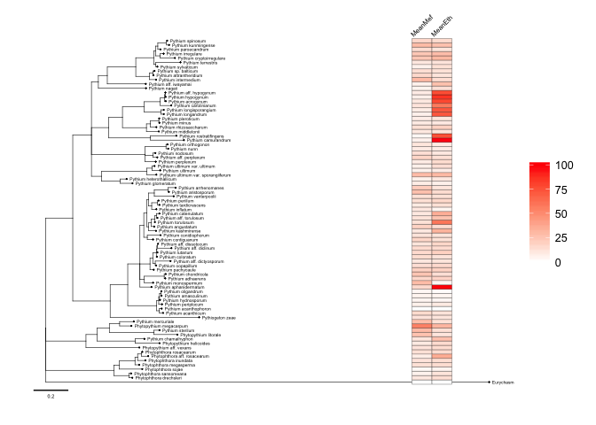
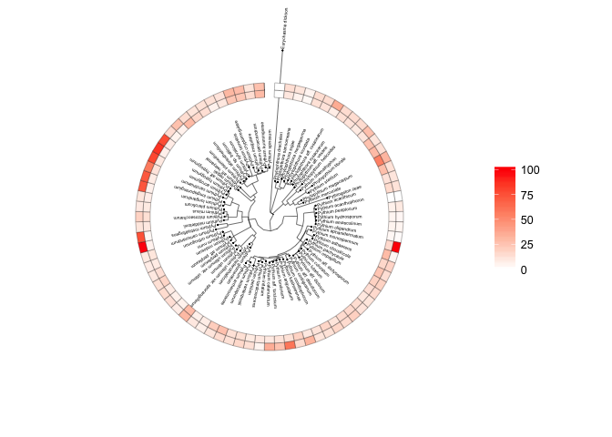

``` r
rm(list = ls(all=TRUE)) # removes all variables in the global environment so you start fresh

Sys.time() # prints out the time and date you ran the code
```

    ## [1] "2016-05-14 12:51:04 EDT"

``` r
options(scipen = 999) # stops anything from being in scientific notation
```

Read in the tree file and the phenotype data.

``` r
library(phytools)
library(ape)
library(ggtree)
#
tree <- read.nexus(file = "phylogenetics/BayesRun2/ENSi_nex3_1.nexus.con.tre")
tree$tip.label <- sub("_", " ", tree$tip.label)
tree$tip.label <- sub("aff._", "aff. ", tree$tip.label)
tree$tip.label <- sub("_var._", " var. ", tree$tip.label)
tree$tip.label <- sub("sp._", "sp. ", tree$tip.label)
phenotype_1 <- read.csv("data.csv")
phenotype_mef <- data.frame(phenotype_1$Species, phenotype_1$mean)
phenotype_mef <- phenotype_mef[order(phenotype_mef$phenotype_1.Species),]; colnames(phenotype_mef) <- c("Species", "Mean")
phenotype_eth <- data.frame(phenotype_1$Species.1, phenotype_1$mean.1)
# making sure the mefenoxam and ethaboxam data are in the correct order
phenotype_eth <- phenotype_eth[order(phenotype_eth$phenotype_1.Species.1),]; colnames(phenotype_eth) <- c("Species", "Mean")
# putting both data sets together 
phenotype <- cbind.data.frame(phenotype_mef$Species, phenotype_mef$Mean, phenotype_eth$Mean); colnames(phenotype) <- c("Species", "MeanMef", "MeanEth")
```

Doing a little data cleaning step to make sure the tree matches the phenotype data

``` r
out.group <- data.frame("Eurychasma dicksonii",0 ,0); colnames(out.group) <- c("Species", "MeanMef", "MeanEth")
missing.group <- data.frame("Pythium acanthophoron",0 ,0); colnames(missing.group) <- c("Species", "MeanMef", "MeanEth")
phenotype <- rbind.data.frame(phenotype, out.group, missing.group)
phenotype <- phenotype[!rownames(phenotype) == "Phytophthora sp.",]; phenotype$Species <- factor(phenotype$Species)
rownames(phenotype) <- phenotype$Species
phenotype <- phenotype[,c(2,3)]
rownames(phenotype)[13] <- "Pythiogeton zeae"
```

In order to get the heatmap to show up with continuous values, first we needed to change missing values to 0 and I had to modify the function. On line 51 of the gheatmap function I had to change the scale\_fill\_gradient function to include a limits statement.

``` r
cls <- list(Clade_6=c("Phytophthora aff. rosacearum","Phytophthora inundata",
                      "Phytophthora megasperma","Phytophthora rosacearum"),
            Clade_7="Phytophthora sojae",
            Clade_8=c("Phytophthora drechsleri","Phytophthora sansomeana"),
            Phytopythium=c("Phytopythium aff. vexans","Phytopythium chamaehyphon",
                           "Phytopythium helicoides","Phytopythium litorale",
                           "Phytopythium megacarpum","Pythium sterilum"),
            Pythiogeton=c("Pythiogeton zeae"),
            Clade_A=c("Pythium adhaerens","Pythium aphanidermatum",
                      "Pythium chondricola","Pythium monospermum"),
            Clade_B=c("Pythium aff. diclinum","Pythium aff. dictyosporum",
                      "Pythium aff. dissotocum","Pythium aff. torulosum","Pythium angustatum",
                      "Pythium aristosporum","Pythium arrhenomanes","Pythium catenulatum",
                      "Pythium coloratum","Pythium conidiophorum","Pythium contiguanum",
                      "Pythium inflatum","Pythium kashmirense","Pythium lutarium",
                      "Pythium oopapillum","Pythium pachycaule","Pythium periilum",
                      "Pythium tardicrescens","Pythium_torulosum","Pythium_vanterpoolii"),
            Clade_D=c("Pythium acanthicum","Pythium amasculinum","Pythium hydnosporum",
                      "Pythium oligandrum","Pythium periplocum"),
            Clade_E=c("Pythium acrogynum","Pythium aff. hypogynum","Pythium camurandrum",
                      "Pythium carolinianum","Pythium hypogynum","Pythium longandrum",
                      "Pythium longisporangium","Pythium middletonii","Pythium minus",
                      "Pythium pleroticum","Pythium rhizosaccharum","Pythium rostratifingens"),
            Clade_F=c("Pythium attrantheridium","Pythium cryptoirregulare",
                      "Pythium intermedium","Pythium irregulare","Pythium kunmingense",
                      "Pythium paroecandrum","Pythium sp. balticum","Pythium spinosum",
                      "Pythium sylvaticum","Pythium terrestris"),
            Clade_G=c("Pythium aff. iwayamai","Pythium nagaii"),
            Clade_I=c("Pythium glomeratum","Pythium heterothallicum","Pythium ultimum",
                      "Pythium ultimum var. sporangiiferum","Pythium ultimum var. ultimum"),
            Clade_J=c("Pythium acanthophoron","Pythium aff. perplexum","Pythium nodosum",
                      "Pythium nunn","Pythium orthogonon","Pythium perplexum")
)

tr <- groupOTU(tree, cls)

#
p <- ggtree(tr, size=0.2, ladderize = TRUE) +
  geom_treescale(x=-0.07, y=-0.9, offset = -1.3, fontsize = 1.5) +
  geom_tiplab(size=1.3, hjust = -0.02) +
  geom_tippoint(size = 0.05, aes(angle=angle)) +
  #geom_text(aes(label=node), size=1.5, hjust = -0.2 ) +
  #geom_cladelabel(node=88, label="Phytopythium spp.", offset = 1.5, align = TRUE, geom = "label", barsize=1.5, fontsize = 2.5) +
  #geom_cladelabel(node=87, label="Clade 8", offset = 1.5, align = TRUE, geom = "label", barsize=1.5, fontsize = 2.5) +
  #geom_cladelabel(node=84, label="Clade 6", offset = 1.5, align = TRUE, geom = "label", barsize=1.5, fontsize = 2.5) +
  #geom_cladelabel(node=124, label="Clade E", offset = 1.5, align = TRUE, geom = "label", barsize=1.5, fontsize = 2.5) +
  #geom_cladelabel(node=150, label="Clade J", offset = 1.5, align = TRUE, geom = "label", barsize=1.5, fontsize = 2.5) +
  #geom_cladelabel(node=137, label="Clade F", offset = 1.5, align = TRUE, geom = "label", barsize=1.5, fontsize = 2.5) +
  #geom_cladelabel(node=146, label="Clade I", offset = 1.5, align = TRUE, geom = "label", barsize=1.5, fontsize = 2.5) +
  #geom_cladelabel(node=97, label="Clade D", offset = 1.5, align = TRUE, geom = "label", barsize=1.5, fontsize = 2.5) +
  #geom_cladelabel(node=114, label="Clade B", offset = 1.5, align = TRUE, geom = "label", barsize=1.5, fontsize = 2.5) +
  #geom_cladelabel(node=c(103, 42), label="Clade A", offset = 1.5, align = TRUE, geom = "label", barsize=1.5, , fontsize = 2.5) +
  theme_tree()
#tiff("tree_h.tiff", res = 300, height = 1500, width = 1200, units = "px") # save a .tiff if uncommented 
p_h <- gheatmap(p, phenotype, offset = -0.5, width = 0.09, colnames=F,
                high = "red", 
                low = "white",
                color = "black") 
lbl <- get_heatmap_column_position(p_h, by="top") 
p_h + geom_text(data=lbl, aes(x, y, label=label), nudge_y = 2.5, 
                nudge_x = 0, angle=45, size=2) 
```

<!-- -->

Cicular phylogram with heatmap. Cool plotting.

``` r
p <- ggtree(tr, size=0.2, ladderize = TRUE, layout = "fan") +
  geom_treescale(x=-0.07, y=-0.9, offset = -1.3, fontsize = 1.5) +
  geom_tiplab(size=1.3, hjust = -0.02, aes(angle = angle)) +
  geom_tippoint(size = 0.05, aes(angle=angle)) +
  theme_tree()
#tiff("tree_h.tiff", res = 300, height = 1500, width = 1200, units = "px") # save a .tiff if uncommented 
p_h <- gheatmap(p, phenotype, offset = -0.8, width = 0.09, colnames=F,
                high = "red", 
                low = "white",
                color = "black") 
lbl <- get_heatmap_column_position(p_h, by="top") 
p_h + geom_text(data=lbl, aes(x, y, label=label), nudge_y = 2.5, 
                nudge_x = 0, angle=45, size=2) 
```

<!-- -->
